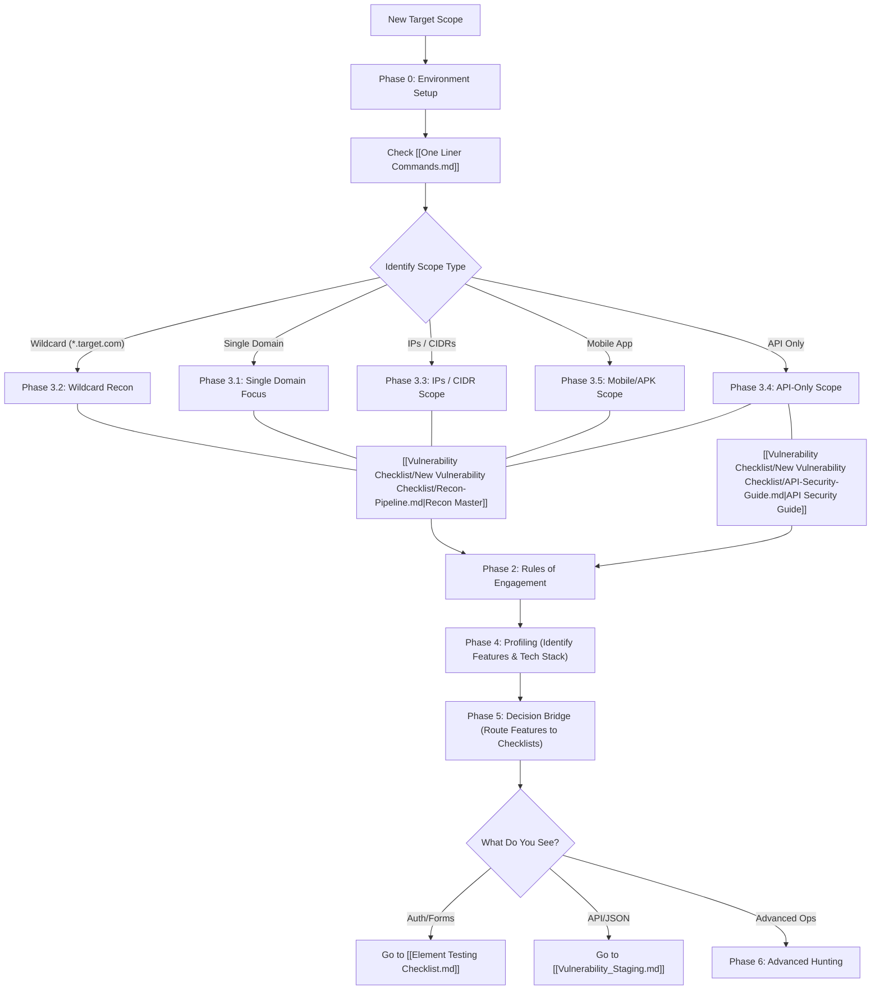

# Hunting Approach Guide

> [!IMPORTANT]
> **The 4-Layer Funnel — Your Bug Hunting System**
> 1. **[[Hunting Approach Guide]] — 📍 You are here** → WHERE to look (Recon & Discovery)
> 2. **[[Element Testing Checklist]]** → WHAT to test (Triage per Element)
> 3. **[[Vulnerability_Staging]]** → ROUTING (Decision Trees & Escalation)
> 4. **Playbooks** (Layer 4 folder) → HOW to exploit (Payloads & PoC)

---


## 📑 QUICK LINKS — JUMP TO PHASE
1. **[[#PHASE 0 — Environment Setup & Logistics|PHASE 0: Setup]]** | [[One Liner Commands.md|🚀 Recon One-Liners]]
2. **[[#PHASE 1 — Scope Selection & Strategy|PHASE 1: Strategy]]**
    - **[[#^bounty-math|1.0 Bounty Math]]**
3. **[[#PHASE 2 — Scope Analysis & Rules of Engagement|PHASE 2: Rules]]**
4. **[[#PHASE 3 — Scope-Based Reconnaissance|PHASE 3: Recon]]**
    - [[#3.0 — General Reconnaissance & Discovery Tactics|3.0 ➡️ Recon Master]] | [[#3.1 — Single Target / Asset Focus|3.1 Single]] | [[#3.2 — Wildcard Domain Scope|3.2 Wildcard]] | [[#3.3 — IPs / CIDR Scope|3.3 IP/CIDR]] | [[#3.4 — API-Only Scope|3.4 API]] | [[#3.5 — Mobile App Scope|3.5 Mobile]]
5. **[[#PHASE 4 — Application Profiling & Per-Target Deep Dive|PHASE 4: Profiling]]**
6. **[[#PHASE 5 — Strategic Routing (The Decision Bridge)|PHASE 5: Target Bridge]]**
7. **[[#PHASE 6 — Advanced Hunting Methodology (The Pro Hub)|PHASE 6: Specialized]]**
8. **[[One Liner Commands.md|🚀 Master Recon One-Liners]]** | **[[Vulnerability Checklist/New Vulnerability Checklist/Vulnerability One-Liner Archive.md|💥 Master Vuln One-Liners]]**


---

# PHASE 0 — Environment Setup & Logistics

> [!NOTE]
> **Why?** A stable, high-performance environment is the foundation of professional bug hunting. It prevents tool crashes and data loss during 24-hour scans.
> **When?** Do this once before you start your session or when migrating to new cloud infrastructure.

## 0.0 — Strategic Mindset & Productivity (The Pro Framework)

> **Goal:** Focus on the psychological and tactical framework of professional bug hunters.

- [ ] **The "One-Inch Deep, One-Mile Wide" Audit** — Perform a shallow sweep of every single endpoint before committing to a deep dive. Map the path of least resistance.
- [ ] **Feature-Driven Iteration** — Instead of bug hunting, "learn" a new feature. Documentation-first approach leads to logic flaws that fuzzers miss.
- [ ] **Note-Taking for Chaining** — Document every "weird" behavior (302 instead of 401, slightly longer response time). These are the seeds of exploit chains.
- [ ] **Burnout Mitigation Rotation** — Switch between target types (Web vs API vs Mobile) or bug classes (XSS vs Logic) every 2-3 hours to keep the analytical mind sharp.
> [!IMPORTANT]
> **The "Developer Intent" Question** — For every endpoint, ask: "What was the developer trying to protect here, and did they protect it everywhere else too?"

## 0.1 — Professional Workspace Setup (WSL & Terminal)

#### WSL & Linux Stability (Methodology 5.1)
- [ ] **WSL Migration (Export/Import)**: 
    - [ ] `wsl --export <Distro> <Path>\distro.tar` — Always backup your environment before major changes.
    - [ ] `wsl --import <NewDistro> <InstallPath> <Path>\distro.tar` — Use this to move WSL to a faster drive (SSD).
- [ ] **WSL Root Configuration**:
    - [ ] `wsl -u root` — Log in as root to bypass permission hurdles during tool installation.
    - [ ] `nano /etc/wsl.conf` → Add `[user]\ndefault=root` to set the default user.
- [ ] **WSL Hostname Resolution Fix**:
    - [ ] If terminal is slow or `sudo` hangs: `nano /etc/hosts` → Ensure `127.0.0.1 localhost <Your-Hostname>` is present.
    - [ ] Identify hostname: `hostname` command in terminal.

#### Persistent Session Management (Methodology 5.2):
- [ ] Use `tmux` (preferred) or `screen` to ensure long-running reconnaissance tasks persist after disconnect.
- [ ] Command: `tmux new -s <target_name>`

#### Project Directory Orchestration (Methodology 5.2):
- [ ] Standardize directory structure for every new target to ensure data consistency and automation compatibility.
- [ ] Command: `mkdir -p ~/bugbounty/<target_name>/{recon,scanning,discovery,exploits,screenshots,notes}`

## 0.2 — Cloud Infrastructure & Data Orchestration

#### I. VPS & Process Management
- [ ] **Persistent Process Migration**:
    - [ ] Use `reptyr` to move a running process started outside of a session into an active `tmux` or `screen` pane.
    - [ ] Command: `Ctrl+Z` → `bg` → `disown %1` → `screen -S new` → `reptyr <PID>`
- [ ] **Remote Resource Monitoring**:
    - [ ] `ps -ef` to audit running tools.
    - [ ] `killall -9 <tool_name>` for aggressive process termination of hung scanners.
- [ ] **Quick Data Hosting**:
    - [ ] Host payloads or tool outputs from your VPS instantly.
    - [ ] Command: `python3 -m http.server 8000`

#### II. Secure Data Transfer (The BBT Workflow)
- [ ] **Local-to-VPS (Upload)**:
    - [ ] `scp /path/to/local/file.txt root@<VPS_IP>:/root/destination/`
- [ ] **VPS-to-Local (Download)**:
    - [ ] `scp root@<VPS_IP>:/root/remote/file.txt /path/to/local_dir/`
- [ ] **Inter-VPS Synchronization**:
    - [ ] Use `rsync` for large wordlist transfers between VPS nodes.
    - [ ] Command: `rsync -av /path/to/source/ root@<REMOTE_IP>:/path/to/destination/`

## 0.3 — Burp Suite Setup & Optimization

> **Why?** To minimize noise and maximize capture of successful vulnerabilities.
> **When?** Configure once at the start of every new target engagement.

- [ ] **Configure Interception Filters**:
    - [ ] Proxy -> HTTP history -> Filter bar.
    - [ ] **Filter by file extension**: Hide images, CSS, and JS (unless hunting for DOM XSS/Secrets).
- [ ] **Essential Burp Extensions (The "Veteran Stack")**:
    - [ ] GAP (Get All Params) — Custom target wordlist generation from history. (See [[Vulnerability Checklist/New Vulnerability Checklist/Recon-Pipeline.md#^feature-driven-recon|Recon Master: Parameter Discovery]])
    - [ ] BAMBDAS — Scriptable Java filters for complex traffic manipulation.
    - [ ] JS Link Finder / Burpjslink-finder — Passive endpoint discovery in JS. (See [[Vulnerability Checklist/New Vulnerability Checklist/Recon-Pipeline.md#^js-analysis|Recon Master: JS Analysis]])
    - [ ] Param Miner — Hidden parameter discovery (essential for Web Cache Poisoning). (See [[Vulnerability Checklist/New Vulnerability Checklist/Recon-Pipeline.md#^feature-driven-recon|Recon Master: Parameter Discovery]])
    - [ ] `Autorize` — Automated IDOR / Access Control testing.
    - [ ] `Turbo Intruder` — High-speed fuzzing & Race Condition testing.
    - [ ] `Active Scan++` — Enhances active scanner with edge-case checks.
    - [ ] `nowafpls` — Bypasses WAF via inspection limit padding.
    - [ ] `IP Rotate` — Bypasses rate limits by rotating `X-Forwarded-For`.
    - [ ] `Request Timer` — For identifying timing-based vulnerabilities.
    - [ ] `Logger++` — Advanced logging for debugging complex interactions.
- [ ] **Proxy Configuration & Scope Management**:
    - [ ] **Strict Scope Management**: Add the root domain/subdomain to Target -> Scope.
    - [ ] **Filter View**: Proxy -> HTTP history -> Filter by "Show only in-scope items".
    - [ ] **Utilize Built-in Browser**: Proxy -> Intercept -> Open Browser. Automatically handles CA certificates.
    - [ ] **Proxy Listeners**: Ensure `127.0.0.1:8080` is active in Settings.

## 0.4 — Browser Extension Toolkit

| Extension | Category | Tactical Use Case |
| :--- | :--- | :--- |
| **Wappalyzer** | Recon | Tech-stack fingerprinting (Apache, PHP, React). |
| **FoxyProxy** | Interception | Routing traffic to Burp (Central Nervous System). |
| **Retire.js** | Analysis | Scanning for vulnerable JS libraries (Client-Side RCE/XSS). |
| **uBlock Origin** | Workflow | Disabling tracking/popups to keep logs clean. |
| **Hack-Tools** | Utility | Quick access to payloads (XSS, SQLi, SSRF). |
| **WebRTC Protect**| Privacy | Preventing local IP leaks through WebRTC. |
| **DotGit** | Recon | Git exposure detection. |
| **S3BucketList** | Recon | AWS bucket discovery. |
| **Mitaka** | Recon | IOC search helper. |
| **EditThisCookie**| Auth | Session manipulation. |
| **User-Agent Switcher**| Bypass | Mobile/Bot impersonation. |
| **JSON Formatter**| Utility | Readable API responses. |
| **Shodan**         | Recon | IP/Host info & history directly in browser. |
| **TruffleHog**     | Recon | API key and secret finding in page source. |
| **Fake Filler**    | Utility | Automated form filling for high-speed testing. |

---

## 0.5 — Callback & Persistence Infrastructure (OOB Setup)

> Setup your listening posts before starting active hunting to catch Out-of-Band (OOB) interactions.

- [ ] **Setup Callback Listeners**:
    - [ ] **NGROK**: `ngrok http 80` or `ngrok tcp 4444`.
    - [ ] **Cloudflare Tunnel**: `cloudflared tunnel --url http://localhost:8080`.
    - [ ] **Interactsh / Burp Collaborator**: For out-of-band (OOB) interactions.
- [ ] **Local Forwarding**: `ssh -R 80:localhost:8080 nokey@localhost.run`.

---

# PHASE 1 — Scope Selection & Strategy

> **Why?** Not all targets are equal. Choosing the right asset type determines your testing methodology and tools.
> **When?** At the very beginning of a hunt to define your path.

## 1.0 — Program Selection & ROI Math (The "Bounty Math") ^bounty-math

> [!IMPORTANT]
> **The Pro Hunter's Secret:** They don't just hack better; they pick **easier programs** with higher payouts.

| Metric | 🔴 Avoid (Dead End) | 🟢 Focus (Gold Mine) |
| :--- | :--- | :--- |
| **Triage Time** | > 1 Month (Slow feedback) | < 3 Days (Rapid turnover) |
| **Bounty Avg** | < $500 for P1 | > $2,500 for P1 |
| **Last Bounty** | > 3 Months ago (Stagnant) | < 1 Week ago (Active) |
| **Report Count** | > 10,000 (Saturated) | < 1,000 (Fresh surface) |
| **Safety** | No Safe Harbor | Full Gold Standard Safe Harbor |

- [ ] **Leverage Private Invites**: Private programs have 90% less competition. Maintain a clean signal-to-noise ratio on VDPs to trigger elite invites.
- [ ] **VDP-to-BBP Conversion**: If a VDP (Points only) has a massive, undocumented API, hack it to build reputation, then ask for a private BBP invite.
- [ ] **The "New Feature" Window**: Monitor the program's Twitter/LinkedIn for "New Launch" announcements. This code is 10X more likely to have critical bugs than the search bar.


## 1.1 — Scope-Type Decision Tree




## 1.2 — The First 30 Minutes

| **Scope Type** | **Primary Recon Action** | **Key Tools** |
| :--- | :--- | :--- |
| **Single Target** | Deep Service & App Profiling | `nmap`, `httpx`, `wappalyzer` |
| **Wildcard** | Subdomain Enumeration | `subfinder`, `amass`, `pure-dns` |
| **Mobile** | Traffic Interception & Decompilation | `Burp Suite`, `Frida`, `apktool` |
| **API** | Schema Discovery & Endpoint Fuzzing | `kiterunner`, `arjun`, `ffuf` |
| **CIDR** | Port Scanning & Network Mapping | `naabu`, `nmap` |

## 1.3 — Prioritize Targets (What to Test First)

Before jumping into testing, sort your targets by priority:

- [ ] **🔴 HIGH PRIORITY — Test these first:**
    - [ ] Login pages, registration, password reset pages
    - [ ] Admin panels, dashboards, internal tools
    - [ ] API endpoints (especially undocumented ones)
    - [ ] Staging/dev/test environments (`staging.`, `dev.`, `test.`, `uat.`, `beta.`)
    - [ ] Old or forgotten applications (outdated tech, old copyrights)
    - [ ] Applications with file upload functionality
    - [ ] Payment/transaction-related pages
    - [ ] Pages with URL parameters (especially `id=`, `user=`, `file=`, `url=`, `redirect=`)
- [ ] **🟡 MEDIUM PRIORITY:**
    - [ ] Content management systems (WordPress, Joomla, Drupal)
    - [ ] Applications using custom/proprietary frameworks
    - [ ] Pages with search functionality
    - [ ] Applications with user profile/settings pages
    - [ ] Any page returning a 403 Forbidden (potential bypass)
- [ ] **🟢 LOWER PRIORITY (but still check):**
    - [ ] Static marketing pages
    - [ ] CDN-only assets
- [ ] **🔥 Heat Mapping (Jason Haddix):**
    - [ ] Identify the most complex apps (highest JS count, most parameters).
    - [ ] Focus 80% of time on the 20% most complex endpoints.
- [ ] **🟡 Note on Third-party SaaS**: Zendesk, Freshdesk, etc. are usually out-of-scope unless explicitly mentioned.

---

# PHASE 2 — Scope Analysis & Rules of Engagement

> **Why?** To prevent out-of-scope reports (N/A) and ensure you stay within legal "Safe Harbor" limits.
> **When?** After selecting a target but BEFORE sending a single packet.

## 2.1 — Policy & Legal Analysis
- [ ] **Read the program policy completely**
    - [ ] Note all in-scope assets (domains, wildcards, IPs, CIDRs, mobile apps, APIs)
    - [ ] Note all out-of-scope assets — create an exclusion list
    - [ ] Note forbidden vulnerability types (e.g., DoS, social engineering, physical)
    - [ ] Note rate limiting rules or scanning restrictions
    - [ ] Note any provided test credentials or accounts
    - [ ] Note reward structure — focus on high-yield areas first
    - [ ] **Verify asset ownership** with at least two signals (Cert SAN, WHOIS, SOA) before active testing.

## 2.2 — Asset Tracking & Monitoring
- [ ] **JSON Asset Tracking**: Log every discovery using the following schema for automation readiness:
      ```json
      { "domain": "api.target.com", "source": "amass", "method": "brute", "provenance": "2026-02-23", "tags": ["dev", "origin"] }
      ```
- [ ] **Mind Mapping**: Use `Xmind` for large-scale scope visualization (ASNs -> Domains -> IPs).
- [ ] **Continuous Change Monitoring**: Use `changedetection.io` on login/api endpoints.
- [ ] **Acquisition Discovery**: Check Crunchbase/Perplexity for subsidiaries.

## 2.3 — Historical Context & Logistics
- [ ] **DNS Reliability Policy**: Use private resolvers and exponential backoff for `SERVFAIL`.
- [ ] **Check for previously reported bugs** — search Hacktivity/disclosed reports.
    - [ ] Understand what has already been found (avoid duplicates)
    - [ ] Look for patterns — if they had IDOR before, check for more IDORs
    - [ ] Check if old bugs were actually fixed properly (regression testing)

---

# PHASE 3 — Scope-Based Reconnaissance

> **Why?** You can't hack what you can't see. Recon is 80% of the work; find the forgotten endpoints the developers missed.
> **When?** As soon as you define your scope and verify rules of engagement.

---

## 3.0 — General Reconnaissance & Discovery Tactics

> [!IMPORTANT]
> ### 🔗 MANDATORY — Complete the Recon Master Playbook
> **All general reconnaissance and discovery for EVERY scope type is now consolidated into a single, dedicated playbook:**
>
> ### 📍 [[Vulnerability Checklist/New Vulnerability Checklist/Recon-Pipeline.md|➡️ Recon-Pipeline [MASTER]]]
>
> ---
>
> **What is it?** The Recon Master is your **complete, step-by-step pipeline** for discovering every asset a target organization owns — from finding their IP ranges and hidden subdomains to extracting secrets from JavaScript files and scanning for misconfigurations. It contains **all** the tools, commands, and strategies you need.
>
> **Why was it moved?** Previously, all these recon techniques were scattered throughout this guide. They have been consolidated into one powerful, focused document so you can follow a single, linear workflow without jumping between files.
>
> **What does it cover?**
>
> | Part | What You'll Learn |
> | :--- | :--- |
> | **Part&nbsp;0** | Strategic mindset, environment setup, Burp/Browser extensions, and prioritization. |
> | **Part&nbsp;1** | Infrastructure recon — ASN enumeration, SSL pivoting, Favicon hashing, and Google dorking. |
> | **Part&nbsp;2** | Subdomain discovery — Passive harvesting, DNS bruteforcing, permutations, and subdomain takeover. |
> | **Part&nbsp;3** | Service triage — httpx probing, port scanning, VHost discovery, and 403 bypassing. |
> | **Part&nbsp;4** | Content discovery — Wayback mining, Katana crawling, directory fuzzing, and API mapping. |
> | **Part&nbsp;5** | JavaScript analysis — Secret hunting, endpoint extraction, sink analysis, and source maps. |
> | **Part&nbsp;6** | Feature-driven recon — Parameter fuzzing, OSINT, and continuous monitoring. |
> | **Part&nbsp;7** | Elite automation — Nuclei templates, Maelstrom workflow, and mass injection pipelines. |
> | **Part&nbsp;8** | Reporting — PoC checklists and HackerOne report templates. |
>
> **When to use it?** Complete the Recon Master **before** moving to the scope-specific sections below (3.1–3.5). It applies to ALL scope types.

> [!TIP]
> **After completing the Recon Master → pick your scope type below: [[#3.1 — Single Target / Asset Focus|3.1 Single]] | [[#3.2 — Wildcard Domain Scope|3.2 Wildcard]] | [[#3.3 — IPs / CIDR Scope|3.3 IP/CIDR]] | [[#3.4 — API-Only Scope|3.4 API]] | [[#3.5 — Mobile App Scope|3.5 Mobile]]**

---


## 3.1 — Single Target / Asset Focus

> **Why?** Since you can't rely on wide-scale discovery (subdomains), your success depends on finding 100% of the features and 100% of the technology. You must profile deeper than anyone else.
> **When?** When you have a single domain (e.g., `app.target.com`) or a very narrow scope.

**1. Deep Profiling Checklist**
*Before testing for vulnerabilities, you must map the application's logical structure.*
- [ ] **Role & Permission Mapping**:
    - [ ] **Multi-Session Setup**: Create at least 2 accounts for every role (User A, User B, Admin, Moderator).
    - [ ] **Differential Mapping**: Use Burp's `Compare Site Maps` to see which endpoints are exclusive to higher roles.
    - [ ] **RBAC Matrixing**: Test every role against every high-value endpoint (Settings, Billing, User Management).
- [ ] **State Machine & Flow Mapping**:
    - [ ] **Multi-Step Wizards**: Map flows like Registration (Email -> SMS -> Bio), Checkout (Add -> Pay -> Confirm).
    - [ ] **Why?** These are prime candidates for **Race Conditions** and **Step-Skipping Logic Bypasses**.
- [ ] **Business Logic Inventory**:
    - [ ] **Money/Credit Features**: Identify Transfers, Credits, Coupons, Billing, and Subscription upgrades.
    - [ ] **Data/Export Features**: Identify CSV Imports, PDF Exports, Reporting, and Bulk Updates.
- [ ] **API Reverse Engineering**: (See **[[#3.4 — API-Only Scope]]**)
    - [ ] Interact with the app while monitoring the **Network Tab**.
    - [ ] Document the schema: REST (`/api/v1/`) vs GraphQL (`/graphql`) vs WebSockets (`ws://`).
- [ ] **Infrastructure Recon (The AD/Internal Pipeline)**:
    - [ ] 🟡 **Triage FTP/SMB**: Test `anonymous` login or `nxc smb --pass-pol`. -> [[Vulnerability Checklist/New Vulnerability Checklist/Cloud & Infrastructure Exploitation.md|Infrastructure Exploitation Playbook]]
    - [ ] 🔴 **LDAP / Kerberos**: Test anonymous bind or AS-REP Pre-Auth checks. -> [[Vulnerability Checklist/New Vulnerability Checklist/LDAP Injection.md|LDAP Injection Playbook]]
    - [ ] 🔴 **Bloodhound**: Map attack paths to find the shortest path to Domain Admin. -> [[Vulnerability Checklist/New Vulnerability Checklist/Active Directory.md|Active Directory Playbook]]
- [ ] **Surface Specialization**:
    - [ ] ⚡ **WordPress Audit**: `wpscan --enumerate p --plugins-detection aggressive`. -> [[Vulnerability Checklist/New Vulnerability Checklist/Specific CVEs & Frameworks.md|WordPress Playbook]]
    - [ ] 🔴 **Mobile/IoT Surface**: Check binaries for hardcoded secrets or gRPC endpoints. -> [[Vulnerability Checklist/New Vulnerability Checklist/Electron & Desktop RCE.md|Electron & Desktop RCE Playbook]]

**2. Technology Assault & Fingerprinting**
- [ ] **Tech-Stack Deep-Dive**:
    - [ ] `httpx -u target.com -tech-detect -status-code -server -x powered-by`
    - [ ] **Burp Passive Audit**: Look for technology-specific headers (e.g., `X-AspNet-Version`, `X-Amz-RequestId`).
- [ ] **Reverse Proxy & WAF Triage**:
    - [ ] `wafw00f https://target.com` — identifies protection layers.
    - [ ] **Proxy Deltas**: Test for `X-Forwarded-For: 127.0.0.1` or `X-Original-URL: /admin` to find hidden backends.
    - [ ] **Verification**: Success if the error changes from a "Proxy 403" to an "App 401/200".
- [ ] Frontend Intel: (See [[Vulnerability Checklist/New Vulnerability Checklist/Recon-Pipeline.md#^js-analysis|Recon Master: JS Analysis]])
    - [ ] Identify UI Framework (React, Vue, jQuery).
    - [ ] Check for **Source Maps** and **Hidden DOM Elements** (disabled buttons, hidden inputs).
- [ ] **Component Triage**:
    - [ ] Search for third-party widgets (chats, tracking, maps) that might have known vulnerabilities.

**3. Direct Routing to Triage**
- [ ] **Found a Search Bar?** -> [[Element Testing Checklist#^element-2|Go to Element Checklist (Inputs)]]
- [ ] **Found a File Upload?** -> [[Element Testing Checklist#^element-3|Go to Element Checklist (Uploads)]]
- [ ] **Found a JSON/API call?** -> [[Element Testing Checklist#^element-9|Go to Element Checklist (APIs)]]
- [ ] **Found a Redirect?** -> [[Element Testing Checklist#^element-17|Go to Element Checklist (Redirects)]]

> 💡 **Want the full pipeline?** For advanced JavaScript analysis, full parameter fuzzing, and hidden file discovery on a Single Target, go to: [[Vulnerability Checklist/New Vulnerability Checklist/Recon-Pipeline.md#^content-discovery|Recon Master: Content Discovery & Fuzzing]]

> [!TIP]
> **Done with recon for this scope type? → Skip to [[#PHASE 4 — Application Profiling & Per-Target Deep Dive|PHASE 4 — Profiling]]**

---

## 3.2 — Wildcard Domain Scope

> ⚡ **Quick Commands**: [[One Liner Commands#^oneliner-subdomains|Phase 3.2 One-Liners]]
> **Why?** Wildcard scopes give you the "Vertical" advantage. While others fight over the main site, you find the internal staging server on a random subdomain.
> **When?** When the program policy includes `*.target.com`.

- [ ] **Phase 1: Passive Intelligence & Scraping**
    - [ ] **Continuous CT Log Monitoring**: Run `ctail -m "target.com" | jq -r '.target'` to catch new subdomains instantly.
    - [ ] **Wildcard Dorking (Injection Candidates)**:
        - [ ] `site:*.*.example.com inurl:?page= filetype:php` (LFI/SSTI)
        - [ ] `site:*.example.com "inurl:/?url="` (Open Redirect)
    - [ ] **Custom Passive Discovery**: Run our custom tool for automated passive gathering.
      ```bash
      python3 tools/passive.py -d target.com
      ```
    - [ ] **ASN to IP Range**: `asnmap -d target.com | dnsx -silent > asn.txt`
    - [ ] **Multi-Tool Scraping Pipeline**:
      ```bash
      subfinder -d target.com -all -recursive -o sub1.txt
      amass enum -passive -d target.com -noalts -o sub2.txt
      bbot -t target.com -f subdomain-enum -o sub4.txt
      ```

- [ ] **Phase 2: DNS Resolution & Active Brute-Forcing**
    - [ ] **Custom Active Resolution**: Use our custom active tool for high-speed resolution and probing.
      ```bash
      python3 tools/active.py -l sub1.txt
      ```
    - [ ] **Mass Resolution**: `cat sub*.txt | anew allsubs.txt | puredns resolve -r resolvers.txt -w resolved.txt`
    - [ ] **Permutations (AlterX)**: `cat resolved.txt | alterx | dnsx -silent | anew resolved.txt`

- [ ] **Phase 3: Web Discovery & Fingerprinting (HTTPX)**
    ```bash
    # High-speed live host discovery + technology identification
    cat resolved.txt | httpx -mc 200,302,403 -server -tech-detect -title -o live_web.txt -silent
    ```

> 💡 **Want the full pipeline?** For advanced tools, permutations, and full passive harvesting, go to: [[Vulnerability Checklist/New Vulnerability Checklist/Recon-Pipeline.md#^subdomain-workflow|Recon Master: Subdomain Discovery Workflow]]

### → For EACH web service found, go to [[#PHASE 4 — Application Profiling & Per-Target Deep Dive|PHASE 4 — Profiling]]

## 3.3 — IPs / CIDR Scope

> ⚡ **Quick Commands**: [[One Liner Commands#^oneliner-activescan|Phase 3.3 One-Liners]]
> **Why?** Many high-severity bugs (like unauthenticated Redis, DB dumps, or Jenkins RCE) are found on bare IPs that don't even have a subdomain.
> **When?** When the program provides large IP ranges or when you find origin IPs through cert-pivoting.

**1. Infrastructure Assault Pipeline**
- [ ] Mass Port Scanning: (See [[Vulnerability Checklist/New Vulnerability Checklist/Recon-Pipeline.md#^target-triage|Recon Master: Service Discovery]])
    - [ ] `rustscan -a <IP/CIDR> -- -sV -sC -oN port_scan.txt`
    - [ ] `nmap -sV -sC -p- <IP> -oN full_nmap.txt` (Run full 65k scan on promising assets).
- [ ] **Infrastructure Deep-Dive (Maelstrom Workflow)**:
    - [ ] **Manual Reverse WHOIS (whoxy.com)**: Pivot on Organization names and emails.
    - [ ] **ASN → IP Pipeline**: `asnmap -d target.com | dnsx -silent > asn.txt`.
    - [ ] **3rd Party IP Extraction**: Pull IPs from `urlscan.io`, `VirusTotal`, and `c99.nl`.
    - [ ] **SAN Enumeration**: Extract Subject Alternative Names from SSL certs (`tlsx -san -cn`).
    - [ ] **Cloud-Range SNI Scraping**: Use `CloudRecon` on provider IP ranges to find shadow assets: `cat cloud_ips.txt | xargs -P50 ./certscrape.py | grep "target.com"`.
- [ ] **Service Enumeration & Default Creds**:
    - [ ] **Database (3306, 5432, 27017, 6379)**: Test for unauth login (`redis-cli`, `mongo`).
    - [ ] **DevOps (22, 8080-Jenkins, 9200-Elastic)**: Test for default creds (`admin:admin`).
    - [ ] **SMB/FTP (21, 445)**: Check for anonymous access or `nxc smb <IP> --pass-pol`.
    - [ ] **Management Panels**: Search for `Tomcat Manager`, `WebLogic`, or `JBoss` console exposures.

**2. Network Protocols & VHost Routing**
- [ ] VHost Discovery: (See [[Vulnerability Checklist/New Vulnerability Checklist/Recon-Pipeline.md#^vhost-bypassing|Recon Master: VHost Fuzzing]] for logic on finding hidden sites pointed at this IP)
    - [ ] `ffuf -u http://<IP> -H "Host: FUZZ.target.com" -w subdomains.txt -mc 200`
    - [ ] Check if the IP hosts hidden internal subdomains.
- [ ] **SNMP/LDAP Leaks**:
    - [ ] `snmp-check <IP>` or `ldapsearch -x -h <IP> -s base` for unauth info leaks.
- [ ] **Protocol-Specific Hunting**:
    - [ ] **RDP (3389)**: Check for NLA requirement and potential BlueKeep susceptibility.
    - [ ] **SSH (22)**: Banner grab to identify specific OS distributions.

> 💡 **Want the Titan Pipeline?** For advanced ASN pivoting, SNI scraping, and **[[Vulnerability Checklist/New Vulnerability Checklist/Recon-Pipeline.md#^part-1-5|Cloud Tenant Mapping]]**, go to: [[Vulnerability Checklist/New Vulnerability Checklist/Recon-Pipeline.md#^infrastructure-maelstrom|Recon Master: Infrastructure (The Maelstrom "King")]]

### → For EACH web service or API found, go to [[#PHASE 4 — Application Profiling & Per-Target Deep Dive|PHASE 4 — Profiling]]

---

## 3.4 — API-Only Scope

> **Why?** APIs are the "plumbing" of the internet. They often lack the UI-level protections (WAF/JS-checks) and are prone to logic flaws like Mass Assignment.
> **When?** When given an API base URL (e.g., `api.target.com`) or when you find a `/v1/` endpoint.

- [ ] **API Endpoint Mapping (Kiterunner)**:
    - [ ] `kr scan https://api.target.com/v1 -w routes-large.kite -o api_recon.txt`
- [ ] **Schema Fuzzing**:
    - [ ] Fuzz for Swagger/OpenAPI: `/docs`, `/swagger`, `/api-docs`, `/openapi.json`, `/redoc`.
    - [ ] `ffuf -u https://api.target.com/v1/FUZZ -w swagger_paths.txt -mc 200,301`
- [ ] **API Discovery & Reverse Engineering**:
    - [ ] **Firebase Check**: `curl https://<app>.firebaseio.com/.json` for unauth read/write.
    - [ ] **Mobile Asset Sourcing**: Download APKs from APKPure/Mirror; decompile with `jadx` or `apktool` to find hidden `/internal/` endpoints.
    - [ ] **Environment Pivoting**: Look for `/api/v0/`, `/api/beta/`, or `/api/v2/` if the app defaults to `/v1/`.
- [ ] **API-Specific Authentication Testing**: 
    - [ ] Test for JWT, Mass Assignment, and BOLA on discovered endpoints.

> 💡 **Want the Titan Pipeline?** For advanced API penetration testing, parameter fuzzing, and **[[Vulnerability Checklist/New Vulnerability Checklist/Recon-Pipeline.md#^modern-api-topology|Modern API Topology (GraphQL/gRPC)]]**, go to: [[Vulnerability Checklist/New Vulnerability Checklist/API-Security-Guide.md#^api-discovery|API Security Guide]]

### → For EACH API operation found, go to [[#PHASE 4 — Application Profiling & Per-Target Deep Dive|PHASE 4 — Profiling]]

---

## 3.5 — Mobile App Scope

> **Why?** Mobile binaries often contain hardcoded "master" API keys or hidden development endpoints not used by the web interface.
> **When?** When an APK or IPA file is provided or linked in the policy.

- [ ] **Mobile APK API Extraction Pipeline**:
    ```bash
    # Extract URLs, endpoints, and hardcoded secrets from APK
    apkleaks -i app.apk -o apkleaks.txt; \
    grep -rnE 'api_key|secret|password|token' apkleaks.txt
    ```
- [ ] **Firebase Discovery**:
    ```bash
    # Find and test Firebase endpoints for insecure rules
    grep -rn 'firebaseio.com' decompiled/ | cut -d: -f3- | sort -u | xargs -I {} curl -s "{}/.json"
    ```
- [ ] **Decompile and Reverse**:
    - [ ] Android: `jadx-gui` - Search for hardcoded Google/AWS/Twilio keys.
    - [ ] **Bypass Pinning**: Use `objection` or `frida` to intercept HTTPS traffic.
- [ ] **ADB Reverse Proxying (Kettle Method)**:
    - [ ] `adb reverse tcp:8080 tcp:8080` to route traffic to Burp without complex proxy setup.

> 💡 **Want the Titan Pipeline?** For deep extraction of endpoints, sinks, and **[[Vulnerability Checklist/New Vulnerability Checklist/Recon-Pipeline.md#^mobile-unpinning|Mobile SSL Unpinning]]**, go to: [[Vulnerability Checklist/New Vulnerability Checklist/Recon-Pipeline.md#^js-analysis|Recon Master: Secret Hunting & Sink Extraction]]

> For API-specific testing, see **[[#3.4 — API-Only Scope]]**

> For Deep Infrastructure Discovery (ASN/CIDR Pivoting), utilize the [[Vulnerability Checklist/New Vulnerability Checklist/Recon-Pipeline.md#^infrastructure-maelstrom|Maelstrom Workflow]] in Phase 3.0.

> [!TIP]
> **Done with recon for this scope type? → Skip to [[#PHASE 4 — Application Profiling & Per-Target Deep Dive|PHASE 4 — Profiling]]**

### → For EACH web service found, go to [[#PHASE 5 — Strategic Routing (The Decision Bridge)|PHASE 5]]


# PHASE 4 — Application Profiling & Per-Target Deep Dive

> **Why?** Recon and Discovery only find the "Door". Profiling is where you understand the "Lock". If you don't profile correctly, you'll spray payloads at the wrong tech stack and get blocked.
> **When?** Perform this for *every* unique web target discovered in Phase 3.

---

## 4.1 — Application Profiling

> ⚡ **Quick Commands**: [[One Liner Commands#^oneliner-tech|Phase 4.1 One-Liners]]
> **Why?** To map the attack surface and identify the "Golden Assets" (e.g., admin panels, sensitive data exports).
> **When?** First step of manual deep-dive testing for a specific target.

- [ ] **Visit the target in a browser with Burp Suite proxy ON**
- [ ] **Architectural Tiering (Three-Tier Profile)**:
    - [ ] **Web Server Layer**: (Apache, Nginx, IIS)
        - [ ] Identify version via `Server` header or error pages.
        - [ ] Look for static file exposure, misconfigured reverse proxies, and directory listing.
        - [ ] **Proxy vs. Backend Error Delta [Audit-6.4]**:
            - [ ] **Baseline the 403**: Trigger a 403 on a protected endpoint (e.g., `/api/admin`).
            - [ ] **Audit the Page**: Check `Server` headers. Is it fixed cloud infra or the application server?
            - [ ] **Bypass Fuzzing**: Use Double Encoding (`%252f`), Dot-Segments (`/.;/`), or Semicolons (`;`) to bypass proxy filters.
            - [ ] **Verification**: Success if the error changes from a "Proxy 403" to an "App 401/200".
    - [ ] **Application Server Layer**: (Node.js, PHP, ASP.NET, Java Tomcat)
        - [ ] Identify via cookies (`PHPSESSID`, `JSESSIONID`) or `X-Powered-By`.
        - [ ] Focus on business logic, session management, and API endpoints. 
- [ ] **Security Posture & Header Audit (Baseline Analysis)**:
    - [ ] **Check response headers**:
        - [ ] `X-Frame-Options` — Missing? → Potential Clickjacking
        - [ ] `Content-Security-Policy` — Missing? → Potential XSS, Clickjacking
        - [ ] `X-Content-Type-Options` — Missing `nosniff`? → MIME-type sniffing
        - [ ] `Strict-Transport-Security` — Missing? → SSL stripping
        - [ ] `Set-Cookie` flags — Missing `HttpOnly`? `Secure`? `SameSite`?
        - [ ] `Access-Control-Allow-Origin` — Set to `*` or reflects input? → CORS misconfig
    - [ ] **CORS Testing**:
        - [ ] Send request with `Origin: https://evil.com`. Does `Access-Control-Allow-Origin` reflect it?
        - [ ] Test `Origin: null`, `Origin: https://target.com.evil.com`.
- [ ] **Data Discovery & Leakage (Active Information Gathering)**:
    - [ ] **Email Header Origin Leak**: Trigger a system email (reset/signup) and inspect `X-Originating-IP` or `Received` headers to find the backend origin IP.
    - [ ] **Error-based Disclosure**: manually trigger 404, 500, and 403 errors. Check stack traces for internal paths, library versions, and database types. -> [[Vulnerability Checklist/New Vulnerability Checklist/Information Disclosure.md|Information Disclosure Master]]
    - [ ] Old API Versions: Check for `/api/v1/`, `/api/v0/`, or `/api/beta/` endpoints that might lack modern protections. -> [[Vulnerability Checklist/New Vulnerability Checklist/API-Security-Guide.md#^api-discovery|API Security]]
- [ ] **Database Layer**: (MySQL, PostgreSQL, MongoDB, MSSQL)
    - [ ] Infer from app behavior or error messages (`ORA-`, `SQL State`).
    - [ ] Focus on data extraction and authentication bypass via injection.
- [ ] **Understand the application**: what does it do? Who is it for?
- [ ] **The Big 7 Questions (Haddix):**
    1. How does the app pass data?
    2. Where does it talk about users?
    3. Are there multi-tenancy/user levels?
    4. What is the unique threat model?
    5. Has the app been researched before (disclosed bugs)?
    6. What framework protections are in place?
    7. How can I bypass the common flow?
- [ ] **Identify all features/functionality** — make a list:
    - [ ] Login / Registration / Password Reset
    - [ ] User Profile / Settings / Preferences
    - [ ] Search functionality
    - [ ] File upload / download / export
    - [ ] Payment / transactions
    - [ ] Comments / messaging / social features
    - [ ] Admin / dashboard areas
    - [ ] API endpoints
    - [ ] Multi-step processes (wizards, onboarding)
    - [ ] Notification / email features
    - [ ] GraphQL endpoints (`/graphql`, `/v1/query`) (Phase 6 / [[Element Testing Checklist#^element-15|Element 15 (GraphQL)]])
    - [ ] Webhook / Callback integrations ([[Element Testing Checklist#^element-9|Element 9 (API Logic)]])
    - [ ] Import / export functionality
    - [ ] Invite / share / referral features
    - [ ] Custom domain / subdomain configuration
    - [ ] Account deletion / deactivation
    - [ ] Newsletter / subscription management
    - [ ] Contact forms / support tickets
- [ ] **Create user accounts** (if registration is available)
    - [ ] Create at least 2 accounts (for testing access control between users)
    - [ ] Note the roles available (admin, user, moderator, etc.)
> [!IMPORTANT]
> **Access Role Matrix Testing (NahamSec)** — if the app has read/write/none permissions per role:
> - [ ] Set all permissions to "none" → can I still read? write? Execute?
> - [ ] Test every combination of role × endpoint × action → 3 of 10 endpoints vulnerable to 2 permissions = **6 separate bugs**
> - [ ] Focus on actions that should be denied — attempt them anyway

> [!TIP]
> **Invest Real Money (NahamSec)** — $5–200 unlocks untested premium functionality
> - [ ] Premium features, subscriptions, enterprise tiers — areas competitors skip because of the cost barrier
> - [ ] Use virtual/temporary cards (Revolut, bank-issued temp cards) for sketchy sites
> - [ ] If minimum bounty is $100+, spending to unlock features has guaranteed ROI

### 4.2 — Feature-Oriented Testing (Yassine Aboukir)
*Goal: Don't try to test everything; pick a specific high-value feature and trigger its corresponding checklist.*

- [ ] When you see **Webhook / Callback** → [[Element Testing Checklist#^element-9|Element 9 (API Logic)]] — "Is there SSRF or RCE? Test for Normalization Bypasses (#, ?) to drop server-appended suffixes."
- [ ] When you see **File Upload** → [[Element Testing Checklist#^element-3|Element 3 (File Upload)]] — "Can I get XSS, XXE (Image Metadata), or RCE?"
- [ ] When you see **Export / Import (CSV, PDF, XML)** → [[Element Testing Checklist#^element-12|Element 12 (Export)]] — "Is there injection, XXE, or SSRF? Test for PDF Renderer SSRF via `<script>` redirection."
- [ ] When you see **OAuth / SSO Flow** → [[Element Testing Checklist#^element-14|Element 14 (OAuth)]] — "Open redirect? Token leakage? Missing state? Attribute update via token? SSRF via registration?"
- [ ] When you see **Custom CSS / LESS** → [[Element Testing Checklist#^element-10|Element 10 (Headers)]] — "Can I get LFI or SSRF via `@import (inline)`?"
- [ ] When you see **Advanced Search / Filter / JSON Params** → [[Element Testing Checklist#^element-20|Element 20 (Search & Filter)]] — "Is there ORM Injection (relational leaks), RSQL Injection (filter bypass), or GraphQL SQLi?"
- [ ] When you see **Password Reset / Login** → [[Element Testing Checklist#^element-6|Element 6 (Password Reset)]] — "Can I bypass logic, extract data, or Hijack with Email CC/BCC/Separators and Unicode Spoofing?"
- [ ] When you see **High-Value Actions (Transfer/Spin/Register)** → [[Element Testing Checklist#^element-23|Element 23 (Business Logic)]] — "Is there a Race Condition via HTTP/2 Sync or Single-Packet attack?"
- [ ] When you see **Strict Rate Limits** → [[Element Testing Checklist#^element-10|Element 10 (Headers)]] / [[Element Testing Checklist#^element-15|Element 15 (GraphQL)]] — "Can I bypass via H2 Multiplexing, GraphQL Aliasing, or REST Batching?"
- [ ] When you see **PostMessage Listeners** → [[Element Testing Checklist#^element-2|Element 2 (Input field)]] — "Is the origin check regex weak? Can I hijack via Null-Origin or `e.source` manipulation?"

---

## 4.3 — Front-End Asset Analysis (The "Unmap" Methodology)

Don't just look for subdomains; look for "hidden" features in the client-side code:
- [ ] JavaScript Deep-Dive: Point to [[Vulnerability Checklist/New Vulnerability Checklist/Recon-Pipeline.md#^js-analysis|Recon Master: JS Analysis]] for full pipeline.
- [ ] **Hidden File Uploads**: Re-enable commented-out upload code or CSS-hidden file inputs to test if the backend still processes them.
- [ ] **Feature Flag Hunt**: Search JS for names like `isBeta`, `enableExperimental`, `adminMode` and toggle them via DevTools Console.

## 4.4 — The "State Disruption" Mental Model (Asynchronous Hacking) ^state-disruption
> [!IMPORTANT]
> **Logic is fragile.** Developers often assume a user will follow the path of A -> B -> C. If you can force the app into state "C" while skipping "B", or trigger "B" twice simultaneously, the logic breaks.

#### 🛠️ Asynchronous Testing Workflows
- [ ] **1. Cross-Device Desync**:
    - [ ] Initiate a critical flow (e.g., Password Change) on **Device A**.
    - [ ] At the final "Confirm" step, stop.
    - [ ] Log in and change unrelated settings on **Device B**.
    - [ ] Complete the flow on **Device A**. 
    - [ ] **Goal**: Test if the backend correctly validates the session state across multiple active devices.
- [ ] **2. Latent Process Disruption**:
    - [ ] Trigger a background action (e.g., "Export Data") that takes 30+ seconds.
    - [ ] Immediately delete the account or change the user's role while the export is "In Progress."
    - [ ] **Goal**: Catch the backend processing data for a user that no longer exists or has lower privileges (Privilege Escalation).
- [ ] **3. Step-Skipping (State Injection)**:
    - [ ] Use Burp Match & Replace to inject `is_verified=true` or `step=complete` into every response. 
    - [ ] **Goal**: Identify if the client-side state is trusted by the backend for multi-step wizards.


---

# PHASE 5 — Strategic Routing (The Decision Bridge)

> **Why?** To pivot from "What is this app?" to "How do I break this specific feature?". This keeps your workflow organized and prevents "rabbit-holing" on low-value elements.
> **When?** Once you have a clear profile of the app’s features (Phase 4), use this bridge to select your testing checklists.

---

> [!TIP]
> You have a live URL. You've profiled its tech and roles. Now, look at the UI. Match what you see to the routing matrix below to trigger the correct checklists.

## 5.1 — The Tactical Routing Matrix

| If you see...                   | Tactical Path        | Goal                                    | Target Link                                                       |
| :------------------------------ | :------------------- | :-------------------------------------- | :---------------------------------------------------------------- |
| **Static Page / CMS**           | Element Checklist    | Find hidden paths, plugins, info leaks. | [[Element Testing Checklist#^element-0|Infrastructure & Pre-Triage]] |
| **Login / Sign-up / Reset**     | Element Checklist    | Test Auth, Registration, OAuth, Reset.  | [[Element Testing Checklist#^element-4|Login Form]] |
| **Search / Forms / Comments**   | Element Checklist    | XSS, SQLi, SSTI, Logic flaws.           | [[Element Testing Checklist#^element-2|Input Field / Text Box]] |
| **File Upload / Webhooks**      | Element Checklist    | RCE, Path Traversal, SSRF, XXE.         | [[Element Testing Checklist#^element-3|File Upload]] |
| **Imports (CSV, XML)**          | Element Checklist    | SSRF, XXE, Formula Injection.           | [[Element Testing Checklist#^element-12|File Download & Export]] |
| **Dashboard / Panel / Profile** | Staging & Escalation | IDOR, Privilege Escalation, BOLA.       | [[Vulnerability_Staging#^bola-staging|BOLA / IDOR Staging]] |
| **API / JSON / XML**            | Staging & Escalation | Mass Assignment, JWT, Schema Fuzzing.   | [[Vulnerability_Staging#^api-exploit-staging|API Exploit Staging]] |

### → Now go to [[#PHASE 6 — Advanced Hunting Methodology (The Pro Hub)|PHASE 6]] to continue advanced chaining

---

# PHASE 6 — Advanced Hunting Methodology (The Pro Hub)

> **Why?** Once the checklists are done, the real hunt begins. Success at this level requires chaining vulnerabilities, modeling threats across features, and setting up automated tripwires.
> **When?** After completing the initial triage of high-value elements.

## 6.1 — Exploit Chaining (The "Impact Multiplier")
*Goal: Turn "Low" impact findings into "Critical" payouts by proving the full compromise path.*

> [!TIP]
> **Don't stop at one bug!** For advanced chaining recipes and impact math, refer to the **[[Vulnerability Checklist/New Vulnerability Checklist/Bug Escalation Map.md|📍 Master Bug Escalation Map]]**.

- [ ] **XSS + CSRF -> Account Takeover**: 
    - [ ] If you find Self-XSS, find a CSRF vulnerability to trigger it on any user (e.g., in a profile bio).
- [ ] **Open Redirect + OAuth -> Token Theft**:
    - [ ] Use an open redirect on the `redirect_uri` whitelist to steal authorization codes or tokens.
- [ ] **IDOR + Email Change -> Full Takeover**:
    - [ ] Change another user's email via IDOR, then trigger a password reset to your own inbox.

> [!EXAMPLE]
> ### 🔴 Elite Chaining Recipes (From the Escalation Map)
> - **Recipe 1: The "Invisible" Account Takeover (Self-XSS + CSRF)**
>   - [x] Use a CSRF on the profile update page to force a victim into using your "Self-XSS" payload.
> - **Recipe 2: The "Cloud Master" Pivot (XXE + SSRF)**
>   - [x] Use an XXE vulnerability to trigger an SSRF to `http://169.254.169.254/latest/meta-data/` to steal AWS IAM credentials.
> - **Recipe 3: The "Token Stealer" (Open Redirect + OAuth)**
>   - [x] Manipulate the `redirect_uri` in an OAuth flow using a whitelisted Open Redirect to leak the authorization code to your server.
> 
> **For 12+ more recipes, see the full: [[Vulnerability Checklist/New Vulnerability Checklist/Bug Escalation Map.md#Part 3 — Elite Exploit Chaining Recipes|📍 Recipe Book]]**

---

## 6.2 — Feature-Driven Threat Modeling
*Goal: Map out complex business flows that automated scanners cannot understand.*
- [ ] **The Payment Flow Audit**:
    - [ ] **Step Skipping**: Navigate from "Add to Cart" directly to "Payment Success".
    - [ ] **Currency Swapping**: Pay in a weaker currency (e.g., IDR) but set the delivery to a high-value region (e.g., USA).
- [ ] **Multi-Tenant Isolation**:
    - [ ] Test if "User A" from "Company A" can view "User B's" data from "Company B" using shared organization IDs.
- [ ] **Feature Dependency Mapping**:
    - [ ] If "Feature A" is disabled in settings, does the underlying API for "Feature A" still process requests? (e.g., Disabled chat still accepts `POST /api/chat/send`).

---

## 6.3 — Historical Hunting & Archival Audits
*Goal: Find bugs in forgotten code or re-test previously fixed vulnerabilities.*
- [ ] **Wayback Machine Archeology**:
    - [ ] `waybackurls <target>` -> Search for old API versions (`/v1/`, `/test/`) that lack modern security headers or WAFs. (See [[Vulnerability Checklist/New Vulnerability Checklist/Recon-Pipeline.md#^content-discovery|Recon Master: Content Discovery]])
- [ ] **Archival Secret Hunting**:
    - [ ] Crawl historical `.js` files and `.env` snapshots in the Wayback Machine to find keys that were rotated in production but are still "live" in the cloud.
- [ ] **Regression Hunting**:
    - [ ] Re-test bugs fixed in the last 6 months. Developers often re-introduce bugs during major feature refactors.

## 6.4 — The Hacker's Loop (Continuous Monitoring)
*Goal: Be the first to find vulnerabilities in new code deployments.*
- [ ] **JS Diffing**:
    - [ ] Set up a cron job to `curl` main JS bundles and `diff` them. (See [[Vulnerability Checklist/New Vulnerability Checklist/Recon-Pipeline.md#^js-analysis|Recon Master: JS Analysis]]). A change in bundle size usually means a new feature was launched.
- [ ] **Subdomain Monitoring**:
    - [ ] Use `subfinder -d target.com -w` to get notifications when new staging or dev servers go live.
- [ ] **Origin IP Monitoring**:
    - [ ] Monitor newly discovered subdomains; check if they leak the underlying Cloud IP (bypassing Incapsula/Cloudflare) via `ping` or `dig`.

---

# Quick Reference — What Links Where

> Match the **Element** you found in the UI to the **Checklist** below for specific tests.

| Element Type | Target Link |
|---|---|
| Infrastructure / CMS | [[Element Testing Checklist#^element-0|Infrastructure & Pre-Triage]] |
| A URL parameter | [[Element Testing Checklist#^element-1|URL Parameter]] |
| An input field / text box | [[Element Testing Checklist#^element-2|Input Field / Text Box]] |
| A file upload | [[Element Testing Checklist#^element-3|File Upload]] |
| A login / registration | [[Element Testing Checklist#^element-4|Login Form]] / [[Element Testing Checklist#^element-5|Registration Form]] |
| A password reset / magic link | [[Element Testing Checklist#^element-6|Password Reset]] |
| Files / LFI / Directory Listing | [[Element Testing Checklist#^element-11|URL Path & Route]] |
| Cookies & Session Tokens | [[Element Testing Checklist#^element-7|Cookie & Session Token]] |
| JWT & Modern Tokens | [[Element Testing Checklist#^element-8|JWT & Modern Tokens]] |
| An API endpoint | [[Element Testing Checklist#^element-9|API Endpoint & Logic]] |
| HTTP Headers (403 Bypasses) | [[Element Testing Checklist#^element-10|HTTP Headers]] |
| A URL Path / Route | [[Element Testing Checklist#^element-11|URL Path & Semantic Route]] |
| File Download / Export | [[Element Testing Checklist#^element-12|File Download & Export]] |
| WebSocket / Real-time | [[Element Testing Checklist#^element-13|WebSocket & Real-time]] |
| An OAuth / SSO flow | [[Element Testing Checklist#^element-14|OAuth & SSO Flows]] |
| GraphQL Endpoint | [[Element Testing Checklist#^element-15|GraphQL Endpoint]] |
| Error Pages | [[Element Testing Checklist#^element-16|Error Page]] |
| Redirect Parameters | [[Element Testing Checklist#^element-17|Redirect Parameter]] |
| Rich Text / Markdown / PDF | [[Element Testing Checklist#^element-18|Rich Text & Markdown]] |
| Image / Media Processing | [[Element Testing Checklist#^element-19|Image & Media Processing]] |
| Search / Filter Fuzzing | [[Element Testing Checklist#^element-20|Search & Filter Fuzzing]] |
| Browser Extensions | [[Element Testing Checklist#^element-21|Browser Extensions]] |
| Exposed Infrastructure | [[Element Testing Checklist#^element-22|Exposed Infrastructure]] |
| Business Logic / Payments | [[Element Testing Checklist#^element-23|Business Logic & Payments]] |
| Niche CVEs / Architectures | [[Element Testing Checklist#^element-24|Niche Vulnerabilities & CVEs]] |
| Automation / Triage | [[Element Testing Checklist#^element-25|Automation & Final Triage]] |
| Email / SMTP | [[Element Testing Checklist#^element-26|Email Functionality]] |
| Webhooks / Callbacks | [[Element Testing Checklist#^element-27|Webhooks & Payment Gateways]] |
| CI/CD / DevOps | [[Element Testing Checklist#^element-28|CI/CD & DevOps Exposure]] |
| AI / LLM / Chatbots | [[Element Testing Checklist#^element-29|AI & LLM Integrations]] |
| A payment / logic flow | [[#6.2 — Feature-Driven Threat Modeling|Phase 6.2 — Threat Modeling]] |

---

## Audit Trail

> [!NOTE]
> The extensive integration log and audit trail have been moved to a dedicated file to maintain document readability.
> **Full log:** [[Audit_Trail]]

---
