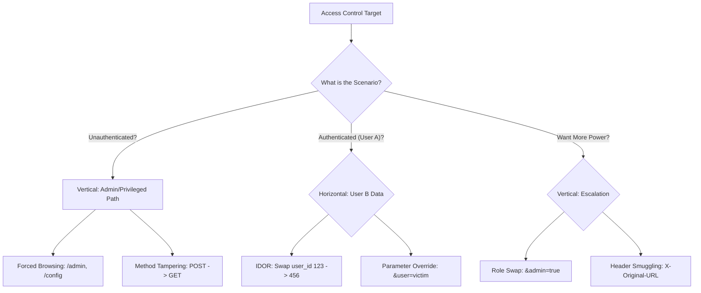

*Navigation: [🏠 Home](../../Hunting%20Approach%20Guide.md) | [🔙 Back to Checklist](../../Element%20Testing%20Checklist.md) | [Next: Authentication](Authentication.md) >>*
---

# Access Control : Master Playbook

> **Goal:** Accessing data or performing actions without proper authorization (Vertical or Horizontal Privilege Escalation).
> **Triggers:** Any endpoint with a user ID, role-based access, admin panels, or sensitive data exports.
> **Context:** Access control is the digital equivalent of "Who is allowed to enter which room?" We are looking for doors that were left unlocked, or ways to trick the "security guard" into letting us into the Admin suite or a vault belonging to another user.
> **Hacker Mindset:** "I'm logged in as a 'normal' user. But what happens if I manually browse to `/admin`? Does the server check my ID badge, or does it just assume I'm allowed there because I know the address?"

---

## 0. Exploit Selection Search Tree
*Use this logical search tree to decide which Access Control technique to prioritizing:*

1.  **Can you access unlinked Admin or Config panels directly?**
    *   **Yes** → Use **[[#3.1 Unprotected Administrative Panels]]** (Forced Browsing).
2.  **Does an action fail via `POST` but work if converted to `GET`?**
    *   **Yes** → Use **[[#3.3 Circumventing Front-End Filters]]** (Method Tampering).
3.  **Can you view another user's data by changing a numeric or UUID identifier?**
    *   **Yes** → Use **[[#3.4 Horizontal IDOR & Data Leakage]]**.
4.  **Can you inject unauthorized parameters (e.g., `"roleid": 2`) into a profile update?**
    *   **Yes** → Use **[[#3.2 Role Manipulation & Cookie Forgery]]** (Scenario 4).
5.  **Is your user role determined by a client-side cookie like `Admin=false`?**
    *   **Yes** → Use **[[#3.2 Role Manipulation & Cookie Forgery]]** (Scenario 3).
6.  **Is the application behind a proxy that trusts the `X-Original-URL` header?**
    *   **Yes** → Use **[[#3.3 Circumventing Front-End Filters]]** (Scenario 5).

---

## 1. Methodology & UX Impact Table

| Attack Vector | Beginner "Why" | Detection Indicator | Success Confirmation | Bounty Impact |
| :--- | :--- | :--- | :--- | :--- |
| **Vertical** | Walking into the VIP lounge without a pass. | Access to `/admin` or `/settings` works. | Admin panel loaded successfully. | **High/Critical** (P1) |
| **Horizontal** | Opening your neighbor's mailbox with your key. | Changing `id=123` to `456` returns data. | Private data of another user seen. | **High/Critical** (P1) |
| **Parameter Override** | Writing "Admin" on your name tag. | Adding `&role=admin` to a POST body. | Account escalated to admin status. | **High/Critical** (P1) |
| **Method Tampering** | Entering through the exit door. | `GET` request bypasses `POST` filters. | Action completes via GET link. | **Medium/High** |

---

## 2. Phase 1: API-Based Access Control Audit (Heritage Checklist)

*Systematic probing of API endpoints for ownership and permission flaws.*

### 2.1 Identifier Probing (IDOR & Beyond)
| Method | Technique | Raw Payload Example |
| :--- | :--- | :--- |
| **Predictable ID** | Basic ID Swap | `GET /api/v1/account/2222` -> `3333` |
| **ID Combo** | Cross-Object Mapping | `GET /api/v1/UserA/data/2222` -> `UserB` |
| **Integer vs Array** | Logical Confusion | `{"Account": 2222}` -> `{"Account": [3333]}` |
| **Email as ID** | PII Confusion | `{"email": "UserA@email.com"}` -> `UserB@email.com` |
| **Group ID** | Org-Level IDOR | `GET /api/v1/group/CompanyA` -> `CompanyB` |
| **Group + User** | Relational Bypass | `POST /api/v1/group/CompanyB` + `{"email": "userB..."}` |
| **Nested Object** | JSON Wrapping | `{"Account": 2222}` -> `{"Account": {"Account": 3333}}` |
| **Multiple Keys** | JSON Pollution | `{"Account": 2222, "Account": 3333}` |
| **Predictable Token**| Token Comparison | `data: DflK1df7jSdfa1...` -> `DflK1df7jSdfa2...` |

### 2.2 Expert Obfuscation & Character Injection
*Using special characters to "smuggle" or bypass API filters naming identifiers.*

| Payload Sequence | Goal | Context |
| :--- | :--- | :--- |
| `%0d%0a` | CRLF Injection | `{"Account": 2222%0d%0a1111}` |
| `%0a` | Newline Split | `{"Account": 2222%0a1111}` |
| `%0d` | Carriage Return | `{"Account": 2222%0d1111}` |
| `%00` | Null Byte | `{"Account": 2222%001111}` |
| `[id1, id2]` | Array Expansion | `{"Account": [2222, 1111]}` |
| `;` | Semicolon Split | `{"Account": 2222;1111}` |
| `,` | Comma Split | `{"Account": 2222,1111}` |
| `\|` | Pipe Split | `{"Account": 2222\|1111}` |
| `%0a%0dcc:` | Complex Smuggling | `{"Account": 2222%0a%0dcc:1111}` |
| `&` | Parameter Smuggling | `{"Account": 2222&1111}` |
| `#%` | Fragment Truncation | `{"Account": 2222#%1111}` |

---

## 3. Phase 2: Web & Admin Access Control (Portswigger Case Studies)

*Real-world scenarios for compromising administrative and user boundaries.*

### 3.1 Unprotected Administrative Panels
* **Scenario 1: Disclosed via `robots.txt`**
  - **Attack**: Browse to `/robots.txt`. Look for `Disallow` paths.
  - **Discovery**: `/administrator-panel` or `/admin`.
  - 
  - 

* **Scenario 2: Disclosed via Client-Side JS**
  - **Attack**: Review page source (`CTRL+U`) and grep for "admin" paths.
  - **Discovery**: Hidden JavaScript variables often leak internal routes.
  - 
  - 

### 3.2 Role Manipulation & Cookie Forgery
* **Scenario 3: Cookie Param Override (`Admin=false`)**
  - **Attack**: Intercept login/home response. Look for role cookies.
  - **Action**: Change `Admin=false` to `Admin=true` in Burp.
  - 
  - 
  - 

* **Scenario 4: Profile JSON Pollution (`roleid`)**
  - **Attack**: Update your email. Observe the JSON response.
  - **Action**: Re-send the request adding `"roleid": 2` to the JSON body.
  - 
  - 
  - 

### 3.3 Circumventing Front-End Filters
* **Scenario 5: `X-Original-URL` Header Bypass**
  - **Attack**: Access `/admin` -> Get blocked by Front-End.
  - **Bypass**: Use `X-Original-URL: /admin` while requesting `/`.
  - 
  - 

* **Scenario 6: Method-Based Bypass (POST to GET)**
  - **Attack**: Request `/admin/promote` via `POST` -> Blocked.
  - **Action**:
    1. Change method to `POSTX` and check if the response changes to "missing parameter" (Indicates logic failure).
    2. Convert the request to use the `GET` method.
    3. Change the username parameter to yours and resend.
  - 
  - 
  - 
  - 
  - 

### 3.4 Horizontal IDOR & Data Leakage
* **Scenario 7: Predictable IDOR**
  - **Attack**: Change `/my-account?id=wiener` to `id=carlos`.
  - 
  - 

* **Scenario 8: IDOR with Unpredictable GUIDs**
  - **Attack**: Find a GUID in a public place (e.g., Blog post author link).
  - 
  - 
  - 

* **Scenario 9: Leakage in 302 Redirect Body**
  - **Attack**: The browser says "Redirecting...", but Burp shows the content in the body.
  - 
  - 

* **Scenario 10: Password Disclosure in Prefilled Inputs**
  - **Attack**: View source on another user's profile to see masked password values.
  - 
  - 
  - 

### 3.5 Specialized Logical & File-System IDOR
* **Scenario 11: File-System Traversal (Chat Logs)**
  - **Attack**: Transcripts saved at `/chat/1.txt`. Try `2.txt`, `3.txt`.
  - 
  - 
  - 
  - 

* **Scenario 12: Multi-Step Bypass**
  - **Attack**: The "Confirm" step in a role change lacks original authorization.
  - 
  - 
  - 

* **Scenario 13: Referer-Based Auth Bypass**
  - **Attack**: Requesting `/admin-roles` fails unless `Referer: /admin` is present.
  - 
  - 

---

## 4. Resources & Advanced Tools
- [Portswigger Access Control Academy](https://portswigger.net/web-security/access-control)
- [OWASP Top 10: Broken Access Control](https://owasp.org/www-project-top-10/2021/A01_2021-Broken_Access_Control.html)
- **Tooling**:
  - `Burp AuthMatrix`: Comparing multiple sessions simultaneously.
  - `Autorize`: Automating IDOR detection as you browse.

---
*Navigation: [🏠 Home](../../Hunting%20Approach%20Guide.md) | [🔙 Back to Checklist](../../Element%20Testing%20Checklist.md) | [Next: Authentication](Authentication.md) >>*
