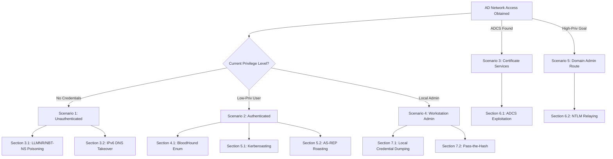

*Navigation: [🏠 Home](../../Hunting%20Approach%20Guide.md) | [⬅️ Layer 2: Element Testing](../../Element%20Testing%20Checklist.md) | [⬅️ Layer 3: Vulnerability Staging](../../Vulnerability_Staging.md)*

# Active Directory: Master Playbook

> **Goal:** Identifying and exploiting misconfigurations in Windows Active Directory (AD) environments to achieve privilege escalation, lateral movement, and Domain Dominance.
> **Triggers:** Gaining access to an internal network, discovering LDAP/SMB services, or obtaining low-privileged domain credentials.
> **Context:** If the network is a fortress, Active Directory is the **Master Keyring**. If you can compromise the AD, you control every door, every camera, and every vault in the building.
> **Hacker Mindset:** "I don't need to 'hack' the administrator's password if I can find a service that trusts an old certificate, or a user who accidentally left their VIP pass lying around in a shared folder."

---

## 0. Exploit Selection Search Tree
*Use this logic to navigate AD exploitation based on your current access:*



1. **Are you on the internal network with NO credentials?**
    * **Yes** → Use **[[#3.1 LLMNR/NBT-NS Poisoning (The Interceptor)]]** or **[[#3.2 IPv6 DNS Takeover (mitm6)]]**.
2. **Do you have a low-privileged User Account?**
    * **Yes** → Run **[[#4.1 BloodHound (The GPS of AD)]]**, then try **[[#5.1 Kerberoasting (Popcorn Stand Hack)]]** or **[[#5.2 AS-REP Roasting (The ID-less Hack)]]**.
3. **Did you find an AD Certificate Service (ADCS) web enrollment page?**
    * **Yes** → Pivot to **[[#6.1 ADCS Exploitation (The Forged Identity)]]**.
4. **Are you a Local Admin on a single workstation?**
    * **Yes** → Use **[[#7.1 Local Credential Dumping (Mimikatz)]]** and move laterally with **[[#7.2 Pass-the-Hash (PtH)]]**.
5. **Are you trying to abuse misconfigurations to reach Domain Admin?**
    * **Yes** → Try **[[#6.2 NTLM Relaying (The Doorbell Hack)]]** if SMB signing is disabled.

---

## 1. Methodology & UX Impact Table

| Attack Vector | Beginner "Why" | Detection Indicator | Success Confirmation | Bounty Impact |
| :--- | :--- | :--- | :--- | :--- |
| **Poisoning** | Tricking machines into sending you their passwords by mistake. | LLMNR requests seen. | Capturing NTLMv2 hashes in Responder. | **High/Critical** |
| **Kerberoasting** | Asking for "VIP Passes" (Tickets) for services and cracking them offline. | SPN associated with user account. | Receiving an encrypted TGS ticket to crack. | **Critical** |
| **BloodHound** | Using a "GPS for the Domain" to find the shortest path to Admin. | Bloodhound ingestion succeeds. | Visualizing "Shortest Paths to Domain Admin". | **Medium** |
| **NTLM Relay** | Stealing a password and immediately using it on another machine. | SMB Signing Disabled on target. | Achieving a remote shell or SAM dump on target. | **Critical** |

---

## 2. Hunter's Checklist
- [ ] Have you checked for LLMNR/NBT-NS poisoning opportunities?
- [ ] Did you map the domain using BloodHound?
- [ ] Have you performed Kerberoasting on all accounts with SPNs?
- [ ] Have you checked for "Pre-authentication disabled" users for AS-REP Roasting?
- [ ] Did you audit ADCS templates for ESC1/ESC8 misconfigurations?
- [ ] Have you tested for SMB Signing being disabled on high-value targets?
- [ ] Can you dump LSASS on a local workstation to pivot horizontally?

---

## 3. Unauthenticated Initial Access
> **Hunter Questions**: 
> - Are there any machines on the network broadcasting LLMNR or mDNS requests?
> - Is IPv6 enabled and unconfigured on the workstations?
> - Can I coerce a machine to authenticate to me via a known protocol "feature"?

> **Context**: You just plugged in your laptop. You have no login. You are "invisible."

### 3.1 LLMNR/NBT-NS Poisoning (The Interceptor)
#### 3.1.1 Why It Happens
When a Windows machine cannot resolve a hostname via DNS, it falls back to LLMNR or NBT-NS, effectively broadcasting its request to the entire local network. If an attacker answers first, they can intercept the authentication attempt.

#### 3.1.2 Success Indicators
- **Captured Hashes**: Responder window shows `[HTTP] NTLMv2-Hash` or `[SMB] NTLMv2-Hash`.
- **Relay Success**: `ntlmrelayx` confirms a successful authentication on a target host.

#### 3.1.3 Execution (The Payload)
*   **The Tool**: **Responder**.
*   **Command**:
    ```bash
    sudo responder -I eth0 -dwv
    ```
> **Beginner Note**: Responder is essentially a "Liar." It listens for any machine that is lost and says "I'm the server you're looking for!" to steal their credentials.

### 3.2 IPv6 DNS Takeover (mitm6)
#### 3.2.1 Why It Happens
Modern Windows systems prefer IPv6 and often attempt to perform DHCPv6 configuration even if only IPv4 is actively managed. By acting as a rogue DHCPv6/DNS server, an attacker can position themselves as the primary DNS resolver.

#### 3.2.2 Success Indicators
- **Local WPAD Retrieval**: Clients attempting to fetch `wpad.dat` from the attacker's server.
- **Relayed Credentials**: Successful authentication relayed to LDAP or SMB via `ntlmrelayx`.

#### 3.2.3 Execution (The Payload)
*   **Command**:
    ```bash
    sudo mitm6 -d [domain.local]
    ```
*   **Strategy**: Use this in conjunction with `ntlmrelayx` to capture credentials or relay them to other services.

---

## 4. Authenticated Enumeration (The Mapmaker)
> **Hunter Questions**: 
> - What are the shortest paths to a Domain Admin group from my current user?
> - Are there any users with active sessions on machines I can already access?
> - Which service accounts have vulnerable Kerberos configurations?

> **Goal**: You have a foothold. Now you need to visualize the "Empire."

### 4.1 BloodHound (The GPS of AD)
#### 4.1.1 Why It Happens
Active Directory contains thousands of objects and permissions. Humans cannot manually trace every "User -> Group -> Computer -> Admin" relationship. BloodHound uses graph theory to automate this pathfinding.

#### 4.1.2 Success Indicators
- **Graph Visualization**: Clear lines connecting "Current User" to "Domain Admin" in the GUI.
- **Shortest Paths Found**: "First Degree Local Admin" or "MemberOf" relationships identified.

#### 4.1.3 Execution (The Payload)
*   **Step-by-Step**:
    1.  **Ingestor**: Run `SharpHound.exe` on the victim machine or `pythonhound` from Linux.
    2.  **Visualization**: Drag the generated ZIP into the BloodHound GUI.
    3.  **The Query**: "Find Shortest Paths to Domain Admin."

### 4.2 NetExec (The Swiss Army Knife)
#### 4.2.1 Why It Happens
Manual enumeration of SMB shares and LDAP attributes is time-consuming and prone to human error. Automation tools like NetExec allow for rapid, protocol-specific probing across entire subnets using single-line commands.

#### 4.2.2 Success Indicators
- **Readable Shares**: Output shows `READ` or `READ,WRITE` permissions for specific shares.
- **User Lists**: LDAP module returns a list of domain users, groups, or description fields.

#### 4.2.3 Execution (The Payload)
*   **Command**:
    ```bash
    nxc smb [target-ip] -u [user] -p [pass] --shares
    nxc ldap [target-ip] -u [user] -p [pass] --users
    ```

---

## 5. The Kerberos Attack Surface
> **Beginner Analogy**: Kerberos is like a **Movie Theater**.
> 1. You show your ID (Login) to get a **Ticket Granting Ticket (TGT)** (The wristband that says you're allowed in the building).
> 2. You show your wristband to the **Bouncer (TGS)** to get a **Ticket for the Popcorn Stand** (The Service Ticket).

### 5.1 Kerberoasting (Popcorn Stand Hack)
#### 5.1.1 Why It Happens
Any domain user can request a service ticket (TGS) for any service that has a Service Principal Name (SPN) registered. The ticket is encrypted with the service account's hash, allowing for offline brute-force attacks.

#### 5.1.2 Success Indicators
- **Ticket Received**: Terminal shows `TGS-REP` hashes for specific SPNs.
- **Crack Success**: Hashcat or John the Ripper recovers a cleartext password from the hash.

#### 5.1.3 Execution (The Payload)
*   **The Goal**: Requesting Service Tickets (TGS) and cracking the encrypted part of the ticket to get the service account's password.
*   **Command (Impacket)**:
    ```bash
    impacket-GetUserSPNs [domain]/[user]:[pass] -dc-ip [dc-ip] -request
    ```
> **Beginner Note**: You are asking the AD for a "Service Ticket" for a specific account. The ticket is encrypted with that account's password. If the password is weak, you can guess it (crack it) on your own machine.

### 5.2 AS-REP Roasting (The ID-less Hack)
#### 5.2.1 Why It Happens
Some users are configured with "Do not require Kerberos preauthentication". This means an attacker can ask the KDC for an encrypted TGT for that user without knowing their password, and then attempt to crack it offline.

#### 5.2.2 Success Indicators
- **Hash Captured**: Command returns a `$krb5asrep$` hash for one or more users.
- **Cleartext Recovery**: Hashcat identifies the password for the account.

#### 5.2.3 Execution (The Payload)
*   **The Goal**: Finding users who don't require "Pre-authentication" (Showing ID). You can ask for a ticket for them and crack it without a password.
*   **Command (Impacket)**:
    ```bash
    impacket-GetNPUsers [domain]/ -usersfile users.txt -format hashcat -outputfile hashes.txt
    ```

---

## 6. Modern Escalation Vectors

### 6.1 ADCS Exploitation (The Forged Identity)
#### 6.1.1 Why It Happens
Active Directory Certificate Services (ADCS) can be misconfigured to allow low-privileged users to request certificates for arbitrary identities (like Domain Admin) if specific template settings (e.g., `ENROLLEE_SUPPLIES_SUBJECT`) are enabled.

#### 6.1.2 Success Indicators
- **Vulnerable Template Found**: `Certipy` identifies a template marked as "Vulnerable".
- **Certificate Issued**: A signed `.pfx` or `.pem` certificate for an administrative user is successfully retrieved.

#### 6.1.3 Execution (The Payload)
*   **The Tool**: **Certify.exe** (Windows) or **Certipy** (Linux).
*   **Command (Certipy)**:
    ```bash
    certipy find -u [user] -p [pass] -dc-ip [dc-ip] -stdout -vulnerable
    ```

### 6.2 NTLM Relaying (The Doorbell Hack)
#### 6.2.1 Why It Happens
If SMB Signing is not required (disabled), an attacker can capture an NTLM authentication request and forward ("relay") it to another target machine. The target machine accepts the credentials, granting the attacker access.

#### 6.2.2 Success Indicators
- **Authentication Successful**: `ntlmrelayx` shows `Authenticating against [target] as [user] SUCCEEDED`.
- **Action Performed**: SAM database is dumped, or a command is executed on the target.

#### 6.2.3 Execution (The Payload)
*   **The Concept**: Capturing an authentication request and "relaying" it to a machine where SMB Signing is **Disabled**.
*   **Scenario**: Relay a helpdesk admin's login to a server where they have admin rights.
*   **Command**:
    ```bash
    impacket-ntlmrelayx -tf targets.txt -smb2support
    ```

---

## 7. Post-Exploitation & Lateral Movement

### 7.1 Local Credential Dumping (Mimikatz)
#### 7.1.1 Why It Happens
Windows stores credentials (hashes, and sometimes cleartext passwords) in the memory of the Local Security Authority Subsystem Service (LSASS). If an attacker has local administrator privileges, they can read this memory to steal credentials of any user who has logged into that machine.

#### 7.1.2 Success Indicators
- **Output of `logonpasswords`**: Cleartext passwords or NTLM hashes for domain users are visible in the terminal.
- **DCSync Success**: Obtaining the hash of the `krbtgt` account from a Domain Controller.

#### 7.1.3 Execution (The Payload)
*   **The Goal**: Extracting hashes and cleartext passwords from memory (LSASS).
*   **Command**:
    ```powershell
    privilege::debug
    sekurlsa::logonpasswords
    ```

### 7.2 Pass-the-Hash (PtH)
#### 7.2.1 Why It Happens
NTLM authentication does not require the plain-text password; it only requires the MD4 hash. If an attacker possesses the hash, they can present it to a remote system as if they were the legitimate user.

#### 7.2.2 Success Indicators
- **Interactive Shell**: A successful `psexec` or `smbexec` session is established.
- **Access Granted**: Filesystem access to `C$` shares without entering a password.

#### 7.2.3 Execution (The Payload)
*   **The Concept**: You don't need the cleartext password. If you have the NTLM hash, you can "Pass" it to authenticate directly.
*   **Command (Impacket)**:
    ```bash
    impacket-psexec [user]@[target-ip] -hashes :[NTLM_HASH]
    ```

---

## 8. Tooling & Continuous Learning
| Tool | Purpose | link |
| :--- | :--- | :--- |
| **Impacket** | The "Internal Engine" for AD protocols (SMB, LDAP, Kerberos). | [GitHub](https://github.com/fortra/impacket) |
| **BloodHound** | AD Relationship visualizer. | [GitHub](https://github.com/BloodHoundAD/BloodHound) |
| **NetExec (nxc)** | Modern, faster alternative to CrackMapExec. | [GitHub](https://github.com/ PennyWise8Cracker/NetExec) |
| **Responder** | LLMNR/NBT-NS Poisoner. | [GitHub](https://github.com/lgandx/Responder) |

---

## 9. AD Defense (Hardening)
#### 9.1 Why It Happens
AD vulnerabilities are rarely "bugs" in the code; they are almost always "features" that have been misconfigured or left in insecure default states.

#### 9.2 Defensive Checklist
1.  **Disable LLMNR/NBT-NS**: Removes the ability for attackers to "poison" the wire.
2.  **Enforce SMB Signing**: Prevents NTLM Relaying attacks.
3.  **Tiered Administration**: Ensures Domain Admins never log into lower-tier workstations where their hashes can be stolen.
4.  **LAPS**: Local Administrator Password Solution ensures every machine has a unique admin password.

---
*Navigation: [🏠 Home](../../Hunting%20Approach%20Guide.md) | [⬅️ Layer 2: Element Testing](../../Element%20Testing%20Checklist.md) | [⬅️ Layer 3: Vulnerability Staging](../../Vulnerability_Staging.md)*
