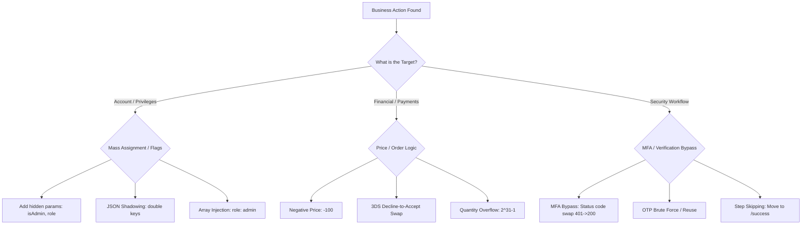

*Navigation: [🏠 Home](../../Hunting%20Approach%20Guide.md) | [🔙 Back to Checklist](../../Element%20Testing%20Checklist.md) | [Next: Password Reset](Password%20Reset.md) >>*
---

# Business Logic & Mass Assignment : Master Playbook

> **Goal:** Exploiting flawed application logic and trust in client-provided data to bypass intended controls or manipulate business processes.
> **Triggers:** State-changing actions like "Update Profile," "Checkout," "MFA/OTP Setup," "Refunds," or "Email Verification."
> **Context:** Think of business logic as the "Rules of the Game." The server expects you to follow a specific path: (1) Add item -> (2) Pay -> (3) Get product. A business logic flaw is like finding a way to skip step 2 or tricking the server into thinking you paid $100 for a $0.01 item.
> **Hacker Mindset:** "The developer expects me to use the UI as intended. I'm going to look at the raw requests to see what rules I can break. Can I pay a negative price? Can I skip the verification step? Can I make the server do something it wasn't designed to do?"

---

## 0. Exploit Selection Search Tree
*Use this logical search tree to decide which technique to use based on the application behavior:*



1.  **Can I elevate my privileges by adding hidden fields like `isAdmin`?**
    *   **Yes** → Use **[[#1.1 Discovery & Triage]]** (Mass Assignment).
2.  **Can I confuse the JSON parser by using duplicate keys (Shadowing)?**
    *   **Yes** → Use **[[#1.2 Advanced Parameter Pollution]]**.
3.  **Does the server process arrays (e.g., `["user", "admin"]`) to grant highest rank?**
    *   **Yes** → Use **[[#1.2 Advanced Parameter Pollution]]** (Array Injection).
4.  **Can I checkout with a negative total to gain credit?**
    *   **Yes** → Use **[[#3.1 Price & Cart Manipulation]]** (Negative Price).
5.  **Can I bypass 3DSecure by swapping a "Decline" response to "Accept"?**
    *   **Yes** → Use **[[#3.6 Advanced Payment Logic (DEF CON 32 Vanguard)]]**.
6.  **Can I crash the order logic or overflow the total using $2^{31}-1$ items?**
    *   **Yes** → Use **[[#3.1 Price & Cart Manipulation]]** (Quantity Overflow).
7.  **Can I bypass MFA by swapping a 401 Unauthorized status for a 200 OK?**
    *   **Yes** → Use **[[#6.1 Response & Status Code Manipulation]]**.
8.  **Can I guess a 4-digit OTP or reuse an old code to bypass MFA?**
    *   **Yes** → Use **[[#6.2 OTP & Code Attacks]]**.
9.  **Can I skip the payment step by navigating directly to `/success`?**
    *   **Yes** → Use **[[#4.1 Step Skipping (Forced Browsing)]]**.

---

## 1. Methodology & UX Impact Table

| Attack Vector | Beginner "Why" | Detection Indicator | Success Confirmation | Bounty Impact |
| :--- | :--- | :--- | :--- | :--- |
| **Mass Assignment** | Adding "Admin" to your name tag to get backstage. | Hidden `role` or `id` params in profile updates. | Privileged features become accessible. | **High/Critical** (P1) |
| **Price Tampering** | Changing the price tag on a diamond to $1. | Modifiable `price` or `amount` in checkout. | Order processes for the wrong amount. | **High/Critical** (P1) |
| **MFA Bypass** | Tricking the bouncer into thinking you showed your ID. | `200 OK` on a failed 2FA status code swap. | Dashboard access without valid OTP. | **High/Critical** (P1) |
| **Step Skipping** | Entering the theater through the exit door. | Direct access to `/success` or `/download`. | Bypassed payment or verification gate. | **Medium/High** |

---

## 1. Mass Assignment

### 1.1 Discovery & Triage
The application blindly assigns user-controlled input to backend objects without filtering for sensitive properties.
*   **Workflow**:
    1.  **Map Parameters**: Inspect `POST`/`PUT`/`PATCH` requests for registration, profile updates, or permission changes.
    2.  **Probe for Privilege**: Inject hidden parameters like `role`, `isAdmin`, `is_admin`, `permissions`, `accountType`.
    3.  **Bypass Mapping**: Use `{"role": "admin"}` or `role=admin` in the request body.
    4.  **Confirm**: Check if the UI or subsequent requests reflect the changed role.

### 1.2 Advanced Parameter Pollution
*   **JSON Shadowing**: Send `{"email": "legal@target.com", "email": "attacker@mail.com"}`. Some parsers take the first, others the second.
*   **Array Pollution**: `{"role": ["user", "admin"]}` to see if the server processes all elements and grants the highest permission.
*   **Null Payloads**: Try sending `null` or empty values for critical parameters to see if the backend fails to validate and defaults to a privileged state.

## 2. Core Logic Discovery (Mindset)
*   **Targeting SUS Parameters**: During profiling, analyze all name-value pairs, JSON, XML, or cookies. If a parameter name suggests ACL/Permissions (e.g., `role`, `isAdmin`), it becomes a primary target.
*   **Tactical Fuzzing & Deciphering**: 
    > **Testing Method**: Identifying target parameters is just the first step. You must evaluate the value (Hex, Binary, JSON). Fuzz bit patterns or permission flags like `1` to `0` or `Y` to `N` to decipher the server's logic. Some combination of bruteforcing, logical deduction, and artistic tampering will help to decipher the logic. If this is successful then we get a point for exploitation and end up escalating privileges or bypassing authorization.
*   **Identity Extraction**: Profiles are often maintained by numeric tokens or guessable usernames. Look for parameters like `id=1001` - if changing it to `1089` returns another user's PII, authorization bypass is confirmed.
    > **Scenario (Retrieving a Profile)**: Jack's profile can be fetched with `id=1001`. If this value is changed to `1089`, we get another user's information. A scanner may change it to `'1001` to find SQL injection, but not to `1089` and would miss deducing that the application is vulnerable to authorization bypass. By changing the `id` from `1001` to `1089`, a pen tester can see that John's profile, rather than Jack's, is being displayed.

---

## 3. Financial & Quantity Logic
> **Scenario: The Shopping Cart Loophole**: In many online stores, customers add items to their cart and are sent to a payment gateway. Business logic errors often allow attackers to bypass authentication or payment entirely by manipulating cart states or avoiding the "payment completed" trigger. In this shopping cart application, business logic errors may make it possible for attackers to bypass the authentication processes to directly log into the shopping cart application and avoid paying for "purchased" items.

### 3.1 Price & Cart Manipulation
*   **Price Tampering**: `100` -> `50`, `100` -> `-100`, `100` -> `(+-120)`, or `100` -> `0.5*100`.
*   **Negative Balance Check**: Add `-10` of one item + `5` of an expensive item to balance checkout total. 
*   **Large Quantity Overflow**: Add $2^{31}-1$ items or a value larger than available stock (e.g., 999999) to test for overflow or state-corruption.
*   **Delivery Charge Abuse**: 
    *   Try tampering with the delivery charge rates (`shipping_fee`, `delivery_charge`) to `-ve` values to see if the final amount can be reduced.
    *   Try checking for free delivery by tampering with the params.
*   **Cart/Wishlist Abuse**: 
    *   **Add to Target's Cart**: Tamper with `user_id` to add expensive items to another user's cart.
    *   **Add More Than Available**: Add a product in more than the available quantity.
    *   **External Deletion**: Delete items from a cart session or wishlist you don't own.
    *   **Wishlist Migration**: Try to see when you add a product to your wishlist and move it to a cart, if it is possible to move it to some other user's cart or delete it from there.

### 3.2 Review & Feature Abuse
*   **Review Functionality**:
    *   **Verified Reviewer Bypass**: Some apps mark verified reviews with a tick. Try to post a review as a Verified Reviewer without purchasing that product.
    *   **Scale Manipulation**: If the app uses a 1 to 5 scale, try to go beyond/below the scale—provide `0`, `6`, or negative values.
    *   **Rating Race Conditions**: Try to see if the same user can post multiple ratings for a product. This is an interesting endpoint to check for Race Conditions.
    *   **File Upload on Reviews**: Try to see if the file upload field is allowing any extensions—devs often miss implementing protections on such endpoints.
    *   **Review Impersonation**: Try to post reviews like some other users.
    *   **CSRF on Reviews**: Try performing CSRF on this functionality—it is often not protected by tokens.
*   **Thread Comment Functionality**:
    *   **Unlimited Comments**: Test if unlimited comments on a thread are possible.
    *   **Comment Race Condition**: If a user can comment only once, try race conditions to see if multiple comments are possible.
    *   **Privileged Comment Bypass**: If there is an option to "comment by verified user" (or some privileged user), try to tamper with various parameters to see if you can do this activity.
    *   **Comment Impersonation**: Try posting comments impersonating some other users.
*   **Premium Feature Abuse**: 
    *   **Force Browsing**: Try forcefully browsing the areas or some particular endpoints which come under premium accounts.
    *   **Refund Logic Leak**: Pay for a premium feature and cancel your subscription. If you get a refund but the feature is still usable, it's a monetary impact issue.
    *   **Flag Swapping**: Some applications use true-false request/response values to validate if a user has access to premium features. Try using Burp's **Match & Replace** to see if you can replace these values whenever you browse the app & access the premium features.
    *   **Cookie/Storage Check**: Always check cookies or local storage to see if any variable is checking if the user should have access to premium features or not.

### 3.3 Currency & Refunds
*   **Currency Arbitrage**: Pay in 1 currency say USD and try to get a refund in EUR. Due to the difference in conversion rates, it might be possible to gain more amount.
*   **Refund Feature Abuse**: Purchase a product (usually some subscription) and ask for a refund to see if the feature is still accessible.
*   **Refund Multiplier (Race Condition)**: Try making multiple requests for subscription cancellation (race conditions) to see if you can get multiple refunds.

### 3.4 Coupons & Discounts
*   **Coupon Reuse**: Apply the same code more than once to see if the coupon code is reusable.
*   **Multi-Account Race Condition**: If the coupon code is uniquely usable, try testing for Race Condition on this function by using the same code for two accounts at a parallel time.
*   **Stacking Overrides**: Try Mass Assignment or HTTP Parameter Pollution to see if you can add multiple coupon codes while the application only accepts one code from the Client Side.
*   **Input Sanitization**: Try performing attacks caused by missing input sanitization such as XSS, SQLi, etc. on this field.
*   **Non-Discounted Products**: Try adding discount codes on products which are not covered under discounted items by tampering with the request on the server-side.

### 3.6 Advanced Payment Logic (DEF CON 32 Vanguard)
> [!IMPORTANT]
> **Theory:** Modern payment gateways (Stripe, 3DSecure) use multiple redirects. If the application trusts the *final destination URL* or fails to check the *actual transaction state* from the provider, you can bypass the entire payment.

*   **3DS Decline-to-Accept Swap**: 
    *   **Workflow**: Start a payment -> 3DSecure page appears -> Click "Decline".
    *   **Tampering**: Intercept the request to `/Decline3DS` and change the URL/endpoint to `/Accept3DS` while keeping the same signed parameters.
    *   **Result**: The application may interpret the "Decline" as an "Accept" and grant the product/balance. (Daniel Le Gall - Swisspost chain).
*   **The "Coffee Break" Timeout**: 
    *   **Workflow**: Start a transaction -> Wait on the 3DSecure/OTP page until the session times out (e.g., 20 minutes).
    *   **Result**: Some poorly designed backends default a "Timed Out" transaction to "Successful" if no explicit "Failure" signal is received. (Daniel Le Gall - Swisspost chain).
*   **Signed Redirect Manipulation**: Manipulate signed parameters in the payment success redirect to change the amount or currency at the last second.

### 3.5 Parameter Tampering (General)
*   Tamper Payment or Critical Fields to manipulate their values.
*   Add multiple fields or unexpected fields by abusing HTTP Parameter Pollution & Mass Assignment.
*   Response Manipulation to bypass certain restrictions such as 2FA Bypass.

---

## 4. Process & Workflow Bypasses
> **Understanding Business Flow**: Applications include flows controlled by redirects and page transfers (e.g., Login -> Payment -> Success). After a successful login, the application will transfer the user to the money transfer page. During these transfers, the user's session is maintained by a session cookie. In many cases, this flow can be bypassed which can lead to an error condition or information leakage.

***How to test for this business logic flaw:***
> Identify business functionalities which are in specific steps (e.g., a shopping cart or wire transfer). Analyze all steps carefully and look for possible parameters which are added by the application either using hidden values or through JavaScript. These parameters can be tampered through a proxy while making the transaction. This disrupts the flow and can end up bypassing some business constraints.

### 4.1 Step Skipping (Forced Browsing)
*   **Navigation Bypass**: Move from `/checkout/step1` directly to `/checkout/success`. 
*   **Redirect Tampering**: Intercept and modify redirects in multi-step flows (e.g., Wire transfers). Identify hidden parameters or JavaScript-added fields that dictate the next step.
*   **Disrupting the Flow**: Tamper with parameters via a proxy mid-transaction. This can bypass constraints (e.g., order limits) that only trigger on specific pages.

### 4.2 Application-Specific Logic Case Studies
*   **Semrush Academy Bypass**: In this situation, it was possible to bypass the exam process—to replace the results of the exam with the correct ones and send a request to get the certificate right away. The body of the request was JSON, where `1` = true, and empty = false.
*   **Steps To Reproduce (The Retake Glitch)**: 
    1. Finished exams with any answers.
    2. Retake exam.
    3. Send the last request of our answer.
*   **Example body**: 
    ```json
    {"answers":{"503":"","504":"","505":"1","506":"","507":"","591":"1","592":"","593":"","594":"","595":"","596":"","1340":"1","1341":"","1342":"","1343":"","1344":"","1345":"","1351":"1","1352":"","1353":"","1354":"","1355":"","1356":"","1357":"","1358":"1","1359":"","1360":"","1361":"","1362":"","1363":"","1365":"1"}}
    ```

### 4.3 Business Constraint Exploitation
> The application's business logic should have defined rules and constraints. If business logic is processing variables controlled as hidden values then it leads to easy discovery and exploitation. While crawling and profiling the application, one can list all these possible values and their injection places.

***How to test:***
> Analyze hidden parameters and their values, look for business-specific calls like `transfer_money`, `max_limit`, etc. All these parameters which are dictating a business constraint can become a target. These target parameters can be manipulated and values can be changed. It is possible to avoid the business constraint and inject an unauthorized transaction.

---

## 5. Account & Identity Logic

### 5.1 Authentication Flags & Privilege Escalation
> Applications have their own ACLs and privileges. If the implementation of authorization is weak, exploitation would likely include accessing another user's content or becoming a higher-level user with greater permissions.

***How to test for this business logic flaw:***
> During the profiling phase, observe POST/GET requests. If the parameter name is suspicious and suggests that it has something to do with ACL/Permission then that becomes a target. Once the target is identified, the next step is evaluating the value—it can be encoded in hex, binary, string, etc. The tester should do some tampering and try to define its behavior with bit of fuzzing. Fuzzing may need a logical approach, changing bit patterns or permission flags like `1` to `0` or `Y` to `N`.

### 5.2 Critical Parameter Manipulation
> HTTP GET and POST requests are accompanied with parameters (name/value pairs, JSON, XML). These parameters can be tampered with and guessed (predicted). If business logic is processing these parameters before validating them, it can lead to information/content disclosure.

***How to test:***
> Observe the values in the traffic and look for incrementing numbers and easily guessable values across all parameters. This parameter's value can be changed and one may gain unauthorized access. In the above case we were able to access other users' profiles.

### 5.3 Developer Cookie Tampering
> Cookies are essential to maintain state over HTTP. Application developers set new cookies at important junctures which exposes logical holes. If application developers are passing cookies, then they might be reverse engineered or have values that can be guessed/deciphered.

***How to test:***
> Analyze all cookies delivered during profiling—some will be defined by developers and are not session cookies. Observe cookie values, look for incrementing easily guessable values. Cookie value can be changed and one may gain unauthorized access or logical escalation.

### 5.4 LDAP Parameter Identification
> LDAP is becoming important for large applications and may integrate with "single sign on." Many infrastructure tools like Site Minder or Load Balancer use LDAP for authentication and authorization. LDAP parameters can carry business logic decision flags and those can be abused.

***How to test:***
> Analyze parameters and their values—look for `ON`, `CN`, `DN`, etc. Usually these parameters are linked with LDAP. Also look for parameters taking email or usernames—these are prospective targets. These target parameters can be manipulated and injected with `*` or other LDAP-specific filters like `OR`, `AND`, etc. It can lead to logical bypass over LDAP and escalating access rights.

### 5.5 Identity or Profile Extraction
> A user's identity is one of the most critical parameters. The identities of users are maintained using session or other forms of tokens. Poorly designed applications allow an attacker to identify these token parameters from the client side. The token is either using only a sequential number or a guessable username.

***How to test:***
> Look for parameters which are controlling profiles. Once these target parameters are identified, one can decipher, guess or reverse engineer tokens. If tokens are guessed and reproduced—game over!

### 5.6 Destructive Logic
*   **Password Deletion**: In a "Change Password" form, try removing the `current_password` parameter. If the API only checks if the `new_password` is present, you may bypass the knowledge verification gate.
*   **Profile Deletion via ID Change**: Test if `DELETE /account/101` can be changed to `/account/99` to delete another user's profile.

---

## 6. 2FA Bypass Master Suite (The Anti-Logic Map)

### 6.1 Response & Status Code Manipulation
*   **Response Manipulation**: Check the response of the 2FA request. If you observe `"Success":false`, change this to `"Success":true` and see if it bypasses the 2FA.
*   **Status Code Swap**: If the response status code is `4XX` (e.g., 401, 402), change the response status code to `200 OK` and see if it bypasses the 2FA.

### 6.2 OTP & Code Attacks
*   **Brute Force OTP**: Brute force the OTP code at the verification page.
*   **OTP Doesn't Expire After Usage**: Request a 2FA code and use it. Then re-use the 2FA code—if it still works, that's an issue.
*   **Code Never Expires**: Try to re-use a previously used code after a long time (say 1 day or more). 1 day is enough to crack a 6-digit code.
*   **Bypass with Null/000000**: Enter `000000` as the 2FA code. For a 6-digit code, try `000000`.
*   **Multiple Codes — Do Old Ones Expire?**: Request multiple 2FA codes and see if previously requested codes expire when a new code is requested.
*   **Infinite OTP Regeneration**: If you can generate a new OTP infinite times and the OTP is simple enough (4 numbers), try the same 4-5 tokens every time and generate OTPs until one matches.

### 6.3 Token Cross-Account & Reuse
*   **Account A to V**: Request 2 tokens from Account A and Account V. Use A's token in V's account.
*   **Reusing Token**: Maybe you can reuse a previously used token inside the account to authenticate.
*   **Sharing Unused Tokens**: Check if you can get the token from your account and try to use it to bypass 2FA in a different account.
*   **Leaked Token**: Is the token leaked on a response from the web application?
*   **Missing 2FA Code Integrity Validation**: Request a 2FA code from Attacker Account. Use this valid 2FA code in the victim's 2FA request and see if it bypasses the 2FA protection.

### 6.4 Request Deconstruction
*   **Mode Swap (Grammarly Bypass)**: Change `"mode":"sms"` to `"mode":"email"` and `"secureLogin":true` to `"secureLogin":false`. You enter the account without a phone code.
*   **Change `otprequired`**: Change `otprequired=true` to `false`. The application may allow to create an account or login without OTP validation.
*   **Remove/Strip the Code**: Remove the 2FA code parameter or send a blank code entirely. (Glassdoor Bypass: Intercept the POST request for incorrect code. Before forwarding, remove the code and forward. Login fulfilled.)
*   **Remove Both Code and Parameter**: Try removing both the code value and the parameter name from the request.
*   **JSON Email Array**: In JSON, give email as an array: `{"email": ["victim@gmail.com"]}`.
*   **Array Brute Force**: Send the code as a JSON array to bypass single-guess limits:
    ```json
    {"code":["1000","1001","1002","1003","1004","...","9999"]}
    ```
*   **Send Null Response for JSON**: Try sending a null response for JSON body.

### 6.5 Session & Persistence Attacks
*   **Direct Request / Forced Browsing**: Directly navigate to the page which comes after 2FA or any other authenticated page.
*   **Referer Smuggling**: If direct access fails, change the `Referrer` header to the 2FA page URL. This may fool the application to pretend as if the request came after satisfying 2FA.
*   **Session Permission (Parallel Flow)**: Using the same session, start the flow using your account and the victim's account. When reaching the 2FA point on both, complete the 2FA with your account but do not access the next part. Instead, try to access the next step with the victim's account flow. If the back-end only sets a boolean inside your session, you will bypass the victim's 2FA.
*   **Previous Session Hijack**: Login in two different browsers. Enable 2FA from the 1st session. Use the 2nd session—if it is not expired, that's an issue. If an attacker hijacks an active session before 2FA, they can carry out all functions without 2FA.
*   **Enabling 2FA Doesn't Expire Previous Sessions**: When 2FA is enabled, previous sessions created should be ended. If not, this is a vulnerability. (Grammarly: Access the account on two devices → Enable 2FA on Device A → Device B session still active.)
*   **Authenticated Requests Without 2FA**: Try to perform different authenticated requests (profile details change, API create/delete, etc.) without solving the 2FA.

### 6.6 2FA Disable/Reset Attacks
*   **CSRF on 2FA Disable**: Check if the 2FA disable feature is protected against CSRF.
*   **Clickjacking on 2FA Disable**: Try to iframe the page where the application allows a user to disable 2FA. If iframe is successful, perform social engineering.
*   **No 2FA Required to Disable 2FA**: Check if 2FA is required when disabling 2FA itself.
*   **Password Not Checked When Disabling 2FA**: Enter a valid 2FA/backup code but use any random/wrong password—see if 2FA is disabled without password validation.
*   **Password Reset Bypasses 2FA**: Password can be reset via forgot password without 2FA. The password reset function automatically logs the user in after the reset procedure. Check if the reset link can be reused to reset the password multiple times (even if the victim changes their email).
*   **Enable 2FA Without Verifying Email**: Attacker signs up with victim email (verification sent to victim). Attacker logs in without verifying email. Attacker adds 2FA. Victim is permanently locked out.

### 6.7 Rate Limit Evasions
*   **Lack of Brute-Force Protection**: Request 2FA code and repeat the request for 100-200 times. If no limitation, that's a rate limit issue.
*   **Initiate OTP Requests + Brute Force Simultaneously**: Request OTPs at one side and brute-force at another side. Somewhere the OTP will match in the middle.
*   **Flow Rate Limit but No Hard Rate Limit**: There is a flow rate limit (brute force very slowly: 1 thread, sleep between tries) but no absolute rate limit. With enough time, you can find the valid code.
*   **Re-send Code Resets the Limit**: There is a rate limit but when you "resend the code," the same code is sent and the rate limit is reset. Brute force the code while resending it so the rate limit is never reached.
*   **Client Side Rate Limit Bypass**: Check if the rate limit is enforced client-side only.
*   **Lack of Rate Limit in User Account Actions**: Even with login rate limits, there may be no rate limit for actions inside the account (change mail, password, etc.).
*   **Lack of Rate Limit for SMS Re-sending**: You won't bypass 2FA, but you will waste the company's money.

### 6.8 Infrastructure & Discovery Bypasses
*   **Login via OAuth to Bypass 2FA**: Login using OAuth to bypass 2FA (Mostly N/A but worth trying).
*   **Search 2FA Code in Response/JS**: Search for the 2FA code in the response or JS files using Burp's search functionality.
*   **JS File Analysis**: While triggering the 2FA code request, analyze all the JS files that are referred in the response to see if any JS file contains info that can help bypass 2FA.
*   **OpenID Misconfiguration**: [OpenID Misconfiguration Bypass](https://youst.in/posts/bypassing-2fa-using-openid-misconfiguration/)
*   **Testing Subdomains**: If you can find some "testing" subdomains with login functionality, they could be using old versions that don't support 2FA (directly bypassed) or those endpoints could support a vulnerable version.
*   **Older API Versions**: If the 2FA is using an API located under a `/v*/` directory (like `/v3/`), there are probably older API endpoints that could be vulnerable to some kind of 2FA bypass.
*   **Guessable "Remember Me" Cookie**: If the "remember me" functionality uses a new cookie with a guessable code, try to guess it.
*   **IP Address Spoofing for Remember Me**: If "remember me" is attached to your IP address, try to figure out the IP address of the victim and impersonate it using the `X-Forwarded-For` header.

### 6.9 Backup Code Attacks
*   **Backup Code Generation After Login**: After successful login, generate the backup code request from your browser. You may be able to get the backup codes:
    ```
    POST /api/enable-2fa HTTP/1.1
    Host: target.com
    {"action":"backup_codes","email":"victim@gmail.com"}
    ```
*   **Backup Code Reuse**: Apply same techniques used on 2FA (Response/Status Code Manipulation, Brute-force, etc.) to bypass Backup Codes and disable/reset 2FA.
*   **Improper Access Control to Backup Codes**: Backup codes are generated immediately after 2FA is enabled and available on a single request. After each subsequent call, codes can be regenerated or remain unchanged (static codes). If there are CORS misconfigurations/XSS vulnerabilities, the attacker could steal the codes and bypass 2FA if username and password are known.

### 6.10 Permanent DoS Scenarios
*   **Permanent User DoS (Variant I)**: Register an account with `victim@gmail.com` (if there is no email verification). Enable 2FA in the account. Now victim can't create an account as it'll ask for 2FA code.
*   **Permanent User DoS (Variant II)**: Can't enable 2FA without email verification? Register with your email and verify it → Enable 2FA → Change your email to victim.

### 6.11 Information Disclosure
*   **Metadata on 2FA Page**: Check whether the 2FA page is disclosing some sensitive info that you didn't know previously (like Ph. No.). If confidential information appears on the 2FA page, this is an information disclosure vulnerability.

---

## 7. Anti-Automation & CAPTCHA Bypasses
> **Goal**: Detect and bypass bot protection mechanisms.
> **Master Playbook**: For detailed bypass vectors, OCR scripts, and bounty-grade PoCs, see the **[[Captcha Bypass.md|Captcha Bypass: Master Playbook]]**.

---

## 8. File/URL Access & Asset Leakage
> Business applications contain critical information in their features, in the files that are exported, and in the export functionality itself. A user can export their data in a selected file format (PDF, XLS or CSV) and download it. If this functionality is not carefully implemented, it can enable asset leakage. These files can be fetched directly from URLs or by using some internal parameters.

***How to test for this business logic flaw:***
> Identify file call functionalities based on parameter names like `file`, `doc`, `dir`, `export_id`, etc. These parameters will point you to possible unauthorized file access vulnerabilities. Once a target parameter has been identified, start doing basic brute force or guess work to fetch another user's files from the server.

---

## 9. Visual Case Studies (Restored Evidence)
### Case Study: Amount Manipulation Logic

*[Detection]*: The screenshot shows various price and amount tampering vectors. Key techniques include:
- Entering correct coupon responses into incorrect endpoints.
- Ordering a product and cancelling it, while tampering with the refund amount in the request.
- Adding negative values to the order total to get a partial refund.
- Using race conditions for double-coupon deductions.
- Changing the currency from USD to another currency (e.g., RUB) to reduce the actual payable amount.

---

## 10. Systematic Verification
- [ ] Test all state-changing endpoints for "Calculated vs. Provided" discrepancies (e.g., `price`).
- [ ] Audit all multi-step workflows (e.g., checkout) for skipped steps.
- [ ] Verify that session invalidation occurs immediately on password/email change.
- [ ] **LDAP Check**: Ensure `*` filters don't bypass identity checks.
- [ ] **2FA Check**: Confirm that `success: true` manipulation doesn't grant dashboard access.
- [ ] **Null Payload Check**: Ensure the server rejects empty/null values for critical auth/permission flags.

---

## 11. Resources & Expert Research
*   **Video Walkthroughs**:
    *   [Product Price Manipulation Logic](https://www.youtube.com/watch?v=3VMlV7j_yzg)
    *   [Mastering 2FA Bypasses](https://youtu.be/X2WfhBYQ2fY)
*   **Expert Writeups**:
    *   [Email and Phone Verification Bypass (Medium)](https://infosecwriteups.com/email-and-phone-number-verification-bypass-worth-85dbaa794b28)
    *   [How I Bypassed 2FA (Blog)](http://c0d3g33k.blogspot.com/2018/02/how-i-bypassed-2-factor-authentication.html)
    *   [OpenID Misconfiguration Bypass](https://youst.in/posts/bypassing-2fa-using-openid-misconfiguration/)
*   **PortSwigger Methodology**:
    *   [Business Logic Vulnerabilities](https://portswigger.net/web-security/logic-vulnerabilities)
    *   [Multi-Factor Authentication Bypasses](https://portswigger.net/web-security/authentication/multi-factor)
*   **Twitter/Community References**:
    *   [2FA Bypass Techniques (@tuhin1729_)](https://twitter.com/tuhin1729_/status/1414813055054086152)
    *   [CAPTCHA Bypass Reference (@tuhin1729_)](https://twitter.com/tuhin1729_/status/1436929625024647170)

---
---
*Navigation: [🏠 Home](../../Hunting%20Approach%20Guide.md) | [🔙 Back to Checklist](../../Element%20Testing%20Checklist.md) | [Next: Password Reset](Password%20Reset.md) >>*
