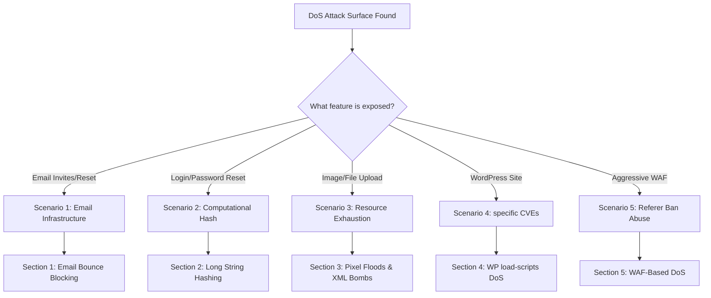

*Navigation: [🏠 Home](../../Hunting%20Approach%20Guide.md) | [⬅️ Layer 2: Element Testing](../../Element%20Testing%20Checklist.md) | [⬅️ Layer 3: Vulnerability Staging](../../Vulnerability_Staging.md)*

# Denial of Service (DoS): Master Playbook

> **Goal:** Disrupting the availability of an application, feature, or infrastructure by consuming resources (CPU, Memory, Disk, Bandwidth) or exploiting system limits.
> **Triggers:** Forms with email notifications, password fields, image uploaders, search bars, and caching headers.
> **Context:** DoS in bug bounty is NOT about hitting a site with a botnet. It's about finding "Application-Level DoS" where a single, clever request can crash a service or block a user.
> **Hacker Mindset:** "If I send a 1-megabyte password, does the server spend 30 seconds hashing it? If I upload a 'Billion Laughs' SVG, does it freeze the image processor?"

---

## 0. Exploit Selection Search Tree
*Use this logic to identify your DoS entry point:*



1.  **Does the app send automated emails (Invites/Registration)?**
    *   **Yes** → Go to **[[#1. Email Infrastructure DoS (Bounce Blocking)]]**.
2.  **Is there a login or password change form?**
    *   **Yes** → Go to **[[#2. Computational DoS (Long String Hashing)]]**.
3.  **Can you upload images (JPG, GIF, SVG)?**
    *   **Yes** → Go to **[[#3. Pixel Floods & XML Bombs]]**.
4.  **Is the site running WordPress?**
    *   **Yes** → Check **[[#4. WordPress Specific DoS (CVE-2018-6389)]]**.
5.  **Is there an aggressive WAF blocking users?**
    *   **Yes** → Go to **[[#5. WAF-Based DoS (Referer Abuse)]]**.

---

## 1. Methodology & UX Impact Table

| Attack Vector | Beginner "Why" | Detection Indicator | Success Confirmation | Bounty Impact |
| :--- | :--- | :--- | :--- | :--- |
| **Email Bounce Limit** | Triggering so many "delivery failures" that the provider bans the company. | Discovery of high bounce rates (5%+). | AWS SES/Hubspot account suspended. | **Medium/High** |
| **Billion Laughs (SVG)** | A tiny file that expands into gigabytes of data. | SVG parsed by backend. | 5xx error or extreme response delay (10s+). | **High/Critical** |
| **WAF Referer Ban** | Tricking the WAF into blocking the victim by spoofing them. | WAF uses strict Referer checks. | Victim receives "Access Denied". | **Medium** |
| **Long Password DoS** | Making the server compute a massive math problem. | High computing cost on auth endpoints. | 504 Timeout or high CPU usage. | **Medium/High** |

---

## 2. Infrastructure & Logic DoS

### 1. Email Infrastructure DoS (Bounce Blocking)
*   **The Flaw**: Applications that allow invitations to invalid emails without rate limits.
*   **The Exploit**: 
    1. Identify the Email Service Provider (ESP) via headers or `mxtoolbox.com` (e.g., AWS SES, SendGrid, Hubspot).
    2. Check the ESP's **Hard Bounce Limit** (AWS SES is ~5%).
    3. Flood the invitation feature with invalid emails (e.g., `invalid$1@nonexistent.com`).
    4. **Impact**: The ESP blocks the company's account, disabling all transactional emails for legitimate users.

### 2. Computational DoS (Long String Hashing)
*   **The Flaw**: High-cost hashing algorithms (Argon2, bcrypt) applied to massive input strings without length limits.
*   **The Exploit**:
    1. Send a [Very Long Password](https://github.com/tuhin1729/Bug-Bounty-Methodology/blob/main/payloads/password.txt) (e.g., 1MB) during registration or login.
    2. Monitor response time ($T$). If $T > 10,000ms$, you have identified a computational bottleneck.
    3. **Impact**: Multiple concurrent requests can peg the CPU to 100%, causing a service-wide outage.

### 3. Pixel Floods & XML Bombs
*   **Lottapixel (JPG)**: A tiny JPG that claims to be 10,000x10,000 pixels. The server crashes trying to allocate RAM to resize it.
*   **Uber.gif**: A GIF with a massive number of frames or high resolution designed to crash encoders.
*   **Billion Laughs (SVG)**: An XML-based image that uses recursive entity expansion.
    ```xml
    <!DOCTYPE lolz [
     <!ENTITY lol "lol">
     <!ENTITY lol1 "&lol;&lol;&lol;&lol;&lol;&lol;&lol;&lol;&lol;&lol;">
     ...
     ]>
    <svg>&lol9;</svg>
    ```

### 4. WordPress Specific DoS (CVE-2018-6389)
*   **The Flaw**: `load-scripts.php` and `load-styles.php` allow users to request dozens of JS/CSS files at once.
*   **The Exploit**:
    `https://target.com/wp-admin/load-scripts.php?c=1&load[]=jquery-ui-core,imgareaselect,tpl,wp-a11y,wp-util...` (Repeat all possible script names).
*   **Impact**: Forces the server to perform hundreds of disk I/O operations per request, leading to server exhaustion.

### 5. WAF-Based DoS (Referer Abuse)
*   **The Flaw**: WAFs that block based on malicious payloads found in the `Referer` or `Cookie` headers.
*   **The Exploit**:
    1. Create a link: `https://attacker.com/page.html?<script>alert(1)</script>`.
    2. The HTML page redirects the victim to `https://target.com`.
    3. The victim's browser sends the `Referer: https://attacker.com/page.html?...` header.
    4. The WAF sees the XSS in the referer and **blocks the victim's IP address**.

---

## 3. High-Value Payloads & Payloads List
| Type | Payload URL / Snippet |
| :--- | :--- |
| **Apache Byte Range** | `Range:bytes=0-,5-0,5-1...` (Repeated 200+ times) |
| **Null Byte Truncation**| `%00`, `%0d%0a`, `%09`, `%0C` |
| **JSON Null Value** | `{"search": null}` (Check for unhandled exceptions) |
| **Account Lockout DoS**| Brute force a user until they are locked out permanently. |

---

## 4. Reporting & Proof-of-Concept (The PoC)
> [!WARNING]
> ### 🛑 STOP: DO NOT PERFORM DESTRUCTIVE DOS 🛑
> In Bug Bounty, a DoS report is valid if you show the **possibility** of exhaustion. Do NOT actually crash the server.
> - **Proof**: Show a single request taking 10s+.
> - **Proof**: Show the "Memory Allocation" error in a local environment.

### 11.3 Bug Bounty Report Template
**Title**: Application-Level DoS via Billion Laughs SVG Upload.
**Summary**: The application's profile picture uploader allows SVG files but does not disable XML entity expansion. An attacker can upload a nested ENTITY payload that causes the server to consume all available memory during processing.
**PoC**:
1. Upload `billion_laughs.svg`.
2. Observe the request hanging for 30s before returning a 504 Gateway Timeout.
**Impact**: High availability risk. Five concurrent uploads could potentially crash the entire web server.

---
*Navigation: [[Hunting Approach Guide|🏠 Home]] | [[Element Testing Checklist|⬅️ Layer 2: Element Testing]] | [[Vulnerability_Staging|⬅️ Layer 3: Vulnerability Staging]]*
