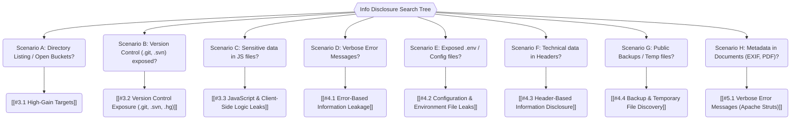

*Navigation: [🏠 Home](../../Hunting%20Approach%20Guide.md) | [⬅️ Layer 2: Element Testing](../../Element%20Testing%20Checklist.md) | [⬅️ Layer 3: Vulnerability Staging](../../Vulnerability_Staging.md)*

# Information Disclosure : Master Playbook

> **The Careless Janitor Analogy**: Imagine a high-security bank. The vault is locked, but the janitor left the trash can full of sensitive bank statements and a sticky note with the "forgotten" back door code right outside the building. Information Disclosure is finding those "leftover" secrets that make hacking the rest of the system much easier.

---

## 0. Exploit Selection Search Tree



*   **1. Scenario A: Directory listing enabled?**
    *   Target: [[#3.1 High-Gain Targets]].
*   **2. Scenario B: Source code in `.git` or `.svn`?**
    *   Target: [[#3.2 Version Control Exposure (.git, .svn, .hg)]].
*   **3. Scenario C: Sensitive data in JS files?**
    *   Target: [[#3.3 JavaScript & Client-Side Logic Leaks]].
*   **4. Scenario D: Verbose error messages?**
    *   Target: [[#4.1 Error-Based Information Leakage]].
*   **5. Scenario E: Exposed `.env` or config files?**
    *   Target: [[#4.2 Configuration & Environment File Leaks]].
*   **6. Scenario F: Technical data in headers?**
    *   Target: [[#4.3 Header-Based Information Disclosure]].
*   **7. Scenario G: Data in public backups?**
    *   Target: [[#4.4 Backup & Temporary File Discovery]].
*   **8. Scenario H: Metadata in documents (PDF, Doc)?**
    *   Target: [[#5.1 Verbose Error Messages (Apache Struts)]].

---

## 1. Professional Methodology: UX Summary Table

| Attack Vector | Beginner "Why" | Detection Indicator | Success Confirmation | Bounty Impact |
| :--- | :--- | :--- | :--- | :--- |
| **Error Leaks** | Triggering an error to force the server to show its internal guts. | Verbose errors returned in response. | Seeing file paths like `/var/www/` or framework versions. | P4 - P3 |
| **Header Tricks** | Using `TRACE` to see how a server modifies your request. | Reflected headers in response. | Discovering internal headers like `X-Forwarded-For`. | P5 - P4 |
| **Backup Safari** | Looking for "forgotten" files containing DB passwords. | 200 OK on `.bak` or `.old` files. | Downloading a config file containing valid passwords. | P3 - P1 |
| **Version Control** | Stealing development history from `/.git`. | 200 OK on `/.git/config`. | Reconstructing a repository and viewing commit diffs. | P3 - P1 |
| **Secret Mining** | Using Regex to find "API Keys" hidden in JS files. | Regex match on high-entropy strings. | Extracting and validating an `AWS_SECRET_ACCESS_KEY`. | P4 - P1 |

---

## 2. The Hunter's Mental Model (Thinking Phase)

> **Why It Happens**: Information Disclosure persists because developers prioritize "ease of debugging" over "security in production." They leave debug modes on, fail to clear `.git` folders during deployment, or forget that every "verbose" error message is a gift to a hacker.
> **Hacker Mindset**: "I am the digital archeologist. Every piece of trash (error log) or old bone (backup file) tells me how the city (application) was built and where the gold is hidden."

### 2.1 The Discovery Mindset
**Goal:** Map the internal environment of the target before attempting complex injections.

1.  **The Exception Trigger**: Inputting a single quote `'` or a non-integer string into every ID parameter.
2.  **The Robot's Path**: Manually reading `robots.txt` for paths like `/backup`, `/dev`, `/staging`.
3.  **The Comment Scrawl**: Right-click -> View Page Source. Searching for `TODO:`, `FIXME:`, or internal IP addresses.
4.  **The Version Probe**: Checking `/.git/config`. If it exists, the game is over; you have the source.
5.  **The API Trail**: Looking for `api-docs` or `swagger.json` and using the regex extractor to find hidden keys.

---

## 3. Discovery & High-Gain Targeting (Hunting Phase)

### 3.1 High-Gain Targets
*   **Error Messages**: Stack traces, database drivers (PostgreSQL/MySQL versions).
*   **Version Control**: `/.git`, `/.svn`, `/.hg`, `/.bzr`.
*   **Configuration Files**: `config.php`, `web.config`, `settings.py`, `robots.txt`, `humans.txt`, `.htaccess`.
*   **Backup Files**: `.bak`, `.old`, `.save`, `~`, `.swp`.
*   **Dependency Files**: `package.json`, `composer.json`, `pom.xml` (leaks library versions).
*   **Diagnostic Pages**: `/phpinfo.php`, `/cgi-bin/phpinfo.php`, `/server-status`, `/env`.

---

## 4. Technical Execution: The 12-Phase Strategy

### Phase 1: Footprinting & File Discovery
- [ ] Check `/robots.txt` for disallowed directories.
- [ ] Check `/sitemap.xml` for unlinked pages.
- [ ] Check for `.DS_Store` (macOS) or `Thumbs.db` (Windows) inside directories.
- [ ] **Public S3 Buckets**: Identify organizational bucket names (e.g., `company-dev-assets`) and check for public read permissions.
- [ ] Scan for `/.well-known/security.txt`.

### Phase 2: Error-Based Disclosure & Stack Traces
- [ ] **Data Type Mismatch**: Change `?id=1` to `?id=string` or `?id[]`.
- [ ] **Method Mismatch**: Send a `POST` request to a `GET` endpoint.
- [ ] **Content-Type Mismatch**: Send `Content-Type: application/xml` to a JSON endpoint.
- [ ] **Parameter Fuzzing**: Send unexpected parameters to trigger 500 Internal Server Errors.

### Phase 3: Directory Brute-Forcing & Backup Hunting
- [ ] Use **ffuf** or **gobuster** with a "Common Files" wordlist.
- [ ] Search specifically for backups:
    - `/filename.ext.bak`
    - `/filename.ext~`
    - `/filename.ext.old`
    - `/filename.ext.1`

### Phase 4: Header & Response Analysis
| Technique | Example | Why? |
| --- | --- | --- |
| **TRACE Method** | `TRACE /admin` | Reveals front-end proxies and added headers. |
| **Server Header** | `Server: Nginx/1.14.0` | Gives specific version for exploit lookup. |
| **X-Powered-By** | `X-Powered-By: PHP/5.6` | Leaks language and version. |
| **Custom Auth** | `X-Custom-IP-Authorization` | Reveals how internal IP checks are handled. |

### Phase 5: Version Control & Repository Harvesting
- [ ] **Identify**: Check for `/.git/HEAD`.
- [ ] **Tooling**: 
    - `wget -r https://target/.git/`
    - `git-dumper https://target.com/.git/ output_dir`
- [ ] **Audit**: Look for "Remove password" commits in `git log -p`.

### Phase 6: Debug Interfaces & Diagnostic Panels
- [ ] `/phpinfo.php`
- [ ] `/cgi-bin/phpinfo.php`
- [ ] `/django-debug-toolbar`
- [ ] Symfony `/app_dev.php/_profiler`

### Phase 7: Environment Variables & Secrets
- [ ] Check for `.env` or `.bash_history` files in the web root.
- [ ] Scan for `SECRET_KEY`, `AWS_ACCESS_KEY_ID`, `DB_PASSWORD`.

### Phase 8: Cloud Metadata Disclosure (SSRF Hook)
- [ ] Target `http://169.254.169.254/latest/meta-data/` on AWS.
- [ ] Target `http://metadata.google.internal/computeMetadata/v1/` on GCP.

### Phase 9: Client-Side Logic & RedDoS/XSSI
- [ ] **XSSI**: Identify sensitive JSON or JavaScript data that can be included via a `<script>` tag.
    - **PoC**: 
      ```html
      <script src="https://target.com/api/user_data"></script>
      <script>alert(JSON.stringify(window.userData));</script>
      ```
- [ ] **ReDoS**: Submit `(a+)+$` to regex-heavy search fields to trigger "catastrophic backtracking" (504 timeout).
- [ ] **Comment Audit**: Search JS files for `password`, `key`, `secret`, `TODO:`, or `FIXME:`.

### Phase 10: Secret Extraction Automation (Checklist 2)
Use this **Burp Suite / Python Regex** to identify over 150+ types of API keys and tokens:
* 
  > **Beginner Note**: This regex can be used in Burp Suite's "Search" or "Match and Replace" to automatically flag potential secrets in traffic.
```python
(?i)((access_key|access_token|admin_pass|admin_user|algolia_admin_key|algolia_api_key|alias_pass|alicloud_access_key|amazon_secret_access_key|amazonaws|ansible_vault_password|aos_key|api_key|api_key_secret|api_key_sid|api_secret|api.googlemaps AIza|apidocs|apikey|apiSecret|app_debug|app_id|app_key|app_log_level|app_secret|appkey|appkeysecret|application_key|appsecret|appspot|auth_token|authorizationToken|authsecret|aws_access|aws_access_key_id|aws_bucket|aws_key|aws_secret|aws_secret_key|aws_token|AWSSecretKey|b2_app_key|bashrc password|bintray_apikey|bintray_gpg_password|bintray_key|bintraykey|bluemix_api_key|bluemix_pass|browserstack_access_key|bucket_password|bucketeer_aws_access_key_id|bucketeer_aws_secret_access_key|built_branch_deploy_key|bx_password|cache_driver|cache_s3_secret_key|cattle_access_key|cattle_secret_key|certificate_password|ci_deploy_password|client_secret|client_zpk_secret_key|clojars_password|cloud_api_key|cloud_watch_aws_access_key|cloudant_password|cloudflare_api_key|cloudflare_auth_key|cloudinary_api_secret|cloudinary_name|codecov_token|config|conn.login|connectionstring|consumer_key|consumer_secret|credentials|cypress_record_key|database_password|database_schema_test|datadog_api_key|datadog_app_key|db_password|db_server|db_username|dbpasswd|dbpassword|dbuser|deploy_password|digitalocean_ssh_key_body|digitalocean_ssh_key_ids|docker_hub_password|docker_key|docker_pass|docker_passwd|docker_password|dockerhub_password|dockerhubpassword|dot-files|dotfiles|droplet_travis_password|dynamoaccesskeyid|dynamosecretaccesskey|elastica_host|elastica_port|elasticsearch_password|encryption_key|encryption_password|env.heroku_api_key|env.sonatype_password|eureka.awssecretkey)[a-z0-9_ .\-,]{0,25})(=|>|:=|\|\|:|<=|=>|:).{0,5}['\"]([0-9a-zA-Z\-_=]{8,64})['\"]
```

### Phase 11: Detection of False Negatives
- [ ] Audit **Content-Length** on 500 errors vs 200 OK.
- [ ] Check if `TRACE` is disabled by default but allowed on sub-paths.
- [ ] Verify if `.git` is blocked at the root but accessible through `/static/.git/`.

### Phase 12: Impact Assessment (Prioritization)
1.  **Cleartext Credentials** (P0 - Immediate ATO).
2.  **Source Code Disclosure** (P1 - Full bypass discovery).
3.  **PII Leakage** (P1 - GDPR/Legal impact).
4.  **Framework/Path Disclosure** (P2 - Infrastructure mapping).

---

## 5. Visual Walkthrough (Image Narratives)

### 5.1 Verbose Error Messages (Apache Struts)
*   **Step 1: Triggering the Error**: Select a product page and send the request to Repeater. Change the `productId=1` parameter to a string like `productId="example"`.
* 
  > **Beginner Note**: Notice the stack trace in the response highlight. It explicitly mentions "Apache Struts 2 2.3.31". This is an Information Disclosure.
* 
  > **Beginner Note**: Use the version number disclosed in the error to search for public CVEs or exploits.

### 5.2 Hidden Debug Panels (PHP Info)
> **Lab Goal**: Solve by obtaining and submitting the `SECRET_KEY` environment variable hidden in a debug page.

*   **Step 2: Finding Internal Paths**: Use Burp Suite's Engagement tools -> "Find comments" on the home page. Discover a link to `/cgi-bin/phpinfo.php`.
* 
  > **Beginner Note**: Developers often leave these links for their own testing, forgetting that even commented-out links are visible to hackers via "View Source" or Burp tools.
* 
  > **Beginner Note**: The `phpinfo()` output contains all environmental variables, including secret keys.
* 
  > **Beginner Note**: Search the diagnostic page for sensitive strings like `SECRET_KEY` or `DB_PASS`.

### 5.3 Source Code Recovery (Backup Files)
> **Lab Goal**: Identify and submit the database password, which is hard-coded in the leaked source code.

*   **Step 3: Accessing Backups**: Check `robots.txt` or use Engagement tools -> "Discover content" to find a `/backup` directory.
* 
  > **Beginner Note**: Notice the directory listing. Files like `ProductTemplate.java.bak` are common when developers edit files directly on the server.
* 
  > **Beginner Note**: Opening a `.java.bak` or `.php.save` file directly in the browser reveals the hard-coded database logic.

### 5.4 Authentication Bypass via Header Disclosure
> **Lab Goal**: Access the admin interface using credentials `wiener:peter` and delete user `carlos` by discovering the front-end header.

*   **Step 4: Using TRACE for Internal Auditing**: Change the method to `TRACE` on a protected route like `/admin`.
* 
  > **Beginner Note**: Look at the reflected request. The proxy added a header: `X-Custom-IP-Authorization: [MY_IP]`.
* 
  > **Beginner Note**: We can now "spoof" this header to bypass authentication.
* 
  > **Beginner Note**: Using Burp's "Match and Replace" allows us to inject this header (`X-Custom-IP-Authorization: 127.0.0.1`) into every request automatically.
* 
  > **Beginner Note**: The server now thinks we are coming from the local IP and grants us unrestricted access.

### 5.5 Repository Extraction (Git Forensics)
*   **Step 5: Dumping version control**: Browse to `/.git`. If you see a directory listing or the `config` file, the repo is exposed.
* 
  > **Beginner Note**: If you see this directory listing, you can use specialized tools to dump the whole history.
* 
  > **Beginner Note**: Use `git log` to find commits that "removed" passwords. The password is still in the history!
* 
  > **Beginner Note**: The `git diff` shows exactly what was deleted. Here, we can see the administrator password in plain text.
* 
  > **Beginner Note**: Use the leaked credentials to log in and take control of the application.

---

## 6. Beyond the Basics: Chaining & Complex Logic

> **Why It Happens**: Information Disclosure is rarely the end-goal; it is the fuel for much larger attacks. Knowing a path (`/var/www/html/`) allows for Path Traversal; knowing an internal IP allows for SSRF escalation.
> **Hacker Mindset**: "I am connecting the dots. The disclosed version tells me what to attack; the backup file tells me how to attack; and the secret key tells me I've already won."

### 6.1 Chaining with SSRF
*   **Internal Scout**: Use SSRF to reach `http://127.0.0.1/phpinfo.php` or `/actuator/env`. These pages are often blocked from the internet but visible from the inside.
*   **Cloud Credential Leaching**: Chain SSRF with Information Disclosure to steal `IAM` role credentials from the Metadata Service (IMDSv1).

### 6.2 Chaining for Path Traversal Escalation
*   **Blueprint Discovery**: Use Information Disclosure (Error Messages) to find the absolute path of the application (e.g., `/var/www/html/app/`). 
*   **Targeted Traversal**: Once you know the path, you can use Path Traversal to read sensitive files with 100% accuracy instead of guessing.

### 6.3 CI/CD Pipeline Disclosure
*   **Credential Harvest**: Check for `.travis.yml`, `Jenkinsfile`, or `.circleci/config.yml`. These often leak deployment credentials, Docker Hub login tokens, or staging database credentials.

---

## 7. The Master Toolbox

| Tool | Primary Purpose | Key Command / Extension |
| :--- | :--- | :--- |
| **ffuf** | Content Discovery | `ffuf -w common.txt -u HOST/FUZZ` |
| **git-dumper**| Git repo recovery | `git-dumper [URL] [DIR]` |
| **TruffleHog**| Secret Scanning | Scans git history for high-entropy secrets. |
| **Burp Scanner** | Automated Disclosure | Passively flags headers and comments. |
| **Google Dorks**| Public Index Analysis | `site:target.com filetype:phpinfo` |

### 7.1 Curated High-Yield Resources
*   **[PortSwigger: Information Disclosure Academy](https://portswigger.net/web-security/information-disclosure)** — Absolute best interactive labs for these techniques.
*   **[HackTricks: Info Disclosure Guide](https://book.hacktricks.xyz/pentesting-web/information-disclosure)** — Massive database of specific paths and file extensions.
*   **[PentesterLand: Information Disclosure Writeups](https://pentester.land/list-of-bug-bounty-writeups.html#information-disclosure)** — Real-world bug bounty reports showing how these lead to P0 rewards.

### 7.2 References
*   **[OWASP: Information Exposure](https://owasp.org/www-community/vulnerabilities/Information_exposure)**
*   **[PayloadsAllTheThings: Info Disclosure](https://github.com/swisskyrepo/PayloadsAllTheThings/tree/master/Information%20Disclosure)**

---
*Navigation: [🏠 Home](../../Hunting%20Approach%20Guide.md) | [⬅️ Layer 2: Element Testing](../../Element%20Testing%20Checklist.md) | [⬅️ Layer 3: Vulnerability Staging](../../Vulnerability_Staging.md)*
