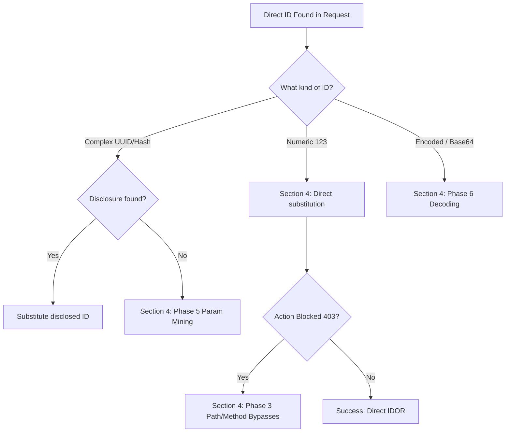

*Navigation: [🏠 Home](../../Hunting%20Approach%20Guide.md) | [🔙 Back to Checklist](../../Element%20Testing%20Checklist.md) | [Next: Business Logic](Business%20Logic%20%26%20Mass%20Assignment.md) >>*
---

# Insecure Direct Object Reference (IDOR) : Master Playbook

> **Goal:** Manipulating object identifiers (IDs) in requests to access or modify data belonging to other users.
> **Triggers:** URL parameters (`?id=123`), JSON body fields (`{"user_id": 456}`), API paths (`/api/v1/users/789`), or hidden headers.
> **Context:** Imagine a hallway of private mailboxes in a post office. You have the key to your own mailbox (Object 1). An IDOR occurs when the bouncer (the server) lets you use your key to open someone else's mailbox (Object 2) just because you changed the number on the door.
> **Hacker Mindset:** "The server is asking me which object I want to see. I'll give it someone else's ID. If the server doesn't double-check my 'ID badge' against that specific object, I'm in."

---

---

## 0. Exploit Selection Search Tree
*Use this logical search tree to decide which IDOR technique to prioritize based on the application's behavior:*

1.  **Direct ID Visible in URL or Body?** (e.g., `/user/123`, `?id=456`, `{"id": 789}`)
    *   **Scenario A: Numeric IDs** → Use **[[#Phase 2: Direct ID Substitution & Enumeration|Phases 2 & 3]]** (Sequential increment/decrement).
    *   **Scenario B: Complex IDs (UUID/Hash)** → Use **[[#3.3 Multi-Level Probing Techniques|UUID Disclosure]]** or **[[#Phase 6: Encoding & Obfuscation|Encoding Analysis]]**.
2.  **Request Blocked with 403 Forbidden?**
    *   **Scenario C: Path-Based Protection** → Try **[[#Phase 3: Path and URL Manipulation Bypasses|Trailing Slashes (//)]]** or **[[#Phase 4: Logic & Endpoint Bypasses|Version Downgrading (/v1/)]]**.
    *   **Scenario D: Parameter-Based Protection** → Use **[[#Phase 5: Parameter & Body Abuse|Parameter Pollution]]** or **[[#Phase 7: Protocol Bypasses|Method Overrides]]**.
3.  **No ID Visible but Private Data Returned?**
    *   **Scenario E: Hidden Tokens** → Use **[[#Phase 10: Automation Recipes|Arjun/ParamMiner]]** to uncover hidden `user_id` or `org_id` fields.
4.  **Static UI regardless of Success?**
    *   **Scenario F: Blind Endpoint** → Use **[[#6.2 Blind IDOR & Out-of-Band Detection|OAST/Burp Collaborator]]** to detect background triggers.
5.  **Testing a Binary gRPC interface?**
    *   **Scenario G: Protobuf Manipulation** → See the specialized **[[gRPC & Protobuf Exploitation.md|gRPC Playbook]]**.

---

## 1. Methodology & UX Impact Table

| Attack Vector | Beginner "Why" | Detection Indicator | Success Confirmation | Bounty Impact |
| :--- | :--- | :--- | :--- | :--- |
| **Sequential Swap** | Simply changing an ID from `1` to `2` to see someone else's data. | 200 OK instead of 401/403. | Modifying or viewing private data belonging to another user. | P3 - P1 |
| **Version Downgrade** | Accessing an older `/v1/` API lacking modern security checks. | 200 OK on `/v1/` endpoint. | Successfully bypassing 403 Forbidden utilizing a legacy route. | P3 - P1 |
| **Base64/Hex Swap** | Decoding an ID (`dmljdGlt`), changing it, and re-encoding. | Encoded string unpacks to a predictable value. | Directly manipulating another user's encoded identifier. | P3 - P1 |
| **Path/Method Tricks** | Trick routing logic using double slashes or `Method-Override`. | Bypass 403 with `//` or `PUT`. | Reaching a protected endpoint bypassing front-end WAF or Auth. | P3 - P1 |
| **Parameter Mining** | Finding hidden parameters controlling object reference. | Uncovering `?user_id=` with Arjun. | Discovering a parameter that dictates server session identity. | P4 - P2 |

---

## 2. The Hunter's Mental Model (Thinking Phase)

> **Why It Happens**: IDOR persists because developers often rely on "Client-Side Trust." The server thinks: "I gave this user ID 10, so they will only ever ask for ID 10." If the server fails to verify the *ownership* relationship for every single request, the hunter can simply "lie" about which object they want to see.
> **Hacker Mindset**: "I am not going to break the door; I am just going to ask the bouncer for the key to Room 101 instead of Room 102. If he doesn't check my reservation, the room is mine."

### 2.1 The Firefox Thinking Process
*Restoring the master thought process from the legacy heritage audit.*
**Scenario:** You visit `https://www[.]place[.]com/user/12345`. Your browser forces a client-side request to `https://api[.]place[.]com/api/v3/users/12345` which returns sensitive JSON PII.

1.  **The 5-Second Proximity Test**: Immediately try `12344` in the path. Iterate a bit. If you get 401/403s, the server is checking *something*. If you get someone else's PII, you've already won.
2.  **The API Time-Machine**: Change the path version: `/v1/`, `/v2/`, `/v4/`. Sometimes older versions are left completely unguarded.
3.  **The Parameter Trail**: Append parameters to the end: `?userId=12344`. Map every field from the JSON response back into the URL as a query parameter.
4.  **Siphoning the Source**: Search JavaScript files for the string `/api/v3/users`. This often reveals hidden, deprecated, or "admin-only" routes developers thought were invisible.
5.  **The Trailing Slash War Story**: Append a `/`, `?`, or `#` to the end. *Heritage Note: One time I bypassed security on thousands of APIs using a single trailing slash because of a logic flaw in the routing code. This also works to bypass some WAF rules.*
6.  **Path Breadcrumbing**: Traverse backwards: `/api/v3/users/`, `/api/v3/`, `/api/`. Look for directory listing or API schemas (Swagger/OpenAPI).
7.  **Injection Side-Quest**: Try a single quote `/12345'`. If the page breaks, try a double quote `/12345''`. If it fixes itself, you're looking at SQL Injection, not just IDOR.
8.  **Keyword Hunt**: Fuzz the word "users". Try `/api/v3/profiles` or `/api/v3/accounts`.
9.  **The Reserve Keyword Trick**: Try `/users/all` or `/users/default`. Run common dictionary words through the path.
10. **The 10-Minute Limit**: If none of these produce a lead within 10 minutes, you're likely on a well-secured endpoint. Pivot to the next API.

---

## 3. Discovery & Targeting (Hunting Phase)

> **Why It Happens**: Developers often assume that if an ID is "complex" (like a UUID) or "hidden" (in an image route), it's secure. But any ID that appears in a request is a potential target.
> **Hacker Mindset**: "I am not looking for the lock; I am looking for the key lying on the floor. I will check every background request, every image path, and every API call for a token I can swap."

### 3.1 High-Gain Discovery Targets
Always prioritize these sensitive areas for IDOR testing:
*   **Sequential IDs**: Incrementing or decrementing a numeric ID: `/api/v1/users/1234` -> `/api/v1/users/1235`.
*   **Predictable UUIDs**: If v1 (Time+MAC), register accounts in quick succession to guess victim IDs.
*   **Financials**: `POST /change_price` or `POST /currency_swap?from=USD&to=EUR`.
*   **Access Control**: `GET /view_api_keys` or `DELETE /api_key/123`.
*   **Account Actions**: `POST /delete_account` or `GET /profile_image`.
*   **Private Data**: Reading comments, private notes, or PII.

### 3.2 Recovery Checklist (Absolute Fidelity)
Restored items from the original legacy audit for absolute fidelity:
- [ ] **Profile Images**: Changing `user_id` in image upload/view routes.
- [ ] **Account Deletion**: Attempting to delete based on `user_id` or `email`.
- [ ] **Account Info**: Accessing full PII summaries (`/GetUser/dmljdGltQG1haWwuY29t`).
- [ ] **API Keys**: Viewing, deleting, or generating keys for other accounts.
- [ ] **Private Commentary**: Reading restricted or "friends-only" comments.
- [ ] **Price Manipulation**: Changing the product price in checkout or cart bodies.
- [ ] **Currency Swaps**: Forcing the coin type from Dollars to Euros/local currency.
- [ ] **Hashed/Encoded IDs**: Decoding MD5, Base64, or Hex strings to find the raw ID.

### 3.3 Multi-Level Probing Techniques
*   **Relationship Traversal (ORM)**: Append nested fields: `?user__password__startswith=a` or `?user__settings__private=true`.
*   **Passive Siphoning**: Look for background requests (`/api/notifications/count`) and JS API paths (`/api/v3/admin/users/`).
*   **SQLi Quick Check**: Append a single quote (`'`) to your ID. If it blows up, pivot to SQL injection testing.

---

## 4. Technical Execution: The 12-Phase Strategy
> **Why It Happens**: Bypasses work because authorization logic is often inconsistent. A developer might secure the `GET` method but forget the `PUT` method, or secure the main controller but forget the "legacy" version 1 API.
> **Hacker Mindset**: "If the front door is locked, I'll check the service entrance. If the service entrance is locked, I'll try to climb through the vents using a trailing slash or a method override."

### Phase 1: Setup & Target Identification
- [ ] **Create Test Accounts:** Create Attacker and Victim accounts for destructive testing.
- [ ] **API Identification:** Find JSON endpoints over rendered HTML.
- [ ] **Sensitivity Audit:** Target password resets, account recovery, financial data, and DMs.
- [ ] **ID Leakage**: Search public pages or background APIs for IDs belonging to other users.

### Phase 2: Direct ID Substitution & Enumeration
| Technique | Scenario to Test (Attacker ID=10, Victim ID=9) |
| --- | --- |
| **Basic ID Flip** | `GET /api/v5/users/10` -> `GET /api/v5/users/9` |
| **Numeric Brute Force** | Loop over sequential numeric IDs. |
| **Non-Numeric substitution** | Replace ID with email, username, or UUID. |
| **Complex ID Brute Force** | Brute force the last 1–4 chars of a complex ID. |
| **Predictable ID / Combined ID** | `/user/2222/data/3333` — change one or both parts. |
| **Hashed/Derived IDs** | Detect MD5/SHA hashes and attempt derived replacements. |

### Phase 3: Path and URL Manipulation Bypasses
| Technique | Scenario to Test |
| --- | --- |
| **Trailing Slash** | `/users/9` -> `/users/9/` |
| **Double Slashes** | `/users//9` or `/users/./9` |
| **Case Variation** | `/api/User?id=123` vs `/api/user?id=123` |
| **Key Swapping** | Replace `user_id` with `userid`, `account_id`, or `customer_id`. |
| **Path Traversal** | `POST /users/delete/my_id/../victim_id` |
| **Wildcard Substitution** | `GET /api/users/*` |
| **Fuzz Keywords** | `/api/v3/users/all` |

### Phase 4: Logic & Endpoint Bypasses
| Technique | Scenario to Test |
| --- | --- |
| **Version Downgrading** | `GET /v3/user/111` -> `GET /v1/user/111`. |
| **Sub-Endpoint Variant** | Testing a detail endpoint that might be less protected than the profile. |
| **Case Variants (ADMIN)** | `/admin/profile` -> `/Admin/profile` |
| **Role Field Toggle** | Toggle `"owner": false` or `"is_admin"` via body params. |
| **Token / Auth Swap** | Swap active tokens between attacker and victim sessions. |
| **Token Binding Flaws** | Using a valid token for Resource A against Resource B. |
| **Front-Back Desync** | Sending IDs hidden in the UI but accepted by the backend. |

### Phase 5: Parameter & Body Abuse
| Technique | Scenario to Test |
| --- | --- |
| **Add Parameter Bypass** | `?user_id=victim_uuid` on an endpoint that usually takes no ID. |
| **Multi-ID / Comma Sep** | `GET /api/users?id=10,9` |
| **HTTP Parameter Pollution** | `?user_id=10&user_id=9` |
| **JSON Array Wrap** | `{"userid":[123]}` |
| **JSON Object Wrap** | `{"userid":{"userid":123}}` |
| **JSON Param Pollution** | `{"userid":1234,"userid":2542}` |
| **Null Termination** | `/api/users/9%00` |
| **Replace Param Name** | `album_id` -> `account_id` |
| **Batch Injection** | `{"ids":[111,222,target_id]}` |
| **Object Injection** | `{"user": {"id": 9, "role": "admin"}}` |

### Phase 6: Encoding & Obfuscation
*   **Leading Zeros**: `GET /api/users/009`.
*   **Hex/MD5/SHA Analysis**: Binary/Hex patterns like `0x7B` or `5d41402...`.
*   **Decode/Re-Encode**: Base64 (`MTIzNg`) -> Change -> Re-encode.
*   **Type Confusion**: `"9"` (String) vs `9` (Integer).

### Phase 7: Protocol Bypasses
*   **Change HTTP Method**: `GET` -> `POST` -> `PUT` -> `DELETE`.
*   **X-HTTP-Method-Override**: Use `X-HTTP-Method-Override: DELETE` to bypass method filters.
*   **Content-Type Swap**: `json` ↔ `xml` ↔ `form-urlencoded`.
*   **File Type Swap**: `.json` -> `.xml`, `.txt`, `.config`.
*   **gRPC / Protobuf**: Test binary message manipulation (e.g., `GetUser(UserRequest { user_id: 9 })`).

### Phase 8: Injection Payload Table
| Variant | Example |
| --- | --- |
| `%0d%0a` | `{"id":2222%0d%0a1111}` |
| `%00` | `{"id":2222%001111}` |
| `;` or `,` | `{"id":2222;1111}` |
| `\|` or `&` | `{"id":2222 | 1111}` |
| `#` | `{"id":2222#1111}` |

### Phase 9: Advanced Monitoring
*   **Blind IDOR**: Monitor for victim-side actions (emails/exports) using **Burp Collaborator**.
*   **WebSocket Channels**: Subscribing to `user_9` channels via `SUBSCRIBE`.
*   **TOCTOU / Race**: Racing ownership checks with data export requests.
*   **GraphQL Mutation**: Substituting object IDs in GraphQL queries.

### Phase 10: Automation Recipes
*   **ffuf**: `ffuf -u https://target/api/user/FUZZ -w ids.txt`.
*   **Intruder**: Sequential numeric range fuzzing.
*   **Arjun**: Finding hidden `user_id` parameters in the background.

### Phase 11: Detection of False Negatives
- [ ] Audit **Content-Length** changes, not just status codes.
- [ ] Test same object with **Multiple Methods**.
- [ ] Check **Mobile Parity** (APKs often use different routes).
- [ ] Verify **Batch Endpoints** for accidental data leakage.

### Phase 12: Prioritization Guide
1. **PII/Financials** (Highest Impact).
2. **Export/Download** operations.
3. **Write/Delete** operations.
4. **GraphQL/WebSockets/gRPC**.

---

## 5. Visual Walkthrough (Image Narratives)

> **Why It Happens**: Visual evidence is the quickest way for a beginner to see the "Delta" (change) in a server's behavior. By comparing the request from your account with the response from the victim's account, the vulnerability becomes undeniable.
> **Hacker Mindset**: "I am going to document the exact moment the server lies to me. I'll show the before and after, proving that changing one digit unlocked the whole world."

### 5.1 Identifying Vulnerable Direct References
*   **Step 1: Discovering the Entry Point**: Open Burp Suite and intercept the traffic while browsing user profiles. Notice the `id=123` parameter in the URL path.
* 
  > **Beginner Note**: See the numeric index in the highlight? That is your target. This is a "Direct Reference" to a database object.
*   **Hacker Mindset**: If the server doesn't check *who* is asking for `id=123`, we can simply change the number.

### 5.2 Cross-Account Data Leakage (PII Exfiltration)
*   **Step 2: Proving the Vulnerability**: Change the `id` from 10 (your account) to 9 (victim) in the Repeater tab. The server returns a JSON response containing the victim's full name, email, and address.
* 
  > **Beginner Note**: The "200 OK" response with data belonging to someone else is the "Gold Medal" in IDOR hunting. Notice how the PII is leaked in raw JSON.
*   **Hacker Mindset**: Confidentiality is broken. We have accessed private data without authorization.

### 5.3 Discovering Hidden API Routes
*   **Step 3: Expanding the Attack Surface**: Look for subdomains like `api.target.com` or paths like `/api/v1/`. Discover that while `/v3/` is protected, `/v1/` or `/mobile/` endpoints might be completely unauthenticated.
* 
  > **Beginner Note**: If `/v3/users/9` gives a 403 Forbidden, **always** try `/v1/users/9`. Developers often forget to secure old API versions.
*   **Hacker Mindset**: Developers often forget to secure old API versions when releasing new ones.

---

## 6. Beyond the Basics: Chaining & Complex Logic

> **Why It Happens**: Impact is maximized when you chain IDOR with other vulnerabilities. A simple PII leak is good, but an Account Takeover (ATO) or profile defacement via IDOR is an elite finding.
> **Hacker Mindset**: "I have accessed the user's settings. Now, can I use an IDOR to change their password or inject an XSS payload into their bio, effectively attacking everyone who views their profile?"

### 6.1 IDOR Chaining
*   **IDOR + XSS**: Chain an IDOR that modifies a user's nickname to inject a profile-wide XSS payload.
*   **IDOR + CSRF**: Bypassing missing form tokens by substituting the victim's ID in the submission body.

### 6.2 Blind IDOR & Out-of-Band Detection
*   Submit requests for sensitive resources (PDF exports, Receipt generation) that are sent to secondary systems.
*   Monitor your **Burp Collaborator** or OAST address for hits from the target server's internal export engine.

### 6.3 Detection of False Negatives (Final Audit)
- [ ] **Content-Length Audit**: Compare response body sizes meticulously. A 403 Forbidden with a 4000-byte body might still be leaking the victim's data in the metadata.
- [ ] **Session Race**: Re-test your "attacker" requests immediately after logging in and out to ensure the server isn't caching authorization results.
- [ ] **Method Chaos**: Test the same ID with every available HTTP method (GET, POST, PUT, DELETE, PATCH, HEAD).
- [ ] **Mobile Route Analysis**: Decompile the target's APK/IPA to find hidden endpoints (e.g., `/mobile_api/`) that lack the web app's WAF filters.
- [ ] **Array Leakage**: Test batch endpoints `[1, 2, 3]`. Adding a victim's ID to your own often causes the server to return all records.

---

## 7. The Master Toolbox

| Tool | Primary Purpose | Key Command / Extension |
| :--- | :--- | :--- |
| **Autorize** | Automated Auth Checks | Burp Suite Extension (The standard for IDOR). |
| **Paramalyzer** | Parameter Archiving | Burp Suite Extension for finding hidden IDs. |
| **Arjun** | Parameter Discovery | `arjun -u [URL] -m POST` |
| **ffuf** | Sequential Fuzzing | `ffuf -u [URL]/FUZZ -w ids.txt` |
| **GAP** | API Path Scraping | Scrapes JS files for hidden endpoints. |
| **Param Miner** | Hidden ID Fuzzing | Burp Suite Extension for "un-guessable" IDs. |

### 7.1 References
*   **[[Resources to Learn 2a71808bc7b78041bfc4d21cc9e97b25|Master Heritage List]]**: Consolidated links and war stories from the original audit.
*   **[IDOR MindMap (XMind)](https://xmind.app/m/CSKSWZ/)**: The visual reference guide for IDOR mastery.

### 7.2 Curated High-Yield Resources
*   **[PortSwigger: Access Control (IDOR) Labs](https://portswigger.net/web-security/access-control/idor)**: The gold standard for hands-on IDOR training.
*   **[HackTricks: IDOR Exploitation](https://book.hacktricks.xyz/pentesting-web/idor)**: Deep technical breakdown of modern bypass techniques and edge cases.
*   **[PentesterLand: IDOR Bug Reports](https://pentester.land/list-of-bug-bounty-writeups.html?vulnerability=IDOR)**: Real-world bug bounty writeups to study exactly how hunters find these in the wild.
*   **[Bugcrowd: How-To Find IDORs](https://www.bugcrowd.com/blog/how-to-find-idors/)**: Strategic guide for identifying object references in complex applications.
*   **[The Insecure Direct Object Reference Bible](https://medium.com/@I_am_Siddiki/the-idor-bible-c9d300e8f237)**: Comprehensive collection of payloads and automation tips.

---
---
*Navigation: [🏠 Home](../../Hunting%20Approach%20Guide.md) | [🔙 Back to Checklist](../../Element%20Testing%20Checklist.md) | [Next: Business Logic](Business%20Logic%20%26%20Mass%20Assignment.md) >>*
