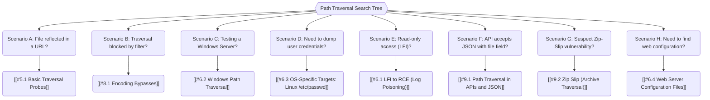

*Navigation: [🏠 Home](../../Hunting%20Approach%20Guide.md) | [⬅️ Layer 2: Element Testing](../../Element%20Testing%20Checklist.md) | [⬅️ Layer 3: Vulnerability Staging](../../Vulnerability_Staging.md)*

# Path Traversal : Master Playbook

> **The Hotel Master Key Analogy**: Imagine you're at a hotel and you find a way to tell the elevator to go to the basement "Employees Only" area by pressing a sequence of buttons like "Up, Up, Down, Down." Path Traversal is like using `../` to tell the computer to leave the "Public Guest Room" (Web Folder) and sneak into the "Manager's Office" (System Files).

---

## 0. Exploit Selection Search Tree

*   **1. Scenario A: File reflected in a URL?**
    *   Target: [[#5.1 Basic Traversal Probes]].
*   **2. Scenario B: Traversal blocked by filter?**
    *   Target: [[#8.1 Encoding Bypasses]].
*   **3. Scenario C: Testing a Windows server?**
    *   Target: [[#6.2 Windows Path Traversal]].
*   **4. Scenario D: Need to dump user credentials?**
    *   Target: [[#6.3 OS-Specific Targets: Linux /etc/passwd]].
*   **5. Scenario E: Can only read but not execute?**
    *   Target: [[#6.1 LFI to RCE (Log Poisoning)]].
*   **6. Scenario F: API accepts JSON with a "file" field?**
    *   Target: [[#9.1 Path Traversal in APIs and JSON]].
*   **7. Scenario G: Suspect a zip-slip vulnerability?**
    *   Target: [[#9.2 Zip Slip (Archive Traversal)]].
*   **8. Scenario H: Need to find hidden web config?**
    *   Target: [[#6.4 Web Server Configuration Files]].

---

## 1. Professional Methodology: UX Summary Table

| Attack Vector | Beginner "Why" | Detection Indicator | Success Confirmation | Bounty Impact |
| :--- | :--- | :--- | :--- | :--- |
| **Standard `../`** | Using "dot-dot-slash" to climb out of the intended directory. | Request processed without blocking. | File content (e.g., `/etc/passwd`) appears. | P3 - P1 |
| **Root Referencing** | Bypassing relative path filter by providing "Full Home Address". | Request processed directly at root. | Accessing `/etc/passwd` directly. | P3 - P1 |
| **Recursive Stripping**| Using `....//` so when the app "cleans" it, a valid `../` remains. | Bypass 403 on standard jump. | Bypassing filters that strip sequences once. | P3 - P1 |
| **URL Obfuscation** | Using `%2e%2e%2f` to hide the "dots" from the security filter. | Bypass 403 or WAF blocking. | Filter doesn't recognize the traversal chars. | P3 - P1 |
| **Start-of-Path** | Giving the "correct" folder first, then using `../` to leave it. | Prefix is accepted as valid. | Accessing files while keeping the prefix valid. | P3 - P1 |
| **Extension Spoofing**| Adding `%00.png` to trick the app into thinking it's an "image". | Successful upload or read of non-image. | File extension check is bypassed fully. | P3 - P1 |

---

## 2. Phase 1: File System Recon & Discovery (Heritage Checklist)

*Systematic probing of image displays and file-fetching parameters.*

### 2.1 Standard & Absolute Path Bypasses
* **Scenario 1: Simple Case**
  - **Attack**: Change `filename=photo.jpg` to `filename=../../../etc/passwd`.
  - 
    > **Beginner Note**: In Burp, we see the `filename` parameter. By using `../` three times, we tell the server: "Go up three levels from the image folder to the root directory, then enter the `/etc/` folder and give me the `passwd` file."

* **Scenario 2: Absolute Path Bypass**
  - **Logic**: If the app "blocks" the `../` sequence but still treats your input as relative to a root, try the absolute path.
  - **Payload**: `/etc/passwd`
  - 
    > **Beginner Note**: Some servers don't check for "relative" jumps (`../`) but fail to block "absolute" paths. By providing the full home address of the file, we skip the directory jumping entirely.

### 2.2 Advanced Filter Evasion
* **Scenario 3: Non-Recursive Stripping**
  - **Attack**: If the app removes `../`, use a nested version.
  - **Payload**: `....//....//....//etc/passwd`
  - 
    > **Beginner Note**: The server is programmed to "clean" the input by deleting any `../` it finds. But it only does this *once*. When it deletes the inner `../` from our `....//`, the remaining characters snap together to form a new, valid `../` jump!

* **Scenario 4: Superfluous URL-Decode**
  - **Attack**: Double-encode the slashes to bypass initial WAF checks.
  - **Payload**: `..%252f..%252f..%252fetc/passwd`
  - 
    > **Beginner Note**: We are using "Double URL Encoding". The security filter sees `%252f` and doesn't recognize it as a slash `/`. But when the backend server processes the request, it decodes it twice, revealing our hidden traversal command.

---

## 3. Phase 2: Logic & Extension Bypasses

*Defeating business logic that validates prefixes or extensions.*

### 3.1 Start-of-Path Validation
* **Scenario 5: Mandatory Folder Prefix**
  - **Logic**: The app checks if your input starts with `/var/www/images/`.
  - **Bypas**: `/var/www/images/../../../etc/passwd`
  - 
    > **Beginner Note**: The server is stubborn—it refuses to look at any file unless it starts with `/var/www/images/`. So, we give it exactly what it wants, then immediately use `../../../` to "undo" that folder and jump back to the sensitive system files.

### 3.2 Null Byte & Extension Spoofing
* **Scenario 6: File Extension Check (`.png`)**
  - **Attack**: Use a Null Byte (`%00`) to terminate the string early on the backend, but keep the extension for the frontend filter.
  - **Payload**: `../../../etc/passwd%00.png`
  - 
    > **Beginner Note**: The server demands that the filename ends in `.png`. We use the Null Byte `%00` as a "stop sign". The frontend sees `.png` and is happy. But the backend server sees `%00`, stops reading right there, and fetches `etc/passwd`, ignoring the useless `.png` at the end.

---

## 4. Expert Targets & OS Differences

### 4.1 Linux Targets
- `/etc/passwd` (User List)
- `/etc/shadow` (Password Hashes - Root only)
- `/root/.bash_history` (Command History)
- `/proc/self/environ` (Environment Variables)

### 4.2 Windows Targets
- `c:\windows\win.ini` (System Config)
- `c:\windows\system32\drivers\etc\hosts` (Local DNS Mapping)
- `c:\users\administrator\desktop\passwords.txt`

---

## 5. Reference & Resources
- [Portswigger: Directory Traversal](https://portswigger.net/web-security/file-path-traversal)
- [HackTricks: File Inclusion / Traversal](https://book.hacktricks.xyz/pentesting-web/file-inclusion)
- [PayloadsAllTheThings: Directory Traversal](https://github.com/swisskyrepo/PayloadsAllTheThings/tree/master/Directory%20Traversal)

---
*Navigation: [🏠 Home](../../Hunting%20Approach%20Guide.md) | [⬅️ Layer 2: Element Testing](../../Element%20Testing%20Checklist.md) | [⬅️ Layer 3: Vulnerability Staging](../../Vulnerability_Staging.md)*
