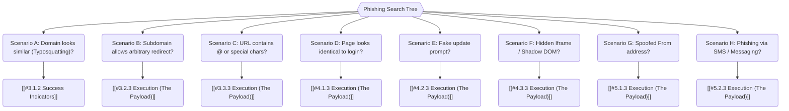

*Navigation: [🏠 Home](../../Hunting%20Approach%20Guide.md) | [⬅️ Layer 2: Element Testing](../../Element%20Testing%20Checklist.md) | [⬅️ Layer 3: Vulnerability Staging](../../Vulnerability_Staging.md)*

# Phishing & Visual Spoofing : Master Playbook

> **Goal:** Deceiving users through visual manipulation, protocol spoofing, and infrastructure hijacking to bypass modern defenses (like 2FA) and steal credentials or sessions.
> **Triggers:** Discovery of user-controlled links, OAuth integrations, frames without security headers, or injection points in email/HTTP headers.
> **Context:** If bug hunting is a technical duel, Phishing is a **Psychological Masterclass**. We don't just break the code; we break the **User's Trust** in their own eyes and the application's perceived safety.
> **Hacker Mindset:** "The browser is a canvas of trust. If I can paint a fake window or redirect a trusted link, the strongest encryption in the world won't save the user from themselves."

---

## 0. Exploit Selection Search Tree



*   **1. Scenario A: Domain looks similar (Typosquatting)?**
    *   Target: [[#3.1.2 Success Indicators]].
*   **2. Scenario B: Subdomain allows arbitrary redirect?**
    *   Target: [[#3.2.3 Execution (The Payload)]].
*   **3. Scenario C: URL contains "@" or special characters?**
    *   Target: [[#3.3.3 Execution (The Payload)]].
*   **4. Scenario D: Page looks identical to login?**
    *   Target: [[#4.1.3 Execution (The Payload)]].
*   **5. Scenario E: Fake update prompt?**
    *   Target: [[#4.2.3 Execution (The Payload)]].
*   **6. Scenario F: Hidden Iframe or Shadow DOM?**
    *   Target: [[#4.3.3 Execution (The Payload)]].
*   **7. Scenario G: Spoofed "From" address?**
    *   Target: [[#5.1.3 Execution (The Payload)]].
*   **8. Scenario H: Phishing via SMS or Messaging?**
    *   Target: [[#5.2.3 Execution (The Payload)]].

---

## 1. Methodology & UX Impact Table

| Attack Vector | Beginner "Why" | Detection Indicator | Success Confirmation | Bounty Impact |
| :--- | :--- | :--- | :--- | :--- |
| **Visual Deception** | Tricking the eye into seeing safety (safe extensions/domains). | Spoofed URL renders cleanly. | User clicks or visits a domain that looks 100% correct. | P4 - P2 |
| **UI Hijacking** | Manipulating the application UI or browser context. | UI element overlaps or steals focus. | User interacts with a fake window or invisible elements. | P4 - P2 |
| **Link Laundering** | Using trusted domains to bypass filters and establish false trust. | Legitimate redirect works without warning. | A phishing link starting with `google.com/url?q=` is clicked. | P3 - P2 |
| **Session Theft** | The "Final Act": Bypassing 2FA to steal active sessions directly. | Cookie is accessible/stolen. | Attacker logs in with stolen session cookies, bypassing MFA. | P2 - P1 |

---

## 2. Hunter's Checklist
- [ ] Does the application support International Domain Names (IDN)?
- [ ] Is there any outbound link missing `rel="noopener"`?
- [ ] Is `X-Frame-Options` or CSP `frame-ancestors` missing?
- [ ] Can I manipulate the `Host` header to control links in system emails?
- [ ] Does the application have an Open Redirect that can be used to "hide" malicious URLs?
- [ ] Can I create an OAuth app with a deceptive name (e.g., "Internal Support")?
- [ ] Is there an XSS point where I can paint a fake login modal?

---

## 3. Classic Visual Deception
> **Target**: Exploiting character rendering and domain naming conventions.

### 3.1 RTLO (Right-to-Left Override)
#### 3.1.1 Why It Happens
Unicode character `U+202E` is meant for languages (e.g., Arabic) that read right-to-left. Windows and browsers flip all text following this character.
**Analogy**: It's like a magician showing you a "safe" card, then flipping it into a "danger" card under your nose.

#### 3.1.2 Success Indicators
- **Visual Lie**: `invoice_pdf[RTLO]exe.pdf` appears as `invoice_pdf.fdp.exe` (showing .pdf to the user).

#### 3.1.3 Execution (The Payload)
*   **Character**: `\u202E`
*   **Payload**: `http://target.com/content/\u202Emoc.attacker.www//ptth` (Visual: `http://www.attacker.com/content/target.com`).

---

### 3.2 IDN Homograph Attacks (The Mirror URL)
#### 3.2.1 Why It Happens
Browsers allow non-English characters (Cyrillic, Greek). Some look identical to Latin (e.g., Cyrillic 'а' vs Latin 'a'). 
**Analogy**: It's like finding two identical twins. They look the same, but they have different social security numbers (Punycode).

#### 3.2.2 Success Indicators
- **Secure Lock**: The browser shows a green lock for what looks like `amazon.com`.
- **Punycode**: The URL bar reveals `xn--...` when clicked or inspected.

#### 3.2.3 Execution (The Payload)
*   **Target**: `google.com`
*   **Spoof**: `gоogle.com` (using Cyrillic 'о' - `U+043e`).
*   **The Hack**: Register the `xn--` domain and host a mirror of the original site.

---

### 3.3 Typosquatting & Combosquatting
#### 3.3.1 Why It Happens
Users make mistakes. Attacker register domains like `g0ogle.com` (Typosquatting) or `google-security-update.com` (Combosquatting).
**Analogy**: Opening a store next to a famous bank and naming it "Bank of Americas."

#### 3.3.2 Success Indicators
- **Traffic Spikes**: Users accidentally landing on the site.
- **Phishing Hook**: Users enter credentials into the "security update" portal.

#### 3.3.3 Execution (The Payload)
*   **Strategy**: Register `[target]-support.com` or `[target]-verify.io`. Setup a convincing landing page.

---

## 4. UI & Logic Redressing
> **Target**: Hijacking the user's interaction point with the application.

### 4.1 Reverse Tab Nabbing (The Tab Hijack)
#### 4.1.1 Why It Happens
Opening links in a new tab (`target="_blank"`) gives the new page a handle (`window.opener`) to the original tab.
**Analogy**: While you're in the back room looking at a new item, someone silently changes the sign on the front door of the shop you just left.

#### 4.1.2 Success Indicators
- **Silent Pivot**: The original tab has changed from the target site to a fake login.

#### 4.1.3 Execution (The Payload)
*   **Attacker Page (opened in new tab)**:
    ```javascript
    window.opener.location = "https://phish.com/session_expired";
    ```

---

### 4.2 Browser In The Browser (BITB)
#### 4.2.1 Why It Happens
Modern login prompts (Google/MS) often open in small separate windows. Attackers can "draw" this entire window inside the HTML of their page.
**Analogy**: Painting a fake window on a wall that looks exactly like a real window. The user tries to look through it and gets hit in the head.

#### 4.2.2 Success Indicators
- **Draggable Modal**: The modal behaves like a window but is stuck inside the browser boundaries.
- **Perfect URL Bar**: The "URL bar" of the popup shows the legitimate domain and SSL lock.

#### 4.2.3 Execution (The Payload)
*   **The Layout**: Use CSS to draw a window title bar, URL field, and SSL lock.
*   **The Logic**: Embed an iframe or fake form inside this "drawn" window.

---

### 4.3 UI Redressing (Clickjacking)
#### 4.3.1 Why It Happens
Missing `X-Frame-Options` or CSP `frame-ancestors` allows a site to be iframed. An attacker makes the target site invisible and overlays it with an innocent game.
**Analogy**: An invisible sheet of glass over a computer. You click a "Play Game" button on the glass, but you're actually clicking "Delete Account" underneath it.

#### 4.3.2 Success Indicators
- **Action Performed**: The user performs a high-privilege action (Delete, Transfer, Invite) without knowing it.

#### 4.3.3 Execution (The Payload)
*   **The CSS**:
    ```css
    #target_iframe { opacity: 0; position: absolute; }
    #dummy_button { position: absolute; top: [Target_Button_Y]; left: [Target_Button_X]; }
    ```

---

### 4.4 DOM Spoofing (XSS-to-Phishing)
#### 4.4.1 Why It Happens
Using an XSS vulnerability to change the UI. This is highly effective because the URL and SSL lock are **100% Genuine**.
**Analogy**: You're in your real bank's real lobby, but an attacker has put a fake "Check-in Here" desk right in front of the real tellers.

#### 4.4.2 Success Indicators
- **Modal Overlay**: A "Session Timeout" or "Security Alert" appears during legitimate use.

#### 4.4.3 Execution (The Payload)
*   **XSS Injection**:
    ```javascript
    document.body.innerHTML += '<div id="fake_login">Session Expired. Please Re-enter Password...</div>';
    ```

---

## 5. Infrastructure Poisoning
> **Target**: Hijacking system-level communications.

### 5.1 Email Header Injection
#### 5.1.1 Why It Happens
Newline injection (`%0a%0d`) in email forms.
**Analogy**: Adding extra names to a letter's "To" field while the sender isn't looking.

#### 5.1.2 Success Indicators
- **Spam Delivery**: Emails intended for the support team reach your injected CC list.

#### 5.1.3 Execution (The Payload)
*   **Input**: `test@mail.com%0a%0dCc:hacker@mail.com`

---

### 5.2 Password Reset Poisoning (Host Header)
#### 5.2.1 Why It Happens
Server uses the `Host` header to build links.
**Analogy**: Asking for a map to the bakery, but the person tells you to follow the street sign you just (secretly) painted.

#### 5.2.2 Success Indicators
- **Hijacked URL**: Reset emails contain `https://attacker.com/reset?token=...`.

#### 5.2.3 Execution (The Payload)
*   **Header**: `Host: evil.com` in the password reset request.

---

### 5.3 Weaponized Open Redirects
#### 5.3.1 Why It Happens
Redirects allow attackers to "tunnel" malicious URLs through trusted domains.
**Analogy**: A bad guy hiding in a Trojan Horse that is painted with the King's official logo.

#### 5.3.2 Success Indicators
- **Pre-fill Trust**: The user sees `accounts.google.com/...` and clicks comfortably.

#### 5.3.3 Execution (The Payload)
*   **URL**: `https://legit.com/login?next=http://phish.com`

---

## 6. Advanced Session Theft (The End-Game)
> **Target**: Bypassing 2FA/MFA and modern identity providers.

### 6.1 AiTM / Reverse Proxy Phishing (Evilginx)
#### 6.1.1 Why It Happens
Traditional phishing fails against 2FA. AiTM proxies the entire real site in real-time.
**Analogy**: An evil translator sitting between you and a bank. He repeats what you say to the bank, and what the bank says to you, but he copies the keys (session cookies) at the end.

#### 3.1.2 Success Indicators
- **Session Cookie Captured**: Tools like **Evilginx2** capture the `SID` or `SessionID` after the victim completes 2FA.

#### 6.1.3 Execution (The Payload)
*   **Tool**: **Evilginx2**.
*   **Setup**: Configure a "phishlet" for the target site. Send the phishlet link to the victim. Once they log in (even with 2FA), the tool intercepts the resulting session cookie.

---

### 6.2 OAuth Consent Phishing
#### 6.2.1 Why It Happens
Users trust "Sign in with..." prompts. They often grant wide permissions (Read Mail, Manage Files) to unknown apps.
**Analogy**: Giving your house keys to a stranger because they're wearing a uniform that looks like your security company's.

#### 6.2.2 Success Indicators
- **Access Token Granted**: Attacker receives a token that allows API access to the victim's account forever (until revoked).

#### 6.2.3 Execution (The Payload)
*   **The App**: Create an OAuth app named "Security Audit" or "Attachment Scanner."
*   **The Link**: Redirect the user to the legitimate OAuth consent screen for YOUR app.

---

## 7. Mitigation & Defense
1.  **Strict Security Headers**: Enforce `X-Frame-Options: DENY` and `Content-Security-Policy`.
2.  **Referrer Control**: Use `Referrer-Policy: strict-origin-when-cross-origin`.
3.  **Static Logic**: Never use `Host` or redirected inputs to build critical links.
4.  **Hardware Keys (FIDO2)**: Hardware-backed MFA is the only definitive protection against AiTM.

---
*Navigation: [🏠 Home](../../Hunting%20Approach%20Guide.md) | [⬅️ Layer 2: Element Testing](../../Element%20Testing%20Checklist.md) | [⬅️ Layer 3: Vulnerability Staging](../../Vulnerability_Staging.md)*
