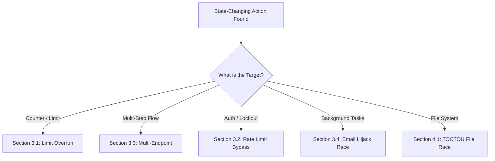

*Navigation: [🏠 Home](../../Hunting%20Approach%20Guide.md) | [🔙 Back to Checklist](../../Element%20Testing%20Checklist.md) | [Next: Electron & Desktop RCE](Electron%20&%20Desktop%20RCE.md) >>*
---

# Race Conditions : Master Playbook

> **Goal:** Exploiting the "Time-of-Check to Time-of-Use" (TOCTOU) gap to perform unauthorized actions or multiply resources (money, coupons, votes).
> **Triggers:** State-changing endpoints with counters (Limit Overruns), multi-step validations, or background email processes.
> **Context:** A Race Condition is like a **"Double-Cashing a Check"**. Imagine you have $100 and you walk into two bank branches at the *exact same microsecond*. If they both check your balance before either one updates it, you get $200.
> **Hacker Mindset:** "The server thinks it can multi-task safely. I'll prove that if I'm fast enough, I can sneak between its checks and its actions."

---

---

## 0. Exploit Selection Search Tree
*Use this logical search tree to decide which Race Condition technique to prioritize:*



1.  **Can I use a single-use object (coupon, gift card) twice?**
    *   **Yes** → Use **[[#3.1 Lab: Limit overrun race conditions]]**.
2.  **Can I change the state (add items) DURING a long checkout process?**
    *   **Yes** → Use **[[#3.3 Lab: Multi-endpoint race conditions]]**.
3.  **Is there a delay between a DB update and a background task (like sending mail)?**
    *   **Yes** → Use **[[#3.4 Lab: Single-endpoint race conditions]]**.
4.  **Can I sneak past a security counter (like a 3-try lockout)?**
    *   **Yes** → Use **[[#3.2 Lab: Bypassing rate limits via race conditions]]**.
5.  **Can I swap a file after the server validates it but before it saves it?**
    *   **Yes** → Use **[[#4.1 File System Races (TOCTOU)]]**.

---

## 1. Methodology & UX Impact Table

| Attack Vector | Beginner "Why" | Detection Indicator | Success Confirmation | Bounty Impact |
| :--- | :--- | :--- | :--- | :--- |
| **Limit Overrun** | Bypassing a counter. | Parallel batch reduces price/count multiple times. | Negative balance or multi-use. | **High** |
| **Multi-Endpoint** | Swapping items during checkout. | Warming connection creates tight sync. | Checkout succeeds with wrong item/price. | **High** |
| **Rate Limit Bypass**| Crowding the bouncer. | Multiple failures before lockout. | Brute-force success despite limits. | **Medium/High** |
| **Email Race** | Swapping the address mid-delivery. | Duplicate confirmation links. | Admin link sent to attacker's mail. | **Critical** |
| **TOCTOU File** | The "Bait and Switch". | Delay between check and save. | Shell executed despite jpg check. | **Critical** |

---

## 🔎 2. Detection & Benchmarking

### 2.1 Predict a Collision: Diagnostic Checklist

To find a race condition, ask yourself these diagnostic questions at every state-changing endpoint:

- **1. Is there a shared state or counter?** 
    - *Example*: Does this `POST /cart/coupon` interact with a balance, a "used" flag, or a limited-stock item?
- **2. How is this state keyed?** 
    - *Inference*: Is it **Session-Keyed** (only I can affect my cart) or **Global-Keyed** (anyone can affect the stock)?
- **3. Is there a "Check-then-Act" gap?** 
    - *Logic*: Does the server say *"If X is valid, THEN do Y"*? 
    - *The Window*: If you send 20 requests at once, can they all pass the *"If X is valid"* check before the first one completes *"do Y"*?
- **4. Is the operation non-atomic?**
    - *Technical*: Does the server Read from DB → Calculate in Memory → Write to DB? (This is the "Golden Window" for a collision).

#### 🎯 High-Value Targets (Where to Look)
*   **Purchasing**: Can I apply the same coupon twice? Can I buy 10 items with $1 balance?
*   **Authentication**: Can I spray 50 passwords before the "3-try lockout" kicks in?
*   **Identity**: Can I change my email to `admin@site.com` while the server is busy sending a confirmation to my old email?
*   **Metrics**: Can I "Like" a post 100 times using a parallel batch?
*   **File Uploads**: Can I swap a safe image for a malicious script *during* the server's validation process?

### 2.2 Connection Warming
> **The Pro's Secret**: Always add a `GET /` request to the start of your Repeater group. This warms the TLS handshake, ensuring your attack requests land in a tight sub-50ms window.

### 2.3 HTTP/1.1 Last-Byte Sync
On servers that **don't** support HTTP/2, use this technique:
1. Send 99% of each request.
2. Hold the last byte.
3. Release the last bytes of all requests simultaneously.
*   **Tool**: Turbo Intruder (Scripts below).

---

## 🧪 3. Prototypical Lab Walkthroughs

### 3.1 Lab: Limit overrun race conditions
**Goal**: Purchase a Lightweight L33t Leather Jacket for an unintended price.

**Steps from Heritage:**

**Predict a potential collision**
1. Log in and buy the cheapest item possible, making sure to use the provided discount code so that you can study the purchasing flow.
2. Consider that the shopping cart mechanism and, in particular, the restrictions that determine what you are allowed to order, are worth trying to bypass.
3. In Burp, from the proxy history, identify all endpoints that enable you to interact with the cart. For example, a `POST /cart` request adds items to the cart and a `POST /cart/coupon` request applies the discount code.
4. Try to identify any restrictions that are in place on these endpoints. For example, observe that if you try applying the discount code more than once, you receive a `Coupon already applied` response.
5. Make sure you have an item to your cart, then send the `GET /cart` request to Burp Repeater.
6. In Repeater, try sending the `GET /cart` request both with and without your session cookie. Confirm that without the session cookie, you can only access an empty cart. From this, you can infer that:
    - The state of the cart is stored server-side in your session.
    - Any operations on the cart are keyed on your session ID or the associated user ID.
    
    This indicates that there is potential for a collision.
    
7. Consider that there may be a race window between when you first apply a discount code and when the database is updated to reflect that you've done this already.

**Benchmark the behavior**
1. Make sure there is no discount code currently applied to your cart.
2. Send the request for applying the discount code (`POST /cart/coupon`) to Repeater.
3. In Repeater, send the `POST /cart/coupon` request twice.
4. Observe that the first response confirms that the discount was successfully applied, but the second response rejects the code with the same `Coupon already applied` message.

**Probe for clues**
1. Remove the discount code from your cart.
2. In **Repeater**, open the **Custom actions** side panel.
3. Click **New > From template**, then select **Trigger race condition**.
4. Save the template to the **Custom actions** side panel without making any modifications.
5. Click beside the **Trigger race condition** custom action. The request is sent 20 times in parallel.
6. In the browser, refresh your cart and confirm that the 20% reduction has been applied more than once, resulting in a significantly cheaper order.

**Prove the concept**
1. Remove the applied codes and the arbitrary item from your cart and add the leather jacket to your cart instead.
2. Resend the group of `POST /cart/coupon` requests in parallel.
3. Refresh the cart and check the order total:
    - If the order total is still higher than your remaining store credit, remove the discount codes and repeat the attack.
    - If the order total is less than your remaining store credit, purchase the jacket to solve the lab.


> **Beginner Note**: This screen shows that the cart belongs to your specific session ID. This means our race condition only needs to fight with our own requests, not everyone else's.


> **Beginner Note**: We are telling Burp to "Release the Kraken"—to send many requests exactly at the same time instead of one by one.


> **Beginner Note**: The `gate` argument is the most important part. It tells Burp to wait until *every* request is ready before letting them out.


> **Beginner Note**: Look at the response times. They are almost identical. This is what we want!


> **Beginner Note**: Instead of $20 off, you might see $200 or $400 off. The server checked the "Is coupon applied?" rule for all 20 requests at once before it could write the first "Yes" to the database.


> **Beginner Note**: The cart is now showing the jacket as "Free." The logic has been completely broken by speed.


---

### 3.2 Lab: Bypassing rate limits via race conditions
**Goal**: Brute-force the password for the user `carlos`.

**Password List:**
```text
123123, abc123, football, monkey, letmein, shadow, master, 666666, qwertyuiop, 123321, mustang, 123456, password, 12345678, qwerty, 123456789, 12345, 1234, 111111, 1234567, dragon, 1234567890, michael, x654321, superman, 1qaz2wsx, baseball, 7777777, 121212, 000000
```

**Steps from Heritage:**

**Predict a potential collision**
1. Experiment with the login function by intentionally submitting incorrect passwords for your own account.
2. Observe that if you enter the incorrect password more than three times, you're temporarily blocked from making any more login attempts for the same account.
3. Try logging in using another arbitrary username and observe that you see the normal `Invalid username or password` message. This indicates that the rate limit is enforced per-username rather than per-session.
4. Deduce that the number of failed attempts per username must be stored server-side.
5. Consider that there may be a race window between:
    - When you submit the login attempt.
    - When the website increments the counter for the number of failed login attempts associated with a particular username.

**Benchmark the behavior**
1. From the proxy history, find a `POST /login` request containing an unsuccessful login attempt for your own account.
2. Send this request to Burp Repeater.
3. In Repeater, add the new tab to a group.
4. Right-click the grouped tab, then select **Duplicate tab**. Create 19 duplicate tabs. The new tabs are automatically added to the group.
5. Send the group of requests in sequence, using separate connections to reduce the chance of interference.
6. Observe that after two more failed login attempts, you're temporarily locked out as expected.

**Probe for clues**
1. Send the group of requests again, but this time in parallel.
2. Study the responses. Notice that although you have triggered the account lock, more than three requests received the normal `Invalid username and password` response.
3. Infer that if you're quick enough, you're able to submit more than three login attempts before the account lock is triggered.

**Prove the concept**
1. Still in Repeater, highlight the value of the `password` parameter in the `POST /login` request.
2. Right-click and select **Extensions > Turbo Intruder > Send to turbo intruder**.
3. In Turbo Intruder, in the request editor, notice that the value of the `password` parameter is automatically marked as a payload position with the `%s` placeholder.
4. Change the `username` parameter to `carlos`.
5. From the drop-down menu, select the `examples/race-single-packet-attack.py` template.
6. In the Python editor, edit the template so that your attack queues the request once using each of the candidate passwords.
7. Note that we're assigning the password list from the clipboard by referencing `wordlists.clipboard`. Copy the list of candidate passwords to your clipboard.
8. Launch the attack.
9. Study the responses.
    - If you have no successful logins, wait for the account lock to reset and then repeat the attack. You might want to remove any passwords from the list that you know are incorrect.
    - If you get a 302 response, notice that this login appears to be successful. Make a note of the corresponding password from the **Payload** column.
10. Wait for the account lock to reset, then log in as `carlos` using the identified password.
11. Access the admin panel and delete the user `carlos` to solve the lab.


> **Beginner Note**: The red "Too many unsuccessful login attempts" message is the trigger. We need to beat this counter.


> **Beginner Note**: In parallel mode, Burp tries to land all 20 attempts in the same millisecond.


> **Beginner Note**: This screen is the "Smoking Gun." It proves the server is vulnerable because we got 10+ normal error messages instead of the lockout.

**Modified Turbo Intruder Script (from Heritage):**
```python
def queueRequests(target, wordlists):

    engine = RequestEngine(
        endpoint=target.endpoint,
        concurrentConnections=1,
        engine=Engine.BURP2
    )

    passwords = [
        "123123", "abc123", "football", "monkey", "letmein", "shadow", "master", "666666", "qwertyuiop", "123321", "mustang", "123456", "password", "12345678", "qwerty", "123456789", "12345", "1234", "111111", "1234567", "dragon", "1234567890", "michael", "x654321", "superman", "1qaz2wsx", "baseball", "7777777", "121212", "000000"
    ]

    for password in passwords:
        engine.queue(target.req, password, gate='1')

    engine.openGate('1')

def handleResponse(req, interesting):
    table.add(req)
```


> **Beginner Note**: Turbo Intruder is even faster than Repeater because it uses raw socket control.

---

### 3.3 Lab: Multi-endpoint race conditions
**Goal**: Purchase a Lightweight L33t Leather Jacket for an unintended price.

**Tip from Heritage**: When experimenting, we recommend purchasing the gift card as you can later redeem this to avoid running out of store credit.

**Steps from Heritage:**

**Predict a potential collision**
1. Log in and purchase a gift card so you can study the purchasing flow.
2. Consider that the shopping cart mechanism and, in particular, the restrictions that determine what you are allowed to order, are worth trying to bypass.
3. From the proxy history, identify all endpoints that enable you to interact with the cart. For example, a `POST /cart` request adds items to the cart and a `POST /cart/checkout` request submits your order.
4. Add another gift card to your cart, then send the `GET /cart` request to Burp Repeater.
5. In Repeater, try sending the `GET /cart` request both with and without your session cookie. Confirm that without the session cookie, you can only access an empty cart. From this, you can infer that:
    - The state of the cart is stored server-side in your session.
    - Any operations on the cart are keyed on your session ID or the associated user ID.
    
    This indicates that there is potential for a collision.
    
6. Notice that submitting and receiving confirmation of a successful order takes place over a single request/response cycle.
7. Consider that there may be a race window between when your order is validated and when it is confirmed. This could enable you to add more items to the order after the server checks whether you have enough store credit.

**Benchmark the behavior**
1. Send both the `POST /cart` and `POST /cart/checkout` request to Burp Repeater.
2. In Repeater, add the two tabs to a new group.
3. Send the two requests in sequence over a single connection a few times. Notice from the response times that the first request consistently takes significantly longer than the second one.
4. Add a `GET` request for the homepage to the start of your tab group.
5. Send all three requests in sequence over a single connection. Observe that the first request still takes longer, but by "warming" the connection in this way, the second and third requests are now completed within a much smaller window.
6. Deduce that this delay is caused by the back-end network architecture rather than the respective processing time of the each endpoint. Therefore, it is not likely to interfere with your attack.
7. Remove the `GET` request for the homepage from your tab group.
8. Make sure you have a single gift card in your cart.
9. In Repeater, modify the `POST /cart` request in your tab group so that the `productId` parameter is set to `1`, that is, the ID of the jacket.
10. Send the requests in sequence again.
11. Observe that the order is rejected due to insufficient funds, as you would expect.

**Prove the concept**
1. Remove the jacket from your cart and add another gift card.
2. In Repeater, try sending the requests again, but this time in parallel.
3. Look at the response to the `POST /cart/checkout` request:
    - If you received the same "insufficient funds" response, remove the jacket from your cart and repeat the attack. This may take several attempts.
    - If you received a 200 response, check whether you successfully purchased the leather jacket. If so, the lab is solved.


> **Beginner Note**: We are looking for the gap between the server saying "Yes, you have enough money" and actually taking the money.


> **Beginner Note**: This delay is usually the server's "cold" start for a connection. We need to "warm" it up.


> **Beginner Note**: Connection warming makes our attack "Stealthy" and much more likely to succeed.


> **Beginner Note**: We are trying to add the jacket while the checkout is still "Thinking" about our balance.


> **Beginner Note**: You can see the balance was deducted for the cheap item, but you received the expensive one.


---

### 3.4 Lab: Single-endpoint race conditions
**Goal**: Associate an arbitrary email address with your account.

**Steps from Heritage:**

**Predict a potential collision**
1. Log in and attempt to change your email to `anything@exploit-<YOUR-EXPLOIT-SERVER-ID>.exploit-server.net`. Observe that a confirmation email is sent to your intended new address, and you're prompted to click a link containing a unique token to confirm the change.
2. Complete the process and confirm that your email address has been updated on your account page.
3. Try submitting two different email addresses in succession, then go to the email client.
4. Notice that if you try to use the first confirmation link you received, this is no longer valid. From this, you can infer that the website only stores one pending email address at a time. As submitting a new email address edits this entry in the database rather than appending to it, there is potential for a collision.

**Benchmark the behavior**
1. Send the `POST /my-account/change-email` request to Repeater.
2. In Repeater, add the new tab to a group.
3. Right-click the grouped tab, then select **Duplicate tab**. Create 19 duplicate tabs.
4. In each tab, modify the first part of the email address so that it is unique to each request.
5. Send the group of requests in sequence over separate connections.
6. Go back to the email client and observe that you have received a single confirmation email for each of the email change requests.

**Probe for clues**
1. In Repeater, send the group of requests again, but this time in parallel.
2. Go to the email client and study the new set of confirmation emails you've received. Notice that, this time, the recipient address doesn't always match the pending new email address.
3. Consider that there may be a race window between when the website:
    1. Kicks off a task that eventually sends an email to the provided address.
    2. Retrieves data from the database and uses this to render the email template.
4. Deduce that when a parallel request changes the pending email address stored in the database during this window, this results in confirmation emails being sent to the wrong address.

**Prove the concept**
1. In Repeater, create a new group containing two copies of the `POST /my-account/change-email` request.
2. Change the `email` parameter of one request to `anything@exploit-<YOUR-EXPLOIT-SERVER-ID>.exploit-server.net`.
3. Change the `email` parameter of the other request to `carlos@ginandjuice.shop`.
4. Send the requests in parallel.
5. Check your inbox:
    - If you received a confirmation email in which the address in the body matches your own address, resend the requests in parallel and try again.
    - If you received a confirmation email in which the address in the body is `carlos@ginandjuice.shop`, click the confirmation link to update your address accordingly.
6. Go to your account page and notice that you now see a link for accessing the admin panel.
7. Visit the admin panel and delete the user `carlos` to solve the lab.


> **Beginner Note**: The server can only store one "pending" email at a time. This is its fatal flaw.


> **Beginner Note**: We are trying to overwhelm the email sender process.


> **Beginner Note**: In this screenshot, the email says "Confirm test1", but it was sent to "test2". This confirms that the data was swapped in the DB while the mail was being built!


> **Beginner Note**: BINGO! The email intended for Carlos just leaked into our inbox.


---

## 4. Elite Attack Classes

1.  **File System Races (TOCTOU)**
    1.  **Scenario**: Attacker uploads a safe file (`photo.jpg`). The server checks the extension, then moves it to the `/uploads` directory.
    2.  **The Race**: Attacker uses a local script to replace `photo.jpg` with `shell.php` **after** the server checks it but **before** it moves it.
    3.  **Impact**: Remote Code Execution (RCE).

2.  **Partial Construction State**
    1.  **Scenario**: User registration takes 3 seconds (DB writes to `users`, `profiles`, and `permissions`).
    2.  **The Race**: Attacker tries to access `GET /admin` with the new user ID **immediately** after Step 1 of registration finishes.
    3.  **Impact**: Privilege Escalation because the "unprivileged" flag hasn't been written to the profile yet.

3.  **Payment Group/Batch Races**
    1.  **Scenario**: Transferring $100 from Wallet A to Wallet B.
    2.  **The Race**: Execute 20 transfers simultaneously.
    3.  **Impact**: $2000 transferred out while only $100 was deducted from the source.

---

## 5. Turbo Intruder: Elite Script Vault

In addition to providing native support for the single-packet attack in Burp Repeater, Turbo Intruder is suited to more complex attacks, such as ones that require multiple retries, staggered request timing, or an extremely large number of requests.

**To use the single-packet attack in Turbo Intruder:**
1. Ensure that the target supports HTTP/2. The single-packet attack is incompatible with HTTP/1.
2. Set the `engine=Engine.BURP2` and `concurrentConnections=1` configuration options for the request engine.
3. When queueing your requests, group them by assigning them to a named gate using the `gate` argument for the `engine.queue()` method.
4. To send all of the requests in a given group, open the respective gate with the `engine.openGate()` method.

**Example Script (from Heritage):**
```python
def queueRequests(target, wordlists):
    engine = RequestEngine(endpoint=target.endpoint,
                            concurrentConnections=1,
                            engine=Engine.BURP2
                            )
    
    # queue 20 requests in gate '1'
    for i in range(20):
        engine.queue(target.req, gate='1')
    
    # send all requests in gate '1' in parallel
    engine.openGate('1')
```

### 5.2 HTTP/1.1 Last-Byte Sync (Non-H2)
```python
def queueRequests(target, wordlists):
    engine = RequestEngine(endpoint=target.endpoint,
                            concurrentConnections=20,
                            requestsPerConnection=1,
                            pipeline=False)
    for i in range(20):
        engine.queue(target.req, gate='sync')
    engine.openGate('sync')
```

---

## 6. Secure Remediation: Global Standards

| Language | Remediation Strategy |
| :--- | :--- |
| **SQL** | `UPDATE accounts SET balance = balance - 100 WHERE id = 1 AND balance >= 100;` |
| **Java** | `synchronized(session) { // Process checkout }` |
| **Node.js** | Use `async-lock` or `redlock` for distributed systems. |
| **Go** | `mu.Lock(); defer mu.Unlock();` |

---

## 7. Real-World Case Studies
*   **Shopify ($10,000)**: Double-use of discount codes.
*   **Starbucks ($5,000)**: Gift card value multiplication.
*   **Uber ($6,000)**: Fare bypass by racing Promo Codes.

---

## 8. Toolbox
*   **Turbo Intruder**: Engine for high-speed parallel requests.
*   **Burp Suite Repeater (Parallel Grouping)**: Native single-packet attack support.
*   **Race Condition Custom Action**: Built-in Burp Pro probe tool.

## 🔗 Resources (from Heritage)
*   [PortSwigger: Race Conditions Masterclass](https://portswigger.net/web-security/race-conditions)
*   [Bambdas for Race Detection](https://github.com/PortSwigger/bambdas)
*   [Trigger race conditions custom action (Burp Suite Pro)](https://github.com/PortSwigger/bambdas/blob/main/CustomAction/ProbeForRaceCondition.bambda)

---
---
*Navigation: [🏠 Home](../../Hunting%20Approach%20Guide.md) | [🔙 Back to Checklist](../../Element%20Testing%20Checklist.md) | [Next: Electron & Desktop RCE](Electron%20&%20Desktop%20RCE.md) >>*
