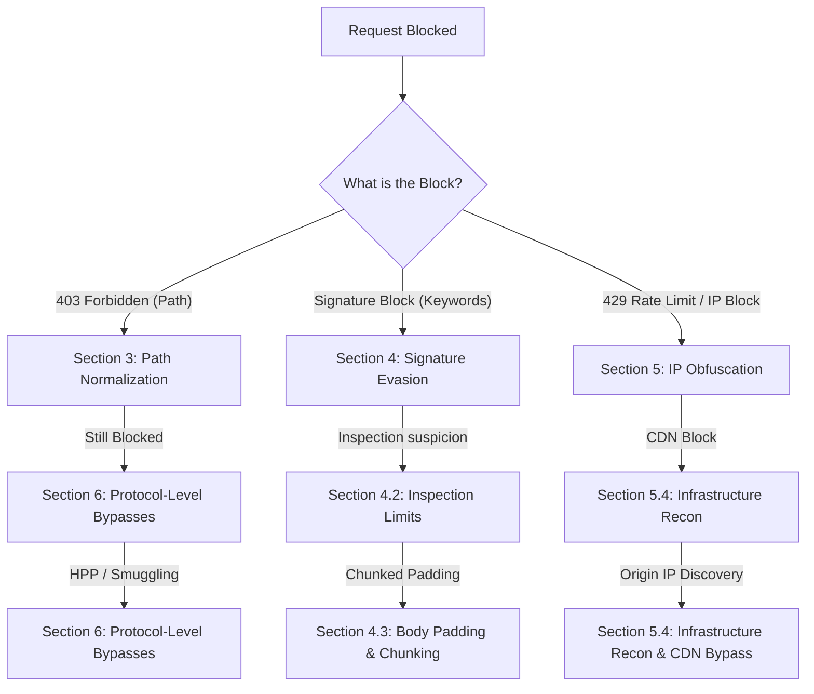

*Navigation: [🏠 Home](../../Hunting%20Approach%20Guide.md) | [⬅️ Layer 2: Element Testing](../../Element%20Testing%20Checklist.md) | [⬅️ Layer 3: Vulnerability Staging](../../Vulnerability_Staging.md)*
---

# WAF & Infrastructure Bypasses : Master Playbook

> **Goal:** Evading Web Application Firewalls (WAFs), Proxies, and IDS to reach vulnerable code or restricted endpoints.
> **Triggers:** Receiving 403 Forbidden, 429 Too Many Requests, or finding specific payloads blocked by security filters.
> **Context:** A WAF is like a bouncer at a club. He has a blacklist of people he won't let in. If you show up wearing a mask (Encoding) or enter through the kitchen door (Path Normalization), you sneak past him.
> **Hacker Mindset:** "The bouncer is looking for a guy named 'SELECT'. I'll wear a mustache and call myself 'S%45LECT'. The WAF is just a parser; if I can make the WAF see a safe request and the backend see a malicious one, I win."

---

## 0. Exploit Selection Search Tree
*Use this logical search tree to triage the WAF bypass pathways:*

1.  **Is your access blocked with a 403 Forbidden on a specific path?**
    *   **Yes** → Use **[[#3. Path Normalization & 403 Bypasses]]** (Dot-slash, semicolon tricks).
2.  **Are specific attack keywords (like `alert` or `SELECT`) being blocked?**
    *   **Yes** → Use **[[#4. WAF Signature Evasion]]** (Encoding, Obfuscation).
3.  **Is your IP blacklisted or are you hitting a 429 rate limit?**
    *   **Yes** → Use **[[#5. IP Obfuscation & Cloud Gateways]]** (IP Rotation, Spoofing headers).
4.  **Is the WAF inspectiing the body? Can you bypass it by splitting the request?**
    *   **Yes** → Use **[[#6. Protocol-Level Bypasses]]** (HPP, Smuggling).
5.  **Is the request blocked but the payload seems clean? Is it a size limit?**
    *   **Yes** → Use **[[#4.2 Inspection Limits (Buffer Overloading)]]** (Padding).
6.  **Are you blocked by a CDN and need to perform deep hardware/network reconnaissance?**
    *   **Yes** → Use **[[#5.4 Infrastructure Recon & CDN Bypass (Elite)]]**.
7.  **Can you use large chunks of padding to force the WAF to skip inspection of the body?**
    *   **Yes** → Use **[[#4.3 Advanced Evasion (Elite)]]**.
8.  **Can you inject multiple parameters (HPP) or exploit Smuggling to confuse logic?**
    *   **Yes** → Use **[[#6. Protocol-Level Bypasses]]** (HPP & Desync Logic).
9.  **Can you find the "Real" server IP and bypass the Cloud WAF entirely?**
    *   **Yes** → Use **[[#5.4 Infrastructure Recon & CDN Bypass (Elite)]]** (Origin Discovery).

---

## 1. Professional Methodology: Summary Table

| Attack Vector | Beginner "Why" | Detection Indicator | Success Confirmation | Bounty Impact |
| :--- | :--- | :--- | :--- | :--- |
| **Path Normalization**| The side-door entry. | `/admin/..;/` | 200 OK on restricted path. | **Medium ($500+)** |
| **Signature Evasion** | The master of disguise. | `%2527` (Double Encode) | Payload fires past filters. | **High ($1.5k+)** |
| **IP Obfuscation** | The crowd-blend. | `X-Forwarded-For` | Rate limits are reset. | **Medium ($800+)** |
| **Buffer Overloading** | Overwhelming the guard.| 10KB+ junk padding. | WAF skips inspection. | **Critical ($3k+)** |
| **Origin Discovery** | Finding the home address.| Hit IP directly. | WAF is completely bypassed. | **Critical ($5k+)** |

---

## 2. Why It Happens: Core Logic

### 2.1 The Inspection Gap
WAFs are essentially high-speed regex filters. They look for "known bad" patterns (Signatures) in real-time. Because they must process thousands of requests per second, they often take shortcuts:
*   **Normalization Divergence**: They might decode `%27` once, but not twice (Double Encoding).
*   **Buffer Limits**: They might only inspect the first 8KB of a 50MB POST request.
*   **Protocol Dialects**: They might speak a different version of HTTP than the backend server.

### 2.2 Diagnostic Checklist (Hunter Questions)
*   [ ] **1. Is there a mismatch in path parsing?** 
    - *Ask*: Does `//admin` or `/admin/.` bypass the filter while still reaching the target?
*   [ ] **2. Can I hide the payload through encoding?**
    - *Ask*: Does the backend normalize `％` (U+FF05) to `%` after the WAF check?
*   [ ] **3. Am I being blocked by IP reputation/rate?**
    - *Ask*: Does shifting to AWS API Gateway or using `X-Forwarded-For` with random IPs stop the 429/403 blocks?
*   [ ] **4. Can I overload the inspector?**
    - *Ask*: Does adding 15KB of junk padding to the `POST` body cause the WAF to skip inspection?

## 🛡️ 3. Path Normalization & 403 Bypasses

### 3.1 Character & Format Tricks
| Technique | Payload | Goal |
| :--- | :--- | :--- |
| **Dot-Slash** | `/admin/.` or `/admin/./` | Bypassing exact-path matching. |
| **Semicolon** | `/admin/..;/` | Bypassing Spring/Nginx path filters. |
| **Case Flip** | `/ADMIN` or `/admin%20` | Bypassing case-sensitive signature filters. |
| **Null Byte** | `/admin%00` | Terminating path strings in backend C-based logics. |
| **Dot-Dot-Slashes** | `//path//`, `/./path/`, `/accessible/../restricted` | Bypassing path-segment checks. |

### 3.3 403 Bypass Checklist
- [ ] Try trailing slashes: `/admin/` vs `/admin`.
- [ ] Try different file extensions: `/admin.php`, `/admin.json`, `/admin.xml`.
- [ ] Test `OPTIONS` and `TRACE` verbs to see if they return restricted content.
- [ ] Use `ffuf` with a 403 bypass wordlist to automate header and path fuzzing.

### 3.2 Extension & Routing
*   **Extension Overriding**: If `/admin` is blocked, try `/admin.json` or `/admin.php`.
*   **Header-Based Pathing**: 
    - `X-Original-URL: /admin`
    - `X-Rewrite-URL: /admin`
    *(The proxy checks the main URL, but the backend uses the header).*
*   **Wayback Discovery**: Check historical robots.txt or sitemaps for paths that were previously public.

---

## ⚡ 4. WAF Signature Evasion

### 4.1 Encoding & Obfuscation
*   **Double Encoding**: `%2527` (Encoded from `%27` which is `'`).
*   **Unicode Normalization**: Use `ï¼…u0053ELECT` (Full-width Unicode) which some WAFs ignore but backends "normalize" to standard `SELECT`.
*   **Keyword Fragmentation**: `SEL/**/ECT` or `UNI%00ON`.
*   **Homoglyphs**: Using characters that look like letters but have different Unicode values.
*   **Normalization Divergence**: Exploiting characters that normalize to multiple standard characters (e.g., `ß` to `ss`).
*   **Case Variation**: `<sCrIpT>` or `ONloAD`.

### 4.2 Inspection Limits (Buffer Overloading)
*   **Padding**: Send a 15KB `POST` body filled with junk data `a=1&b=2...` followed by the real payload. Many WAFs stop inspecting after the first 8-10KB to preserve performance.

---

### 4.3 Advanced Evasion (Elite)

*   **Wildcard/Glob Command Evasion**: Bypassing command filters: `cat /e?c/pa??wd` or `c\at /etc/passwd`.
*   **Content-Type Switching**: Change `application/x-www-form-urlencoded` to `application/json` or `multipart/form-data` to dodge inspection rules that only check specific formats.
*   **Chunked Transfer Encoding**: Split a payload across multiple HTTP chunks. The WAF sees incomplete fragments while the backend reassembles the malicious payload.
    - *Example*: `Transfer-Encoding: chunked`.

---

## 🌎 5. IP Obfuscation & Cloud Gateways

### 5.1 IP Rotation Techniques
*   **Proxychains & Residential Proxies**: Configure `proxychains.conf`. Every request originates from a different IP, making CIDR-based rate limiting ineffective.
*   **Cloud Gateway Pivoting**: Pivot traffic through AWS API Gateway or Google Cloud Functions (GCF) to use legitimate cloud IP ranges.

### 5.2 Header-Based Spoofing
Inject headers that the server might trust for identifying the "real" client IP:
- `X-Forwarded-For: [Random_IP]`
- `X-Client-IP: [Random_IP]`
- `X-Real-IP: [Random_IP]`
- `True-Client-IP: [Random_IP]`
- `X-Custom-IP-Authorization: [Random_IP]`

### 5.3 Behavior Variation
*   **Session Rotation**: Use a different session cookie for every set of requests.
*   **User-Agent Randomization**: Use random browser strings for every request.

### 5.4 Infrastructure Recon & CDN Bypass (Elite)

*   **Origin IP Discovery**: Use Shodan, Censys, or DNS history (`SecurityTrails`) to find the **real server IP** behind Cloudflare/Akamai/WAF. Hit the IP directly to bypass the WAF entirely.
*   **IP Address Encoding**: Bypass SSRF/IP filters by encoding `127.0.0.1`:
    - **Decimal**: `2130706433`
    - **Hex**: `0x7f000001`
    - **Octal**: `0177.0.0.1`

### 5.5 Verification (Heritage)
*   **IP Check**: Run `curl https://ifconfig.me` through your proxy setup to verify the exit IP.
*   **ASN Entropy Check**: Ensure exit IPs belong to different ASNs to avoid being flagged as a single botnet cluster.

---

## 🧩 6. Protocol-Level Bypasses

### 6.1 HTTP Parameter Pollution (HPP)
*   **Mechanism**: `?id=1&id=1+AND+1=1`.
*   **Bypass**: WAF inspects the first `id` (Benign), Backend executes the second `id` (Malicious).

### 6.2 Parser Differential (Splitting)
*   **Header Splitting**: Use multiple `Host` or `Content-Type` headers to confuse which one the WAF inspects versus which one the Backend uses.
*   **Semicolon Injection**: `/admin/..;/index.php` (Bypasses some Nginx/Spring gateways).

### 6.3 Protocol-Level Desync (Elite)

*   **HTTP Method Override**: Use `X-HTTP-Method-Override: PUT` or `_method=DELETE` in a `POST` request to bypass verb-based WAF rules.
*   **HTTP Request Smuggling**: (`CL.TE` / `TE.CL`) Exploiting desync between the WAF and backend regarding request length. This can lead to completely bypassing ACLs or poisoning sessions.
*   **Verb Tampering**: Send invalid/unknown methods like `FOOBAR /admin`. Many WAFs only inspect standard methods (`GET/POST`) and let unknown ones pass to the backend.

---

## 🧪 7. Prototypical Lab Walkthroughs

### 7.1 Lab: Authentication bypass via information disclosure

**Goal**: Obtain a custom HTTP header name from a `TRACE` response to bypass authentication.

*   **Step 1**: In Burp Repeater, browse to `GET /admin`. 
    *   The response discloses that the admin panel is only accessible if logged in as an administrator, or if requested from a local IP.
*   **Step 2**: Send the request again, but this time use the **TRACE** method: `TRACE /admin`
*   **Step 3**: Study the response. 
    *   Notice that the `X-Custom-IP-Authorization` header, containing your IP address, was automatically appended to your request. This reveals the "Whitelisted" header name.
*   **Step 4**: Go to **Proxy > Match and replace**. Click **Add**.
*   **Step 5**: Set Type to **Request header** and leave Match empty.
*   **Step 6**: In the **Replace** field, enter: `X-Custom-IP-Authorization: 127.0.0.1`
*   **Step 7**: Browse back to the home page or `/admin`. 
    *   Notice that you now have access to the admin panel because the proxy is effectively spoofing a localhost request.

> **Beginner Note**: Here we see the 403 block. The server is telling us we aren't "local" enough.

> **Beginner Note**: The TRACE response "echoes" the headers back to us. This is where we find the secret `X-Custom-IP-Authorization` header.

> **Beginner Note**: Setting up the "Match and Replace" rule. This automates the injection of the bypass header into every request.

> **Beginner Note**: Bypassed! We can now see the admin panel options.

---

## 8. Toolbox

| Tool | Usage / Command |
| :--- | :--- |
| **recollapse** | Fuzzing for normalization/encoding bypasses. |
| **WAFW00F** | `wafw00f <url>` - Fingerprint WAF type. |
| **IPRotate** | Burp Extension for AWS-based IP rotation. |
| **Arjun** | Find hidden parameters used in bypasses. |
| **XSSer** | `--waf-recode` / `--waf-automata` to test auto-encoding combis. |
| **Nuclei** | `-t waf-detect` to identify the WAF. |
| **Katana (Stealth)** | `katana -u "https://$DOMAIN" -d 5 -delay 3 -rl 10 -random-user-agent -H "X-Forwarded-For: 127.0.0.1" -silent -nc` |

---

## 📝 9. Secure Remediation
*   **Strict White-listing**: Avoid blacklisting specific payloads; instead, allow only expected characters and formats.
*   **Uniform Normalization**: Ensure the WAF and Backend use the same normalization libraries and character encoding standards.
*   **Rate Limiting by Session**: Instead of IP, rate limit by unique session identifiers or authenticated tokens.

---

## 📚 10. Heritage Resources
*   [HackTricks - WAF Bypass](https://book.hacktricks.xyz/pentesting-web/waf-bypass)
*   [PentestBook - 403 Bypasses](https://pentestbook.io/403-bypasses/)
*   [PayloadsAllTheThings - WAF Bypass](https://github.com/swisskyrepo/PayloadsAllTheThings/tree/master/WAF%20Bypass)

---
---
---
*Navigation: [🏠 Home](../../Hunting%20Approach%20Guide.md) | [🔙 Back to Checklist](../../Element%20Testing%20Checklist.md) | [Next: Phase 5 - Frameworks >>](ORM%20Injection.md) >>*
