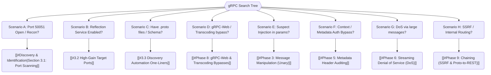

*Navigation: [🏠 Home](../../Hunting%20Approach%20Guide.md) | [⬅️ Layer 2: Element Testing](../../Element%20Testing%20Checklist.md) | [⬅️ Layer 3: Vulnerability Staging](../../Vulnerability_Staging.md)*

# gRPC & Protobuf Exploitation : Master Playbook

> **The Blueprint Analogy**: Traditional APIs (REST) are like a restaurant where you just shout "Burger!". gRPC is like a high-tech factory where every order must follow a strict "Blueprint" (Protobuf). Exploitation is when you find a flaw in the blueprint or trick the factory into building something unintended using the blueprint's own rules.

---

## 0. Exploit Selection Search Tree



*   **1. Scenario A: Port 50051 open?**
    *   Target: [[#Discovery & Identification|Section 3.1: Port Scanning]].
*   **2. Scenario B: Reflection service enabled?**
    *   Target: [[#3.2 High-Gain Target Ports]].
*   **3. Scenario C: Have `.proto` files?**
    *   Target: [[#3.3 Discovery Automation One-Liners]].
*   **4. Scenario D: gRPC-Web bypass?**
    *   Target: [[#Phase 8: gRPC-Web & Transcoding Bypasses]].
*   **5. Scenario E: Suspect injection?**
    *   Target: [[#Phase 3: Message Manipulation (Unary)]].
*   **6. Scenario F: Auth Bypass?**
    *   Target: [[#Phase 5: Metadata Header Auditing]].
*   **7. Scenario G: DoS via large messages?**
    *   Target: [[#Phase 6: Streaming Denial of Service (DoS)]].
*   **8. Scenario H: SSRF via gRPC?**
    *   Target: [[#Phase 9: Chaining (SSRF & Proto-to-REST)]].

---


## 1. Methodology & UX Impact Table

| Attack Vector | Beginner "Why" | Success Indicator | Bounty Range |
| :--- | :--- | :--- | :--- |
| **Reflection Leak** | Exposed "Map" of all secret internal functions. | Service list returned via `grpcurl`. | **P4 (Usually Info)** |
| **gRPC BOLA** | Accessing other users' data via message IDs. | Unauthorized data in response. | **P1 ($1.5k+)** |
| **Stream Exhaustion** | Crashing the server via infinite data streams. | 502/504 Timeouts or Service Crash. | **P2 ($800+)** |
| **Metadata Injection** | Spoofing headers (JWT) in HTTP/2 frames. | Gaining Admin privileges. | **P1 ($2k+)** |
| **Error Disclosure** | Forcing stack traces via malformed binary. | Verbose debug messages in response. | **P3 ($300+)** |

---

## 2. The Hunter's Mental Model

### Why It Happens (The Analogy)
gRPC is faster than REST because it doesn't use human-readable text (JSON). It uses **Protocol Buffers**, which are compressed binary messages. Because these messages are hard to read without the "Key" (the `.proto` file), developers often assume them to be "secure by obscurity." They might forget to add authorization checks to individual gRPC methods, assuming only internal "trusted" services will call them.

### The Mindset
Don't be intimidated by the binary stream. Your goal is to:
1.  **De-serialize**: Turn the "Packed Suitcase" back into readable fields.
2.  **Modify**: Change the values (IDs, Roles, Prices).
3.  **Re-serialize**: Pack it back up and send it to the server.

### 2.1 Hunter's Diagnostic Questions
1.  **Is Reflection enabled?** (Try `grpcurl -list`).
2.  **Does the payload use standard gRPC or gRPC-Web?** (Check `content-type`).
3.  **Are authentication tokens sent in the message body or the metadata (headers)?**
4.  **Can I find `.proto` files in the JS source or public GitHub repos?**

---

## 3. Discovery & Identification

### 3.1 Indicators of gRPC
Scan for these "Signposts" in Burp Suite:
*   **Headers**: `content-type: application/grpc` or `application/grpc-web`.
*   **Status Codes**: Look for `grpc-status` and `grpc-message` headers in responses.
*   **Binary Blobs**: If the request body looks like `\x00\x00\x00\x00\x0a\x08...`, it's likely Protobuf.

### 3.2 High-Gain Target Ports
Traditional REST/GraphQL usually live on 80/443. gRPC often uses:
*   `50051` (Default)
*   `8080`, `9090` (Common dev ports)

### 3.3 Discovery Automation One-Liners
Quickly probe for gRPC endpoints and reflection:
```bash
# Mass-scan for default gRPC port
nmap -sV -p 50051 --script grpc-info <target>

# Fingerprint gRPC via curl (Look for HTTP/2 + application/grpc)
curl -v -X POST -H "Content-Type: application/grpc" -H "TE: trailers" --http2 <target>:50051
```

### 3.4 Protobuf Recovery from JS Bundles
If reflection is disabled, find the "Blueprint" in the frontend:
1.  Search `main.js` or `vendor.js` for strings like `proto`, `Service`, or `Method`.
2.  Look for Base64 encoded blobs that look like Protobuf descriptors.
3.  **The Extraction**: Use `protoc --decode_raw < binary_blob` to reconstruct the field structure even without the `.proto` file.

### 3.5 Protobuf Wire Format Cheat Sheet
When reading raw binary (black-box), you need to decode the "Wire Type" (bits 0-2 of the tag):

| Type | Name | Description | Identification in Hex |
| :--- | :--- | :--- | :--- |
| **0** | Varint | Integers, Booleans, Enums | Payload starts with bytes like `0x01` (true), `0x64` (100). |
| **1** | Fixed64 | Double, Fixed64 | Exactly 8 bytes of data. |
| **2** | Length-Delim | String, Bytes, Messages | Prefixed by a length byte. E.g., `0x05` followed by 5 bytes. |
| **5** | Fixed32 | Float, Fixed32 | Exactly 4 bytes of data. |

### 3.6 Burp Suite Setup Walkthrough
To intercept and scan gRPC traffic like REST:
1.  **Install**: Open Extensions -> BApp Store -> install **gRPC Catcher** or **Protobuf Editor**.
2.  **Intercept**: Capture HTTP/2 traffic. If it's binary, the extension will provide a "Protobuf" tab.
3.  **Tweak**: For gRPC-Web, use the **gRPC-Web Decoder** extension to view encoded text as readable JSON.

---

## 4. The 10-Phase Strategy

> **Why It Happens**: Developers often treat gRPC like an internal "black box." They assume that because the traffic is binary and requires a specific client, a random attacker won't be able to "speak" the language. This leads to missing input validation and weak authorization on the assumption that "only our services talk this way."

### Phase 1: Reflection Audit
gRPC has a "Manual" built-in. If the developer didn't disable it, the server will tell you exactly how to hack it.
*   **Payload**:
    ```bash
    grpcurl -plaintext target.com:50051 list
    ```
*   **Expected Result**: A list of all services (e.g., `pkg.UserService`, `pkg.AdminService`). If you see a list, you have the "Blueprint."

### Phase 2: Mapping the Attack Surface
Once you have the service list, drill down into individual methods.
*   **Payload**:
    ```bash
    grpcurl -plaintext target.com:50051 describe pkg.UserService
    ```
*   **Expected Result**: Detailed definitions of methods (e.g., `GetUser(UserRequest) returns (UserResponse)`).

### Phase 3: Message Manipulation (Unary)
This is the "REST-like" part of gRPC. One request, one response.
*   **Step 1**: Use `grpc-ui` or Burp's `Protobuf Editor` to see the JSON representation of the binary.
*   **Step 2**: Modify a field. Change `{"user_id": 123}` to `{"user_id": 1}`.
*   **Expected Result**: Unauthorized access to data or unauthorized actions (BOLA).

### Phase 4: gRPC BOLA / IDOR
Because gRPC methods are often internal, authorization checks are frequently missing at the object level.
*   **The Test**: Find a method like `UpdateAccount` and try to change an ID that does not belong to you.
*   **Referer Leakage**: Sometimes gRPC services "leak" internal IDs in the `grpc-message` header during an error.
*   **Expected Result**: Unauthorized modification of object state or disclosure of internal IDs in error messages (IDOR).

### Phase 5: Metadata Header Auditing
Authentication in gRPC often happens in the **Metadata** (equivalent to HTTP headers).
*   **What to Look For**: `authorization` headers containing JWTs or API keys.
*   **Payload (grpcurl)**:
    ```bash
    # Replay a stolen JWT to a restricted method
    grpcurl -H "authorization: Bearer <JWT>" -plaintext target.com:50051 pkg.AdminService/DeleteUser
    ```
*   **The Attack**: Try to replay metadata from a low-privileged user to a high-privileged method (BFLA - Broken Function Level Authorization).
*   **Expected Result**: Successful call to an admin function using a standard user token.

### Phase 6: Streaming Denial of Service (DoS)
Streaming allows a single connection to stay open for massive data transfer.
*   **The Attack**: Send an infinite stream of empty or oversized messages to a method that has `stream` in its definition.
*   **The Goal**: Exhaust the server's thread pool or memory by forcing it to maintain thousands of active streams.
*   **Payload (ghz)**:
    ```bash
    # Flood a streaming endpoint with 10k connections
    ghz --call pkg.Service/StreamMethod -d '{}' -c 100 -n 10000 --stream-interval 1ms <target>:50051
    ```
*   **Expected Result**: The service becomes unresponsive (502/504 errors) or crashes entirely.

### Phase 7: Error-Based Disclosure
gRPC errors often contain raw stack traces or internal environment details.
*   **The Test**: Send malformed Protobuf data (e.g., a string where an integer is expected) or out-of-range values.
*   **Force Error (binary)**:
    ```bash
    # Send a single null byte to force a decoding error
    echo -e "\x00" | grpcurl -plaintext -d @ target.com:50051 pkg.Service/Method
    ```
*   **Look For**: The `grpc-message` and `grpc-status` headers in the response.
*   **Expected Result**: Disclosure of internal file paths, database queries, or server technology versions.

### Phase 8: gRPC-Web & Transcoding Bypasses
Often, gRPC is "transcoded" to look like REST for better browser compatibility.
*   **The Vuln**: The transcoder (like Envoy) might have different validation rules than the backend gRPC service.
*   **The Test**: Try to inject "REST-only" payloads (like `../` for path traversal) into gRPC-Web requests and see if they reach the backend.
*   **Expected Result**: Bypassing a WAF that only understands standard gRPC but ignores the transcoded wrapper.

### Phase 9: Chaining (SSRF & Proto-to-REST)
Chain a gRPC call with other vulnerabilities.
*   **Scenario**: A REST API that calls a gRPC backend. If the REST API has SSRF, you can use it to hit the internal gRPC reflection port.
*   **The Payload**: Use a gRPC-to-JSON gateway to talk to the binary backend via a standard HTTP/1.1 request.
*   **Expected Result**: Accessing restricted gRPC endpoints through a vulnerable REST frontend.

### Phase 10: Persistence & Advanced Field Manipulation
Some Protobuf fields are "unknown" but still processed by the backend.
*   **The Attack**: Add extra fields to the message that aren't in the official `.proto` file (e.g., an `isAdmin: true` field). Use a hex editor to inject the tag and data.
*   **Hex Injection Logic**:
    - Field Tag 15 (Varint) = `x78` (hex)
    - Value `true` (Boolean as Varint) = `x01`
    - **The Hack**: Manually append `\x78\x01` to the end of a binary message.
*   **Expected Result**: Overwriting internal state variables if the backend "blindly" merges incoming messages into its internal models.

---

## 5. Narrative Walkthroughs

### 5.1 Case Study: The Reflection-to-BOLA Bank Shot
**The Flow**:
1.  Hunter discovers port `50051` is open.
2.  Hunter runs `grpcurl -plaintext target.com:50051 list` and finds `AccountService`.
3.  Hunter runs `describe AccountService.GetBalance`. It takes an `AccountRequest` with an `id` field.
4.  Hunter uses `grpc-ui` to call `GetBalance` for their own ID (`101`).
5.  Hunter changes the ID to `102` and sends the binary message.
6.  **The Result**: The server returns the private balance of User 102. BOLA confirmed.

### 5.2 Case Study: The "Unknown Field" Persistence (Uber-Style)
*Restoring a high-impact gRPC logic flaw found in the wild.*
**The Flow**:
1.  Target uses gRPC for `UpdateProfile`. The `.proto` file has `name` and `email` fields.
2.  Hunter discovers through a JS bundle that an internal `AdminService` uses a field `is_staff` at index `15`.
3.  Hunter sends a binary-encoded message to `UpdateProfile` manually appending field `15` with value `true`.
4.  The backend gRPC service decodes the message, and because it uses a shared library for both services, it "blindly" updates the `is_staff` attribute in the database.
5.  **The Result**: Account elevation to Staff status via unknown field injection.

---

## 6. Beyond the Basics: Chaining & Escalation

### 6.1 gRPC → SSRF
If a gRPC method accepts a URL (e.g., for a webhook), test if it can hit the internal metadata service (`169.254.169.254`). gRPC backends are often less restricted than web frontends.

### 6.2 gRPC → Business Logic
Look for methods that handle payments or discounts. Because these are "binary," logic flaws like "Negative Pricing" are often overlooked during standard testing.

### 6.3 gRPC → JWT Forgery
If the metadata contains a JWT, check if the gRPC backend properly validates the signature. Often, internal gRPC services trust the JWT signature from a central gateway and don't re-verify, allowing you to forge `{"role": "admin"}` if you can reach the service directly.

### 6.4 gRPC → Race Conditions
Streaming methods are highly susceptible to race conditions. If a stream allows multiple `Update` messages, try sending them in a tight parallel batch to see if the backend handles concurrent state updates correctly.
*   *Reference*: See [[Race Conditions]] Section 2.

---

## 7. Verification & PoC Templates

### 7.1 Command-Line Verification
```bash
# Verify Reflection is on
grpcurl -plaintext target.com:50051 list

# Send a sample request (Unary)
grpcurl -plaintext -d '{"user_id": 123}' target.com:50051 pkg.UserService/GetUser

# Verify streaming persistence
grpcurl -plaintext -d '{}' target.com:50051 pkg.LogService/StartLogs
```

### 7.2 PoC: gRPC-Web BOLA (JavaScript)
If the target uses gRPC-Web, use a script to intercept or replay messages:
```javascript
// Example of replaying a gRPC-web call with a modified ID
const xhr = new XMLHttpRequest();
xhr.open("POST", "https://api.target.com/pkg.UserService/GetUser", true);
xhr.setRequestHeader("Content-Type", "application/grpc-web-text");
xhr.onreadystatechange = () => { if (xhr.readyState === 4) console.log(atob(xhr.responseText)); };
// Base64 encoded protobuf: {id: 1} -> {id: 2} substitution
xhr.send("AAAAAAYIARK="); 
```

### 7.3 gRPC Status Code Rosetta Stone
Use this table to interpret error messages without a manual:

| Code | Name | HTTP Equivalent | Meaning for Hunters |
| :--- | :--- | :--- | :--- |
| **0** | OK | 200 OK | Successful execution. |
| **1** | CANCELLED | 499 Closed | Request cancelled by client (Check for timeout bugs). |
| **2** | UNKNOWN | 500 Error | Internal server error (Check for stack traces). |
| **3** | INVALID_ARGUMENT | 400 Bad Request | Payload format is wrong (Try JSON vs. Array). |
| **4** | DEADLINE_EXCEED | 504 Timeout | Request took too long (Benchmark for DoS/Complexity). |
| **5** | NOT_FOUND | 404 Not Found | Endpoint or ID doesn't exist. |
| **6** | ALREADY_EXISTS | 409 Conflict | Resource exists (Indicator for User Enumeration). |
| **7** | PERMISSION_DENIED | 403 Forbidden | User lacks rights (Target for bypass). |
| **8** | EXHAUSTED | 429 Too Many | Rate limiting hit (Goal for DoS). |
| **9** | PRECONDITION | 400 Bad Request | Client state is wrong (Check for logic bypass). |
| **10** | ABORTED | 409 Conflict | Concurrency issue (Target for Race Conditions). |
| **11** | OUT_OF_RANGE | 400 Bad Request | Value too large/small (Check for Buffer Overflow). |
| **12** | UNIMPLEMENTED | 404/501 | Method not active on this port. |
| **13** | INTERNAL | 500 Error | Severe failure (Search for stack traces). |
| **14** | UNAVAILABLE | 503 Service | Server down (Result of successful DoS). |
| **15** | DATA_LOSS | 500 Error | Irrecoverable data loss (High impact logic bug). |
| **16** | UNAUTHENTICATED | 401 Unauthorized | Missing JWT/Auth metadata. |

---

## 8. Secure Defense & Remediation

*   **Disable Reflection**: Always disable `grpc.reflection.v1alpha.ServerReflection` in production.
*   **Strict Message Validation**: Validate every field in the message, even if it's "just" binary.
*   **Enforce Auth at Method Level**: Use Interceptors/Middleware to check permissions on *every* gRPC call.

### 8.1 Example: gRPC Auth Interceptor (Go)
```go
func authInterceptor(ctx context.Context, req interface{}, info *grpc.UnaryServerInfo, handler grpc.UnaryHandler) (interface{}, error) {
    md, ok := metadata.FromIncomingContext(ctx)
    if !ok || len(md["authorization"]) == 0 {
        return nil, status.Errorf(codes.Unauthenticated, "missing token")
    }
    // Perform ownership/role check here
    return handler(ctx, req)
}
```

---

## 9. Strategic Reference (Hunter's Vault)

### 9.1 Why Your Report Might Be Rejected (N/A)
*   **Reflection Enabled on Dev Ports**: If you find reflection on `50052` but it only shows dummy test services.
*   **Intended Error Disclosure**: Minor status messages without stack traces or sensitive data.
*   **Localhost Bindings**: If the gRPC port is only reachable from the internal VPC (needs SSRF to be a bug).

### 9.2 Real-World Impact Stories
*   **Dropbox**: Discovered a critical gRPC-based account takeover using field manipulation.
*   **Kubernetes**: Historically had gRPC-related vulnerabilities in internal cluster communication.

### 9.3 Reporting Template
> **Description:** A gRPC BOLA/IDOR vulnerability was found in the `[METHOD_NAME]` method of the `[SERVICE_NAME]` service.
> **Impact:** An attacker can access the private data of other users by manipulating the `[FIELD_NAME]` Protobuf field in the binary stream.
> **PoC:** Use `grpcurl` or the provided JS script to retrieve data for ID `[VICTIM_ID]`.
> **Remediation:** Implement server-side ownership checks in the gRPC interceptor.

### 9.4 Severity Mapping
| Action | Severity | Est. Bounty |
| :--- | :--- | :--- | :--- |
| **BOLA (Object ID Access)** | P1 | **$1,500 - $3,000** |
| **Metadata / JWT Injection** | P1 | **$2,000 - $4,000** |
| **Field Manipulation / Logic** | P1 | **$1,500 - $3,000** |
| **Service-wide DoS** | P2 | **$800 - $1,500** |
| **Error / Stack Disclosure** | P3 | **$300 - $600** |
| **Reflection enabled** | P4 | **$50 - $150** |

### 9.5 Sibling Playbook Cross-Links
*   **[[API Security]]**: Core triage for REST/JSON/SOAP.
*   **[[Insecure IDOR]]**: Advanced BOLA/IDOR patterns.
*   **[[Information Disclosure]]**: Sensitive data leakage in gRPC errors.

---

## 10. Toolbox & Curated Resources

### 10.1 Essential Tools
| Tool | Purpose | Primary Command |
| :--- | :--- | :--- |
| **grpcurl** | Command-line gRPC client | `grpcurl list` |
| **grpc-ui** | Web-based UI for gRPC testing | `grpc-ui target:port` |
| **ghz** | gRPC benchmarking (DoS testing) | `ghz --call pkg.Service/Method` |
| **Burp gRPC Catcher** | Intercept gRPC traffic | (Burp Extension) |

### 10.2 Curated High-Yield Resources
*   [HackTricks: gRPC Pentesting](https://book.hacktricks.xyz/pentesting-web/grpc)
*   [PortSwigger: gRPC Security](https://portswigger.net/burp/documentation/desktop/testing-workflow/api-testing/grpc)

---
*Navigation: [🏠 Home](../../Hunting%20Approach%20Guide.md) | [⬅️ Layer 2: Element Testing](../../Element%20Testing%20Checklist.md) | [⬅️ Layer 3: Vulnerability Staging](../../Vulnerability_Staging.md)*
